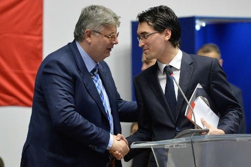

Acum un an, scriam despre 7 trenduri care vor marca fotbalul românesc în 2013.

Am avut dreptate în majoritatea cazurilor, cu o excepție evidentă. Spuneam acolo că acei conducători care-și căpușează clubul vor avea probleme.

În continuare, conducătorii de club reprezintă de departe cea mai slabă verigă din fotbalul românesc.

Mă refer în primul rând la vârful organigramelor, la președinții de club, la directorii generali, la conducerile executive.

La oamenii care ar trebui să gândească strategiile cluburilor și să aibă puterea de-a influența apoi finanțatorul să le urmeze.

La oamenii care ar trebui să creeze toată structura necesară pentru finanțarea clubului dincolo de contractul negociat de Dragomir cu televiziunile, dincolo de finanțarea mascată și politică venită de la Primării, dincolo de banii patronului.

De-asemenea, mă refer la cei care se dovedesc de atâtea ori incapabili să aleagă un antrenor potrivit pentru clubul lor. Unul care să reziste mai mult de câteva etape pe bancă și care să performeze profesional.

Mă refer la cei care n-au capacitatea de-a-și educa patronii să înțeleagă că fotbalul e mai mult decât o afacere pe care o conduci imitând principiile speculei imobiliare. Iar un club are nevoie de-o organigramă mai stufoasă decât cea a unui trader de energie.

Repet, omul cu bani poate fi în toate felurile, datoria ta de specialist în domeniu este să-l educi, să se vadă măcar dupa 5 ani petrecuți în fotbal c-a învățat ceva de la tine, nu doar de pe urma suferinței din conturi.

Și-n fine, vin cei care nu știu sau nu pot să-și educe fotbaliștii, antrenorii, subordonații pentru o relație deșteaptă cu fanii, prin intermediul presei.

Aparent, eu vorbesc aici de câteva categorii de conducători. În realitate, caracteristicile de mai sus se combină într-o singură mare categorie – conducătorul de club, indiferent de nivelul competiției în care activează.

Prin urmare, nu avem probleme uriașe legate de juniori, de capacitățile antrenorilor, de forța financiară a patronilor, de lipsa sprijinului politic.

Avem în schimb o lipsă majoră de pregătire și cunoaștere la nivelul conducătorilor de club. Poate acum 10 – 15 ani, această lipsă nu era atât de mare. Cerințele postului erau oarecum diferite, așteptările erau diferite.

Astăzi însă, dacă te bazezi doar pe banii patronului și pe banii de la Primărie, n-ai nicio treabă cu managementul unui club de fotbal. Ești cel mult un executant de buget, dar nu un creator de buget.

Ești șeful unui centru de cost și atât.
