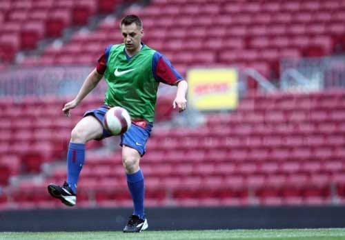

Zilele trecute, am văzut ceva rar.

Chiar foarte rar. Ar putea fi o premieră…

Dar înainte de-a scrie despre asta, vreau să-ți povestesc altceva.

Lucram la Gazetă și trebuia să predau un material. Era o perioadă de aceea în care Cătălin Tolontan era plecat pe cine știe unde, iar Andrei Vochin avea grijă ca ziarul să iasă-n condiții bune.

Ziarul mergea OK și cu Andrei. Poate prima pagină nu era la fel de spectaculoasă ca atunci când Cătălin era prezent, dar Andrei nu “fura” titlurile colegilor pentru a le folosi pe copertă.

Mai mult, în redacție era o atmosferă foarte relaxată. Chiar foarte, foarte relaxată.

Ei, în mijlocul acestei atmosfere, mi-aduc aminte că încercam să termin de scris un subiect.

## Omul care te poate face să-ți fie rușine fără să rostească o vorbă

Încercam de câteva ore, dar diverse alte activități mă opreau să termin. Vorbeam pe mess, vorbeam cu colegii, mă plimbam de pe-un site pe altul, orice numai să nu scriu.

Andrei a venit la un moment dat și m-a întrebat dacă-s gata. Nu eram, așa că l-am asigurat că termin în câteva minute.

După jumătate de oră, a venit din nou.

Nu terminasem și am mai cerut vreo câteva minute.

A spus un “bine” sau ceva echivalent, s-a întors și-a plecat.

Ce-am făcut?

M-am apucat de scris, dar am calculat greșit timpul necesar. Am fost serios în încercarea de-a finaliza ce-aveam de scris, dar n-am reușit.

Andrei s-a întors încă o dată.

Nu m-a mai întrebat dacă am terminat, doar s-a oprit la doi metri de mine. Eu aproape m-am uitat la el, dar n-am mai spus că am nevoie de timp. Nu aveam idee ce-aș mai fi putut zice.

A zâmbit și-a plecat.

Deși singura sa reacție a fost acel zâmbet, am simțit un soi de rușine.

Probabil că nu ți se pare ceva special să-ți fie rușine într-o situație în care ar trebui în mod clar să-ți fie rușine.

Posibil, doar că-n acele vremuri ideea de-a-mi fi rușine de ceva era la fel de prezentă-n mintea mea pe cât e de prezentă în mintea unui senator PSD în zi de vot pentru ridicarea imunității lui Șova.

## Câteva lucruri despre felul de-a fi al lui Andrei Vochin

De ce-ți spun asta?

Pentru că PSD… glumesc 🙂

Pentru că-l consider pe Andrei un tip aparte.

Se ghidează mult după ideea că trebuie să te porți cu oamenii așa cum ai vrea aceștia să se poarte și ei cu tine. De-asemenea, crede că dacă te respecți, dacă ai un comportament corect cu tine însuți, atunci sunt șanse mari să fii respectat de cei din jur.

Acestea nu sunt concluzii trase de mine, ci vorbe rostite și puse-n practică de el.

Mai mult, în anii în care am lucrat la Gazetă, a fost în ochii mei un exemplu de autocontrol.

Nu l-am văzut ieșindu-și vreodată din fire, deși lucra într-o redacție populată cu ziarști aparte.

Din contră, uneori avea o capacitate specială de-a controla inclusiv lucruri dincolo de controlul său printr-o atitudine calmă și printr-un discurs logic.

L-am văzut prima dată consumându-se până aproape de evidență în perioada în care eu eram un fel de asistent al producătorului Recursului – Cristi Crețu, iar Andrei era invitat la emisiune pentru a analiza la acea tablă magnetică diverse episoade remarcabile din fotbalul nostru.

Deși era vorba doar de câteva minute într-o emisiune care depășea două ore, domnul Ovidiu îl mai grăbea câteodată sau îl introducea de parcă rubrica sa ar fi fost vreun supliciu pentru cei care ne urmăreau.

Ei, în acele momente, Andrei se consuma.

Nu atât încât să ceară normalitate, dar suficient pentru a renunța la un moment dat.

Elegant, în stilul său obișnuit.

## Ce greșește Andrei Vochin în aceste zile

De ce-ți spun și asta?

Pentru că l-am văzut zilele acestea pentru a doua oară consumându-se și pentru prima dată nervos în mod real.

A fost un amestec de situații care l-au adus în această stare neobișnuită pe care am observat-o la Digi Sport, în emisiunea lui Radu Naum.

A fost dezamăgirea legată de evoluția naționalei României la turneul din Anglia. De aici s-a născut o parte a consumului.

Apoi, a fost [decizia sa de-a-și da demisia din Comisia Tehnică](http://www.gsp.ro/fotbal/nationala/andrei-vochin-a-renuntat-la-statutul-de-membru-al-comisiei-tehnice-a-frf-cum-isi-motiveaza-decizia-447151.html). Deși a explicat care-i rolul prezenței sale acolo, a simțit totuși nevoia să-și dea demisia pentru a închide discuțiile.

În fine, a fost conflictul Hagi – FRF, conflict care include inclusiv episodul disputei cu Zoltan Kovacs.

Concret, ideea de tabere adverse în jurul unui proiect al naționalei i se pare de neconceput lui Andrei. Iar ideea că un coordonator al loturilor de juniori **ar fi putut** în mod intenționat să trateze jignitor un copil i s-a părut “mizerabilă”.

De aici, o altă parte a consumului.

Andrei spune că are capacitatea de-a separa reacțiile oamenilor în funcție de priza lor cu realitatea.

Că nu ia în seamna ce-i aberant în postările de pe site-uri, dar nici nu face eroarea de-a-i considera incapabili să facă aprecieri corecte pe cei care urmăresc fotbalul și-și dau cu părerea fără a fi “specialiști”.

Din exterior, impresia mea este că s-a lăsat totuși afectat de cei mai vocali comentatori de pe net și de posibilele bârfe din jurul muncii sale de la Federație.

După cum foarte bine știe, cei mai vocali oameni care comentează pe net nu au automat nici dreptate, nu reprezintă nici o majoritate. Singura certitudine legată de ei este că sunt cei mai zgomotoși.

Având în vedere rolul său în Comisia Tehnică, ideea de-a se retrage e inutilă și chiar pare emoțională. Ca să nu mai vorbesc despre faptul că e o reacție care nu dă satisfacție logicii și faptelor.

Apoi, ar trebui să înceteze să-și mai subaprecieze capacitățile.

Simplu fapt că nu este antrenor nu-nseamnă că prezența sa acolo n-ar fi utilă pe anumite zone de activitate ale Comisiei Tehnice. Din contră, structura sa profesională poate fi un mare avantaj într-un grup de lucru format în special de oameni care, în unele momente, pot avea vederile limitate tocmai de specializarea lor.

Nu faptul că a ridicat tonul sau că s-a văzut că-i afectat de ceea ce se-ntâmplă este principala eroare, ci faptul că vrea să controleze lucruri dincolo de controlul său și cedează când vede că asta-i imposibil.

Oamenii, în general, ar trebui să fie mai atenți la ceea ce depinde de ei și la ceea ce nu depinde de ei. Nu-i dau sfaturi lui Andrei, ci doar mă gândesc că-i păcat să acționeze pe baza unor lucruri dincolo de controlul tău.

**PS cu poveste**: unii dintre colegii care lucrează în diverse redacții obișnuiesc să ironizeze simpatia mea profesională pentru Andrei Vochin și-mi amintesc de vremuri în care ziariștii din generația sa, inclusiv el, erau omeniți de diverși conducători de club.

Nu am trăit acele vremuri, așa că nu pot să-i contrazic. Nu-i pot însă crede orbește pe cuvânt pentru că ar trebui să dau mai mare importanță vorbelor decât faptelor concrete observate de mine.

Am în schimb o poveste povestită de Andrei, poveste care le susține parțial spusele și le infirmă din anumite puncte de vedere.

Se-ntâmpla la Brăila, unde Brainconf făcea cămăși bune de îmbrăcat orice român, inclusiv ziariștii care veneau la meciurile celor de la Dacia Unirea.

Un conducător de club, aș spune Ulman, dar mi-e teamă să nu greșesc, avea o tactică specială de-a identifica exact ce număr poartă la camașă fiecare ziarist de la București.

La masa pe care gazdele o dădeau înainte de meci pentru presă, domnul respectiv trecea prin spatele fiecărui ziarist și cu o mișcare de masaj fals cuprindea gâtul respectivului între degetul său mare și arătător.

După o simplă strângere și-un zâmbet adresat ziaristului, ridica privirea spre un asistent de-al său care avea în mâini un caiet și-un pix: “Un 44 pentru domnu’, te rog!”
