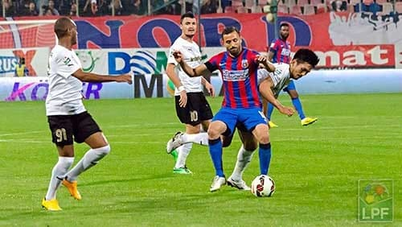

5 cuvinte reușesc aproape de fiecare dată să mă scoată din sărite:

> *Avem un fotbal foarte slab*

Nu știu exact de când această ideea a început să mă enerveze, dar știu care era contextul general.

Tocmai se terminase un meci bun din Liga 1…

Da, există astfel de meciuri în campionatul nostru.

Este suficient să te uiți la jocurile unei etape și le vei vedea. Atenție, să te uiți la meciuri, nu la rezultatul final. Să te uiți la meciuri, nu pe Facebook la ce comentează alții.

Să te uiți la meciuri fără să-ți lași mintea să se scalde în cea mai nocivă prejudecată vehiculată intens de ani buni sub o formă sau alta:

> *Avem un fotbal de c@%$t*

Chiar avem un fotbal atât de slab pe cât sunt tentați mulți dintre fani să-l catalogheze?

Chiar avem un fotbal atât de slab pe cât sunt tentați mulți dintre ziariși și analiști să-l caracterizeze?

Eu cred că avem un fotbal în privința căruia se exagerează mult, mai ales când se spune c-ar fi slab.

## Mironică: „De ani buni se anunță sfârșitul… La anul avem două echipe în Ligă”

Duminică seară, am deschis acest subiect într-o discuție pe care am avut-o cu Mihai Mironică.

În 87,34% din cazuri, eu și Mihai avem opinii diferite.

Nu e ceva grav, Mihai are în general opinii diferite față de majoritatea oamenilor de pe fața acestei planete. Uneori, folosește atâta energie și-un val de atât de mare de argumente care-i susțin punctul de vedere, încât îl bănuiesc de faptul c-ar putea să se contrazică inclusiv cu cei care-s de acord cu el.

În fine, nu a fost cazul de această dată.

Mihai remarca faptul că, de ani de zile, diverse voci anunță moartea fotbalului nostru.

Nu știu cum arată moartea în opinia respectivilor, dar din sezonul viitor vom avea două echipe în preliminariile Ligii Campionilor:

> *„Situația asta nu o poți numi o întâmplare, coeficientul acela ia în calcul rezultatele a 5 ani de prezență în cupele europene. Nu mai zic de niște rezultate foarte bune obținute recent – bați Lyon, bați Ajax, bați Chelsea, bați Victoria Plzen etc.”*

Avem o moarte interesantă, tare interesantă.

## "Tu nu vezi ce se joacă în fotbalul nostru comparativ cu ce-i în Vest?"

Tocmai, eu văd ce se joacă în fotbalul nostru.

Tu vezi ce se joacă la noi?

Te uiți la meciuri?

Dacă te uiți la meciuri, vei vedea și jocuri slabe, dar vei vedea și o grămadă de jocuri bune, suprinzător de bune dacă te gândești la cât de mort e considerat fotbalul nostru de-o grămadă de ani.

Apoi, întâmplător sau nu, am avut un campionat dat naibii de imprevizbil.

Sigur, a fost vorba și de faptul c-au retrogradat 6 echipe, că Steaua n-a fost în stare să-și apere un avans uriaș de puncte, dar acestea sunt lucruri care țin de fotbalul nostru, nu ni le-au dat alții.

Noi le-am trăit, noi am avut posibilitatea de-a le vedea efectele.

Sigur, dacă vei compara fotbalul nostru cu cel din Anglia, vei găsi diferențe uriașe.

Întrebarea-i dacă vezi și diferența de finanțare.

O vezi?

În Liga 1, probabil media salarială este undeva la 5.000 Euro / lună. Zi-mi un campionat în care se plătesc banii ăștia și se joacă un fotbal superior celui din Liga 1.

Până-ți vine ceva în minte, îți spun eu 4 campionate în care se investesc sume mari, dar diferența de calitate între fotbalul nostru și-al lor nu este proporțională cu sumele investite – Rusia, Ucraina, Turcia și Elveția.

Da, au echipe mai bune, au performanțe mai bune, dar plătesc foarte mult pentru a fi mai nu cu mult mai buni decât noi.

Investițiile lor în bugetele cluburilor sunt uriașe comparativ cu investițiile noastre, dar, așa cum spuneam, diferențele de calitate între fotbalul lor și al nostru nu sunt proporționale cu aceste investiții.

Apoi, îți dau exemplul Basel. Buget anual de peste 40 Mil. Euro în mod constant.

Uneori, urcă spre 60 Mil. Euro. Am găsit în anumite surse și sume mult mai mari.

Ți se pare că Basel, în ciuda rezultatelor bune făcute, s-a aflat tare departe de Steaua sau CFR Cluj când a venit vorba de participarea în Liga Campionilor. Ți se pare că elvețienii au un campionat net superior Ligii 1?

Aș putea continua exemplele cu campionate în care se plătesc banii de la noi, în general, campionate din țările vecine și am ajunge amândoi la concluzia că nu-s peste noi, chiar din contră.

Recunosc, nu sunt chiar cea mai bună sursă de recomandări când vine vorba de fotbal – spectacol. Adică Serie A este campionatul meu preferat, apoi vine Bundesliga, apoi Premier League și, undeva la coadă se află competiția iubită de mulți - Primera Division.

Fiecare cu gusturile sale, dar te-asigur că Liga 1 nu e atât de slabă pe cât se tot insistă c-ar fi.

## "Tu nu vezi că Liga 1 e plină de blaturi?"

Te-ntreb din nou, urmărești meciurile sau comentezi doar pe baza rezultatelor?

Nu întreb întâmplător, ci pentru că unii dintre cei care acuză cel mai vocal blaturile din Liga 1 sunt indivizi care nu au răbdarea de-a se uita la jocuri sau n-au mai văzut un meci din Liga 1 cap – coadă de ani buni.

Uneori, respectivii recunosc asta în discuțiile pe care le am cu ei, alteori nu este nevoie să recunoască, e evident în ceea ce spun.

Dacă te uiți la meciuri, îi știi calitățile lui Astafei. Nu vei fi absolut sigur c-a dorit să marcheze cu ASA, dar măcar vei lua-n calcul că acele ratări n-au fost rodul intenției lui de-a nu juca pe bune.

Faptul că te vei uita la meciuri îți va lămuri anumite situații și-ți va provoca dubii apropo de altele.

Doar ignoranța specifică celor care nu se uită la meciurile pe care le comentează te poate ajuta să fii sigur de absolut tot ceea ce se-ntâmplă în jur.

La rândul meu, am anumite dubii.

Nu la fel de multe precum Ștucan, nu la fel de puține precum Romică Pașcu. Cel mai probabil, voi scrie mai mult despre subiectul acesta într-un text viitor.

## Ce greșesc de prea multe ori televiziunile care transmit meciurile

În prea multe situații, televiziunile care transmit meciurile uită total că acestea sunt produsul pe care-l vând telespectatorilor.

Prin urmare, în emisiunile de analiză și în comentariile transmisiunilor s-a dezvoltat reflexul de-a ironiza tot ceea ce ține de Liga 1.

Iar dacă nu e vorba de ironii, e vorba despre exprimarea unor dezamăgiri atât de adânci încât ți-e teamă că respectivul va intra în depresie.

Iar dacă nu e vorba de dezamăgire, apare invariabil disprețul pentru fotbalul nostru.

Unde se mai poate găsi loc pentru entuziasmul provocat de multe dintre meciurile din Liga 1?

Există și meciuri bune, există și meciuri cu ritm excelent, există și meciuri c-un soi aparte de tensiune, există și meciuri cu miză.

Toate acestea sunt într-un număr mai mare decât se apreciază c-ar fi. Păcat că sunt mult prea puțin remarcate.

Apoi, faptul că dați acele meciuri, că le comentați, că le analizați n-ar trebui să fie o corvoadă, ci o plăcere.

Eu nu spun ca ziariștii să se transforme în agenți de PR pentru Liga 1, eu spun doar să vă uitați la fotbal și să faceți efortul de-a evidenția inclusiv lucrurile cu adevărat bune care se regăsesc în multe dintre acestea.

Sigur, e mult mai ușor să vii într-un studio și să spui că ai văzut un meci slab, că nu se joacă nimic, că nivelul e scăzut, că bla-bla, bla-blum.

La fel de ușor este să faci acest lucru și-n scris, asta ca să nu uit vreo zonă a presei sportive.

Totuși, acest tip de discurs poate fi lejer abordat și de cei care se pricep la fotbal, și de cei care nu se pricep la fotbal.

Cei care au habar, care se uită la meciuri, pot însă spune mai mult de-atât.

În fine, deși moderatorii nu le pot cere invitaților să-și modifice discursurile – dacă aceștia văd că un meci e slab, păi, slab este – totuși, moderatorii au capacitatea de-a influența discuția prin întrebările pe care le adresează, prin temele pe care le deschid.

Dacă tu, ca moderator, începi discuția de fiecare dată cu o constatare de genul „vai, ce meci slab”, atunci ai șanse mari ca și cei de la masă să-și orienteze discursul după tine.

Și-i păcat, mai ales că, sezonul acesta, am avut un campionat interesant chiar și atunci când s-a jucat prost.

**PS1**: știai că-n Liga 1 sunt mai mulți portari de picior stâng decât, foarte probabil, oriunde în lume? Fără să fac vreun efort special, îmi vin în minte acum: Pecanha (Petrolul), Matache (Chiajna), Pleșca (Gaz Metan), Mingote (Pandurii), Veselovsky (U Cluj), Marc (Dinamo), Abraham (Oțelul), Mincă (CFR Cluj), Barna (Ceahlăul, debutant etapa trecută).

Și mai sunt, dar nu reușesc să mi-i aduc pe toți aminte. În plus Dragoș Balauru a plecat la Voluntari în Liga a II-a și va reveni în prima ligă.

Știi cum am aflat această informație pe care tu o citești în premieră pe-un blog dedicat fotbalului românesc?

Mă uit la meciuri.

Mă uit cu adevărat la meciuri, urmăresc jucătorii, mă interesează ce calități și defecte au, le privesc jocul și, de cele mai multe ori, nu-mi pare rău, nu e un timp pierdut.

Din contră.

**PS2**: când ProTV a încetat să mai dea Formula 1, cei de acolo nu au spus că produsul respectiv este varză. Au preferat să acorde mult mai puțin spațiu informațiilor despre acea competiție, dar nu au denigrat-o.

Alții însă au preferat să spună că produsul pe care nu-l mai dau e penibil cu atâta determinare încât, după un timp, le-a intrat în reflex să spună asta.

Prin urmare, când au dat din nou meciuri, au rămas blocați în acel discurs. 

Poate mi s-a părut mie și celor cu are am discutat subiectul. 

Sau poate nu.
