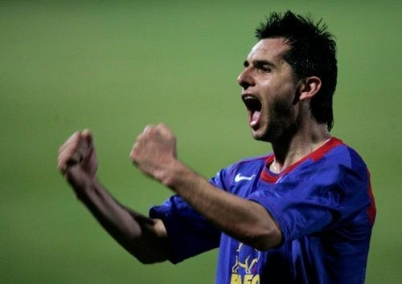

**Le Prénom** este o comedie faină.

Dacă n-ai văzut-o, merită să o vezi. Dacă ai văzut-o, merită să o revezi.

În mare, e vorba despre ideea unui tată de-a da un nume scandalos copilului pe care soția sa urmează să-l aducă pe lume.

Prietenii familiei asistă la anunțul legat de nume și ripostează amuzant și ipocrit în același timp.

Nu există dreptate clară pentru vreo tabără, există însă multe probleme care ies la suprafață în relațiile dintre cei implicați.

Exact ca-n povestea conflictului dintre Becali și Armată.

Vei găsi această comedie și sub titlul** What’s in a name?**, titlu care mi-a venit în minte imediat ce-am văzut știrea că, oficial, Steaua va purta numele FCSB.

Nici nu era greu având în vedere cât de amuzante și ipocrite sunt discuțiile legate de numele Steaua sau cât de amuzante și ipocrite sunt atitudinile multora dintre noi, indiferent că vorbesc aici de oameni din fotbal, ziariști, suporteri.

Prin urmare, vreau să-mi explic gândurile din spatele unei decizii: pentru o perioadă nedeterminat de timp, îi voi spune în continuare Steaua echipei numită formal și total lipsit de inspirație FCSB.

Nu scriu ceea ce scriu aici ca să te conving și pe tine să gândești ca mine, ci ca să înțelegi de ce gândesc eu așa.

Apropo, [acesta este varianta video](https://youtu.be/1W_x7KG6Buw) a ideilor pe care le menționez aici.

## Echipa lui Becali a pierdut multe, mai puțin șirul faptelor

În logica de azi și în limitele bunului simț, înseamnă că Becali a preluat FCSB de la Armată, nu Steaua.

Normal, e o aberație să spui așa ceva, dar e o aberație susținută de realitatea la care s-a ajuns.

Realitate care spune ceva de genul: Becali a  venit la-nceputul anilor 2000 la Steaua, a împrumutat clubul, l-a preluat apoi de la asociația lui Viorel Păunescu și a constat după mai bine de-un deceniu că n-a luat Steaua, ci FCSB

Toată populația României conștientă de fotbal a trăit aceeași impresie cu el în primă fază, inclusiv Pițurcă, inclusiv Talpan, inclusiv toți cei care i-au fost rivali în această dispută. Când au descoperit însă că Becali exploata un brand pe care-l controla în baza unor acte făcute aiurea, s-au regrupat.

Astfel, Becali a pierdut dreptul de-a utiliza numele Steaua și sigla.

Nu a pierdut echipa.

Și, cel mai important, n-a pierdut șirul faptelor – adică echipa sa este continuatoarea echipei Armatei.

Știu, unii sunt oricând dispuși să spună că totul s-a oprit când Armata i-a dat echipa lui Păunescu sau când Păunescu i-a dat-o lui Becali, dar nu s-a oprit nimic.

Steaua a continuat să joace în campionat și în cupele europene.

A făcut performanțe pentru suporteri și bani buni pentru Becali.

Repet, acestea au fost faptele din perspectiva continuității – Becali a luat echipa de la asociația lui Păunescu după ce Păunescu o luase de la Armată.

Datorită acestei continuități eu am considerat că echipa lui Becali este Steaua.

Tot datorită continuității am considerat că toate echipele Craiovei de după 1990 au fost Universitatea, indiferent de felu-n care s-au făcut actele și indiferent dacă patronul s-a numit Păunescu, Arnăutu, Ilinca, Dinel Staicu, Mititelu, Nețoiu, Gheară, Staicu, Mititelu și indiferent cât de inspirat au făcut respectivii actele.

Tot datorită continuității, am considerat că toate echipele de după 1990 care au jucat în Giulești au fost Rapid, indiferent de forma de organizare a societăților care administrau clubul. De asta consider că azi, AFC Rapid e continuatoarea ideii de Rapid.

De altfel, AFC Rapid chiar a administrat clubul de fotbal înainte înainte de falimentara Rapid SA.

Tot datorită continuității am considerat că toate echipele care au jucat în Groapă au fost Dinamo, indiferent de forma de organizare, acționari, deținători ai siglei, deținător al site-ului etc.

În imaginea de mai sus, Nicolae Dică se bucură, fără să știe, pentru succesul FCSB… E ca-n romanul 1984 al lui Orwell: istoria se poate modifica în funcție noile realități ale prezentului. (Foto: Mediafax)

## Cum le zici etnicilor maghiari din Harghita și Covasna?

Cei mai mulți dintre noi le zicem unguri.

Unii le spunem unguri cu respect, alții le spunem unguri cu indiferență, alții avem cucul mic sau cine știe ce alte probleme și le spunem unguri cu dispreț.

Deși formal sunt cetățeni români, deși în actele oficiale apar drept cetățeni români, le spunem unguri.

De ce facem asta?

Pentru că etnia lor este mai conturată în percepția noastră decât ceea ce reușesc hârtiile formale să ne spună despre ei.

În percepția mea, echipa lui Becali a rămas Steaua, chiar dacă nu poate folosi numele respectiv.

Nu sfidez decizii judecătorești sau înscrisuri oficiale. Dacă mă întreabă cineva care este numele oficial al echipei patronate de Becali, voi spune că e FCSB fără nicio problemă.

## Ce limbă se vorbește peste Prut?

Peste Prut, trăiește o populație formată în mare măsură din etnici români.

Formal însă, ei sunt cetățeni moldoveni.

Inclusiv limba română vorbită de ei este numită oficial limba moldovenească.

Mă-ndoiesc însă că tu consideri limba română vorbită acolo limbă moldovenească doar pentru că așa o spune formal statul vecin.

La fel de aberant este să sfidezi evidența faptului că echipa care a jucat sfertul de finală UEFA cu Rapid a fost Steaua. Sau cea care a adus zecii de mii de oameni la diverse meciuri. Sau care a fost cea mai urmărită echipă în transmisiile televizate.

Dacă n-ar fi așa, înseamnă că Becali de fapt a negociat cu Aramata preluarea FCSB, nu a Stelei. Și că limba vorbită în Moldova este limba moldovenească, nu româna.

Comic, exact ca-n Le Prénom.

## Cât de mult îl urăști pe Becali?

Eu nu-l urăsc deloc.

Alții însă îl urăsc din toți rărunchii.

Ura a jucat un rol foarte important în această dispută alături de prostie, lăcomie și aroganță.

Nu-ți închipui că povestea conflictului dinte armată și Becali are legătură în primul rând cu setea de dreptate.

E ură amestecată cu diverse…

De exemplu, la început a fost prostia.

Mă refer aici la incapacitatea lui Becali de-a face vreodată lucrurile așa cum le fac oamenii de afaceri serioși – cu avocați pe măsura tranzacției în care sunt implicați.

Nu cu avocați remarcați la televizor în emisiuni de scandal sau care au avut rezultate în spețe care n-au legătură cu litigiul tău.

În paralel, prostia a fost dublată de aroganță. Pentru Becali n-a existat trecutul acestei echipe și asta s-a-ntors împotriva lui.

Unele dintre gloriile clubului l-au urât că e bogat și nu le-a dat bani.

Alții l-au urât c-a făcut bani de pe urma Stelei și nu le-a dat bani.

Unii l-or fi urât doar pentru că e un individ grobian.

Doar Pițurcă l-a urât în mod evident din orgoliu – că l-a dat afară de două ori de la Steaua.

Important este însă că adversarii săi s-au alimentat cu ură și asta s-a văzut în energia cu care l-au contestat în aceste luni.

Armata a vrut doar bani, că doar e vorba de onoare. Sunt convins că unii din Armată și-au primit partea, că prea l-au lăsat singur pe Talpan în disputa lui nebună cu Becali.

## Limbajul este un cod. Important este să ne-nțelegem

Dacă eu îi voi spune Steaua echipei lui Becali, tu vei ști la cine mă refer, cel puțin în acest moment.

Nu mi s-a întâmplat să folosesc termenul Steaua și să vină cineva să-mi spună c-a crezut că mă refer la echipa Armatei și că l-am indus în eroare.

Când spun că e important să ne înțelegem, nu spun că trebuie să-ți placă, spun doar că trebuie să înțelegi la ce mă refer.

De exemplu, când pe mine mă fac diverși șpăgar sau sclavul lui Becali, știu că la mine se referă.

Nu contează că în 15 ani de presă [nu am avut vreodată relații private cu absolut nimeni din fotbal](https://www.cmeravar.ro/
relatii-ziaristi-oameni-din-fotbal) sau că singurele discuții pe care le am cu personaje din fotbal sunt cele publice, din timpul emisiunilor TV.

Dacă eu îi spun Steaua și tu nu vei ști la ce mă refer, atunci eu voi avea o problemă.

Voi vorbi singur.

Din fericire, sunt convins însă că cel puțin pentru o perioadă de timp, tu vei înțelege și eu nu voi vorbi singur.
