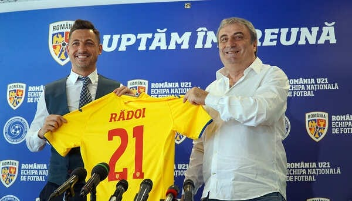

Performanța obținută de naționala de tineret este una aparte pentru fotbalul nostru.

De obicei, fotbaliștii români se maturizează târziu din tot felul de rațiuni – de la modul în care sunt educați acasă și până la modul în care sunt educați fotbalistic.

Prin urmare, ajungem să jucăm împotriva unor adversari egali din perspectiva vârstei formale, dar mai dezvoltați fizic și mai ales mental.

De asta nu prea aveam rezultate la nivelul copii / juniori și de asta avem obiceiul de-a numi fotbalist tânăr jucători trecuți zdravăn de 20 de ani.

În fine, dincolo de această poveste, performanța lui Rădoi este una aparte și din perspectiva emoțiilor de tot felul pe care le-a stârnit în rândul suporterilor și nu numai.

Faptul că această echipă a obținut rezultate duce la creșterea cotei fotbaliștilor care o compun. Și asta sprijină acel bine făcut cu forța de Federație – regula care le face pe cluburi să promoveze fotbaliști tineri.

Bun, ce l-a ajutat mult pe Rădoi?

## 1. L-a ajutat felul lui de-a fi

Am folosit această formulă pentru a incorpora tot felul de alte sintagme, gen temperament, caracter, personalitate etc. De exemplu, temperamentul este înnăscut, restul din șir se formează.

Când spun că l-a ajutat felul său de-a fi mă refer atât la ceea ce a reușit el să transmită ca fotbalist, dar și felul în care s-a descurcat în acele câteva luni în care a fost antrenorul Stelei.

Nu mă refer la rezultate în sine, mă refer la cum a gestionat acea perioadă. Nu mi-a fost dat să văd un conflict moral mai interesant în fotbalul nostru…

Concret, pe de o parte a cedat tentației de-a antrena Steaua deși încălca regulile de-o manieră extremă – nu avea vreun soi de licență de antrenor.

Pe de alta, a avut o atitudine demnă de-a lungul acelei perioade din punctul meu de vedere. Chiar moral elegantă aș spune. Nimic din ceea ce fac de obicei personajele din fotbalul nostru în momentul în care sunt confruntate cu incorectitudini nu s-a regăsit la Rădoi.

Asta dovedește un anume tip de caracter. Capabil să-și recuască vina, dar și capabil să reziste unei presiuni psihice reale.

Inclusiv dialogul la distanță cu Becali a demonstrat că are personalitate, lucru pe care fotbaliștii-l simt imediat în vestiar, pe terenul de antrenament și în timpul meciurilor.

Asta contează tare mult dacă vrei să-i determini pe aceștia să-ți urmeze indicațiile sau măcar să simtă că joacă și pentru a te mulțumi și pentru tine.

## 2. L-au ajutat jucătorii

Avem o serie de jucători tineri care au făcut juniorate ceva mai serioase decât au reușit să facă alte generații.

Unii pentru că au fost pe-afară, alții pentru c-au lucrat bine sau foarte bine chiar în țară.

Avem mai mult talent în această generație decât în altele, trecute? Nu cred. Pur și simplu, e vorba de felu-n care a fost pus în valoare aceste talent.

Personal, cred că inclusiv discuțiile veșnice legate de faptul că avem tineri talentați care se irosesc e posibil să fi provocat ceva-n mentalul acestui grup de fotbaliști.

Poate nu e ceva definit clar, academic, dar importantă e idee. Chiar și sub forma unui vers dintr-o manea, tot e important că e-n mintea multora dintre ei – „Vreau să joc și eu ceva, să nu mă ratez ca Mitea!”.

Aceast vers nu există în vreo manea, e inventat de mine ca să ilustrez o idee.

## 2. L-a ajutat Isăilă

Isăilă a făcut o parte din drumul calificării. Nu i-a lăsat doar o poziție favorabilă în grupă, dar i-a lăsat și efectele muncii sale-n ceea ce privește jocul propriu – zis al echipei.

Isăilă este un antrenor care are o experiență superioară lui Rădoi și e posibil ca asta să fi văzut în ceea ce privește felu-n care arăta echipa când a preluat-o actualul selecționer.

Nu e ușor să gestionezi un început de campanie, sunt multe lucruri care trebuie gândite deștept, lucruri în care experiența superioară contează.

Rădoi a făcut unele schimbări în echipă, dar amprenta lui Isăilă rămâne. Nu sunt super obiectiv când vorbesc despre el poate și pentru că-mi place-n general ca antrenor, dar asta este, va trebui să accepți și posibilitatea unor exagerări din partea mea dacă-mi citești textele.

## 4. L-au ajutat Hagi și Federația

A spus-o și el, o spun și eu.

Hagi l-a ajutat prin faptul că s-a ajutat singur. Deși proiectul său este demn de toată lauda, de fapt Hagi nu face altceva decât să se ajute-n primul rând pe sine.

Academia sa este forma prin care el încearcă și reușește să conteze-n continuare în fotbalul românesc. Lucrul acesta e personal și dedicat celorlalți în același timp.

Federația l-a ajutat prin ceea ce eu numesc „regula binelui făcut cu forța”. Adică regula folosirii obligatorii în Liga 1 unui titular cu vârsta sub 21 ani pe tot parcursul meciului.

Am spus-o și-n trecut pe site și prin emisiuni că regula aceasta este cel mai bun lucru pe care Burleanu l-a făcut din perspectivă fotbalistică la FRF. Spunând fotbalistică, am eliminat alte lucruri foarte importante, dar neinteresante pentru fani, gen echilibrarea bugetului instituției.

## 5. L-a ajutat cariera de jucător

Unii se vor gândi mereu la Rădoi ca la un fost căpitan al Stelei și un fost fotbalist care și-a terminat cariera la arabi.

Două lucruri vreau să-ți evidențiez totuși… Rădoi e un fost internațional care a jucat la echipa națională alături de fotbaliști mari și împotriva unor fotbaliști mari.

Lucrurile acestea contează. Logic, nu te transformă automat într-un foarte bun antrenor, dar îți dă șanse-n plus. Așa cum spuneam și mai sus fotbaliștii, indiferent că-s cei de la naționala de tineret sau de veteranii de la lotul mare știu mereu ce-i de capul unui selecționer.

Inclusiv cei care nu joacă suficient și sunt nemulțumiți pot ajunge să-l respecte profund pe omul care ia loc pe bancă dacă acesta are genul de personalitate care să obțină acest respect.

Ca jucător, Rădoi a colaborat și cu câteva nume importante de antrenori. A învățat, probabil, ceva din felu-n care Olăroiu a interacționat cu anumite vedete de pe la echipele pe la care a fost.

Probabil a învățat ceva chiar și de la Răzvan Lucescu, un as în ceea ce privește capacitatea de-a forma grupuri extrem de solide la echipele sale.

Rădoi de astăzi este mult peste ce-a fost Rădoi de dinaintea preluării mandatului de la Steaua și chiar mult peste ce-a fost înainte de aceste câteva meciuri ca selecționer al tineretului.

Fiecare zi petrecută în locuri care cer mult de la tine așa cum sunt funcția de selecționer al tineretului sau cea de antrenor al unei echipe ca Steaua te transformă.

Eșecurile și succesele te transformă și te-nvață lucruri indiferent că-ți propui asta sau nu. Rădoi a învățat pentru că-n ciuda unor naivități de-ale sale (ex. vezi încercarea de-a prelua Juventus Colentina alături de parteneri neserioși, pe care nu a știut să și-i măsoare) chiar este un tip inteligent.

Faptul că pe lângă asta are și personalitate, dar și-o situație financiară bună îl vor ajuta mult în cariera sa. De altfel, îmi doresc să-l văd antrenând din la un moment dat și-n Liga 1.

De ce?

Pentru că felu-n care vede fotbalul este destul de aproape de felu-n care vreau să văd eu c-arată fotbalul jucat în campionatul nostru.
