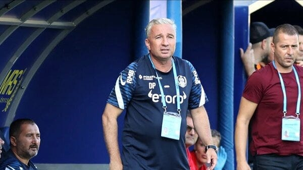

Am văzut tot felul de discuții / reacții legate de situația lui Fica de la CFR Cluj.

Majoritatea acestor reacții mi s-au părut amuzante.

Mă refer în special la cele care au trădat multă indignare.

Până și Petrescu a spus despre gestul lui c-a fost penibil.

În condițiile acestea, ce mi se pare amuzant?

Cu adevărat amuzant mi s-a părut faptul că printre cei oripilați de decizia lui Petrescu s-au aflat și antrenori care n-au promovat pe nimeni niciodată.

Dincolo de asta, la modul ceva mai profund, aceste reacții mi se par amuzante și pentru că eu privesc diferit ceea ce s-a întâmplat.

De exemplu, mie mi se pare mai nociv pentru acești puști să li se plângă de milă public în condițiile în care fotbalul este un joc în care răzbesc cei mai buni, nu cei mai sensibili.

Nu spun că ar trebui să i se urle lui Fica să se ducă la șah, precum i-a strigat Grigoraș lui Semeghin, spun doar că există domenii în care sensibilitatea poate fi mai bine exploatată decât în fotbal.

Șahul nu este nici el un astfel de domeniu.

Mi se pare aiurea să încerci să câștigi puncte la capitolul simpatie populară îngrijorându-te de starea psihică a lui Fica în condițiile în care tocmai această îngrijorare îi face mai mult rău băiatului.

Apoi, un puști de 18 ani, indiferent că este sau nu este un bun fotbalist, poate înțelege realitate: regula folosirii fotbaliștilor sub 21 ani este un bine făcut cu forța de către Federație cluburilor din Liga 1 și fotbalului nostru în general.

A fost o regulă bună sezonul trecut, când exista obligativitatea de-a folosi un singur fotbalist de gen, e o regulă prost normată acum.

Adică, dacă doreai ca echipele să folosească doi jucători pe durata întregului meci, trebuia să te folosești de regulament.

Altfel, era de așteptat să se întâmple ca la țară, acum 15 ani, când juniorul juca mereu fundaș lateral și era scos cum ieșea prima dată mingea în aut.

Federația a avut însă o atitudine slabă, ca să nu folosesc termenul căc@cioasă, în ceea ce privește felul în care se aplică regula în acest moment.

Dacă ai luat o decizie și crezi în ea, mergi până la capăt – asigură-te că nu poate fi ocolită.

Bun, Fica și orice puști intrat în adolescență pot înțelege asta.

La nivel de logică rece, pot înțelege că unii dintre ei sunt pe teren doar pentru că regulile spun asta, nu pentru că ar fi printre cei mai buni jucători din lot.

E vorba doar de logică aici, nimic emoțional, nimic ce ține de tăria psihică.

Abia acum urmează etapa a doua: cea a emoțiilor.

Ca bărbat sau ca bărbat în devenire, e în puterea ta să decizi cum reacționezi în raport cu propriile emoții.

Nu-ți poți alege ce emoții să simți, ci doar ce atitudine să ai față de acele emoții. Nu o spun eu, o spun una dintre cele mai practice filosofii existente în istoria umanității - [stoicismul](https://beldie.ro/ce-este-stoicismul/) și o spune cea mai importantă școală de psihoterapie – cea cognitiv – comportamentală.

De exemplu, poți alege ca după ce antrenorul te scoate, să te bălăcești în lacrimile ale celor care comentează pe la TV și să-ți plângi la rândul tău de milă.

Sau poți alege să faci ceea ce bărbații fac de când existăm ca specie: să-ți dai seama că în felul tău ai ajutat grupului.

Că ajutorul tău poate n-a fost spectaculos, dar că totuși a însemnat mai mult decât dacă n-ai fi fost în lot.

Nu fac întâmplător trimitere la acest aspect al sănătății psihice primitive a bărbaților. (simplu fapt că ceva este primitiv nu înseamnă că e automat rău).

Deși nu mai trăim în peșteri, jocul de fotbal este o manifestare arhaică a psihismului nostru. Nu întâmplător e vorba de disputa cu alt grup pe care-l consideri advers și pe care vrei să-l învingi.

În fine, există o situație aparte dedicată puștilor cu ouă mari.

Cu coaie, cum se spune pe stadion.

Dacă tu crezi că meriți să fii pe teren dincolo de acea regulă, că ești bun, că poți să-ți ajuți echipa mai mult jucând decât fiind schimbat fă asta: **refuză schimbarea**.

Refuză să ieși de pe teren când ți-o cere antrenorul.

Acceptă consecințele acestui gest și joacă în continuare.

Nimeni nu te poate scoate de pe teren în afară de un cartonaș roșu al arbitrului. În rest, vor fi poate colegi care îți vor cere să ieși sau vor fi colegi care te vor încuraja.

Depinde de grup.

Presiunea asupra ta va fi imensă, dar o astfel de decizie nu te va trage înapoi dacă ești bun.

În istoria recentă a fotbalului nostru, au mai existat cazuri.

Când avea cam aceeași vârstă ca Fica, Mutu a refuzat să iasă de pe teren când Dobrin, antrenor al lui FC Argeș pe atunci, i-a cerut-o.

Unii spun că Mutu a fost atunci needucat, nesimțit, obraznic etc.

Eu spun că a avut ouă.

Sau coaie, cum se spune pe stadion.

Ideea este că dacă ești cu adevărat bun, vei avea cel puțin aceleași șanse ca și până atunci să reușești.

Poate chiar ceva mai multe șanse pentru că un astfel de gest îți va spune ție însuți ceva despre tine.

Iar acel ceva pe care-l știi despre tine categoric nu va fi „ești o victimă”, așa cum îți spun diverși pe la televizor.
