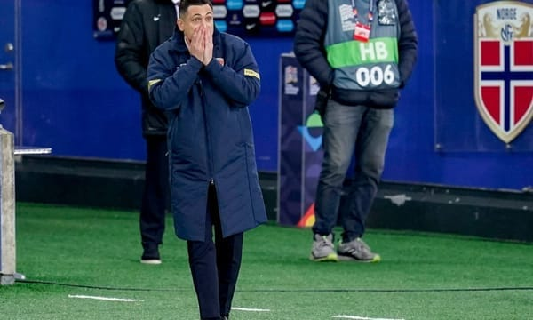

Hagi spune că trebuie să fim optimiști, că avem calitate.

Doar că dincolo de optimism și calitate ne trebuie și un plan major care să ne aducă succesul.

Gabi Balint, Marica și mulți alții vorbesc despre lipsă de valoare și se arată pesimiști.

Toșca vorbește de părți pozitive, Rădoi vorbește de părți negative.

Cornel Dinu nu iartă pe nimeni, din reflex.

Iar Ilie Dumitrescu îi cam iartă pe toți, din eleganță.

Deși toată lumea comentează aceleași întâmplări, povestea care iese arată diferit.

De ce?

În mare, pentru că oamenii au repere diferite când discută despre fotbal.

Opiniile fiecărui om, indiferent că-i suporter sau analist de prin studiourile TV, se bazează atât pe ceea ce vede, cât și pe reperele personale în ceea ce privește fotbalul.

O categorie majoră a celor care-și dau cu părerea nervos sau cu lehamite este formată dintre cei care au repere sărace.

Mă refer la cei care se uită cam degeaba la jocuri.

La fel de bine ar fi putut sta cu un site de live score în față și ar fi avut aceeași părere.

Îi recunoști de la distanță pentru că rezultatul este singurul care îi ajută să formuleze o idee.

Batem - suntem tari, patrioți, șmecheri.

Pierdem - jucătorii și antrenorii sunt proști, leneși, lipsiți de atitudine etc.

Alții însă au repere mai bogate.

Ori pentru că au jucat fotbal, ori pentru că au jucat fotbal și au antrenat, ori pentru că au jucat fotbal, au antrenat, au finanțat cluburi, au lansat jucători etc.

Și-n această zonă însă există elemente care duc la apariția unor păreri diferite.

Unii au construit lucruri la viața lor, alții n-au construit nimic.

Unii sunt mulțumiți cu ce produc, alții sunt veșnic nemulțumiți și dornici să dea vina pe oricine poate fi atacat.

Unii pot vedea dincolo de ultimul rezultat, alții consideră că ultimul rezultat e definitoriu.

Ce vezi la TV sau citești pe site-uri poate fi efectul unui meci văzut / înțeles pe sfert sau pe efectul unei vieți dedicate total fotbalului.

De aici și diferențele.

Nu e numai despre ceea ce vedem cu toții, parțial este și despre ceea ce suntem fiecare în parte.
