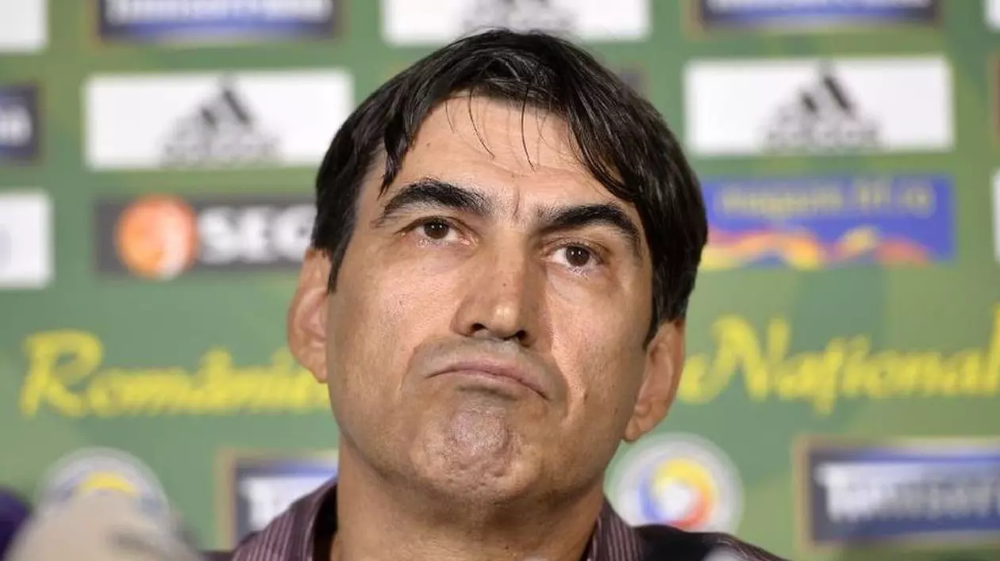

Am văzut la Sergi Lopez [înregistrea](https://www.facebook.com/100003884592122/videos/1907328659406602/) faimoasei pauze publicitare din emisiunea în care **Silviu Tudor Samuilă** l-a avut invitat pe **Victor Pițurcă**.

Și am citit apoi cu atenție [bucățile de dialog](https://www.gsp.ro/fotbal/liga-1/victor-piturca-dezvaluiri-socante-628704.html) publicate ulterior pe site-ul Gazetei.

Prin urmare, am câteva nelămuriri.

Unele se leagă de faptul că nu-nțeleg dacă Pițurcă a mințit sau n-a mințit în cele spuse.

Nu de alta, dar adevărul are mai mare importanță decât cuvintele care-l îmbracă.

Apoi, am câteva nelămuriri secundare care se leagă de cât de afectați sunt colegii de la Gazetă că un astfel de dialog privat a putut să aibă loc.

Au folosit sintagmele lor preferate „șocant” și „derapaj, chestiune la care apelează de câte ori se transformă în niște fecioare neprihănite uluite de violența de limbaj a lumii fotbalului.

În fine, hai să o luăm cu începutul…

## Pițurcă îl consideră jigodie pe Pigliacelli

**Pițurcă**: Pigliacelli era o jigodie fără margini!

**Samuilă**: Dădea mesaje să fie el căpitan, da…

**Pițurcă**: Nu numai asta. Aveam un puști portar, Popică (n.r. – Laurențiu Popescu), l-am băgat în Cupă și i-am spus lui Pigliacelli să-l încurajeaze și pe el. Nu voia! El era supărat că de ce nu apără tot el și în Cupă!

**Samuilă**: Ce jeg!

**Pițurcă**: Da, da, da, un jeg mare!

Dacă e adevărat că Pițurcă l-a rugat pe Pigliacelli să-și încurajeze pe colegul fără experiență, iar italianul n-a vrut, e dreptul lui Pițurcă să-l considere jigodie.

E părerea lui despre Pigliacelli, părere care, în contextul de mai sus, e posibil să o împărtășească și alții.

Sigur, colegii de la Gazetă pot verifica dacă lucrurile s-au întâmplat cum le spune Pițurcă, chiar dacă asta presupune mai mult efort jurnalistic decât să preiei informații gata servite și să te arăți uluit de limbajul pe care-l poate avea Pițurcă în privat.

## Pițurcă are un mod aparte de-a interacționa cu patronii

**Pițurcă**: A venit Rotaru și mi-a zis că e răzmeriță în vestiar. De unde știi, mă, tu că e răzmeriță? Știi tu ce-i aia?! O știu eu, o știi tu că vin și îți spun ție câțiva jucători?!

**Samuilă**: S-au obișnuit prost cu antrenori sclavi, cocoșați.

După cum se știe deja, Pițurcă are obiceiul să fie șef pe treaba lui oriunde antrenează.

Așa e firea lui și așa sunt contractele lui.

Patronii sunt deranjați de chestia asta și reacționează. Iar când reacționează, Pițurcă îi tratează ca pe niște nepricepuți.

Uneori are dreptate, alteori n-ar dreptate.

Colegii de la Gazetă pot verifica dacă chiar a fost răzmeriță în vestiarul Craiovei sau Pițurcă avea dreptate – doar câțiva fotbaliști nemulțumiți că nu joacă se smirocăiau la patron.

## Pițurcă a vorbit despre ceea ce Gazeta știa, dar nu a scris în ciuda misiunii sale

**Pițurcă**: Daa, el voia să-l dea afară de mult și pe Mangia, l-a prins că-i trimitea mesaje unui jucător, era «bulangiu». O să vezi că îl schimbă și pe grec (n.r. – Marinos Ouzounidis)

**Samuilă**: Că nu joacă spectaculos?

**Pițurcă**: Nuu, că-l bagă pe Vătăjelu fundaș dreapta… Am auzit deja că e nemulțumit, sunt multe discuții.

**Samuilă**: Îmi povesteau ăștia că se uită el pe InStat, are păreri…

După ce Mangia a plecat de la olteni, informația care a venit dinspre Craiova a fost că italianul ar fi avut o relație sau încercare de relație cu unul dintre fotbaliștii pe care-i antrena.

Adică era homosexual și-i plăcea de unul dintre elevii săi.

Ciudat este că nu s-a scris și nu s-a vorbit despre asta, ceea ce arată bigotismul multora dintre cei care lucrează în presă – dacă Mangia era împins să demisioneze după o aventură cu o secretară de la club, aflam cu toții și puteam să râdem deștept:

*„Al naibii macaronar!”.*

Așa, dacă italianul e homosexual și a fost îndepărtat pentru că a avut o relație nepotrivită profesional cu unul dintre jucătorii săi, nu zice nimeni nici pâs.

Oare de ce?

A, vine Pițurcă și dezvăluie fără să vrea cum au stat lucrurile. Folosește termenul argotic și clar depreciativ „bulangiu” în loc de homosexual, dar spune adevărul – Mangia și-a dat mesaje cu acel fotbalist.

E de investigat de colegii de la Gazetă dacă Rotaru l-a dat afară pentru că are ceva cu homosexualii sau nu.

De asemenea, e de scris povestea în sine, că e adevărată și are relevanță pentru interesul public care a fost motivul real al plecării unui antrenor de la o echipă.

## Pițurcă a demontat varianta c-ar fi fost dat afară de Rotaru

**Pițurcă**: E un libidinos, un jeg de om! Îmi zice că m-a dat afară. Păi, bă, în p***a mă-tii, dacă mă dădeai afară nu trebuia să-mi dai banii? 450.000 de euro! Ăstora așa trebuie să le faci. Banii!

**Samuilă**: Întotdeauna v-am admirat pentru asta, că v-ați luptat pentru drepturile dumneavoastră.

**Pițurcă**: Acum am zis că nu mai vreau să stau, să mă cert cu ei. El voia să plec, pentru că el nu mai însemna nimic pe-acolo. Înainte era șeful.

Aici, lucrurile sunt simple.

Pițurcă avea o clauză de reziliere a contractului său de către club – 450.000 Euro.

Dacă pleca de acolo fără ca el să fie de acord să plece, Rotaru ar fi trebuit să-i plătească acea clauză.

Cum nu a luat acei bani, clar că s-au despărțit pentru că Pițurcă a fost de acord sau chiar a vrut să se despartă.

Dacă lucrurile nu stau cum o spune această logică, colegii de la Gazetă pot investiga.

Normal, asta presupune iarăși un anume tip de efort, mult mai mare decât cel pe care-l faci ca să te declari oripilat de felu-n care vorbește Pițurcă.

## Pițurcă are aceeași părere despre Rotaru și-n public, și-n privat

**Samuilă**: Cum v-a adus, cum v-a convins?

**Pițurcă**: Din prostia mea, că a fost vorba de Craiova.

**Samuilă**: M-a mirat că ați preluat din mers echipa.

**Pițurcă**: Am avut încredere că voi face o echipă bună acolo. Nu credeam că Rotaru e un astfel de om. Trebuia să-l înjur de două ori, să-i dau un șut în cur, să mă dea afară și să-i dau banii. Așa trebuia să-i fac. Că la țărani d-ăștia așa trebuie să le faci!

**Samuilă**: Corect, sunt sută la sută de acord.

Iarăși fac trimitere spre adevăr, cea mai importantă chesiune când judeci spusele și acțiunile unui om.

După cum se poate vedea din acest dialog privat, Pițurcă are o părere cel puțin proastă despre Rotaru.

Îl consideră „libidinos” și „țăran”, apoi face niște afirmații exagerate legate de cum ar fi trebuit să-l trateze – „înjurături” și „șuturi în cur”.

Ce vreau eu să evidențiez este Pițurcă nu este ipocrit în cazul de față, chiar din contră.

Anterior acestei emisiuni, Pițurcă a avut luări publice de poziție din care reieșea că are un conflict cu Rotaru, că s-a despărțit de acesta cu resentimente și că nu-l respectă pe patronul Craiovei.

A, dacă public îl lăuda, iar în privat îl înjura, atunci puteai spune de Pițurcă că-i pervers, ipocrit etc.

Dar n-a făcut așa ceva.

Tot ce-a făcut Pițurcă a fost să spună ce crede el despre niște oameni, ceea ce reprezintă opinii.

De asemenea, a mai vorbit și despre niște întâmplări care par adevărate sau logice din felul în care le-a prezentat.

În privința opiniilor, nu e nimic de comentat.

În privința întâmplărilor, să vină cineva să spună dacă minte pe undeva.

## Despre Silviu Tudor Samuilă

După cum ai observat, n-am scris nimic până aici despre intervențiile lui Silviu Tudor Samuilă.

De ce?

Din două motive.

Primul este că nu-l cunosc personal pe acesta.

Absolut deloc. Nu am vorbit vreodată cu el, nu știu nimic despre el dincolo de ceea ce văd prin emisiuni.

În schimb, îl cunosc cei de la Gazetă, care l-au invitat recent să scrie texte de opinie pentru ziar. M-aștept ca ei să aibă o reacție de orice fel legat de acest aspect.

Apoi, la rândul meu am discuții private cu diverși oameni de fotbal în timpul pauzelor publicitare ale emisiunilor la care-s invitat. Nu folosesc expresii de genul „Ce jeg!” referindu-mă la cineva, dar categoric pot avea o părere proastă despre diverși.

De exemplu – cred despre Croitoru că e un antrenor umflat (dar rezultatele lui arată cu totul altceva), patronul Rapidului mi se pare de o naivitate comică când vine vorba de numit și dat afară antrenori, Talpan îmi pare un ipocrit, DDB-ul îmi pare lovită de mania persecuției în comunicatele pe care le dă presei, [Becali e Becali](https://www.cmeravar.ro/de-ce-il-urasti-pe-becali) etc.

Mai mult, pot la rândul meu să am respect pentru atitudini / fapte ale unor personaje care nu plac publicului.

De exemplu, mi-a plăcut atitudinea necăcăcioasă, nesmiorcăită cu care Ioan Becali s-a dus la închisoare, spre deosebire de atitudinea vărului său.

Sau îmi place cum își fac contractele Pițurcă, Iordănescu Jr. și alți câțiva astfel încât să poată avea garanția că nu vor fi tratați precum sunt tratați majoritatea antrenorilor din Liga 1.

Sau cred că [Iorgulescu a revoluționat fotbalul nostru](https://www.cmeravar.ro/meritul-lui-iorgulescu) prin faptul c-a adus antrenori italieni de la care românii au avut ce învăța.

N-am absolut nicio problemă să le spun acestor oameni că respect chestiunile respective în cazul lor, fără să fiu servil.

## Despre ipocrizia Gazetei

Niște ani, am fost producătorul emisiunilor lui Ovidiu Ioanițoaia.

Din această postură, am asistat la zeci de situații în care diverși oameni de fotbal își exprimau în privat părerile despre alți oameni de fotbal.

O bună parte dintre colegii mei de la Gazetă au asistat la rândul lor la astfel de discuții și al naibii să fiu dacă am văzut vreunul leșinând din cauza șocului pe care-l vântură acum prin titluri.

Sau dacă a doua zi au vorbit scârbiți despre [derapajele diverselor personaje](https://www.cmeravar.ro/gazeta-penalty-la-coltul-scurt/) din lumea fotbalului.

Din contră, era subiect de glumă la țigară și cam atât.

**PS:** „a fi derby” înseamnă a fi „fair play”. Expresia s-a născut pe buzele unui țigan care juca fotbal mai bine decât toți.

Pentru că era bun și dribla mult, adversarii încercau să-l intimideze prin tot felul de intrări tari.

La un moment dat, tipul n-a mai suportat chestia asta, s-a oprit din joc și a cerut în mod propriu un pic de fair play:

„Fiți, bă, derby!”.
