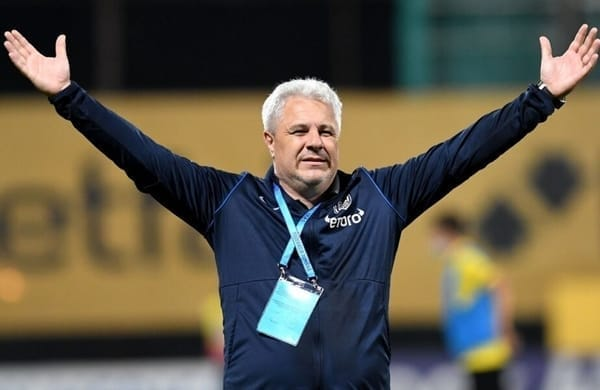

Șumudică polarizeză mai profund decât Becali.

Majoritatea celor care urmăresc Liga 1 ori îl plac total, ori îl disprețuiesc extrem. Aproape că nu există posibilitatea de-a avea reacție de mijloc în ceea ce-l privește.

Și tocmai asta îi place la culme antrenorului.

De ce?

Vei înțelege mai multe despre Șumudică după ce vei citi textul de față.

## Fotbalistul Șumudică – vârf adevărat, gură mare și nu numai asta…

Cred că se întâmpla în 1999, la finalul celebrului meci FC Național – Rapid, în care Gino Iorgulescu l-a alergat pe arbitrul Constantin Zotta.

Rapid a câștigat cu un gol marcat de Lupu, dintr-o lovitură liberă ușor acordată de arbitru.

Iar Șumudică a câștigat o dispută mult mai importantă din perspectivă masculină cu o bună parte a suporterilor lui FC Național.

Vreo 30 de inși l-au înjurat, iar Șumudică le-a arătat, simulat sau pe bune, cât de dotat este.

Eu am văzut meciul la TV, de asta nu pot spune cum au stat lucrurile exact, dar un ziarist de la Sportul Românesc, mult mai bine plasat, a remarcat în pagina săptămânală de umor a cotidianului:

> *Cinste ție Șumudică, noi credeam c-o ai mai mică!*

Ulterior, același Șumudică provoca prima eliminare din cariera unuia dintre cei mai eleganți fundași centrali din istoria fotbalului nostru, Emil Săndoi.

Trecut zdravăn de 30 ani și ajuns la FC Argeș, Săndoi a luat primul roșu din carieră după ce a fost nevoit să-l faulteze pe Șumudică, care scăpa singur cu portarul de la mijlocul terenului.

Deși reacția lui Săndoi n-a avut legătură cu vreun comportament obraznic al lui Șumudică, să fii primul fotbalist care determină o astfel de situație are o valoare simbolică.

Apoi, după un sezon în care cred că a marcat vreo 15 goluri, a plecat la Maritimo Funchal și a fost liniște. Cu Astra a fost ultimul său gol pentru Rapid, din ce-mi amintesc.

Unii spuneau la vremea respectivă că plecarea sa nu însemna doar faptul că Rapid pierdea un om care avea simțul golului, dar și un individ care mobiliza vestiarul prin modul în care comenta tot ce se scria în ziare și se prezenta la TV.

Cariera lui de fotbalist înseamnă următoarele: atacant clasic bun, care a marcat goluri atât la o echipă care nu ducea prea mult mingea în fața porții – Sportul, cât și la o echipă cu pretenții, Rapid.

Nu era tehnic după standardele vremii – adică nu avea vreun dribling aparte, dar avea simțul porții, plasament și inteligență de joc.

Cu cine seamăna?

Păstrând proporțiile, era un fel de Inzaghi.

Nu a ajuns pe la „națională” tocmai pentru că-n generația sa au fost fotbaliști pentru care Becali ar cere acum zeci de milioane fără să pară atât de absurd.

## Antrenorul Șumudică – comic, valoros, instabil emoțional

În ciuda faptului că unii îl văd ca pe un clovn, Șumudică este mai ales un pragmatic desăvârșit inclusiv ca antrenor.

Pentru început, a fost un tip capabil să-și facă prietenii în puncte esențiale – Mircea Rădulescu, când acesta era șeful școlii de antrenori a FRF și Dumitru Dragomir, când acesta era încă președintele LPF.

Dincolo însă de abilitatea aceasta, Șumudică s-a dovedit și un antrenor interesant în mod real.

Uneori, strict datorită rezultatelor obținute în condiții grele (Gloria Bistrița) sau sub o presiune aparte (FC Vaslui – Porumboiu), alteori inclusiv datorită capacității de-a se face interesant pentru presă / public (Rapid).

Prima parte a carierei sale de antrenor a fost definită de două lucruri:

**1. capacitatea de-a câștiga titlul (Astra)** și rezultatele din cupele europene (FC Vaslui și Astra) - a avut parte de loturi valoroase pentru nivelul Ligii 1, dar fără să beneficieze de ceea ce un club cu pretenții ar fi trebuit să-i ofere în perioada petrecută la echipa lui Ioan Niculae.

**2. scandalul pariurilor** - un astfel de comportament este problematic din motive lesne de înțeles. Uman, Șumudică a făcut o greșeală. Profesional, a făcut ceva cu greu de acceptat, chiar dacă Astra nu l-a concediat, [așa cum ar fi fost firesc.](https://www.cmeravar.ro/astra-demisie-sumudica/) Viciul jocurilor de noroc / pariurilor este o povară extremă, pe care societatea o înțelege prea puțin, în ciuda efectelor sale devastatoare.

Din punctul meu de vedere, tot circul pe care-l făcea Șumudică în acea parte a carierei sale era mai puțin important comparativ cu rezultatele sportive obținute cu Astra în campionat și Europa, dar și comparativ cu problema pariurilor.

**Mai mult, cred că o bună parte din ceea ce reprezintă fler / inspirație la Șumudică se naște exact din același loc din care se naște și comportamentul de clovn pe care-l are uneori.**

Prin urmare, cred că cel puțin în acea fază a carierei lui, Șumudică n-ar fi putut să-și reprime astfel de manifestări fără să-și saboteze o parte din atuurile pe care le are în vestiar și pe marginea terenului.

Ca o concluzie până aici – Șumudică a fost ca antrenor ce a fost și ca jucător: un tip cu inspirație, capabil să citească rapid adversarul. Așa cum era un factor de interes în vestiar ca fotbalist, a reușit să facă asta și ca antrenor.

Lucrurile acestea sunt importante pentru că se obțin mai greu decât cunoaștere teoretică necesară unui antrenor. De multe ori, nu se obțin niciodată, oricât s-ar da cineva peste cap.

## Antrenorul Șumudică – pragmaticul extrem

După plecarea de la Astra, se poate vorbi despre ceea ce reprezintă a doua parte a carierei lui Șumudică.

O primă concluzie – Șumudică a continuat să fie un pragmatic desăvârșit. Se poate vedea asta atât în lipsa sa de aplecare spre promovarea de jucători tineri, cât și-n ceea ce privește importanța pe care o dă staff-ului său tehnic.

Chestiunea legată de lipsa de atenție pentru formarea / promovarea de jucători e o slăbiciune pentru un antrenor care lucrează la echipe de Liga 1. Campionatul nostru ar trebui, teoretic, să fie axat pe producere de jucători.

Chestiunea legată de staff-ul său e o dovadă de inteligență profesională – Șumudică știe care-i sunt punctele forte și știe că oamenii pe care-i are în staff-ul său numeros pot să-i compenseze defectele. Inclusiv pe cele care țin de personalitatea / temperamentul său.

Revenind la inapetența sa pentru promovarea tinerilor – acesta este un aspect obișnuit în fotbalul nostru. Răzvan Lucescu, crescut teoretic sub influența tatălui său, care este formatorul suprem de jucători inclusiv la modul serios, nu doar când glumim, este exact ca Șumudică.

În general, această frică de-a promova tineri se naște mai ales din cauza atitudinii isterice pe care majoritatea conducătorilor / patronilor din Liga 1 o au față de antrenori – 4 meciuri consecutive pierdute echivalează de multe ori cu demiterea.

Simplu fapt că asta se întâmplă des îi face pe unii să creadă că-i normal.

Nu-i normal, e o tâmpenie fără margini care duce inclusiv la amputarea curajului antrenorilor să promoveze tineri.

Spre deosebire de Răvan Lucescu, care era un antrenor temător în general pe vremea când antrena în Liga 1, lui Șumudică nu-i lipsește acest curaj. Lui îi lipsește spiritul pedagogic. Așa că preferă să se bazeze pe fotbaliști maturi, care-i aduc și rezultate mai rapid, dar nici nu-i expun defectele profesionale

Contraexemplul Petrila, fotbalist în cazul căruia Șumudică își arogă meritele promovării / creșterii la nivel de confirmare?

**Povestea cu Petrila** nu este o dovadă a faptului că Șumudică e vreun creator de fotbaliști, un mic Mircea Lucescu în devenire. Povestea cu Petrila este doar o altă demonstrație a abilității lui de-a profita deștept de situațiile ivite.

Concret, cine se uită la fotbal cu adevărat știe că Petrila a început să-și arate calitățile cu mult înainte de împrumutul la Sepsi. Altfel, o echipă cu pretențiile lui Sepsi n-ar fi adus un fotbalist fără potențial clar și fără ceva dovezi certe că poate să ajute.

Apoi, saltul major l-a făcut la Sepsi, cu Leo Grozavu. La revenirea în Gruia, Șumudică a fost nevoit să-l folosească pe Petrila și pentru că e jucător sub 21, dar și pentru că era obligat de evoluțiile acestuia de sezonul trecut.

## Antrenorul Șumudică – atitudinile narcisice

Singura poftă nepragmatică pe care și-o satisface necontrolat Șumudică ține de-un soi de narcisism – e disperat să primească atenție, așa că-i în stare să facă orice sau să spună orice pentru asta.

Lucrul acesta s-a văzut atât în Turcia, unde a ajuns să fie demis ca urmare a incapacității de-a-și controla discursul, dar și în România.

Presupunerea mea este că Șumudică se hrănește emoțional cu aplauzele / admirația / uimirea celor din jur într-o asemenea măsură încât pierde controlul asupra propriei imagini.

Serios vorbind, o bună parte din luările sale de poziție indică atitudini narcisice, o chestiune devenită obișnuită în societatea actuală mai ales datorită exploziei interesului față de social media (Facebook, Instagram, Twitter etc.).

Un exemplu în acest sens sunt acele femei care pot produce 35 de selfie-uri pe zi din dorința de-a li se reconfirma dopaminic faptul că sunt atractive.

Șumudică nu stă pe Facebook, dar își produce selfie-urile în conferințe de presă, în intervenții în emisiunile sportive, pe marginea terenului etc.

E suficient să-l privești [cum caută să stârnească admirația ziariștilor străini](https://www.digisport.ro/fotbal/champions-league/marius-sumudica-aplaudat-la-scena-deschisa-dupa-umilinta-de-la-belgrad-ati-ramas-in-inima-mea-1232721) la meciurile CFR-ului din Europa ca să-ți dai seama la ce mă refer. Totul pentru a fi acceptat, plăcut, admirat, aplaudat.

Mai mult, atunci când se înflăcărează legat de un subiect sau se dă peste cap să fie amuzant non-stop, despre asta e vorba.

Apropo de amuzant – are Șumudică umor?

Sigur că are.

Singura problemă în cazul lui este că simte o obligație să fie amuzant ori de câte ori deschide gura.

Normal, unii oameni echivalează ideea de Șumudică cu umorul și nu mai sunt atenți la ce spune acesta. Că dacă ar fi, ar vedea că o bună parte dintre spusele sale n-au niciun haz.

Că sunt chestii forțate, scremute.

De ce?

Pentru că Șumudică este un bun antrenor, nu un bun comediant. Mai mult, inclusiv comedianții profesioniști au nevoie uneori de ani de zile între spectacolele lor ca să poată oferi o oră și jumătate de show.

Șumudică vorbește fără pauze, așa încât ajunge să spună și o grămadă de prostii. Aceleași atitudini narcisice au stat și la baza reacției sale față de analiștii din studiourile TV:

> *Sunt alții care stau bine mersi la diferite posturi de televiziune și încep: „Cutărică nu a făcut bine, Deac nu vrea să îl ajute pe Șumudică, X nu vrea să joace pentru Șumudică”. Nu există așa ceva.
> 
> Îmi place să stau liniștit în fața dumneavoastră și să le răspund și să le spun că atât de mult iubesc meseria, atât de bine mă simt pe teren și aici, și în preajma jucătorilor.
> 
> Și atât de bine mă simt când îi văd că se consumă și că îi doare ceea ce se întâmplă la CFR. Nu îmi spuneți mie că erau ei atât de afectați că a jucat CFR-ul prost în prima repriză prost, bă, dar ce afectați erau ei. Ce iubesc ei CFR-ul că nu a jucat bine în prima repriză. De unde…ei nu știau cum să îl lovească pe Șumudică, jucătorii de la CFR.
> 
> Băi, oameni buni, vă mai transmit o dată: e greu cu CFR și e greu cu Șumudică! Stați în banca voastră, acolo pe 80-100 de euro, cât vă plătesc cei de la televiziuni și mai ușor cu pianul că se varsă claviatura*

A spus-o, s-a bucurat de moment, a trăit plăcerea să-și vadă spusele citate și analizate peste tot.

Apoi, a început să primească „na-na” de la cei care s-au simțit atacați de spusele sale. Când printre cei care au avut replică s-au ivit Crăciunescu, Ilie Dumitrescu și Radu Paraschivescu, Șumudică a dat înapoi.

Că nu s-a referit la aceștia, ci la alții.

Că bla-bla.

Lașitatea este comună printre cei cu atitudini narcisice, așa că nu m-a mirat.

**Totuși, este Șumudică laș?**

Aș fi zis că pare laș, dar există ceva care mă face să am dubii – [spusele lui Gabi Răduță despre Șumudică](https://www.gsp.ro/fotbal/liga-1/ba-te-omor-povestea-conflictului-nestiut-dintre-sumudica-si-o-legenda-a-fotbalului-romanesc-639138.html).  În emisiunea lui Costin Ștucan, Răduță a afirmat că-n tinerețea sa, Șumudică avea tupeul necesar să facă mișto fotbalistic de colegii mai în vârstă de la Sportul.

Or ca să faci asta, trebuia să ai ceva ouă.

În acele vremuri, fotbaliștii experimentați care se simțeau luați peste picior plăteau cu palme, pumni și picioare gesturile obraznice ale colegilor mai tineri.

Mai mult, sunt printre cei care ani de zile au văzut cam toate meciurile din campionat ale echipelor importante, deci și ale Rapidului lui Șumudică – nu a fost un fotbalist fricos, care să se ferească de dueluri fizice. Asta-n ciuada faptului că nu a fost vreun înzestrat din acest punct de vedere.

Prin urmare, înclin să cred că pașii înapoi făcuți de Șumudică țin mai degrabă de pragmatismul său, nu de lașitate.

## Antrenorul Șumudică – teama de un faliment închipuit

De asemenea, Șumudică pare să sufere de ceea ce ce s-ar putea numi „teama falimentului închipuit”.

Concret, aceasta este o frică  specifică în general oamenilor cu copilărie dificilă (habar n-am cum a fost copilăria lui Șumudică) sau celor care au văzut la viața lor multe situații în care diverși din preajmă au ajuns rău ca urmare a tot felul de evenimente.

Ceva din istoricul lor de viață îi face să se asigure și să se reasigure că nu vor trăi ce-au trăit sau au văzut că au trăit alții.

Un exemplu grăitor în acest sens este Dumitru Dragomir.

Acesta a mărturisit că a suferit atât de mult de foame în copilărie încât, ca adult, nu se poate abține să consume cantități majore de mâncare chiar dacă astăzi are ce mânca oricând vrea.

La alții, această teamă se manifestă în relație cu banii, la alții sub forma disperării de-a fi tot timpul în contact cu persoane apropiate.

Exemplele sunt nenumărate.

La Șumudică, această teamă se vede mai ales sub forma disperării de-a fi în atenția altor cluburi chiar dacă se află în acel moment sub contract. E o nuanță aici – nu vorbesc despre disponibilitatea firească a antrenorilor de-a prelua o echipă de la care vine o ofertă mai bună.

Vorbesc de continua băgare în seamă sub formule precum cele de mai jos (citări aproximative):

> *CFR ar fi echipa la care aș antrena pentru că… bla-bla…*

sau

> *Dinamo este o echipă pe care o respect foarte mult… Și fanii lor mă respectă, există o afinitate. Am primit o grămadă de mesaje în acest sens.*

sau

> *Sunt prieten cu domnul Rotaru, iar Universitatea Craiova este o echipă care…*

De la o poveste de acest gen cu Craiova s-a născut și dialogul cu mine în care Șumudică s-a legat de faptul că eu am numit-o Steaua pe FCSB, în loc să spună concret dacă a primit sau nu ofertă de la Mihai Rotaru pentru a antrena Craiova.

Apropo, acela cred că a fost singurul dialog în care Șumudică a fost confruntat  în ceea ce privește „vrăjeala” asta.

De aici și nervozitatea lui.

În fine, revenind la tema falimentului închipuit, aș încadra tot aici și faptul că vehiculează repetat faptul că e un antrenor realizat financiar.

Până la el, n-am mai auzit vehiculată această idee la vreun antrenor și, deși ar putea fi doar o altă formă de laudă narcisică, cred că mai degrabă că e o formă de control a ceea ce se întâmplă în jur.

Un fel de „eu sunt bine, chiar dacă mi-e frică”.

Sigur, ca orice am scris în acest text, e doar o speculație, o interpretare a realității pozițiilor publice ale lui Șumudică prin intermediul opticii mele.

## Concluziile legate de Șumudică

Cel mai interesant lucru la el mi s-a părut tocmai faptul că nu seamănă în mod real cu absolut niciunul dintre antrenorii noștri.

E o categorie aparte. Dacă aș specula psihoanalitic, aș zice că inclusiv originalitatea numelui Șumudică contribuie la conturul lui de „special”.

Apoi, e interesantă și capacitatea lui de-a-și exploata calitățile și de-a-și masca defectele. Un interviu sincer cu Cristi Petre, care-i este secund de multă vreme, ar lămuri probabil aceste lucruri.

Apoi, e demn de menționat că nu se potrivește oriunde, în orice context. Lucrul acesta este atât de evident încât l-aș considera un avantaj – îl ajută și pe el, dar și pe conducătorii de club să nu intre în contracte nepotrivite. Asta teoretic, pentru că practic a mers la CFR Cluj.

Acolo, vestiarul a fost compus din prea mulți flăcăi diferiți ca personalitate de cei cu care Șumudică a făcut treabă de-a lungul timpului. Cred că asta a fost marea problemă și nimic altceva.

Încă o chestie – e un antrenor bun, dar cât de bun este?

După părerea mea, nu este atât de bun pe cât își închipuie el că ar fi în acest moment.

Dar tot după părerea mea, la nivel de potențial, Șumudică poate fi mult mai bun  chiar și decât el însuși își închipuie c-ar putea fi. Mai ales după eșecul parțial de la CFR Cluj.

Așa cum am spus mai sus, lui Șumudică îi lipsesc anumite lucruri (simț pedagogic, atenție la detalii, capacitatea de-a pregăti meciuri „plictisitoare” etc.)  care sunt ușor de obținut prin dezvoltare personală sau prin oameni din interiorul staff-ului.

În schimb, talentul lui bazat pe simț, pe fler este ceva de nereplicat prin intermediul școlii clasice.

Marea lui problemă la ora actuală ține de aceste atitudini narcisice. Pare un fel de imaturitate târzie având în vedere că e un antrenor aflat la vârsta optimă pentru performanță în antrenorat – 50 ani.

Poate să-și rezolve această problemă?

Dacă a putut să treacă peste adicția pentru jocuri de noroc / pariat, categoric poate. Teoretic este cu mult mai ușor, dar într-un fel mai greu.

E mult mai ușor pentru că-n creierul oamenilor secreția de dopamină produsă de anticiparea pierderii / câștigului provocate de jocurile noroc este mai greu de gestionat decât plăcerea de-a fi în centrul atenției.

Pe de altă parte, ca antrenor trăiești public și ești mereu în contact cu tentația de-a spune mai mult decât e cazul într-o conferință de presă sau în timpul unei discuții telefonice într-o emisiune sportivă.

În fine, acest text este ceea ce percep eu despre Șumudică bazându-mă exclusiv pe faptele și atitudinile publice ale acestuia.

Nu-l cunosc în particular.

Prin urmare, posibil să am dreptate în ceea ce am spus, dar e probabil și să mă-nșel măcar parțial.

Oricum ar fi,  Șumudică are mulți ani de antrenorat înainte ca să arate cum stau lucrurile cu adevărat.
