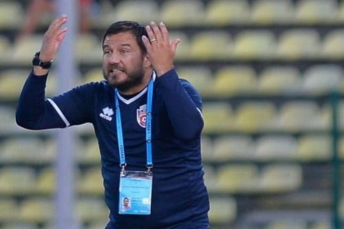

Înainte să te uiți pe rezultatele voturilor, trebuie să știi câteva lucruri.

Voturile mele sunt profund subiective. Ce-mi place mie când vine vorba de fotbal poate să difere mult de ceea ce-ți place ție.

Pe românește, e chestie și de gust, nu doar de logică.

Și tot legat de subiectivitate, nu am judecat cu aceeași măsură în toate cazurile.

Adică, au fost situații în care rezultatele concrete obținute de cel pe care l-am votat au contat cel mai mult, iar în alte situații am judecat în funcție de întregul context în care antrenorul sau fotbalistul respectiv și-a făcut treaba.

De exemplu, pe Petrescu l-am votat într-o măsură mai mare pentru rezultatele sale concrete, iar pe Croitoru pentru capacitatea de-a-și face echipa să joace deși aceasta este reformată masiv periodic.

Din păcate, nu am reușit să găsesc informații legate de cum au votat ceilalți ziariști / colaboratori ai Digi Sport. De altfel, nu am găsit pe nicăieri decât rezultatele pentru [antrenorul anului 2021](https://www.digisport.ro/fotbal/liga-1/edi-iordanescu-antrenorul-anului-in-ancheta-digi-fotbal-eforturile-si-sacrificiile-nu-au-fost-in-van-1442451) și [cel mai bun tânăr jucător al anului 2021](https://www.digisport.ro/fotbal/liga-1/claudiu-petrila-votat-cel-mai-bun-tanar-fotbalist-din-romania-in-2021-a-anuntat-planul-sau-de-viitor-1443161).

Mi s-ar fi părut interesant să văd o astfel de prezentare opiniilor tututor celor care vin în studioul televiziunii de sport și discută despre Liga 1.

În fine, eu am ales exact așa…

## Cel mai bun fotbalist din Liga 1 în 2021

**1. Ciprian Deac** – pentru că a jucat în mod constant bine sau foarte bine de-a lungul întregului an. Bine, face asta de niște sezoane bune, posibil să fi contat și asta pe fundal.

Să nu uit –  îmi place că este un fotbalist foarte intens și-n duelurile fizice. Deși de câteva ori această agresivitate a mers aproape de violență, prefer acest tip de fotbalist unora care iau galbene pentru proteste, trageri de timp și altele de gen.

**2. Florin Tănase** – sezonul trecut a fost extraordinar nu doar din perspectiva numărului de goluri marcate (24), dar și din perspectiva greutății evoluțiilor sale generale.

L-aș fi votat fotbalistul anului dacă lua titlul cu FCSB? Cred că nu, dar tot mi se pare un fotbalist pe care echipa sa îl va resimți major dacă va pleca în această iarnă.

**3. Mario Camora** – pentru că a avut concurență serioasă pe post și sezonul trecut, și acesta, dar joacă de parcă prezența sa pe teren este cel mai firesc lucru. E la nivelul lui Deac din perspectiva constanței. În fine, e primul străin care a ajuns în naționala României.

## Cel mai bun antrenor din Liga 1 în 2021

**1. Dan Petrescu** – îmi place atitudinea sa legată de antrenorat. Îmi place atât de mult disperarea lui de-a câștiga încât pot să trec mai ușor cu vederea faptul că se smiorcăie continuu pentru orice neajuns real sau imaginar.

De asemenea, fotbalul jucat de CFR este destul de aproape de ceea ce-mi place mie – foarte direct, foarte organizat în defensivă, fizic etc.

În fine, probabil că Petrescu este cam ultimul antrenor din Liga 1 care poate spune că el decide tot ce ține în mod tradițional de deciziile antrenorului.

**2. Marius Croitoru** – când a fost numit la Botoșani, mi s-a părut că Iftime este neserios. Continui să spun că la Liga 1 ar trebui numiți antrenori cu experiență, nu debutanți în meserie. Croitoru este o excepție extremă.

Nu doar că a reușit să confirme din start, dar reușește să reziste la un nivel foarte ridicat raportat la bugetul clubului.

Să refaci echipa anual și să joci un fotbal atât de cursiv pare mai degrabă ceva specific unui antrenor care are și experiență, nu doar talent.

**3. Laszlo Balint** – îi urmăresc echipele de când antrena în Liga a 2-a (Snagov și Metaloglobus în special). Sezonul trecut echipa sa a fost un dezastru pe teren propriu, dar anul acesta lucrurile s-au mai echilibrat.

Ce-mi place foarte mult la stilul său este maniera directă, aproape englezească de-a juca.

Dacă aș menționa și ce nu-mi place, atunci aș vorbi de atitudinea sa publică de după meciurile pe care nu le câștigă. Supărarea aceea extremă mi se pare exagerată chiar și pentru condițiile de tensiune din fotbalul nostru.

## Dezamăgirea anului 2021 în Liga 1

**1. Evoluțiile lui Dinamo** – pur sportiv, jucătorii lui Dinamo au fost catastrofali. Inclusiv după ce banii n-au mai fost problema principală, majoritatea fotbaliștilor lui Dinamo au demonstrat cât de mică este diferența este dintre așa zișii fotbaliști cu nume și cei care joacă pe la formații de plan secund.

**2. Eliminarea FCSB de către Shakhtar Karagandy** – ahahaha! Ce comicărie! Ți se poate părea ciudat că râd când vine vorba de o dezamăgire, dar eliminarea aceasta este de râs, abia apoi de plâns.

**3. Eliminarea Universității Craiova de către KF Laci** – altă tristețe de care merită râs. Dubla respectivă a fost pierdută exclusiv la nivel de minte și atât. Nici măcar pentru că adversarul a fost mai deștept, ci pentru că ai noștri au fost mai blegi. Fotbalistic, nu exista comparație între cele două echipe.

## Cel mai bun tânăr al anului 2021 în Liga 1

**1. Claudiu Petrila** - noroc cu sezonul trecut, de la Sepsi și cu bucata jucată cu Șumudică la CFR în acest sezon. Dacă m-aș lua după câte prezențe are recent la CFR Cluj…

În fine, băiatul are talent și chiar un pic de valoare raportat la cât de tânăr este. Valoarea are nevoie de timp ca să se contureze, iar fotbaliștii români se coc după 23-24 ani.

**2. Octavian Popescu** - a jucat titular la o echipă care se bate la titlu și a avut suficiente momente în care

De asemenea, îmi place mult la el faptul că are balonul lipit de gheată, rar am văzut un asemenea control în fotbalul nostru. Deși joacă posturi diferite, îmi aduce aminte de Tiberiu Ghioane din acest punct de vedere.

**3. Ion Gheorghe** – cel mai mult m-a impresionat constanța sa, lucru remarcabil la un fotbalist român tânăr. A jucat bine când echipa lui a jucat prost și a jucat excelent când Voluntari a urcat în clasament.

## Cel mai bun veteran al anului 2021 în Liga 1

**1. Ciprian Deac** – la 35 ani impresionează inclusiv prin capacitatea de efort. Acum, te poți gândi că mereu a avut acest atu, dar pierzi din vedere că de la o vârstă încolo, astfel de capacități trebuie super antrenate ca să se mențină.

După o viață în Liga 1, Deac are marea calitate că se antrenează așa cum trebuie și că are motivație în ciuda faptului că a câștigat tot ce era de câștigat pe plan local.

În fine, chiar e fotbalist.

**2. Paulo Vinicius** – excelent la CFR Cluj sezonul trecut, revine sezonul acesta în Liga 1 și joacă titular la o echipă care se bate la titlu. Ai putea crede că e usor să concurezi pe post cu Miron și Cristea, dar e totuși vorba de FCSB, locul în care logica nu e logică.

**3. Cristian Săpunaru** – nu m-a impresionat major fotbalistic, ci prin influența sa în ceea ce privește clasarea neașteptat de bună a Rapidului în acest sezon. Nicio altă echipă nu cred că are un jucător atât de dedicat clubului cum este Săpunaru. De altfel, nicio altă echipă nu are în istoria recentă fotbaliști atât de atașați cluburilor lor cum au fost Săpunaru, Maftei, Daniel Niculae etc.

## Echipa din Liga 1 care a jucat cel mai atractiv fotbal în 2021

**1. FC Botoșani** – să pierzi mereu atât de mulți jucători și să joci un fotbal atât de plăcut de spectatori mi se pare o mare perfomanță.

**2. Sepsi** – mă refer exclusiv la ce a jucat echipa cu Grozavu înainte de pierderile din vară. Pur fotbalistic, acel stil de fotbal extrem de intens fizic este mult mai pe gustul meu decât ce joacă Botoșani, dar moldovenii au avantajul că au impresionat având pierderi masive înainte de fiecare început de sezon.

**3. UTA** – este anul acesta cam ce era Sepsi sezonul trecut. Aproape la fel de agresivi fizic, dar mai ofensivi. Puține echipe aduc constant 6-7 jucători în 20-25 metri advers aproape la fiecare atac pozițional.  Dacă și-ar crește foarte puțin eficiența când ajung la 1,5 metri de linia porții, ar fi în play off.

## Cel mai frumos moment al anului 2021

**1. Promovările celor de la FC U Craiova și Rapid** – pentru că-mi plac echipele de fotbal care sunt echipe de fotbal. Adică au suporteri.

**2. Revenirea publicului pe stadioane în vară** – nimic nu e mai trist decât un meci fără spectatori în tribune. Un meci prost cu un public cald pare un meci bun. Un meci foarte bun fără spectatori seamănă cu un trening Adibas.

**3. Obținerea licenței de către Dinamo cu ajutorul fanilor** – am o părere proastă despre implicarea DDB în deciziile de management de la Dinamo și o părere foarte bună despre reușita acestui program în ceea ce privește supraviețuirea echipei. Mobilizarea lor financiară este unică în fotbalul nostru și stârnește invidii nerecunoscute majore în rândul rivalelor.
