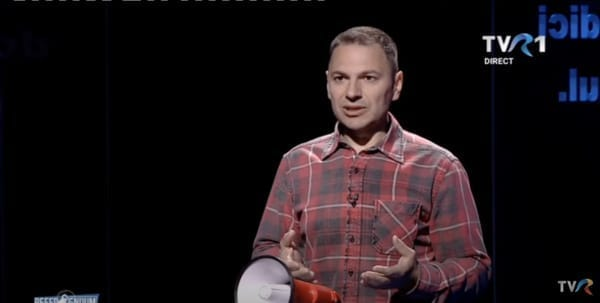

[După ce am fost invitat la Referendum (TVR)](https://www.youtube.com/watch?v=GQdypu-Eip0),  am primit tot felul de mesaje din partea a tot felul de oameni.

Unii, care mă-njură din când în când, m-au felicitat.

Alții, care mă-njură des, au dovedit constanță și caracter – deci m-au înjurat din nou.

Am observat însă o temă adusă-n discuție de câțiva flăcăi:

> *Băi, fraiere, dar pe tine de ce nu te mai bagă nimeni în seamă? Tu de ce nu mai faci emisiuni dacă ești așa de șmecher?*

Sigur, întrebarea a fost mult mai sexuală decât o prezint eu aici, dar ideea de bază cam asta a fost.

Prin urmare, doresc să lămuresc lucrurile de la-nceput până la final.

Nu te speria, nu durează mult.

Adică e doar început și final, mijlocul aproape lipsește.

## La început, îmi doream eu foarte mult, dar nu-și doreau și televiziunile de sport

În mai 2014, când sport.ro (ProArena) [m-a dat afară](https://www.cmeravar.ro/plecare-beldie-sport-ro), îmi doream foarte mult să fac în continuare emisiuni pe teme fotbalistice.

Era o dorință atât de mare, încât probabil că aș fi acceptat orice ofertă decentă.

Ghici ce însă?

Nu am avut oferte.

Sau, mai corect, am avut niște glume de oferte.

Adică ori erau foarte puțini bani din orice punct de vedere, ori erau mai puțini bani decât credeam eu că merit.

Ehehe, m-am obișnuit să fiu bine plătit, asta e.

În fine, după acel moment, pauză totală aproape 8 ani.

8 ani!

Singurele legături pe care le-am mai avut cu presa de sport în toată această perioadă au fost colaborarea de la Digi, la matinalul de week-end al lui Viorel Grigoroiu și aceste texte.

## **Apoi, și-au dorit și unele televiziuni de sport, dar…**

În ultimul an însă, ceva ciudat s-a întâmplat.

Brusc, am început să primesc propuneri să moderez din nou emisiuni dedicate Ligii 1.

Mai exact, am avut 3 propuneri.

Acum, 3 propuneri într-un an ți se poate părea puțin, dar raportat la numărul de televiziuni de sport de pe piață e ca și cum aș fi primit de la aproape toată lumea.

Ce s-a schimbat în acest interval de aproape 8 ani de brusc am devenit interesant?

Aș vrea să vin cu o explicație savantă, dar realitatea este că habar n-am.

Posibil să fie o întâmplare și atât.

Sau, posibil să-și fi dat seama televiziunile de sport cât de bun sunt eu și cât de bine le-ar prinde să mă plătească zdravăn pe mine ca să fac emisiuni pentru ei.

Acum, dacă am avut 3 propuneri, de ce n-am acceptat niciuna?

Simplu: timpul.

Teoretic, nefiind angajat pe undeva în toată această perioadă, timp ar trebui să am.

Și am.

Doar că nu-s dispus să dau prea mult din el pentru bani. Și fiecare dintre aceste 3 propuneri implicau un consum mai mare de timp decât aș fi fost de acord să ofer.

Atenție, aici nu mă refer la timpul pe care-l consum pentru a vedea meciurile din Liga 1.

Acelea le văd oricum pe toate, chiar dacă nu mai fac emisiuni. Da, asta înseamnă că atunci când vorbesc despre un meci într-o emisiune, o fac ca unul care a văzut meciul respectiv, nu ca unul care a stat pe live score și aruncă clasicele „meci slab, echipe subțiri, bla-bla”.

În plus, îmi place să văd toate meciurile din Liga 1.

Eu mă refer strict la timpul pe care ar fi trebuit să-l consum cu emisiunile în sine.

Prea multe ore zilnic sau prea multe ore în jurul meciurilor din week-end-uri.

Normal, fiecare om are un preț.

Doar că al meu e mare din start când vine vorba de-a face emisiuni.

Dacă mai apare și problema consumului de timp, automat crește până la un nivel aproape aberant.

Prin urmare, de ce să-l angajezi pe Beldie cu mulți bani când poți să angajezi pe cineva cu mai puțini bani?

În fine, asta nu-i problema mea.

## Bun, din ce trăiești?

Al doilea motiv pentru care îmi vine greu să fac o emisiune în condiții care nu sunt perfecte ține de faptul că profesional fac altceva.

Adică în acești 8 ani, mi-am alocat timp să merg zi de zi la școală ca să fac o altă facultate, un alt master, alte formări, specializări, training-uri etc.

Doar ca să am o meserie dincolo de presa sportivă.

Sigur, e o meserie care îmi permite să-mi organizez cum vreau timpul și să nu lucrez dacă nu vreau să lucrez.

Exact ca taximetriștii, cu excepția faptului că eu nu trebuie să plătesc stația în fiecare zi.

Totuși, pentru cei care nu mă cunosc, n-au nicio treabă cu mine, dar sunt disperați să știe din ce trăiesc, există următoarele variante:

1. iau șpagă de la domnul Becali să spun diverse evidențe – [gen FCSB este continuatoarea ideii de Steaua](https://www.cmeravar.ro/de-ce-fcsb-este-steaua)

2. iau șpagă de la alți oameni din fotbal când domnul Becali nu este suficient de generos. Nu fac discriminări între Neluțu Varga, Mihai Rotaru, Victor Angelescu etc. Doar când vine vorba de bani publici am niște mici rezerve

3. sunt genul de individ care dacă nu cheltuie bani în exces, poate trăi toată viața fără să lucreze clasic vreodată. Datorită părinților, desigur.

Deci ori sunt șpăgar, ori întreținut.

Ori niciuna, dar nu-i treaba nimănui.

Cam asta a fost.

Să recapitulez…

Nu am făcut emisiuni pentru că întâi n-am avut oferte serioase, apoi timp de aproape 8 ani n-am avut oferte deloc. Iar acum am oferte serioase, dar sunt foarte scump și nu mă-ndur ușor să ofer din timpul meu. 

În concluzie, nu-mi rămâne decât să aștept ca o televiziune să fie dispusă să mă plătească foarte bine pentru două ore de emisiune pe zi.

Sau să mă cheme ca invitat, cum sunt chemat la Digi Sport.

În această privință aș fi mai darnic cu timpul, dar nu și cu banii.

**PS**: când sport.ro m-a dat afară, lucrurile au stat exact așa: Fanatik a scris la vremea respectivă că urmează să fie dați afară o parte dintre angajați.

I-am crezut, așa că i-am spus lui Felix Drăghici că dacă are dificultăți să hotărască cine să plece, mă ofer să plec. I-am explicat că, spre deosebire de alții, nu am credite, nu trebuie să întrețin pe nimeni etc.

Poate că mă dădeau afară și dacă nu mă ofeream, dar ideea este că m-am oferit să plec.

Probabil de asta își pun unii problema c-aș fi șmecher.

Nu sunt, dar am stilul meu.
