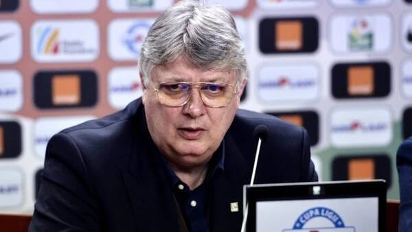
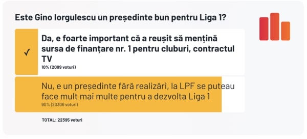

Gino Iorgulescu va fi în continuare președintele LPF după ce cluburile au decis în unanimitate să-l voteze.

Voturi împotrivă nu aveau cum să apară pentru că Iorgulescu a candidat precum Răzvan Burleanu, de unul singur.

În schimb, faptul că n-a existat nicio abținere nici aici, deși domnul Iftime iar făcuse caz legat de cât de slabă e și conducerea LPF, e oarecum comic.

În fine, site-ul Gazetei a avut un sondaj în care oamenii erau îndemnați să voteze [pro sau contra lui Gino Iorgulescu](https://www.gsp.ro/fotbal/liga-1/alegeri-lpf-gino-iorgulescu-664547.html).

Pro, pentru că a adus bani cluburilor prin intermediul contractului de vânzare a drepturilor TV.

Contra, pentru că n-ar fi avut realizări în condițiile în care se puteau face mai multe lucruri la Ligă.

Din cele  22.400 de voturi, peste 20.000 sunt contra Iorgulescu.

Adică aproximativ 90%.

De ce se întâmplă asta?

În opinia mea, există cel puțin 3 rațiuni care influențează masiv alegerile oamenilor.

1. **Lipsa de carismă a preșdintelui LPF**

2. **Ignoranța unei părți a celor care votează**

3. **Problemele personale ale președintelui LPF**

Am să le explic pe fiecare în parte, fără a susține că acestea sunt singurele motive pentru care Iorgulescu este atât de rău văzut.

Cred însă că sunt cam principalele rațiuni ale acestui vot al celor care nu contează în alegerile de la LPF.

## 1. Lipsa de carismă a președintelui LPF

Nu am reușit să găsesc alt termen care să reunească măcar aproximativ o stare de fapt precum cea din jurul lui Iorgulescu.

Spre deosebire de Dumitru Dragomir, Iorgulescu este un personaj care nu există public decât dacă e forțat de evenimente să apară.

Câteodată, nici măcar atunci.

În condițiile acestea, o parte dintre cei care ar încerca inclusiv superficial să-și facă o părere despre el n-ar avea de ce să se agațe.

Iorgulescu este retras, iar asta poate părea suspect multora.

Retras poate înseamna că faci bani și stai la cutie, chestiune zdravăn alimentată de publicarea informațiilor conform cărora ar câștiga lunar peste 15.000 Euro.

Dragomir mai făcea o glumă, mai spunea o prostie, iar oamenii puteau spune „al dracului, dom Mitică”. Iorgulescu nu face nimic de genul acesta.

Nu e felul de-a fi. 

Pur și simplu, e alt temperament și alt aluat față de Dragomir. Pe oameni nu-i interesează însă asta.

## 2. Ignoranța unora dintre cei care votează

Nu vei găsi în presă trimiteri spre ideea că o parte dintre cei care comentează pe site-uri sau votează n-au nicio treabă cu subiectul.

Și totuși, lucrul acesta e adevărat.

O parte a celor care au dreptul la opinie și-o exprimă fără nicio urmă de cunoaștere a domeniului.

Pentru cei cu aducere aminte, Gazeta a publicat la un moment dat un sondaj în care a întrebat care ar trebui să fie cuplul de fundași centrali ai Stelei.

Varianta câștigătoare a fost Gora Tal și Parpas, doi fotbaliști pe care nu-i văzuse nimeni jucând, dar care prin exotismul lor i-a atras pe cei mulți și dornici de votare.

Sigur, nu-ți închipui că cel care a lansat un asemenea sondaj a avut prea multă logică, dar limitări există peste tot, inclusiv în presă.

Uneori, nu e vorba de lipsă de cunoaștere, ci doar o atitudine lipsită de realism față de viață în general.

De exemplu, [un sondaj recent lansat de Gazetă](https://www.gsp.ro/fotbal/liga-1/dezbaterea-zilei-19-mai-cfr-cluj-model-664090.html) indică faptul că unii oameni sunt rupți de importanța echilibrului economic al cluburilor de fotbal.

Gazeta a întrebat referindu-se la situația de la CFR Cluj, dacă ardelenii sunt un model de urmat în Liga 1.

35% dintre votanți (peste 7.000 de oameni) au considerat că modelul CFR ar trebui urmat indiferent de riscurile financiare asumate de clujeni pentru că trofeele sunt tot ce contează.

## 3. Problemele personale ale președintelui Iorgulescu

După cum se știe în lumea celor interesați de fotbal și nu numai, fiul președintelui LPF a produs un accident de mașină care a dus la moartea unui tânăr care avea doi copii minori.

Și nu doar că Mario Iorgulescu a produs accidentul, dar l-a produs fiind sub influența alcoolului și a unor halucinogene.

Mai mult, Iorgulescu l-a dus pe fiul său în Italia, unde l-a internat într-o clinică și l-a scăpat temporar de efectele legilor din România.

Lucrurile acestea adunate îi fac pe oameni să-l considere pe Iorgulescu un individ care trage sforile să-și salveze copilul, care copil e un nenoricit pentru că a ruinat viața unei familii.

Când vine vorba de moartea unui om și de suferința familiei sale, e foarte greu să te mai gândești că Iorgulescu face tot ceea ce în general părinții încearcă să facă în relație cu copiii lor ajunși la ananghie.

Îți vin în minte altele – „Dar de ce nu și-a educat copilul? Dar de ce avea copilul mașină de 300.000 Euro pe mână? Dar dacă-l știa cum este, de ce l-a lăsat nesupravegheat?”.

Toate sunt întrebări legitime, dar nu exclud faptul că indiferent de situație, o bună parte a părinților vor face tot ce pot face pentru a-și salva copiii.

## Ce merite neapreciate are Iorgulescu

Votul de pe site-ul Gazetei este subiectiv, dar asta nu e vreo problemă.

E firesc să fie așa, oamenii își exprimă părerea.

Pe de altă parte, nu mă pot abține să nu remarc câteva lucruri legate de Iorgulescu pe care nu le vei auzi remarcate de cei care viețuiesc prin fotbal sau prin presă.

De ce?

Pentru că ori nu sunt chestiuni considerate interesante, ori pentru că respectivii pur și simplu nu le-au observat.

În fine, eu oricum le voi spune.

Din punctul meu de vedere, Iorgulescu este omul care a contribuit decisiv la cel mai important progres al antrenoratului din România.

Concret, a fost primul conducător de club care a simțit la finalul anilor 90 că antrenorii din România au niște limite de cunoaștere și chiar de metodă.

Prin urmare, a încercat să aducă antrenori străini și, după o tentativă nereușită (Rino Lavezzini), l-a adus pe Alesanco.

Apoi, după Alesanco, l-a adus pe Zenga.

Apoi, pe Bergodi, care a dus pentru prima dată CFR Cluj în zona pretențiilor reale, chiar dacă și Dorinel Munteanu a făcut treabă bună.

Apoi, Landi.

Apoi, orice italian care a venit în România, cu excepția lui Gianinni la FC Argeș, s-a descurcat cel puțin onorabil.

Toți cei pe care Iorgulescu i-a adus, au adus modificări mai mult sau mai mari în ceea ce privește felul în care antrenorii români au continuat să-și facă meseria.

În special Zenga, care a produs inclusiv moartea pregătirii clasice la munte, care se desfășura aproape exclusiv fără minge în prima sa parte.

Zenga l-a influențat mult pe Olăroiu. Și chiar pe Dan Petrescu aș zice.

Iar Olăroiu i-a influențat pe mulți alături de Răzvan Lucescu.

După aceea, lucrurile chiar n-au mai fost la fel în zona aceasta a antrenoratului.

Apoi, un alt lucru pe care oamenii nu-l conștientizează pe măsura dimensiunilor sale este acest contract de vânzare a drepturilor TV ale Ligii 1.

Cele 34 milioane Euro anual pentru cluburile din Liga 1 reprezintă sumă imensă. Sigur, succesul acestui contract nu i se datorează neapărat lui Iorgulescu, ci mai degrabă unei ciudățenii a pieții de TV și telecom din România.

Nu intru în detalii, dar ideea este că raportat la ce se joacă și chiar la audiențe, aceste sume sunt imposibil de acoperit de-o manieră clasică – gen vânzare de publicitate sau chiar prin obținerea de abonați pentru companiile de cablu.

Totuși, Iorgulescu a adus acest contract.

Poate îl aducea și Dragomir.

Poate îl aduceam și eu, nu contează.

Normal, exagerez.

Iorgulescu a semnat contractul care asigură, în medie, jumătate din bugetul cluburilor de fotbal. Asta e o realizare mult mai mare decât își dau mulți seama.

Știu, am mai spus asta, dar nu a fost suficient având în vedere cât de lejer se privește spre această chestiune.

În fine, ideea că Iorgulescu nu face nimic la LPF nu ține cont și de realitatea felului în care se iau decizii acolo.

Adunarea Generală a Ligii trebuie să valideze orice hotărâre a acestei instituții. Prin urmare, dacă te aștepți ca patronatul reunit în această Ligă să ia măsuri care să fie favorabile angajaților (fotbaliștii reuniți în AFAN), ești naiv.

Asta nu se-ntâmplă de bună voie decât foarte rar.

Ar trebui ca toți patronii / conducătorii să fie niște vizionari care fac planuri pe 10 ani și care să agreeze că a-ți silui salarial angajații strică imaginea produsului pe care-l vând.

Produs pe care până acum l-au vândut doar pentru că există, nu pentru că au ei un merit deosebit.

Greu, foarte greu să se întâmple așa ceva.

Prin urmare, Iorgulescu nu e nici pe departe atât de negru pe cât îl percep unii, iar o parte din meritele sale sunt mult prea puțin apreciate.

Sau prea puțin înțelese, mai degrabă.
