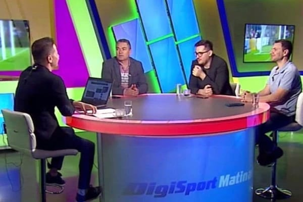

Americanii au chestia asta legată de bun simț.

Înainte să vorbească despre un subiect, dezvăluie ce legături au cu subiectul respectiv.

Concret, să zicem că mergi la o conferință la care urmează să vorbești despre beneficiile dietei carnivore.

Automat anunți dacă ai vreo legătură cu industria cărnii.

Dacă ai vreo bursă plătită de un mare producător de carne sau de o asociație a respectivilor producători. Sau orice interes care ar putea să aibă o influență asupra spuselor tale.

Nu știu, poate socrul tău are cea mai mare fermă de bovine de carne din Argentina.

Trebuie să dezvălui lucruri de genul acesta.

Sau, dacă nu vrei să le dezvălui, te abții să participi.

Când vine însă vorba de interesele / relațiile ziariștilor sportivi, lucrurile sunt aparent complicate.

## Toți am ținut sau ținem încă cu o echipă de fotbal

De ce aparent complicate?

Pentru că toți ziariștii care au fotbalul ca focus au ținut sau țin cu o echipă.

Nu prea ai cum să ajungi să-ți placă fotbalul și să nu-ți placă sau să nu-ți fi plăcut o echipă la un moment dat.

Prin urmare, te poți gândi că acest lucru va influența felul în care ziaristul își face meseria.

Corect, va exista o influență.

Doar că această influență este mai mare sau mai mică în funcție de felul de-a fi al ziaristului respectiv.

Adică în cazul unora influența este insesizabilă sau nedăunătoare meseriei, iar la alții acea influență te face să-i înjuri.

A, să nu uit…

Nu-ți închipui că de fiecare dată când îți vine să-i înjuri pe acel ziarist înseamnă că tu ai dreptate, iar ziaristul a fost incorect.

Probabilitatea ca tu, în calitate de suporter, să vezi lucrurile exagerat sau uneori greșit este ceva mai mare decât probabilitatea ca un ziarist să fie sub influența pasiunilor din copilărie.

De ce spun asta?

## Ziariștii care fac jocurile altora nu o fac din pasiune

Majoritatea ziariștilor care se pot afla sub influența pasiunilor din copilărie au bunul simț de-a-și da silința să fie obiectivi.

Cei care chiar merită înjurați sunt oameni care au interes să apere o anume echipă dincolo de faptul c-ar fi simpatizat-o de mici copii.

Ei, acei ziariști sunt cu adevărat o problemă.

Acțiunile lor sunt influențate nociv de relații personale cu fotbaliști, antrenori, conducători, patroni etc.

Atenție însă, inclusiv aici este o nuanță.

De exemplu, dacă ești ziarist de teren, adică faci munca aceea grea și cu adevărată nobilă a breslei, atunci e firesc să dezvolți o serie de relații cu oamenii din fotbal.

De cele mai multe ori, aceste relații sunt totuși profesionale.

Adică tu ai încredere în mine că ceea ce vorbim este redat corect în scris sau că interviul filmat nu va fi procesat de-o manieră incorectă.

Aici e vorba de un soi de respect care duce la un soi de amiciție.

Legătura de apropiere se dezvoltă în jurul unei acțiuni oneste din partea ziaristului, nu a uneia condiționată de cine știe ce interes financiar sau de altă natură.

În zona celor care fac muncă de teren se pot dezvolta și relații care trec dincolo de profesional și de amiciție.

Adică prietenii pe bune.

Ziariștii care au bun simț nu vor renunța la respectiva prietenie, dar nu o răsplătesc profesional.

Adică nu se apucă să facă interviuri cu prietenul lor în care să-i ridice acestuia mingi la fileu sau în care să ocolească subiecte de interes pentru public.

De cele mai multe ori, evită să interacționeze profesional cu acesta, mai ales dacă prietenia este una reală.

## Țin cu o echipă anume?

Am răspuns deja – toți de prin presă am ținut sau ținem.

[La rândul meu am ținut în copilărie cu o echipă de fotbal](https://www.youtube.com/shorts/9v6KoC91IWs) și am făcut-o la modul cel mai profund cu putință.

Adică ani de zile n-am pierdut vreun meci al respectivei formații, urmăream emisiunile în care se discuta despre ea atât în direct, dar și în reluare.

Urmăream tot ce putea să apară despre echipa mea favorită în ziare, la TV și pe teletextul programelor are aveau așa ceva.

Asta pentru că pe vremea respectivă nu exista net.

Că dacă exista, probabil aș fi fost unul dintre cei care se ceartă cu toată lumea în zona de comentarii a site-urilor.

Din fericire însă, la un moment dat, am crescut.

Adică țin în continuare cu acea echipă, dar asta nu m-a făcut vreodată să încerc să îmi fac meseria altfel decât ar fi firesc să mi-o fac.

Sigur, sunt unii care mă știu din copilărie și știu cu ce echipă țin.

Prin urmare, lor li se poate părea că favorizez echipa în cauză, dar asta e doar o formă de-a-și confirma cunoașterea.

Ei urmăresc indicii și fac o potrivire neobiectivă de puzzle.

La fel ar face oricine dacă i-ai spune că țin cu Victoria Florești.

Ar găsi în ceea ce spun astfel  indicii clare că fac jocurile Victoriei Florești.

## Unde mă situez eu – ce interese am în lumea fotbalului

În fine, îmi propun să nu se vadă că am simpatie pentru o anume echipă?

Nu.

Se vede că am ținut la modul profund cu o echipă?

Nu.

Dovadă noianul confuz de acuze c-aș fi stelisti, dinamovist, cfr-ist, rapidist etc.

Realitatea este că e foarte ușor să-ncerci să fii obiectiv dacă nu ai de fapt nicio legătură anormală cu nimeni din fotbal.

Exact cazul meu.

Nu am niciun fel de legătură anormală cu nimeni din fotbal.

Mai mult, spre deosebire de colegii care fac și muncă de teren, eu doar scriu pe acest site și merg ca invitat la emisiuni TV.

Prin urmare, nu doar că n-am nici legătură anormală cu nimeni din fotbal, dar mi-e ușor să nu am niciun fel de legătură privată cu nimeni din fotbal.

Singurele momente în care discut în privat cu diverse persoane din fotbal sunt:

- **când mă caută respectivii ca urmare a ceea ce am scris sau am vorbit la TV**

- **în pauzele publicitare din timpul emisiunilor la care sunt invitat**

- **când ne întâlnim întâmplător în diverse locuri – prin oraș, vacanțe etc.**

Cam atât.

În rest, orice contact pe care-l am cu cei din lumea fotbalului îl vezi în direct, la TV.

De asemenea, am avut norocul să fac muncă de teren doar pentru redacții care-și plăteau toate cheltuielile, nu apelau la amabilitatea cluburilor.

Prin urmare, nu am mers în deplasări pe banii cluburilor și nu am avut vreodată beneficii de pe urma interacțiunii cu cluburile de fotbal.

Astăzi, îmi cumpăr abonamente la meciurile echipelor la care merg mai des sau bilet în cazul celor pe care le vizitez mai rar.

În trecut, mă acreditam ca ziarist la meciurile lui Dinamo pentru că ofițerul lor de presă, Johnny Culina, făcea ușor tot procesul.

Dacă ar fi fost ca în alte părți, aș fi preferat și acolo să-mi iau bilet sau abonament.

Am primit o singură invitație la un meci din partea unui club. E vorba de un meci al Chindiei. Nu c-ar fi vreo rușine să te duci undeva dacă ești invitat, dar asta-i realitatea.

Bine, asta o spun și pentru cei care-mi cer din când în când să le fac rost de bilete sau de invitații.

Nu pot pentru că nu am genul de relație cu cei din fotbal care să-mi permită să fac așa ceva.

Și nici nu-mi doresc să am.

Prin urmare, când scriu sau spun ceva care te enervează, nu e pentru că iau șpagă sau am cine știe ce interese ascunse.

Posibil să am o zi mai proastă jurnalistic vorbind.

Sau tu să ai o zi mai proastă, suporteristic vorbind.

Asta-i tot.