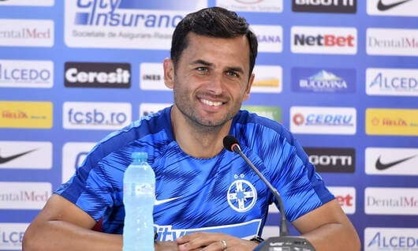

Panduru a spus la Orange Sport că Becali cumpără demnitatea antrenorilor atunci când îi angajează.

Prețul este 10.000 Euro acum pentru că nu se mai găsesc antrenori care să accepte această rușine pentru 3-4.000 Euro.

Ce spune Panduru este o opinie.

Am și eu una, diferită.

## Ce a făcut Dică

Dică a semnat un contract cu echipa din România care are cei mai mulți suporteri și, automat, cea mai mare expunere media.

Va fi antrenorul unui club care oferă condiții excelente de pregătire – bază de antrenament, condiții de deplasare, cantonamente, echipament, nutriție, vitaminizare, asistență medicală etc.

Totul la excepțional pentru România și la un nivel bun sau foarte bun raportat la campionatele din vestul Europei.

De asemenea, Dică a semnat cu o echipă care se bate la titlu și are la dispoziție un lot bun pentru nivelul Ligii 1.

În fine, pur profesional vorbind, dincolo de orice nuanțe, un mandat la echipa lui Becali este una dintre cele mai importante experiențe pe care un antrenor le poate câștiga în fotbalul nostru.

Dică are parte de toate aceste beneficii cu condiția să lucreze pentru un patron care are o viziune diferită de majoritate în ceea ce privește felul în care se conduce un club.

Atenție la nuanță, am spus o viziune diferită, nu am spus o viziune mai proastră.

Așa cum am explicat în ghidul de înțelegere a personajului Becali, ceea ce ți se pare ție c-ar fi corect contează doar în discuții cu prietenii amabili și cam atât.

## Care este meseria lui Dică

Dică este antrenor.

Prin urmare, s-a dus la clubul lui Becali ca să-și facă meseria.

Vei spune că nu-ți poți face meseria în condițiile lui Becali, că vei fi o glumă, că bla-bla.

Am spus deja că am o părere diferită.

Condițiile în care lucrează Dică nu sunt ideale, dar unde sunt?

De exemplu, sunt ideale într-un loc în care patronul face exact ceea ce face Becali, dar nu se află public despre aceste lucruri?

Sau sunt ideale acolo unde lucrezi cu jucători care nu sunt plătiți cu lunile?

Sau sunt ideale acolo unde nu ai teren de antrenament?

Sau sunt ideale acolo unde nu ai lot de jucători ca să speri că vei face performanță?

Sau sunt ideale acolo unde primarul amenință că desființează echipa pentru că nu i-au plăcut ultimele 3 rezultate?

Antrenorul Dică și oricare alt antrenor dispus să vină la echipa lui Becali pun în balanță ce li se oferă și ce nu li se oferă.

Sau chiar chiar ce li se ia.

Și fac un calcul: pot să antrenez în condițiile în care apare riscul ca patronul să aibă pretenții absurde legate de chestiuni tehnice?

De fapt, e o singură pretenție real absurdă cu care e posibil să se confrunte – dorința patronului de-a face schimbări în anumite momente ale jocului, în special la pauză.

În rest, aproape orice cere Becali este măcar parțial justificat de rațiuni economice, adică ceea ce-l ține pe el în fotbal.

În timp ce luni dimineață Dică s-a confruntat probabil cu această dilemă – să merg la Steaua în cele mai bune condiții, mai puțin riscul ca Becali să-mi facă din schimbări – unii dintre cei care râd de el erau blocați în trafic spre locul de muncă.

Loc de muncă unde urma să presteze o activitate pe care o urăsc, alături de colegi pe care nu-i plac, sub comanda unui șef mai prost decât angajații, cu scopul obținerii unui salariu nemulțumitor, cu care să întrețină o familie…

Suficient.

Speculez doar.

Ce vreau eu să spun este că e ușor să râzi de altul că acceptă ceea ce pare a fi o slujbă înjositoare fără să te gândești la cum arată realitatea celor mai mulți dintre noi.

Și fără să iei în calcul că Dică nu se face de râs până nu ajunge efectiv în postura de a accepta schimbările impuse la pauză de patron.

Poate se va întâmpla asta, poate nu.

Poate Dică va alege să plece dacă e forțat să înghită un comportament pe care-l consideră înjositor.

Vom vedea ce va fi.

Oricum, se anunță o vară caldă, cu trafic intens și concedii scurte.
