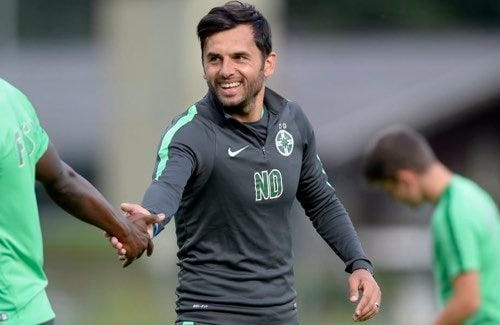

Am tot spus-o în emisiuni, dar n-am apucat să explic în detaliu.

Așa că o fac aici.

De câte ori văd pe ecran afișată echipa cu care FCSB urmează să înceapă o partidă din Liga 1, de atâtea ori am impresia că văd o selecție de investiții individuale, nu o echipă de fotbal.

E o așa zisă echipă de plăcere.

Îmi place Miculescu, îl aduc.

Îmi place Dulca, îl aduc.

Îmi place Rață, îl aduc.

Îmi place Dawa, îl aduc.

Nu contează ce poziție joacă respectivul, nu contează ce nevoi am în lot, nu contează ce fel de om este fotbalistul pe care-l aduc.

Habar n-am de astfel de detalii.

Îi aduc pentru că-mi plac și aș putea să-i vând ulterior pe bani buni.

Efectul?

O evoluție imprevizibilă a echipei.

Și niște rezultate dezastruoase până acum.

## De ce s-a ajuns în situația ca FCSB să fie la retrogradare

Mai mult de jumătate din cei care intră în primul 11 au scopul solitar de-a impresiona și de-a obține contracte afară.

Ceilalți vor doar să nu greșească și să piardă astfel șansa de-a mai juca pentru FCSB.

Aparent, asta fac majoritatea fotbaliștilor de pe la majoritatea echipelor.

Totuși, deși dorința de-a merge la mai bine și dorința de-a nu pierde locul în echipă sunt firești, președintele / directorul sportiv și antrenorul se asigură că aceste "energii" sunt puse totuși cumva și în slujba clubului.

În momentul de față, la FCSB, această stare de fapt duce la situația în care ideea de succes obținut de echipă se subordonează ideii de succes obținut individual.

Fotbaliștii nu mai sunt contributori la succesul echipei, ci văd echipa ca pe un contributor la succesul lor. Echipă care, în aceste condiții, nu are forța să-i ajute pentru că prea puțini din acest lot se pun în slujba ei.

## 3 factori care întrețin această situație nocivă

Pe scurt, situația de față este alimentată 3 factori:

1. **lipsa de valoare a unor jucători din lot** - automat asta se vede ușor în momentele în care echipa nu are măcar coeziune

2. **lipsa de experiență reală a unor jucători din lot**- asta se vede inclusiv în incapacitatea de mobilizare a jucătorilor dincolo de meciurile cu miză europeană

3. **lipsa de răbdare și de cunoaștere fotbalistică a patronului** - asta se vede în dezmățul transferistic în care se scaldă echipa după ce la începutul sezonului asigura pe toată lumea că lotul e complet. [Nimic nu se va schimba aici](https://www.cmeravar.ro/de-ce-il-urasti-pe-becali).

## Ce riscă FCSB în aceste condiții

Măcar pentru o scurtă perioadă, echipa lui Dică riscă să câștige meciuri doar pe bază de sclipire / talent a unora dintre fotbaliștii săi.

Sau pe baza unei super mobilizări, cum se întâmplă de obicei la meciuri de cupă europeană.

Ce-nseamnă asta?

Înseamnă riscul de-a continua să aibă rezultate fluctuante sau să nu adune suficiente puncte în campionat ca să conteze în lupta pentru titlu. Asta chiar dacă va câștiga meciurile restante cu CFR Cluj și FC Botoșani.

Nu cred că se pune problema să nu intre în play off pentru că, inclusiv în aceste condiții de disoluție a ideii de lot și de echipă, valoarea individuală a jucătorilor permite totuși asta.

Mai mult, clubul riscă în mod real să piardă șansa de-a-și îndeplini unul dintre obiectivele principale - să vândă bine jucătorii pe care dorește să-i vândă.

Asta pentru că o evoluție general bună a echipei are meritul să-i crească individual pe fotbaliști, nu să-i anuleze, așa cum pot crede cei care se tem de sintagma "pune-te în slujba echipei".

În fine, e o lipsă acută de timp pentru Dică.

Încă îi mai vin jucători pentru care clubul face investiții majore și pe care patronul vrea să-i vadă la joc așa cum un copil vrea să-și vadă noua jucărie încă ambalată.

În aceste condiții, îi va fi foarte greu să facă echipa să se comporte ca o echipă.

Ar avea nevoie de cel puțin 3-4 luni bune pentru a putea vorbi de efecte ale muncii sale, iar asta pare în situația de față o glumă.
