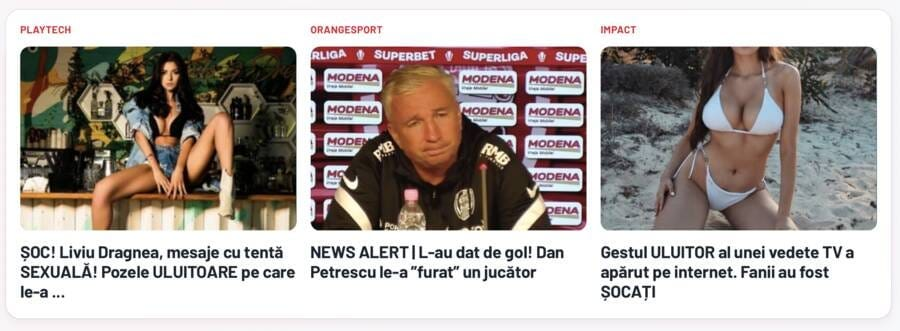

gsp.ro promovează intens în ultima vreme opțiunea de-a-ți face cont pe site.

Ca oamenii să fie motivați în acestă direcție, ziarul oferă beneficii diverse - de la seriosul acces gratuit la ediția digitală a ziarului la amuzanta posibilitate de-a intra în dialog cu jurnaliștii publicației.

Spun că e o chestiune amuzantă pentru că n-am văzut ca așa ceva să se întâmple. Adică cititorii comentează mult și multe, dar nu li se răspunde.

Sau cel puțin n-am văzut eu ca așa ceva să fie o practică.

Apropo de Ringier Connect, platforma pe care Gazeta o folosește pentru această operațiune, cei de acolo spun următoarele:

> "Această soluție de autentificare ne permite să oferim utilizatorilor o experiență media personalizată și este proiectată în conformitate cu cele mai stricte reguli privind protecția datelor".

O precizare importantă aici.

Protecția datelor nu înseamnă că ei nu le-ar colecta. Înseamnă că le colectează, dar își dau silința să le protejeze.

De cine le protejează?

De cei care ar putea să le fure după ce ei le colectează de la tine.

Bun, dar de ce le colectează în primă fază ca apoi să se chinuie atât să le protejeze?

Ca să-ți ofere ție o "experiență media personalizată".

## Ce ar însemna cu adevărat o experiență personalizată pentru cititori

Nu-ți închipui că Gazeta este atât de aridizată de spiritul corporatist încât să arunce acele vorbe la modul serios.

Nu, ei glumesc, doar au uitat să pună acel emoticon clasic.

În fine, primul gând pe care l-am avut când am văzut că gsp.ro invită cititorii să-și creeze conturi a fost că Gazeta se pregătește să treacă serios în lumea a publisherilor care oferă conținut online cu plată.

Încercarea cu versiunea digitală a ziarului fizic n-a avut succes și era dificil să aibă în condițiile în care formatul respectiv era greu de parcurs.

În schimb, ar putea să ofere în continuare acces liber la o parte a conținutului site-ului, iar pentru un anumit număr / tipuri de materiale să existe doar acces cu plată.

E o simplă speculație, dar mi s-ar părea o idee bună.

Mai mult, cred că orice site de sport ar trebui să ofere contra unui abonament lunar / anual acces la o variantă fără reclame și fără acele promovări încrucișate cu alte site-uri.

Abia acum ar putea vorbi de o formă reală și sănătoasă de personalizare a experienței cititorilor.

În momentul de față, modelul pe care gsp.ro îl folosește este acela pe care-l folosesc aproapte toate site-urile de știri de pe piață - conținutul este oferit gratuit, iar vizitatorii plătesc prin faptul că sunt expuși la reclame.

O plată suplimentară, de care nu se vorbește, este cea pe care o faci însă cu nervii tăi.

Concret, mă refer la faptul că este imposibil să navighezi prin  aceste site-uri fără să afli tot felul de lucruri aflate mult dincolo de intențiile tale de informare / delectare.

Acum câteva luni, în zona trimiterilor spre alte site-uri (cross-uri cum li se spune intern), era o informație despre doi copii care ar fi murit după ce au căzut de la nu știu ce etaj pentru că mama lor nu i-a supravegheat.

Deși n-am dat click pe niciuna dintre știrile respective, din combinația titluri + număr impresionant de trimiteri, am aflat aproape orice era de aflat despre subiectul respectiv.

Asta deși eu intru pe gsp.ro, prosport.ro, digisport.ro etc. pentru pentru a afla alte lucruri.

Aproape la fel de invazive sunt și acele click bait-uri trist - mincinoase pe care site-urile de sport le oferă în baza reciprocității cu orangesport.ro

Greu vei găsi în presa online de sport o formă mai ridicolă de cerșetorie decât în acele trimiteri. În peste 80% din cazuri, nimic din titlul nu se regăsește în conținut. În celelalte 20%, ce e în titlul - capcană apare vag și în text.

Redactorii și editorii de la celelalte site-uri știu ce le trimit colegii de la orangesport.ro, dar nu pot refuza.

Nu pot refuza pentru că știu poezia:

> *Eu te promovez pe tine 
> 
> Tu mă promovezi pe mine 
> 
> Cifrele arată bine
> 
> Blegul dă un click la mine
> 
> Apoi vine și la tine
> 
> Cifrele arată bine*

După cum vezi, am spus blegul, nu prostul.

Adică am folosit o formulă care implică un soi de alint, de tandrețe pentru că am învățat acum mulți, mulți ani că [Gazeta își respectă cititorii](https://www.cameravar.ro/tolontan-hamlet-si-chiriches/).

## Excepția de la fotbalul mic  - liga2.prosport.ro

Marea surpriză a acesti lumi în care jurnalismul de calitate se amestecă cu click bait-ul disperat este un site dedicat așa-isului fotbal mic - ligile inferioare.

[Site-ul Liga 2 ](https://liga2.prosport.ro/)este găzduit pe un subdomeniu al prosport.ro și este un adevărat alien în zona site-urilor "fotbalistice".

Ceea ce îl face special sunt două lucruri - lipsesc cu desăvârșire cross-urile acelea triste, dar și volumul incredibil de informații pe care-l oferă.

Chiar îndrăznesc să spun la modul aproape serios că găsești acolo mai multe informații despre Vedița Colonești decât oferă gsp.ro despre FC Botoșani.
