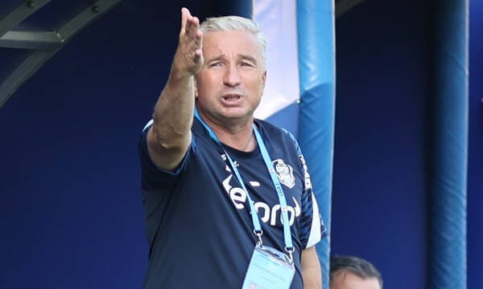

[Patronul CFR spune pentru Fanatik](https://www.fanatik.ro/nelutu-varga-anunta-decizia-in-cazul-dan-petrescu-asta-am-hotarat-cu-el-exclusiv-20183731) că varianta despărțirii de Dan Petrescu a căzut:

> “Am vorbit acum la telefon cu Dan Petrescu, e doar răcit, nu are Covid... El mi-a spus că joi o să fie la antrenament. 
> 
> Nu mai discutăm de plecare, e caz închis. Rămâne la CFR! Avem nevoie de rezultate, de munca lui și a echipei, nu să facem circ la televizor”.

Motivul principal al schimbării de poziție pare să fie refuzul lui Petrescu de-a părăsi echipa fără să încaseze întreaga clauză de reziliere - 400.000 Euro.

Dincolo de asta însă, există cel puțin încă un motiv pentru care o despărțire este dificilă.

## Înlocuirea lui Petrescu ar fi un risc foarte scump

Lotul echipei este făcut de Dan Petrescu pentru Dan Petrescu.

Nu vei găsi cu ușurință un antrenor care să preia echipa în acest moment fără riscuri majore de adaptare.

Orice schimbare de antrenor este un risc din acest punct de vedere, dar când ai o echipă care în ultimii ani a fost continuu "rafinată" în acord cu cerințele lui Petrescu lucrurile se complică și mai mult.

Știu, jucătorii cu experiență sunt jucători mai ușor adaptabili.

Nu e chiar așa.

Când ai fost selectat pentru anumite caracteristici care te fac compatibil cu un anume stil de joc și ai practicat o perioadă respectabilă de timp acel joc, experiența cade pe locul 2.

Sau se manifestă sub forma reflexului de-a juca ceea ce știi.

Mai mult, orice încercare de-a schimba prea brusc macazul poate însemna să rămâi pe cap cu jucători mulți și bine plătiți care să nu-ți ofere ce sperai.

Mai mult, aducerea de antrenor respectabil implică niște cerințe de transferuri din partea acestuia.

Deci riscuri + cheltuieli sigure.

## Ce poate face acum CFR Cluj

CFR este ca un om care a luat un credit pe 30 de ani de la bancă și brusc descoperă că dobândă variabilă înseamnă dobândă variabilă.

Rata poate să crească până la limita suportabilității și chiar dincolo de aceasta.

Prin urmare, începe să se uite după o refinanțare și încearcă să se organizeze mai bine cu banii.

Exact asta face CFR deja din momentul venirii lui Cristi Balaj.

Nu o face neapărat foarte vizibil, dar o face - încearcă să schimbe din mers strategia.

Să întinerească lotul și să pună un soi de presiune pe Petrescu să dea niște șanse mai clare tinerilor.

De asta a apărut Yeboah (19 ani), de asta mai sunt niște jucători de gen la echipa secundă, de asta a început să joace Birligea, de asta a apărut timid din nou și Gâdea.

Inclusiv dorința de-a juca un fotbal mai plăcut poate fi văzută în dublă cheie - încercare de-a-l elimina pe Petrescu, dar și încercare de-a face echipa mai antrenabilă și de antrenori care nu-s ca Petrescu.

## Nu contează că se întrerupe campionatul, contează unde e FCSB

În fine, oamenii se uită la momentul din campionat și cred că acum era o oportunitate pentru CFR Cluj să-l dea afară pe Petrescu.

Adică e acțiune a echipei naționale, se întrerupe campionatul și ar avea timp noul antrenor să cunoască echipa.

Fals.

Reperul mai important este că CFR Cluj are 18 puncte și două meciuri mai puțin jucate.

Adică, în ciuda evoluțiilor bune ale celor de la Rapid și Farul sau de revenirea CS U Craiova, tot CFR sunt favoriți la titlu dacă rămâne Petrescu.

Adversarul cu adevărat puternic este în continuare FCSB, oricât de penibilă ar fi clasarea lor - locul 14, 8 puncte și două meciuri mai puțin jucate.

Or dacă adversarul real este într-o poziție atât de proastă, de ce să riști să-l readuci în joc printr-o mutare riscantă precum înlocuirea antrenorului?

În fine, Varga a ales o cale nu foarte fericită să încheie colaborarea

> “Suntem pe minus cu zeci de milioane, nu cu două. Se joacă foarte urât, a pierdut cu echipe foarte slabe. 
> 
> Eu nu i-am redus lui bugetul, am redus greșelile pe care le-a făcut el. A adus jucători de proastă calitate, pe care îi plăteam cu 40-50.000 de euro pe lună”.

Adică, experiențe trecute din fotbal sau din afara sa i-au arătat probabil că dacă joci la intimidare îți iese.

Așa că omul a spus niște lucruri despre Petrescu care nu i-l fac prieten.

Din contră.

Nu c-ar fi spus ceva neadevărat, să ne înțelegem. Omul a pierdut bani și performanța obținută sportiv a fost foarte, foarte scumpă.

Sincer, la fel ca Șucu, habar n-am cum CFR Cluj n-a făcut implozie până acum.

De aici și nemulțumirea lui Varga

Dar poți scăpa așa de Petrescu?

Se pare că nu.
