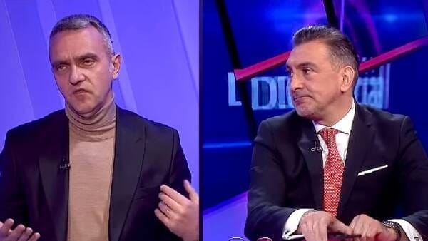

Imaginează-ți-l pe Decebal Rădulescu începând un comentariu legat de FCSB astfel:

>"Aș remarca jocul excelent făcut de-a lungul sezonului de FCSB. Apoi, aș vrea să remarc și cât de bine se lucreză la nivel de management. În fine, cu așa suporteri, e firesc să-ți dai silința. Bravo lor!".

E posibil?

E posibil pentru că Gazeta scrie despre [o prevedere oarecum neașteptată](https://www.gsp.ro/international/campionate/cenzura-in-spania-sefii-la-liga-675151.html) în contractul de vânzare a drepturilor TV ale Primera Division pentru piața din Spania.

Echivalentul iberic al LPF, La Liga, dorește ca meciurile din campionat să fie comentate de o manieră pozitivă.

> "Producția să fie realizată într-o manieră pozitivă, pentru a nu afecta imaginea competiției, a cluburilor, jucătorilor, antrenorilor și suporterilor".

Dacă televiziunile nu se vor conforma acestei cerințe, La Liga își rezervă dreptul să ceară înlocuirea comentatorilor / reporterilor care se fac vinovați de jurnalism lipsit de pozitivism.

După ce au apărut reacții de condamnare a acestei idei, La Liga a explicat că ar fi vorba de o încercare de-a limita tendința de tabloidizare a jurnalismului de sport:

> "Sunt restricții care au ca scop evitarea subiectelor tip tabloid și întrebările legate de familiile jucătorilor în timpul comentariilor sau interviurilor făcute după meciuri".

## Ce vor încerca să impună eAD și LPF în noul contract pentru Liga 1

Bănuiala mea este că-n noul contract de vânzare a drepturilor TV care va intra în vigoare în 2024, vor exista prevederi de acest gen.

E în interesul LPF și al cumpărătorului intermediar, eAD, să facă asta pentru a-și proteja produsul / achiziția.

Merg până acolo încât să cred că-i posibilă chiar o formulare de genul celei folosite de La Liga, care să impună "comentarii pozitive" pentru jocuri.

Normal, eu speculez aici, deci există posibilitatea să fiu departe de realitate.

Totuși mă bazez pe ceva.

În draftul de contract pe care eAD îl propune LPF se află prevederi care arată o preocupare reală pentru ce-nseamnă creșterea atractivității competiției.

Concret, [eAD oferă 2.000.000 Euro anual în plus](https://www.eurosport.ro/fotbal/romanian-liga-i/2020-2021/mai-multi-bani-din-drepturi-tv-pentru-superliga-din-2024-ce-obligatie-vor-avea-cluburile_sto9013903/story.shtml) dacă cluburile vor îndeplini niște performanțe de audiență TV, dar și audiență pe stadion.

Ca aceste lucruri să se întâmple, competiția chiar are nevoie de o imagine bună în ochii publicului.

## De ce este foarte importantă prezența spectatorilor pe stadion

De câțiva ani, eu insist asupra faptului că cel mai important obiectiv al unui club din Liga 1 ar fi [să crească prezența spectatorilor pe stadion](https://www.cameravar.ro/cel-mai-important-obiectiv-liga1).

De ce?

E o poveste mai lungă care implică inclusiv acceptarea ideii că pentru specificul fotbalului nostru și al pieței TV / cablu, acest contract este [o binecuvântare și o vulnerabilitate în același timp](https://www.cameravar.ro/pericolul-contractului-drepturi-tv-liga1).

Totuși, ce e important de știut legat de ideea creșterii numărului de spectatori în tribune este faptul că este genul de obiectiv a cărui îndeplinire implică aproape întotdeauna atingerea și altor obiective intermediare sănătoase.

De exemplu, oamenii sunt tentați să vină la stadion nu doar când echipa are super rezultate.

Vedem exemple când acest lucru nu se întâmplă deși sportiv clubul performează. CFR Cluj nu atrage în tribune un număr de spectatori în acord nici cu mărimea orașului, nici cu succesul sportiv.

În schimb, poți atrage spectatori atunci când:

- **ai localnici în echipă** (spectatorii se identifică mai ușor cu ei)
- **promovezi fotbaliști tineri în echipă** (spectatorii îi plac și le tolerează nereușitele mai ușor)
- **oferi condiții decente pe stadion** (curățenie, acces ușor, mâncare și bere)
- **desfășori constant un program concret de atragere a fanilor** (inclusiv la nivel școlar)

În fine, fanii vin mai degrabă la meci dacă echipa lor emană o așa zisă imagine bună.

Iar ca imaginea să fie bună, unii pot crede că presa trebuie să facă ceva anume.

De exemplu, să nu-l promoveze pe Becali sau să promoveze performanțe din sporturi nebăgate în seamă.

## Confuzie între jurnalism, PR și ce ne place

Aici voiam să ajung.

Presa nu se ocupă cu promovarea.

Promovarea ține de marketing, PR, advertising și altele înrudite.

Totuși, unii oameni au diverse nemulțumiri legate de subiectele pe care le abordează presa sportivă sau legate de maniera în care acestea sunt abordate.

Au dreptate.

Adică poți fi nemulțumit de orice, e o chestiune subiectivă.

Nu ești obligat să te mulțumească nimic.

Ce este însă foarte important de știut este că presa nu are rolul de-a scrie / relata despre ceea ce place sau nu place publicului.

Sau despre ceea ce mulțumește sau nu publicul.

Încercarea de-a fi pe placul plătitorului / clientului este sarcina comercianților din spatele afacerilor clasice.

Un restaurant îți poate face pe plac prin ceea ce oferă în meniu.

Un distribuitor de cablu îți poate face pe plac prin pachetul de  programe oferit.

Un politician îți poate face pe plac prin promisiuni și chiar acțiuni concrete în direcțiile care te interesează.

Presa n-are rolul să facă pe plac, ci să informeze în legătură cu anumite subiecte sau să lămurească diverse aspecte de interes public.

Nicăieri nu e vorba de-a face pe plac.

## Marele pericol este ca televiziunile de sport să fie de acord cu PR-ul

Din punctul meu de vedere, nu e o problemă dacă LPF și eAD ar cere așa ceva.

Cum spuneam, au datoria să-și apere produsul.

Problema va fi dacă televiziunile de sport vor accepta așa ceva.

Adică dacă deciziile comerciale vor înlocui deciziile editoriale sub forma următoarei idei:

> “Plătim foarte mulți bani pentru drepturi, vă rog să aveți grijă ce spuneți în comentarii, ce întrebări puneți după meciuri, ce spuneți prin emisiunile de analiză”.

E posibil să se întâmple asta?

După părerea mea, da.

Nu o spun din experiență proprie pentru că nimeni, nicăieri nu mi-a spus vreodată ce să spun sau cum să spun într-o emisiune.

Dar există scandalul [banilor care vin dinspre partide spre diverse publicații / televiziuni](https://recorder.ro/bani-publici-pentru-presa-privata-povestea-unei-investigatii-in-conturile-partidelor-mogul/) cu scopul “prieteniei jurnalistice”.

Prin urmare, există apetență pentru a elimina ideea de jurnalism dacă apar avantaje financiare considerabile.

Așa că spun și eu ca domnul Gheorghe Ștefan - Pinalti: “Nu mi-e frică, dar mă tem”.

## Liga 1 e un campionat OK, dar trebuie să fii liber să o spui

După cum probabil știi, repet obsesiv pe unde pot [că avem un campionat bun](https://www.cameravar.ro//de-ce-liga1-e-campionat-bun).

Și că anumiți ziariști bat câmpii când analizează campionatul intern fără să țină cont de nivelul de finanțare sau, în unele cazuri triste, fără să fi văzut un meci cap - coadă de ani de zile.

Totuși, n-aș vrea ca și alții să ajungă la concluzia mea doar ca urmare a unor contracte semnate între niște societăți comerciale.

În fine, ce e important de știut - deși există credința aceasta că oamenii înghit nemestecat tot ce li se livrează la TV, lucrurile sunt mai nuanțate.

Mulți oameni au capacitatea să simtă când ceva este forțat, fals, exagerat.

Așa ar fi și comentariile brusc entuziasmate față de un produs care-i decent, dar nu excelează.

[Ar fi ca-n cazul noii denumiri a Ligii 1 - SuperLiga](https://www.cameravar.ro/de-ce-nu-superliga-liga1/).

Denumirea e-n contract, dar nu și-n contact cu realitatea.

Așa se întâmplă când marketingul forțează nota, apar aberații.

Apropo de asta, Gigi Stancu, om de marketing al celor de la SuperBet spunea că sintagma SuperLiga reprezintă și ceea ce LPF și compania de betting își doresc să devină campionatul nostru.

Adică, în limbaj de specialitate, e un statement.

Știi cine mai face de astea?

Gigi Becali, când îi zice Mbappe lui Florinel Coman
