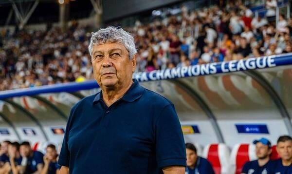

FRF a anunțat că va continua contractul cu Iordănescu, deși înțelegerea îi permitea lui Răzvan Burleanu să-l dea afară.

Prin urmare, ceea ce scriu în continuare este o simplă formă de-a milita pentru o idee.

Mai mult, scriu asta în condițiile în care **nu cred că selecționerul a fost principala problemă pentru “națională” după despărțirea de Pițurcă, din 2014**.

Deci nici Iordănescu nu este.

Principala problemă a echipei naționale este lentoare cu care se dezvoltă fotbalul românesc comparativ cu cel din alte țări pe care le privim cu invidie sau cu mirare.

Da, în ciuda a ceea ce ești tentat să crezi, fotbalul nostru face niște progrese. Din păcate, aceste progrese le facem doar în raport cu noi înșine, nu în raport cu cei care ne sunt adversari pe la turnee finale sau în diverse preliminarii.

Acești adversari sunt la rândul lor într-un progres, dar creșterea lor este mai accelerată.

De asta ne confruntăm cu dificultăți majore în a învinge echipe care-n trecutul oarecum recent erau victime sigure.

Bun, în condițiile acestea, cu ce ar fi de folos un selecționer străin?

## Portretul robot al selecționerului străin ideal

Înainte să-ți spun cum ne-ar putea ajuta un selecționer străin, trebuie să știi cum arată acel selecționer străin.

1. **să aibă peste 50 de ani**. Nu ar fi o problemă dacă ar fi cineva care să se afle spre finalul carierei,  cu condiția să aibă energie și dorința de-a conta în continuare. Experiența profesională și cea de viață sunt importante indiferent de fonfleurile new age gen vârsta e doar un număr
2. **să fie un fost mare fotbalist**. Acest criteriu ar elimina din teoreticienii care pot avea succes în anumite contexte, dar reprezintă excepții. Iar excepțiile sunt riscuri majore înainte de succes. În fine, acest statut i-ar permite să se impună mai ușor în relație cu jucătorii, dar mai ales să le înțeleagă profund mentalitățile
3. **să fie formator de echipe**. Acești antrenori găsesc o plăcere reală în a promova jucători tineri sau măcar în a promova soluții pe care alții nu le iau în calcul. Condiția noastră actuală impune așa ceva. A, să nu uit, formator de echipe în campionate precum Germania, Franța, Olanda.
4. **să fi fost selecționer. **Măcar la nivel de națională de tineret și să fi avut rezultate decente - gen calificare la turnee finale. Acesta este un aspect important pentru că majoritatea antrenorilor au nevoie de muncă zi de zi cu jucătorii ca să reușească ce-și propun. La “națională”, timpul este un lux pe care nu și-l permite nicio echipă.
5. **să fi vândut jucători pe sume mari**. Ușor, nu mă refer la capacități de impresar. Spun doar că ar fi un bonus dacă echipele pe care le-a antrenat au reușit cu el pe bancă să vândă fotbaliști pe sume mari sau foarte mari. Deci nu doar să formeze echipe, dar să fie capabil să promoveze / formeze individualități.

## Cum ne-ar putea ajuta un astfel de selecționer străin

Un selecționer cu caracteristicile de mai sus ar avea avantajul valorii confirmate și a experienței reale în fotbalul important.

Asta ar însemna inclusiv o capacitate foarte bună de-a evalua jucătorii pe care-i are la dispoziție conform unor criterii specifice fotbalului modern.

Mai mult, faptul că nu are tangențe anterioare cu fotbalul nostru reprezintă un câștig, nu o deficiență. Astfel de oameni pot face o selecție bazată exclusiv pe factori profesionali - fără influențe ale impresarilor sau ale patronilor de club.

De asemenea, un astfel de selecționer nu are de ce să trateze cu mănuși pe nimeni. Nu va conta nimic din ce-ai jucat în trecut, nu vor exista temeri de genul “Cum să nu-l chem pe Stanciu sau pe Maxim? Cine mai driblează?”.

Deciziile sale vor fi în acord cu ceea ce percepe, nu în acord cu ceea ce riscă. Asta mai ales dacă i se face un contract serios, pe termen lung.

Iar genul acesta de decizii împing lucrurile cu rapiditate într-o anume direcție.

Va fi o direcție bună?

În acest moment, suntem atât de jos că aproape orice mișcare reprezintă un progres, deci direcția ar fi aproape sigur bună.

Așa cum spuneam însă, ne lipsește viteza, atâta tot.

## Demontarea argumentelor în favoarea ideii că un selecționer străin n-ar fi o idee bună

De-a lungul timpului, am auzit tot felul de argumente împotriva aducerii unui selecționer străin.

Unele sunt penibile, altele sunt politice, foarte puține sunt logice.

1. **“L-am adus pe Daum și a fost un eșec total!”**

Acesta este cel mai leneș argument dintre toate.

De ce?

Pentru că am avut o singură numire de gen și am tras concluzia că nu merge așa.

Noaptea minții.

Pe acest considerent n-ar mai trebui să numim români, c-am avut zeci de încercări și cu vreo câteva excepții, am dus-o din eșec în eșec.

2. **“Nu știe fotbalul românesc, i-ar lua prea mult să se adapteze”.**

Nu trebuie să știe fotbalul românesc, trebuie să știe fotbal.

Nu are nevoie să se adapteze, trebuie să-i adapteze pe jucători la condițiile sale.

Așa cum spuneam mai sus, acest lucru nu este o deficiență, ci un avantaj.

În fine, oricât am fi de mândri de noi, nu-ți imagina că a citi fotbalul românesc presupune cine știe ce abilități ieșite din comun.

Problema nu este că nu înțeleg alții că suntem noi speciali, problema este că nu înțelegem noi să ne dezvoltăm capacitățile care aduc succesul altor selecționate.

3. **“Avem și noi antrenorii noștri, care sunt foarte buni”.**

Această afirmație dă impresia că România este un izvor de talente în antrenorat.

Fals.

Avem fix doi antrenori care au contat în fotbalul european - Mircea Lucescu și Boloni.

Atât.

Restul, sunt ori la nivel 3 în fotbalul european - gen Răzvan Lucescu în Grecia, ori la cel mai înalt nivel într-un fotbal foarte slab raportat la câți bani se investesc - gen Olăroiu în Asia.

Mai mult, Lucescu, Boloni, Olăroiu sunt foarte puțin antrenori români. Expunerea lor îndelungată la condiții total străine de campionatul nostru îi face să fie altceva.

În fine, alegerea unui străin implică faptul că vei avea mai multe variante decât îți va putea oferi fotbalul nostru. Deci nu doar variante mai bune, dar și mai multe.

4. **“Nu avem bani să plătim un antrenor străin”**

Oho, îmi place acest argument.

Adică asta implică faptul că ar fi bun cineva de afară, doar că suntem prea săraci ca să-l aduce.

Prima dintre trăsăturile din portretul robot al selecționerului străin ideal rezolvă parțial această problemă - am spus acolo că ar fi bun inclusiv cineva aflat la final de carieră, care are energie și dorință să conteze în continuare.

Genul acesta de selecționeri acceptă și salarii ceva mai scăzute decât cei aflați pe val.

Sigur, nu va fi ieftin.

Totuși, e mai scump să nu te califici, mult mai scump.

5. **“Poți să-l aduci și pe Mourinho, nu avem valoare”**

În sfârșit, un argument care se leagă de ceva real.

Cei care pun rezultatele exclusiv pe seama valorii sau a lipsei acesteia ar părea că au dreptate.

Și e posibil să aibă.

Totuși, eu cred că avem fotbaliști care în anumite condiții pot oferi mai mult decât a  oferit în ultimii ani “naționala”.

Dovada este că am avut bucăți de meciuri sau chiar meciuri în care lucrurile au mers așa cum ne-am fi dorit.

S-a întâmplat asta și la Rădoi, s-a întâmplat inclusiv în acest mandat al lui Iordănescu.

Deci un soi de potențial există și poate că un selecționer străin de mentalitățile noastre va putea să-l pună mai bine în valoare.

**PS**: când spun c-ar fi bine să aducem un antrenor străin, poate să pară c-aș contrazice oarecum ce-am spus când m-am pronunțat [împotriva ideii de-a naturaliza fotbaliști pentru națională](https://www.cameravar.ro/naturalizare-fotbalisti-nationala-romaniei).

Dacă tu crezi asta, recitește cele două texte și te vei lămuri de diferențe.