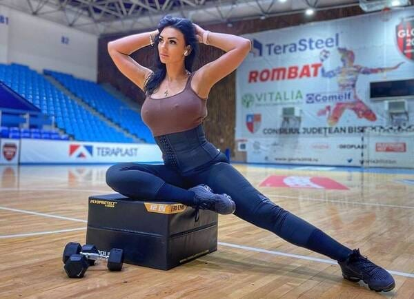

Înainte de orice, un simplu exercițiu de imaginație.

Un antrenor al unei echipe de fotbal feminin îi trimite mesaje nepotrivite unei jucătoare și profită de poziția de putere pe care o are ca să o hărțuiască.

Bine, aici lucrurile sunt neclare parțial.

Unii vorbesc despre hărțuire, alții vorbesc despre consens.

Totuși, clubul decide să-l dea afară pe antrenor ca urmare a faptelor sale.

Gazeta Sporturilor află detaliile poveștii.

Va scrie sau nu va scrie despre acest subiect?

Vor apărea titluri din categoria “Derapaj oribil”?

Vor discuta cu conducerea clubului și va prezenta versiunile celor implicați direct?

Vor demara o campanie care să evidențeze încă o dată poziția fragilă a femeilor într-un domeniu prin excelență sexist și dominat de bărbați cu masculinitate toxică?

Vor amesteca opinii în prezentarea faptelor pentru că jurnalism fără activism pentru justiție socială nu se poate?

Toate sunt întrebări retorice.

Sigur că ziarul va face toate acestea și, cu excepția faptului că amestecă mereu tone de opinie în prezentarea faptelor când vine vorba de astfel de situații, ar fi firesc să o facă.

În condițiile acestea, întrebarea mea este de ce au tăcut în cazul demiterii lui Mangia de la Craiova?

În faimoasa înregistrare cu [Pițurcă la Orange Sport](https://www.cameravar.ro/dreptatea-lui-piturca), fostul selecționer și antrenor al Craiovei lui Mihai Rotaru spunea la un moment dat următoarele:

> "Daaa, el voia să-l dea afară de mult și pe Mangia, l-a prins că-i trimitea mesaje unui jucător, era bulangiu. O să vezi că îl schimbă și pe grec".

Mangia se pare că l-a dat pe Pițurcă în judecată pentru vorbele pe care acesta le-a spus în privat.

Gazeta a tăcut.

De ce a tăcut?

Din ipocrizie.

Povestea plecării lui Mangia de la Craiova ar fi meritat verificată.

Nu pentru a anunța public că Mangia este sau nu este homosexual.

Asta nu are relevanță.

În schimb, are relevanță să lămurești dacă un antrenor s-a folosit de poziția sa ca să profite de un fotbalist.

Sigur, toate redacțiile aveau informația înainte chiar ca Pițurcă să o vehiculeze.

Sau dacă n-au avut-o, le-a servit-o Pițurcă doar ca să o verifice.

Totuși, după cum vezi, eu nu spun nimic despre ceilalți.

Nu pentru că am o colaborare cu Digi Sport sau alte chestiuni de gen.

Ci pentru că doar Gazeta e ipocrită real în situația de față.

Doar ei au campanii care pun la grămadă cazuri serioase de abuz cu [cazuri penibile în care diverși spun nimic](https://www.cameravar.ro/gazeta-penalty-la-coltul-scurt) sau diverse femei frumoase mărturisesc că le-a fost foarte greu să orice.

Bine, e greu să scrii despre Mangia sau despre fotbalistul căruia i-ar fi scris mesaje pentru că o galerie foto cu 40 de imagini ale oricăruia dintre aceștia nu ar fi impresionat pe nimeni.

Nici măcar dacă Gazeta titra profi ceva de genul:

[“Cea mai sexy antrenoare din România se revoltă: „Mi-e scârbă, îmi ajunge” » Decizia radicală luată de aceasta”](https://www.gsp.ro/sporturi/handbal/mihaela-evi-protest-renuntare-antrenorat-handbal-675706.html)
