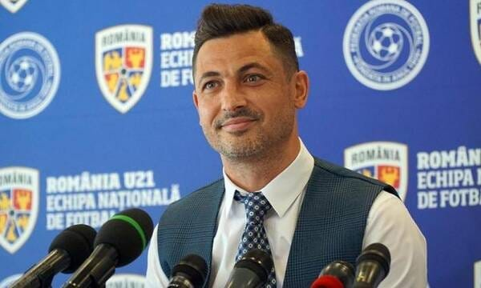

Rădoi este în acest moment într-o situație aparte.

În ciuda experiențelor de selecționer, se află încă la început de carieră în antrenorat.

Și pentru că se află la început de carieră, există un soi de curiozitate legată de capacitatea sa în această profesie.

Pe românește, este sau nu este antrenor?

Ceva-mi spune că această întrebare și-o pun mulți: suporteri, patronul echipei și, foarte probabil, Rădoi însuși.

Totuși, deși antrenorul este cel mai accesibil pariu al unui club, lucrurile depind mult și de jucători.

Și aici e o mare problemă.

## Jucătorii Craiovei sunt nemăsurați

După plecarea lui Reghecampf, au apărut voci care au vorbit despre faptul că la Craiova plătesc prea mult antrenorii și prea puțin jucătorii.

Ideea aceasta are un farmec aparte printre unii suporteri.

Pe de o parte, îi satisface pe cei care sunt deranjați până la oftică de faptul că fotbaliștii au vieți frumoase.

Salarii mari, femei frumoase, munca lor este un joc, călătoresc etc.

Pe de altă parte, există în multe societăți un soi de fascinație față de situațiile în care un grup de perverși (fotbaliștii) îl lucrează pe unul serios (antrenorul).

Bănuiala mea este că aici e vorba despre o formă de explicare a propriului insucces în viață prin găsirea unor veșnici vinovați prin tot felul de zone ale societății.

Și cum fotbalul este foarte prezent, e ușor să îți arăți dezamăgirea față de acești analfabeți care lovesc o bășică, care-s lipsiți de caracter și care poluează aerul performanței prin prezența lor.

Un fel de "dacă n-ar fi ei așa, lumea ar fi un loc mai bun și eu n-aș mai fi cum sunt".

Dincolo însă de percepții subiective, care-i realitatea?

Asta-i marea problemă a Craiovei.

Realitatea nu e clară.

Adică nu există o evaluare profundă a lotului de jucători.

## De ce sunt atât de greu de evaluat jucătorii Craiovei

De fapt, când spun asta, e posibil ca lucrurile să fie văzute prea global.

Nu, mai degrabă ar fi vorba de o analiză profundă a fiecărui jucător în parte.

Și asta, în ciuda faptului că există tot felul de analize și monitorizări, e o chestiune dificilă.

De ce e dificilă?

Din două motive.

Primul motiv - pentru că nu te poți baza doar pe chestiuni pur matematice când iei decizii de acest fel. Oricât de performante ar fi mijloacele statistice, fotbalul este mai mult de atât.

Dacă n-ar fi mai mult de atât, n-ar exista atât de multe meciuri în care rezultatul este contrar monitorizărilor de tip InStat.

Al doilea motiv - cred că Mihai Rotaru are un soi de slăbiciune pentru o bună parte dintre jucătorii de acolo.

Pe ce mă bazez când spun asta?

Mă bazez atât pe informații obținute clasic, pe surse, cât și pe observațiile mele. Normal, aceste observații sunt subiective, dar n-am ce-ți face. Dacă mă citești, mă citești pentru ceea ce spun / cred eu.

În fine, această simpatie a lui Rotaru pentru jucători ar putea sabota o eventuală analiză rece a lotului Craiovei?

Normal.

Mai mult, dincolo de chestiuni umane, mai este ceva care complică toată situația.

Mă uit de jumătate de oră pe lotul de jucători și, la rândul meu, am mari dificultăți să dau verdicte, fie ele și superficiale, legate de mulți dintre fotbaliști.

Adică dacă merită să rămână sau nu.

Indiferent dacă iei drept criteriu ceva din categoria "jucător cu care să te bați la titlu" sau "pe ce loc ar fi într-o ierarhie a postului său?", tot nu e ușor.

Uite, să zicem că-l iei pe Căpățână...

Nu-l știu personal, dar a fost căpitan de echipă la Voluntari. Deci probabil că e un băiat cu o inteligență peste medie și cu un caracter ok.

Perfect.

Îți poate juca mai multe posturi, deci din start e măcar un foarte bun jucător de lot.

Are fizic ok, viteză decentă de deplasare, tehnică bună de lovire a balonului și de pasare.

Este fotbalist cu care să te bați la titlu?

Mm…

Eu înclin să spun că este, dar care sunt meciurile sale memorabile?

Când a fost printre cei mai buni de pe teren?

Meciurile, nu meciul.

Până să-mi răspund, mi-a picat ochii pe Papp.

Poți să-l judeci fără să te raportezi la eliminarea din meciul cu Ber Sheva?

Dacă da, automat te gândești că-ți poate juca două posturi la nevoie. Și fundaș central, și fundaș dreapta. \

E puternic fizic pentru Liga 1. Are o viteză decentă ca fundaș central, nu și ca om de bandă. Are o tehnică ok ca fundaș central. Joc de cap bun spre foarte bun.

E genul care să joace titular într-o echipă care să se bată la titlu?

Nu prea, dar e foarte bine să-l ai în lot.

Dar merită să-i plătești salariul ca rezervă?

Probabil că nu.

Deci ți-ar trebui un fundaș central care să fie peste Papp ca valoare.

Și poți continua până evaluezi tot lotul.

Sigur, eu fac evaluări de om care se uită la meciuri și discută despre ele.

Cei care plătesc salarii și fac din fotbal o afacere ar trebui să o facă de-o manieră mult, mult  mai profundă.

## Va remania Rădoi lotul în iarnă?

Probabil că nu.

În primul rând, o acțiune de acest gen este foarte scumpă, iar oamenii care au bani știu că până prin martie anul viitor, vom trăi niște luni speciale.

De ce ai risca să faci niște cheltuieli în astfel de condiții?

Riști doar dacă ți se pare că o astfel de acțiune va însemna reduceri de pierderi pe termen mediu și rezultate sportive pe termen mediu și lung.

Mai mult, o remaniere ar implica renunțarea la niște jucători care pur și simplu sunt greu de dat afară.

Nu doar pentru că au contract, dar și pentru că e greu să renunți la ei chiar în condițiile în care nu au avut prestații deosebite.

De ce?

Nu pentru că ar fi favoriții lui Mihai Rotaru ci pentru că te agață cu potențialul lor.

Acesta este de fapt al treilea motiv care face evaluare lor dificilă.

O grămadă de fotbaliști de la Craiova au suficient potențial încât să-ți fie teamă să renunți la ei în ciuda evidențelor reci.
