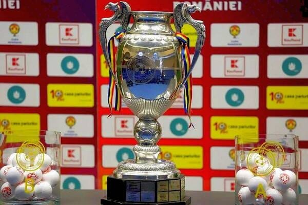

FRF a decis ca din acest sezon să facă modificări masive în ceea ce privește formatul Cupei României.

Scopul este ca această competiție să devină mai interesantă.

Să aducă mai mulți oameni în tribună, să aducă mai mulți oameni în fața televizoarelor, să ofere mai multă expunere partenerilor comerciali.

Adică celor care-și asociază imaginea cu echipele / competiția (sponsori) și celor care plătesc pentru drepturile TV(televiziunile)

Bun, care-i problema?

## Câteva vorbe despre creierul tău

Problema este că orice schimbare în orice domeniu intră în conflict cu starea inițială de fapt.

Concret, o explicație aproape exagerat de simplificată este că creierul nostru iubește la nebunie să fie leneș.

Să nu facă eforturi inutile.

Prin urmare, îi place predictibilitatea.

Și-i place ca atunci când verifică ceva în mediul înconjurător lucrurile să fie așa cum se așteaptă să fie.

Că dacă nu sunt așa cum se așteaptă, atunci trebuie să facă un efort să se lămurească ce s-a schimbat și cum te afectează această schimbare.

Și asta presupune consum de energie pentru creier.

Și nu-i place asta.

Îi place să fie totul la locul său și atât.

Bine, vei zice mulți oameni sunt totuși îndrăgostiți de ideea de noutate, chestie care intră aparent în conflict cu ce spun eu mai sus.

Și ai avea dreptate.

Adică aparent, așa este.

Totuși, rațiunea pentru care mulți oameni sunt dornici de noutăți continue ține de factori ceva mai complicați.

De cele mai multe ori, acea veșnică goană după noutate ține de o programare care are rolul de-a ne feri de eventuale pericole.

Mai exact, creierul caută noutățile nu pentru a te distra, deși chimic se produce și asta, ci pentru a te feri de eventuale pericole.

În zorii speciei noastre, noutatea din mediu puteau fi un dinozaur carnivor, nu un mesaj pe Facebook.

[Sau un format nou pentru Cupa României.](https://www.digisport.ro/fotbal/cupa-romaniei/cum-arata-noul-format-al-cupei-romaniei-va-fi-implementat-din-noul-sezon-1702005)

## Câteva vorbe despre vânzarea unui produs

Totuși, de ce-ți spun toate acestea?

Îți spun toate astea pentru a înțelege că schimbările complică uneori vânzarea produselor.

Fotbalul este un produs popular nu doar pentru că e o metaforă pentru vânătoare - exact, cam asta înseamnă să marchezi - sau pentru cucerirea peșterii adverse.

Fotbalul este un produs popular și pentru că e ușor de înțeles.

Și e ușor de înțeles pentru că regulile sale au fost puțin schimbate de-a lungul existenței sale.

Unul dintre motivele secundare pentru care tot repet [că sistemul cu play off și play out nu e nimerit pentru Liga 1](https://www.cameravar.ro/de-ce-18-echipe-in-liga1) este inclusiv dificultatea cu care oamenii înțeleg ce se petrece în desfășurarea competiției.

Adică după ce zeci de ani ai avut lucrurile într-un anume fel, brusc apar modificări care fac lucrurile să fie aproape ciudate:

- se joacă tur și retur, dar apoi mai apare o bucată de campionat
- se câștigă niște puncte, dar apoi se înjumătățesc
- când se înjumătățesc, dacă ți se ia, ți se va da la egalitate de puncte cu unul căruia i s-a rotunjit pozitiv
- o echipă care n-a prins play off-ul, poate totuși să ajungă în cupele europene doar pentru că câștigă două meciuri de baraj

Adică au apărut elemente care au schimbat lucruri clare - dacă am adunat puncte, sunt ale mele.

Dacă te-am bătut în meciurile directe și terminăm la egalitate de puncte, voi fi peste tine în clasament.

Dacă sunt mai sus decât tine în clasament, n-ai cum să ajungi tu înaintea mea în Europa.

Și tot așa.

La fel stau lucrurile și cu noul format al Cupei.

[Apare un țintar netradițional al jocurilor.](https://www.gsp.ro/fotbal/cupa-romaniei/tragere-la-sorti-grupe-cupa-romaniei-live-675848.html)

Schimbările sunt problematice pentru că oamenii au nevoie să înțeleagă produsul pe care-l cumpără.

Dacă nu-l înțeleg, scad șansele să le placă.

Ia un iPhone și vezi cât de intuitiv este absolut totul.

Ia un telefoan oarecare și vezi cât te scoate din sărite dacă lucrurile nu se petrec așa cum ar trebui să se petreacă.

A, sunt excepții, dar produsele populare sunt pentru mase, nu pentru cei puțini.

Du-te, bă, la șah dacă nu-ți convine!

## Câteva vorbe despre vânzarea Cupei României

FRF a făcut ceea ce face orice companie serioasă - a angajat un consultant cu experiență (Hypercube) care să o ajute [să gândească acest nou format pentru competiția sa](https://www.frf.ro/recomandate/s-a-incheiat-prima-etapa-a-procesului-de-optimizare-a-formatului-competitional-al-cupei-romaniei/).

Problema este că produsul final este mai complicat decât cel inițial.

Normal, ei pot veni cu argumente care să arate într-un final că această competiție a crescut din toate punctele de vedere esențiale - audiență și premii.

Și anticipez că așa va fi în cazul audienței [pentru că-n cazul premiilor e deja o realitate](https://www.gsp.ro/fotbal/cupa-romaniei/razvan-burleanu-bani-cupa-romaniei-667771.html), nu am ce să prorocesc eu.

## De ce apar nemulțumiri legate de noul format

Motivele sunt cele explicate mai sus.

[Schimbările deranjează](https://www.digisport.ro/fotbal/cupa-romaniei/dan-petrescu-nemultumit-de-formatul-cupei-n-am-mai-vazut-asa-ceva-voi-folosi-jucatori-de-la-echipa-a-doua-1945235).

Vei tentat să crezi că-i deranjează doar pe cei care sunt învechiți în gândire, chestiune des vehiculată când vine vorba de oamenii din fotbal.

Sau de oamenii care gustă fotbalul.

Nu-i adevărat.

Schimbările pot fi un atac la lumea pe care aceștia o controlează sau o formă de-a le lua ceva ce le aparține.

Vei fi tentat de asemenea să crezi că respectivii nu pot ține pasul cu evoluția, dar iarăși este o temă falsă.

Există o grămadă de forme aparente de evoluție care-n realitate nu fac altceva decât să nască produse inferioare.

De exemplu, o tastatură mecanică din anii 80 este net superioară unei tastaturi de pe ultimul MacBook Pro.

Asta din perspectiva folosirii.

Doar că producerea celei recente implică niște costuri mai mici și permit producerea unui laptop mai subțire.

Așa că de dragul progresului tastezi pe niște mușuroaie de furnici, nu pe mecanisme care răspund rapid și cu acuratețe fantastică comenzilor.

Sau în habitaclul unei mașini e mai ușor să folosești butoane clasice în timpul mersului ca să urci volumul mai sus sau ca să pornești aerul condiționat. Totuși, “evoluția”, îți oferă acum un touch screen pe care trebuie să-ți plimbi nenatural degetele.

Și exemplele pot continua la nesfârșit.

Oamenii rezistă la tot felul de schimbări, iar unele dintre aceste rezistențe sunt justificate.

În cazul noului format al Cupei României vom vedea rezultatele concrete la finalul primului sezon.

În fine, realitatea este că o parte dintre oamenii de fotbal (conducători, antrenori, fotbaliști) care-și dau cu părerea despre schimbarea de format pur și simplu nu-nțeleg de unde le vin banii.

Adică, ei au impresia că ceea ce primesc li se datorează mai ales pentru că există și mai puțin pentru ce prestează și cum prestează.

Nu e o chestiune generală, dar e o chestiune valabilă când ești enervat de ceva fără niciun fel de nuanță.

Deși acel ceva te plătește.
