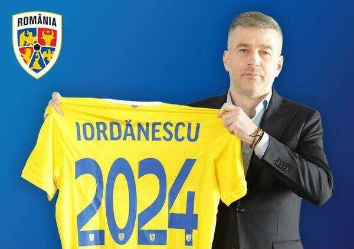

**Update**: aproape evident, am avut dreptate în privința acestui text scris înainte să înceapă calificările.

Cred că avem șanse să câștigăm grupa de calificare la Euro 2024.

Nu șanse de genul celor pe care le ai să câștigi săptămâna viitoare la loto, ci genul de șanse demne de luat în seamă.

Pentru a pune într-un fel de concret ceea ce mai degrabă simt decât pot susține cu argumente, aș zice că avem aproximativ 30% șanse să câștigăm grupa.

Exact, să o câștigăm.

Și cred că avem peste 50% șanse să ne calificăm la Euro de pe locul 2 din această grupă.

Pe ce mă bazez?

Exclusiv pe chestiuni în mare parte subiective, așa cum sunt majoritatea în ceea ce privește fotbalul.

## Elveția și Israel nu fac parte din Grupul celor 4

După ce s-au extras primele două echipe din fiecare grupă, n-am fi putut alege o variantă mai bună pentru România decât cea pe care soarta ne-a oferit-o.

Normal, există niște nuanțe aici.

Când spun variantă bună, mă refer la faptul că nu întâlnim echipe Grupul celor 4.

Eu numesc Grupul celor 4 echipe care prin stil, nu doar prin valoarea extraordinară, sunt foarte dificil de încurcat.

Concret, mă refer în ordinea dificultății la Franța, Olanda, Italia și Germania.

Atenție, nu e vorba că Franța e mai bună decât Germania, e vorba că Franța, în opinia mea, este un adversar mai dificil pentru România decât e Germania.

Bine, toate fiind, așa cum spuneam mai sus, extrem de greu de încurcat.

Orice alt nume greu din Europa este la ora actuală favorit în disputa cu noi, dar nu reprezintă o așa-zisă misiune imposibilă pentru România precum cele 4.

Atenție, am vorbit aici de grupul echipelor clar mai bine cotate decât noi.

Adică acele echipe care te atacă și te țin în propria jumătate fără ca asta să pară ceva rușinos.

Genul acesta de echipe te pot bate, dar de obicei ori au un joc foarte deschis (ex. Anglia), ori au tendința de-a subestima un anumit tip de adversari (ex. Belgia) încât poți spera să le încurci.

## Marea problemă în disputa cu Elveția

Oricât ar suna de ciudat, problema noastră majoră nu vor fi meciurile directe cu Elveția.

Nu vom avea dificultăți să ne mobilizăm cu ei sau să speculăm orice eroare pe care aceștia o vor face în caz că vor considera că sunt favoriți cerți.

Da, ei vor fi favoriți, dar când nu ne-a convenit nouă acest statut? Ce rezultat memorabil am obținut noi fără să plecăm cu șansa a 2-a?

Cred că problema noastră majoră poate fi legată de dificultatea cu care ne-am putea câștiga punctele cu Kosovo și Belarus în comparație cu Elveția.

Adică deși specificul nostru fotbalistic ne permite să batem Elveția măcar într-unul dintre meciurile directe, același specific nu ne este la fel de folositor în disputele cu echipele care nu ne sunt teoretic superioare.

De ce?

Pentru că aici intervine valoarea fotbalistică concretă, nu cea speculatorie.

[În contradicție cu Dan Udrea](https://www.gsp.ro/opinii/editorial-dan-udrea-cine-tine-un-pariu-vom-termina-sub-kosovo-676688-comentarii.html), spun că suntem clar favoriți atât cu Kosovo, cât și cu Belarus, dar asta nu înseamnă decât o probabilitate mai mare de-a câștiga meciurile cu ei decât probabilitatea de-a ne încurca.

În schimb, Elveția este la un nivel valoric care îi permite să câștige relativ ușor astfel de jocuri. Nu că n-ar putea la rândul lor să se-ncurce, dar e mai puțin probabil să li se întâmple lor decât să ni se întâmple nouă.

## Marea problemă cu Israel

Aici am dramatizat.

Nu avem o mare problemă cu Israel.

Vom fi favoriți la meciul de la București și vor fi favoriți la meciul din Israel.

Teoretic, suntem aproximativ la același nivel.

Totuși, deși sunt mulți care nu cred în așa ceva, eu cred că tradiția noastră fotbalistică superioară ar putea să conteze apropo de încrederea cu care ai noștri vor vedea acest meci.

Știu, pare ceva subțire, ceva fără valoare, dar când valorile sunt apropiate, lucrurile acestea pot face diferența.

În fine, Israel se află la un nivel care de asemenea o poate pune în postura de-a se încurca cu oricare dintre Kosovo și Belarus, chiar dacă ultimii își vor juca meciurile de acasă în Serbia.

## În sfârșit, putem profita de erorile pe care le-am făcut în ultimii 3 ani

O parte din ceea ce ne-a tras înapoi în mandatul lui Rădoi și în prima parte a mandatului lui Iordănescu ar putea fi acum un avantaj.

De exemplu, acea selecție continuă care a dus la apariția a peste 60 de fotbaliști la "națională" își va culege acum singurele roade posibile.

Adică Iordănescu chiar a avut posibilitatea să-și facă o părere despre capacitățile jucătorilor și să-i convoace astfel aproape exclusiv pe cei care pot face ceea ce cere el.

Sau măcar își dau silința în mod real să facă ceea ce ce le cere.

Asta ar putea duce la un soi de omogenitate pentru prima dată după foarte mult timp.

Și când nu excelezi la nivel de valori individuale, să ai un grup unit / omogen reprezintă un mare atu.

De asemenea, contează că Iordănescu nu mai este debutant în această meserie.

Nu se compară din această perspectivă cu vreun Pițurcă și nici măcar cu acel Rădoi din momentul plecării la “națională”.

Dar în comparație cu el însuși, e un selecționer clar mai bun astăzi decât a fost în momentul numirii.
