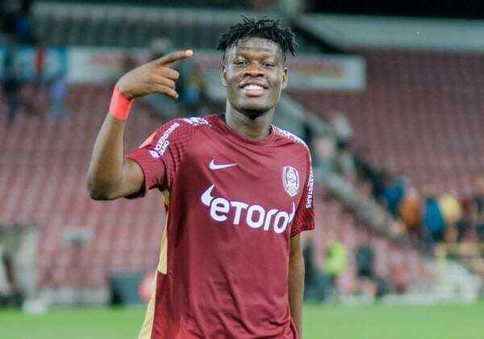

Nu trebuia să o spună Dan Șucu pentru a observa evidența.

CFR Cluj este un club care consumă de ani buni mai mult decât produce.

Pe de altă parte, ceva pare să se fi schimbat de când Cristi Balaj a preluat administrația clubului.

Concret, pentru prima dată în ultimii ani, se văd niște eforturi de intrare într-o normalitate financiară și chiar fotbalistică.

## Clubul încearcă să-și scadă cheltuielile fără să sacrifice major performanța sportivă

Cele două chestiuni pot fi luate separat doar într-o discuție teoretică, în practică ele se leagă și chiar se contopesc în anumite privințe.

Clubul tinde spre o normalitate financiară la nivel concret prin faptul că pare să-și facă niște calcule legate de cât poate consuma și ia niște decizii în acord cu asta.

Inclusiv din acest motiv au plecat Dugandzici, Betancor, Păun - pentru ca presiune asupra fondului de salarii să fie mai mică și pentru ca CFR să încaseze bani concreți și din altă parte decât de la finanțatorul Varga.

De asemenea, și discursul public al lui Varga s-a schimbat și omul a vorbit pentru prima dată despre niște limite în ceea ce privește finanțarea.

Mesajul să a fost atât pentru conducerea executivă, cu care sigur a vorbit și în privat, dar și pentru Petrescu, omul căruia nu i-a păsat vreodată de cheltuielile societății:

> “Până acum am băgat 60 de milioane de euro la CFR, în cinci ani. Avem un buget, cu salarii, taxe şi tot ce înseamnă întreţinerea unei echipe, de 1,5 milioane de euro pe lună.
> 
> Poate că unii jucători au fost supraevaluaţi. La noi sunt şi salarii de 35.000-40.000 de euro. Doar media e de 20.000 de euro. De aceea am şi pretenţii” - [Neluțu Varga pentru gsp.ro](https://www.gsp.ro/fotbal/liga-1/nelu-varga-cfr-cluj-liga-1-655530.html)

De altfel, acest lucru îmi pare interesant în situația celor de la Cluj - Petrescu a determinat în mare măsură succesul sportiv, dar a făcut-o cu niște cheltuieli enorme.

A cerut continuu jucători pe motiv că echipa este implicată în dispute pe mai multe fronturi - campionat + cupe europene, dar sezonul trecut lotul ajunsese extrem de numeros.

Și nu doar numărul contează, ci și faptul că aproape toți cei de acolo sunt bine sau foarte bine plătiți.

Inclusiv cei care nu mai prindeau lista de jucători depusă la LPF pentru campionat. Să plătești salarii uriașe inclusiv  pentru fotbaliști pe care nu-i folosești e și pierdere financiară, dar și dovadă de proastă organizare.

Așa cum spuneam, lucrurile tind să se schimbe de la venirea lui Cristi Balaj inclusiv sportiv.

## CFR Cluj alege să crească fotbaliști cu o cotă potențială mai bună

Pentru prima dată, CFR se orientează spre un model firesc pentru fotbalul românesc - adică să producă fotbaliști.

Am mai spus-o și o spun, fotbalul din România ar trebui să fie unul de producție.

Crești jucători pe care apoi îi vinzi.

Ideea de-a conta în cupele europene este o glumă înfășurată în noroc.

Adică îți trebuie noroc orb să ajungi în grupele Champions League și noroc chior să ajungi în grupele Europa League.

Pentru grupele Conference League e suficient doar norocul fără handicapuri.

Prin urmare, ceea ce pot face cluburile în momentul de față este să crească copii și juniori în condiții cât mai bune, să le educe un soi de respect profund față de club și să încerce să-i vândă când devin interesanți pentru cei cu bani de afară.

Dacă faci asta, lucrezi indirect și la îndeplinirea celui mai important obiectiv al unui club de fotbal - [să aducă spectatori în tribună.](https://www.cameravar.ro/cel-mai-important-obiectiv-liga1/)

Oamenilor le plac tinerii, le plac localnicii promovați la prima echipă, le place să vadă cum se coace un talent despre care, peste ani, să poată spună lucruri de genul: "Să-l fi văzut pe Mutu când a debutat la Pitești...".

După cum cred că ai observat, sunt cluburi care fac deja asta - vezi Farul sau măcar își dau silința în mod real să facă asta - CS U Craiova și FCSB, iar mai nou a început și Rapid.

Mai mult, zone în care mereu au existat resurse de talent au măcar ca intenție să aloce resurse reale spre creșterea de fotbaliști - FC Argeș.

Ce face însă CFR Cluj?

Nu am date concrete legate de preocuparea lor pentru creșterea de tineri români, dar anul acesta a adus 5 fotbaliști africani în două tranșe și un panamez.

Acum, încearcă să-i adapteaze la fotbalul nostru, apoi să-i vândă dacă vor reuși.

Sigur, doar Yeboah este vizibil pentru că se află la prima echipă, dar acest jucător a venit la Cluj în martie, anul acesta, din liga doua ghaneză.

De ce e interesantă această abordare parțial diferită a clujenilor?

Pentru că încearcă să-și crească șansele de reușită cu cheltuieli posibil mai mici decât ceilalți.

Din exterior, să aduci niște puști africani cu potențial pare să fie mai ieftin decât să investești într-o academie clasică. Normal, pentru așa ceva îți trebuie și scouting, dar tot nu cred că-s aceleași costuri ca la FCSB sau Farul.

În fine, fotbaliștii africani, în special cei din țări care au mai dat fotbalului nume importante, precum Ghana, au o cotă mai bună la nivel european decât tinerii din români.

Adică se maturizează mai repede, iar unii dintre ei reușesc și tactic să evolueze decent ulterior în condițiile în care nu-mi închipui că fac cine știe ce juniorat.

În privința calităților fizice, n-au cu cine discuta.

În general, sunt peste tot ce poate produce de obicei Europa și categoric sunt peste tot ce poate produce România din acest punct de vedere.

De asta, deși CFR nu are încă imaginea unui club care crește fotbaliști, asta s-ar putea schimba în curând. Singura diferență majoră este că ei aleg mai degrabă să lanseze fotbaliști decât să crească și  lucrează cu o materie primă diferită față de celelalte cluburi din Liga 1.
