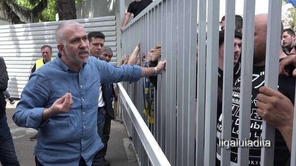

Cine este mai vinovat?

Antrenorul Petrolului, care a înregistrat și a dat suporterilor convorbirea sau fotbalistul Tamaș, care și-a sunat antrenorul și a vorbit cu el pe speaker, fără să-l anunțe că mai sunt 7 oameni de la Petrolul de față?

Nici nu contează cine-i pe primul loc.

A fost o chestie de doi lei din partea ambilor.

Există însă un lucru nediscutat, mult mai relevant decât ce face un fotbalist profesionist la beție sau ce face un antrenor tânăr din reflex.

Concret, este vorba de faptul că Nicolae Constantin a dat acea înregistrare unor lideri ai galeriei Petrolului pentru că, într-un final, a simțit nevoia să se pună bine cu aceștia.

Un fel de "uite ce-a zis Tamaș despre voi, plecarea lui e o chestiune care a ținut doar de el. Nu eu l-am vrut să plecat".

## De ce simt nevoia unii oameni din fotbal să se pună bine influensării din peluze

După cum vezi, n-am spus că se pun bine cu suporterii.

De altfel, acest text chiar nu este despre fani.

Este despre un număr infim de indivizi raportat la marea masă a suporterilor de fotbal care și-au dezvoltat o capacitate incredibilă de-a-și impune propria voință în politicile cluburilor.

Ce este definit drept impunere de voință?

Puterea.

Acești indivizi au o putere reală în raport cu cluburile pe care  susțin că le iubesc. Cu ajutorul acestei puteri se implică de-o manieră care depășește cu mult capacitățile /pregătirea lor în deciziile cluburilor.

Astfel, justificarea lui Constantin că a dat înregistrarea unor suporteri pentru ca aceștia să vadă cum stau lucrurile cu Tamaș este încă un exemplu în care oficiali ai unui club sunt subordonați de către lideri formali sau informali ai suporterilor.

Aici nu este vorba de-a respecta suporterii.

Nici de a sta de vorbă cu ei pentru că sunt importanți.

Nu este nici măcar vorba de a arăta că nu s-a putut face nimic în cazul Tamaș.

Pentru a comunica astfel de lucruri există conferințe de presă, există comunicate de presă, există poziții oficiale pe site-ul clubului / pagina de Facebook etc.

Repet, asta când vrei să comunici cu suporterii.

Când vrei însă să stai de vorbă cu câțiva indivizi care au acaparat putere prin faptul că sunt sau se erijează în lideri ai fanilor lucrurile se schimbă.

Aceea nu mai este comunicare cu fanii, este teamă reală de câțiva influensări din peluză.

Care ce pot face în cazul finanțatorilor, conducătorilor, antrenorilor și chiar fotbaliștilor?

Pot să le facă viața amară sau pot să-i elimine din club prin mobilizarea galeriei împotriva lor.

Și în locul lor îi pot aduce pe alții.

De exemplu...

> "Toată lumea știe că noi, suporterii, am avut o mare contribuție la promovare. La insistențele noastre Nae Constantin a fost numit antrenor și Claudiu Tudor director sportiv, fără aportul său financiar situația ar fi fost una foarte neplacută! 
> 
> [...] 
> 
> Chiar dacă banii au fost mai puțini față de anii trecuți când am avut un partener finanțator alături, al cărui nume nici nu vrem să-l aducem in discuție, unitatea și dorința noastră au reușit să triumfe. 
> 
> [...]
> 
> De ce nu îi oferiți lui Claudiu Tudor dreptul la semnătură? Vă este teama de corectitudinea lui și că va poate strica jocurile?”

[Peluza Ilie Oană](https://www.facebook.com/Peluza1IlieOana/photos/a.279514469102262/1625538134499882/)

## Petrolul nu este la prima poveste de acest gen

Nu mă refer la faptul că au mai existat înregistrări, mă refer la faptul că influența unor suporteri a  mai determinat situații nocive pentru club.

De exemplu, Petrolul a avut timp de aproape 5 ani un super finanțator - compania Veolia.

Omul al cărui nume nu-l rostesc cei care au dat comunicatul Peluzei Ilie Oană este Mădălin Mihailovici, director de țară al francezilor care administrează sau dețin rețele de alimentare cu apă din diverse orașe (Apa Nova)

Acesta, prin poziția sa, a determinat finanțarea clubului cu sume impresionante inclusiv pentru nivelul primei ligi, nu mai vorbesc de cea de-a doua.

În ciuda acestui fapt, relația sa cu o parte a fanilor influenți din galeria Petrolului a fost deosebit de tensionată. De exemplu, înainte de retragerea finală, Mihailovici a mai anunțat o dată sistarea finanțării după ce a fost contestat de câțiva suporteri influenți într-o conferință de presă:

> “În pofida tuturor acestor acțiuni și eforturi depuse de către companie, din păcate, propunerea unei organigrame profesioniste pentru sezonul 2019-2020 nu a fost acceptată de către o anumită parte a suporterilor, aspect care nu se întâmplă în niciun campionat de fotbal din lume. 
> 
> Lipsa unei asumări și a unei înțelegeri în mod profesionist a responsabilităților, pe care fiecare parte implicată în acest proiect sportiv le are, a determinat decizia Veolia România de a nu mai continua acest parteneriat, începând cu data de 13.06.2019”

Aparent, nimic ciudat, nu?

O grămadă de suporteri pot avea nemulțumiri față de finanțatorii echipelor pe care le susțin, indiferent că-i vorba de reprezentanții unor companii private, instituții de stat sau patroni de modă veche și nouă.

Ba da, e ciudat.

Incidentul declanșator s-a petrecut în timpul unei conferințe de presă organizată de club, adică în locul în care pătrund oficiali și ziariști.

Prezența unor suporteri mulțumiți sau nemulțumiți în conferințele de presă ale unui club este o chestiune primitivă și specifică locurilor în care există tradiția abuzului în relația lideri ai suporterilor - angajații cluburilor.

În trecut, astfel de situații erau prin multe locuri.

De exemplu, îmi aduc aminte situații comice de la Craiova sau Galați.

Acolo, la conferințele de după meciuri, au fost suporteri care îi certau pe antrenorii formațiilor adverse pentru c-au jucat într-un anume fel. Sau suporteri care puneau întrebări antrenorului echipei pe care o susțineau.

Glumind serios, acești fani chiar puteau să-i lase pe ziariștii locali să se ocupe de asta, oricum o bună parte dintre ei sunt suporteri ai echipelor respective și-n plus știu să facă meseria aceasta.

Apoi, din informațiile mele, unul dintre motivele pentru care Veolia a renunțat la finanțarea Petrolului este inclusiv atitudinea agresivă a unora dintre fanii influenți ai echipei față de reprezentanții companiei.

Deși sursa e credibilă, îmi permit să cred că această despărțire a avut și alte motive.

Mă gândesc că francezilor de la Veolia nu le-a plăcut când au auzit că-n România, [directorul executiv Mihai Dogaru a încercat să dea mită unui arbitru](https://liga2.prosport.ro/seria-1/flagrant-cu-un-oficial-al-clubului-petrolul-dand-mita-catre-arbitrul-meciului-cs-mioveni-aerostar-reactia-clubului-ploiestean-19176260).

Dogaru era și oficial al clubului Petrolul, iar asta ar fi trebuit să ducă la retrogradarea echipei, dar asta e altă poveste.

## Ce nu înțeleg unii dintre fanii manipulați de liderii galeriilor

Nucleele dure ale galeriilor includ tot felul de oameni.

Pe lângă cei care au ca scop suprem susținerea necondiționată a echipei, există și cei care susțin echipa super condiționat. Adică, cei care vor ca lucrurile să e întâmple așa cum vor ei, în condițiile lor.

Nu-ți închipui că e vorba de condițiile unor oameni care se pricep la fotbal. În general, fanii nu se pricep la condus cluburi de fotbal. Că dacă s-ar pricepe, ar lucra în domeniul de care se simt atrași.

În fine, acești oameni, dar nu numai ei, au impresia că dacă iubesc intens, au un soi de statut special în comparație cu cei care iubesc de la tribuna a 2-a.

Cumva, există această credință că dragostea din peluză e superioară și implică drepturi din categoria te-njur că merg după tine prin deplasări sau te dezbrac pentru că nu te ridici la nivelul de dedicare pe care-l aștept eu.

Sau din categoria "nu-l aduci pe cutare antrenor, îl aduci pe cutărică".

Nu-ți închipui că acum le plâng de milă primarilor care doresc să-și facă imagine electorală prin intermediul cluburilor și nu reușesc să se miște în voie din cauza acestei categorii de suporteri când nu-i au de partea lor.

Sau de mila celor de la CSA Steaua.

Sau…

Nici pe departe.

Doar constat că acest fenomen există și produce pagube de toate felurile - demiteri când nu e cazul, angajări pe criterii penibile, fotbaliști eliminați pentru că nu-s prietenoși cu influensării de peluză etc.

Nu mai vorbesc de cazurile clasice de căpușare a cluburilor - vezi ce-a scris presa de-a lungul vremii despre situația de la Dinamo.

Ideea este că-n acești fani influenți nu-s reprezentativi de fapt pentru marile mase de suporteri. Când ei cer să nu vină Măldărășanu sau să plece Grigore, nu o cer pentru că majoritatea fanilor vor asta.

O cer pentru că ei 4-5 vor asta.
