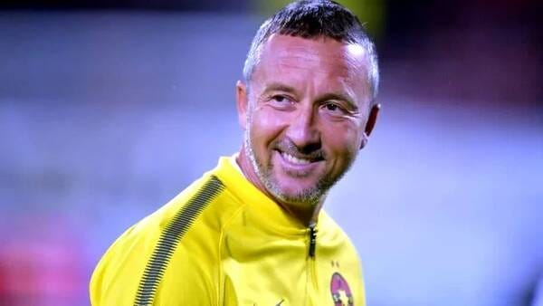

Este manager general la FCSB?

Este analist la Orange Sport?

Este un bun prieten al patronului Gigi Becali?

Mai degrabă este bucăți din toate acestea într-o încercare continuă de-a supraviețui și mai ales de a conta.

În niciunul dintre roluri nu joacă scene complete.

Ca manager, există mai ales atunci când ceea ce ar vrea el să facă se potrivește cu ceea ce vrea patronul să facă.

Ca analist la Orange Sport, limitele sale sunt date tocmai de [conflictul de interese ](https://www.cameravar.ro/televiziuni-sport-analisti-liga1/)dintre statul de angajat al unui club și teoretica imparțialitate a unui invitat de gen.

Ca prieten numit al patronului Becali, își drămuiește libertățile din relație. Adică știe că nu este vorba de prietenie, ci de un soi de dependență financiară. Ca anagajat clasic, asta n-ar fi o problemă, dar Stoica nu este un anajat clasic.

## Relația Becali - Mihai Stoica este cea dintre un abuzator și o victimă

Una dintre credințele populare printre unii suporteri este că lui Mihai Stoica îi merge bine la Steaua.

> "Are salariu mare și nu face nimic!".

Genul de credință conform căreia dacă ai bani și stai degeaba e realizarea supremă se naște de multe ori în mintea a două categorii de oameni: cei săraci și cei care muncesc mult, dar sunt săraci.

Hehehe, nu citești astfel de aprecieri prin presă, este?

Nicio problemă, nu mi-am propus nici să ne împrietenim, nici să îți fac pe plac.

Ci doar să scriu ce cred.

Apropo de prietenie și făcut pe plac...

Din punctul meu de vedere, Becali este un abuzator aparte pentru Mihai Stoica.

Asta în contextul în care majoritatea anagjatorilor sunt abuzatori pentru angajații lor, doar că spre deosebire de unele corporații care minciunesc când vorbesc despre valori și misiuni, Becali folosește un limbaj atât de direct încât pare arhaic.

Și ce e arhaic poate să pară unora violent tocmai pentru că avem tendința de-a fi mai atenți la cum ne simțim când auzim ceva decât să fim atenți la adevărul acelui ceva.

În fine, de ce mi se pare Becali un abuzator și Stoica o victimă?

Pentru că e o relație între un om cu bani, abil în ceea ce privește condiționarea angajaților săi și un om care are suficientă nevoie de bani încât să taie bucăți din ceea ce poate fi ca să se încadreze în ceea ce dorește patronul să fie.

> "La Steaua, Gigi m-a adus în 2002 și stiam de atunci că merg pe gheață subțire, că nu eram dorit de unii. Dar în timp, mi-am consolidat poziția". (Mihai Stoica, ProSport, 2011)

Mai mult, ca-n orice abuz, e vorba de cine deține puterea și cum o folosește.

Becali deține puterea prin bani și o folosește inclusiv prin amestecul de aprecieri laudativ - jignitoarea la adresa lui Stoica.

> "Eu nu mă cert și nu mă împac cu angajații mei. Cu el aveam o prietenie mai aparte și prima dată când m-am dus, cu el am dat mâna. 
> 
> Numai că trebuie să reglăm niște lucruri. E greu să mă mai superi pe mine acum. Dar, dacă fac unii oameni niște lucruri fără să își dea seama, atunci eu iau niște măsuri. Chiar dacă ești frate cu mine, chiar dacă ești cel mai bun prieten, tot iau măsuri.
> 
> Eu am spus că e cel mai bun conducător, cel mai bun psiholog, am vorbit la superlativ de el. Singurul lucru pe care l-am spus a fost că nu are darul ăsta, adică fler la jucători. Nu e o jignire asta". (Becali, ProArena, 2022)

Relația asta arată oarecum ca relația dintre un soț abuziv și o soție casnică. El aduce banii și bătaia în casă, ea este victima care știe să facă o grămadă de lucruri, dar asta contează prea puțin pentru [cel care trăiește doar după propriile reguli](https://www.cameravar.ro/de-ce-il-urasti-pe-becali/).

## De ce este greu pentru Mihai Stoica să viețuiască alături de Becali

Mihai Stoica a fost un om care s-a hrănit ani de zile cu aprecierea presei și a publicului.

Tinerețea sa în fotbal a înseamnat o activitate aproape glorificată de conducător la Oțelul Galați.

Nu doar pentru că împreună cu Marius Stan, Vasile Simionaș și sprijinul Sidex a construit cea mai bună echipă din istoria Galațiului în opinia mea - generația lui Vali Ștefan.

Ci pentru că Mihai Stoica a fost printre primii conducători care s-au opus Cooperativei nu doar prin fapte, ci și prin discurs.

Ai citit bine și m-am exprimat corect. La nivelul percepției publice, faptele pot să rămână în urma vorbelor. Mai ales când vorbele au un anume farmec stârnitor.

Reacțiile sale de după meciuri erau ceva neobișnuit într-un fotbal în care majoritatea conducătorilor erau ori prea serioși ca să aibă astfel de reacții, ori prea inhibați, ori incapabili să lege 3 cuvinte originale.

Fiecare om are un spirit narcisic care poate fi ușor gonflat de reacțiile de apreciere ale celor din jur. Este ceva obișnuit și explicabil prin dependența primitivă a individului de semeni. Așa suntem programați inclusiv biologic, nu doar social.

În fine, după ce a mers la Steaua, Stoica n-a mai avut parte de aceleași surse de plăcere mediatică.

Nu pentru că și-a pierdut reflexele verbale, ci pentru că nu mai era reprezentantul unui club din Provincie care se bătea cu balaurii, ci reprezentantul celui mai puternic club din România.

E ca și cum un cavaler romantic ajunge brusc vătaf la curtea unui mare boier. Financiar și ca statut, lucrurile arată mult mai bine. Din perspectiva libertății de mișcare, lucrurile arată mai rău.

De ce ți-am spus toate acestea?

Pentru că asemeni oricui, Mihai Stoica înaintează în vârstă. Iar când înaintezi în vârstă, încep să se petreacă diverse chestiuni mai mult sau mai puțin interesante.

Aparent, te liniștești:

> "Efectiv, nu mai am nervi să mai fiu înjurat. Acum, la Sepsi, m-a înjurat un om în vârstă încontinuu. <<De ce mă înjuri, omule, nu am zis un cuvânt de Sepsi vreodată>> Chiar nu mai suport să îmi fie înjurată familia non-stop, non-stop" (Mihai Stoica, DigiSport, 2019)

În paralel cu aparenta liniștire, se mai petrece ceva.

De exemplu, te apucă nostalgia după momentele în care erai tânăr și făceai lucrurile diferit. Stoica are la ce tinerețe și la ce lucruri să se raporteze.

Și cu cât prezentul este mai puțin glorios, cu atât nostalgia este mai puternică.

Sigur, vor fi din nou unii care vor spune că-i dă Becali salariul și uită de toate chestiile astea romantice. Nu te lăsa păcălit, banii rezolvă orice pentru cei care nu-i au deloc. Pentru cei care-i au cât de cât, banii sunt foarte importanți și atât.

De altfel, dacă urmărești cu atenție ieșirile publice ale lui Mihai Stoica, ai văzut deja situații în care acesta are reacții neuniforme cu statutul său.

Când Iordănescu a fost numit antrenor la FCSB, Stoica s-a reactivat oarecum și a spus singur că simte ceva diferit, ceva ce susține că l-a surprins chiar și pe el. Așa că a revenit pe bancă:

> "N-am crezut că există ceva sau cineva care-mi poate reda motivația profesională. Bine ai venit, Edi!".

După plecarea lui Iordănescu, Stoica a anunțat din nou că renunță să mai stea pe bancă în timpul meciurilor:

> "Nu mai rămân pe bancă, nu mai am vârsta! Acolo se trăiește cu intensitate și îmi ajunge, nu mai e pentru mine. Mă enervez rău de tot… În tribună nu pot să mă duc să mă cert. Anii au lăsat urme. Chiar nu-mi mai arde. Le-am spus că nu mai pot să stau că mă rupe".

Acum, Stoica e din nou pe bancă.

Care este simbolistica acestui dute-vino în relația cu banca?

Banca este tinerețea lui Stoica și una dintre cele mai intime forme de reamintire a ce a fost și a ce poate fi. Stoica nu a fost niciodată un om de birou sau un om de lojă.

În ciuda tuturor ironiilor, Stoica nu este nici măcar un om de Palat. De altfel, cred că dorința de-a conta este cea mai mare dorință dintre cele sufocate de Becali.

> "E ipocrit cel care spune atunci când pleacă de la o echipă că își dorește ca formația pe care a părăsit-o să aibă rezultate bune. Sau mai bune decat avusese. Când am plecat, îmi doream ca Steaua să piardă tot. Să se simtă lipsa mea". (Mihai Stoica ProSport, 2011)

## De ce nu se poate dezlipi de Becali

În mare, Stoica este într-o situație cu care se confruntă foarte mulți oameni. Singura diferență este că din postura sa el trăiește în văzul tuturor aceste momente.

Concret, Mihai Stoica este un om cu un anume standard de viață. N-am nevoie de acces la cine știe ce date financiare ca să știu asta așa cum o știe oricine. Din ce cunosc, nu are afaceri personale care să-i întrețină în totalitate acel standard de viață, iar eventualele sale dețineri probabil că sunt proprietăți imobiliare valoroase.

Dar aceștia sunt bani mulți pe care-i poți avea deodată în caz că vinzi,  nu surse de venit suficient de mari încât să trăiești liniștit ca un fel de rentier.  În aceste condiții, o eventuală despărțire de Becali ar înseamna să se confrunte cu o situație cu care nu s-a mai confruntat de multă vreme: să muncească clasic.

Când spun "muncit clasic" nu mă refer la vreo situație umilitoare, ci la faptul că ar trebui să se angajeze într-un loc în care nu ar mai avea relația cu Becali, ci relația cu un angajator.

Care angajator probabil l-ar trata cu un respect diferit față de cel cu care-l tratează Becali.

La ce mă refer?

La Becali, forma obișnuită de respect este că te plătește. Cu cât te plătește mai bine, cu atât te respectă mai mult. Chiar și acest "mult" este puțin într-un final din perspectiva respectului.

În schimb, Becali te poate ține anagajat chiar și pentru roluri pentru care nu te-a angajat inițial. De asemenea, tot Becali poate avea ideea de-a te plăti în continuare din rațiuni neobișnuit de umane. Un fel de nu-l dau afară pentru că are familie, ne știm de atâta timp etc.

Ai putea spune că asta înseamnă să te țină de milă, doar că Stoica este capabil să lucreze și-n alte părți, nu are vreun handicap real care să-l oprească.

Doar că, speculez din nou, îi este frică să se mai ducă în alte părți. Îi e teamă de schimbări cum începe să le fie teamă multor oameni după ce trec chiar și de 30 de ani, nu mai vorbesc de 50.

În plus, [Stoica a luat-o pe calea credinței](https://evz.ro/mm-stoica-are-contract-pe-viata-la-fcsb-gigi-becali-a-luat-o-si-el-pe-calea-asta.html), ceea ce sigur îi place lui Becali.

Vezi cum ești?

Deja te gândești că această mișcare a fost o altă șmecherie a lui Stoica de-a se pune bine, de-a se adapta situației, de-a supraviețui.

Orice-i posibil, dar, în general, oamenii se duc în această direcție mai ales când simt nevoia să o facă din cauza a ceea ce li se întâmplă în viață. Nu e ceva ce faci o dată și iei ochii, e ceva ce-ți cere prea mult timp ca să o poți face de fațadă. În fine, [e o formă de terapie mai veche decât ce au produs Freud și ai lui](https://www.staidrept.ro/cand-sa-nu-mergi-la-psiholog/).

## De ce îți este antipatic Mihai Stoica

În momentul de față, există o grămadă de confuzii legate de ce-nseamnă să fii inteligent.

Cei oarecum de modă veche o pot echivala cu succesul academic sau cu cu capacitatea unui individ de-a ști multe lucruri despre multe lucruri.

Cei care au citit puține cărți pot crede că cei care au citit multe cărți și se exprimă fluent în scris sau prin viu grai ar fi de asemenea inteligenți.

În fine, sunt și grupul celor ușor ofensabili pentru care s-au inventat tot felul de tipuri de inteligență doar-doar or excela la ceva și nu se vor mai simți complexați. Cea mai amuzantă inteligență fake dintre toate este inteligența emoțională.

Ce fel de inteligență deține Mihai Stoica?

Fără să-i fi măsurat IQ-ul, îndrăznesc să spun că este deținătorul unei inteligențe clasice, reale de invidiat.

Genul de inteligență care-i născută și care-i ajută pe indivizi să facă cel mai important lucru dintre toate - să gândeacă rapid și să se adapteze ușor în tot felul de situații.

Prin urmare, am o veste proastă pentru cei cărora le place să spună despre Mihai Stoica faptul că-i curvă sau pervers sau alunecos sau etc.

Deși poate fi în toate aceste feluri, Stoica vădește inteligență după standarde ale inteligenței reale. Așa că chiar dacă-l disprețuiești, va trebui să privești această realitate în față - omul este inteligent.

E doar o formă de-a pune într-un cadru confortabil o chestiune care te scoate din sărite - Stoica este foarte inteligent.

Peste acest strat, vin celelalte - ofticile legate de faptul că lucrează la o echipă de prim plan, faptul că are un salariu bun, faptul că ironizează echipa cu care ții etc.

A, și faptul că rezistă în poziția sa deși ți-ar plăcea să-l vezi dat afară.

De asta, inteligența lui Mihai Stoica seamănă cu capacitatea de adaptare a unor insecte.

Oricât le-ai chimiza, ele rezistă.

## Care-i principalul atu al lui Mihai Stoica în relație cu presa

Dacă te-ai întrebat vreodată cum reușește Mihai Stoica să navigheze prin tot felul de situații dificile fără să ia prea multă apă, îți voi explica imediat.

După cum știi, Stoica este confruntat cu diversele sale vulnerabilități reale sau inventate doar în momentele în care are conflicte cu diverși oameni din fotbal.

Atunci, respectivii încearcă să-l jignească sau îl pun în fața unor realități deranjante.

În categoria jignirilor încercate sunt cele legate de faptul că a fost condamnat și a mers la închisoare. Deși la nivelul percepției publice asta e o rușine, în realitate el a plătit deja pentru faptele sale.

Pur teoretic, n-ar trebui să-l afecteze acest lucru. Dar îl afectează. Stoica e doar inteligent, [nu e și vreun monument de stoicism](https://beldie.ro/ce-este-stoicismul/).

În categoria realităților deranjante sunt trimiterile la rolul său de manager de decor la FCSB. Fiind vorba de o situație care chiar se-ntâmplă, Stoica suferă real în cazul acestor ironii.

Totuși, n-auzi nimic de genul acesta din gura ziariștilor cu care interacționează sau care îi analizează munca.

De ce?

Sunt mai multe motive, dar două dintre ele sunt cele mai importante.

În primul rând, Stoica are o foarte bună capacitate de-a măsura limitele celor cu care discută. Asta înseamnă că nu va intra într-o dispută cu oameni care stăpânesc foarte bine ceea ce spun.

În schimb, va fi extrem de agresiv cu orice adversar pe care-l percepe ca fiind inferior.

De exemplu, va fi amabil, împăciuitor și laudativ într-un dialog cu Radu Paraschivescu, dar poate fi ironic până la nivel de batjocură cu un reporter care-i pune o întrebare deranjantă.

De ce?

Unii vor spune că e vorba de lașitate, dar e vorba de adaptare și calculare corectă a situației pe care o are în față.

De exemplu, să fii agresiv într-o dispută directă cu Paraschivescu pe orice subiect înseamnă să încerci să introduci degete printre palele unui ventilator și să speri că nu vei fi atins.

În schimb, dacă prinzi la înghesuială un om care nu e stăpân în totalitate pe lucruri pe care ar trebui să fie în percepția opiniei publice, atunci îți permiți cu relaxare să fii cât se poate de răzbunător.

De ce?

Ar înseamna să speculez și am făcut-o suficient până acum.

## Care este viitorul lui Mihai Stoica în fotbal

Stoica este important pentru FCSB atât timp patronul va continua să aducă antrenori sub nivelul pretențiilor clubului sau cu experiență redusă. În aceste condiții, un om ca Stoica în preajma echipei compensează parțial aceste lipsuri.

De altfel, experiența este una dintre valorile cele mai puțin înțelese și apreciate într-un fotbal în care tot felul de indivizi cred că e suficient să numești un om într-o funcție ca să rezolvi probleme.

Toate meciurile europene și din Liga 1 la care Stoica a participat, toate săptămânile de pregătire ale acestor meciuri pe care Stoica le-a observat, toate interacțiunile cu antrenori și jucători cu care Stoica a colaborat, toate disputele din media pe care le-a purtat sunt lucruri pe care nu le obții prea ușor.

Sau dacă le obții la nivelul unui club mărunt nu e același lucru cu a le obține la un club de super prim plan.

De asemenea, Stoica ar fi cu adevărat important mai ales dacă Becali ar aduce mâine un antrenor de categorie grea.

De ce?

Pentru că abia în acele condiții Stoica ar avea marea șansă să-și utilizeze calitățile cu adevărat.

Cred însă că cu cât petrece mai mult timp în rolul actual de la FCSB, cu atât îi va fi mai greu să accepte să lucreze la un alt club în condiții automat diferite față de cele actuale.

Atenție, nu spun că n-ar putea să o facă, ci că i-ar fi greu să accepte.

Normal, dacă va fi forțat de circumstanțe, va trece peste ce nu-i convine.

Pe de altă parte, tocmai inteligența sa este cea care-l poate sabota într-un fel: adică e posibil să îl ajute să-și păstreze o poziție în preajma lui Becali și să-și limiteze posibilitățile.

Bine, dar de ce un individ atât de deștept nu poate să-l facă pe Becali să-i accepte ideile sau măcar să-i asculte sfatul în diverse situații esențiale?

Pentru că și Becali este inteligent, dar în plus are o credință totală în alegerile sale, în filosofia sa de viață, în ceea ce este el.

Adică exact ceea ce Stoica ar trebui să recupereze ca să conteze din nou pe măsura dorințelor sale.
