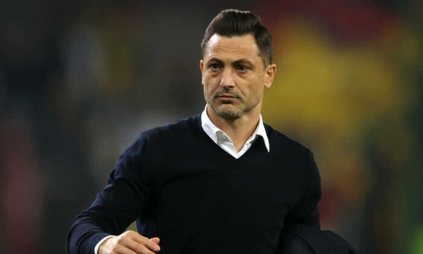

Mai mult de jumătate dintre cele 16 echipe ale Ligii 1 și-au schimbat antrenorii de la începutul sezonului.

Unii antrenori au fost dați afară, alții au fost convinși să demisioneze singuri.

De ce se întâmplă acest fenomen în Liga 1?

Există mai multe motive, dar 3 dintre ele se detașează ca importanță.

## 1. Cluburile sunt conduse de oameni nepricepuți la fotbal

Antrenorii sunt dați afară de cei care i-au angajat.

Asta te face să te întrebi când au greșit angajatorii?

Când au numit antrenorul respectiv sau când l-au dat afară?

Majoritatea conducătorilor își scuză [lipsa de valoare profesională](https://www.cameravar.ro/cea-mai-slaba-veriga-fotbalul-romanesc) prin vehicularea unei idei simple:

> "Domnule, la fotbal nu știi niciodată sigur. Uneori merge cu un antrenor, alteori nu merge".

Așa este, nu știi sigur vreodată.

Totuși, e o diferență mare între a nu ști sigur și a merge de fiecare dată numai la ghici.

Numirea unui antrenor include o doză de hazard.

Nu poți ști sigur că va reuși să producă rezultatele pe care le vrea clubul, dar ai niște repere care pot fi destul de solide dacă îți faci bine treaba în calitate de conducător.

De exemplu, orice antrenor are un CV. Uneori, acel CV conține date care te pot convinge să-l angajezi, alteori conține date care ar trebui să te convingă să nu-l angajezi.

Normal, rezultatele pe care un antrenor le are înainte să fie numit într-o funcție nu reprezintă automat o garanție, dar îți spun ceva despre experiența și despre capacitățile sale.

Așa că pe baza acestui lucru, poți merge mai departe și să urmărești cu atenție ce au jucat în mod concret echipele sale. Așa poți descoperi că Măldărășanu e un antrenor interesant sau că Neagoe merita de ceva vreme să antreneze o echipă cu pretenții.

Sau că Balint și Grozavu pot fi super antrenori dacă îți dorești un anumit tip de fotbal, care implică angajament și intensitate totale.

Doar că majoritatea conducătorilor fac superficial munca aceasta de cercetare a oamenilor pe care-i angajează.

De cele mai multe ori, se bazează pe concluzii trase pe baza a ceea ce au văzut în meciuri pe care nu le mai revăd sau pe baza unor percepții profund subiective din categoria tristă "ăla are sânge în instalație".

Și ceea ce-ți spun eu aici reprezintă cazuri cât de cât fericite, a unor conducători de club care totuși pare să le placă fotbalul suficient cât să-l urmărească.

Gândește-te că multe decizii sunt luate de oameni care au început să se uite la fotbal mult după 40 ani - în special primari sau diverși introduși în cluburi pe criterii politice.

Aceștia sunt pur și simplu proști din perspectiva managementului în fotbal. Proști grămadă. Doar că ei au altă părere și chiar cred că de fapt domeniul e unul ușor, în care experiența lor extra fotbalistică are mare importanță.

## 2. Unii antrenori chiar nu au valoarea necesară să antreneze în Liga 1

Despre lipsa de valoare a unor antrenori se discută foarte rar.

Acesta este un aspect mult mai puțin discutat pentru că antrenorii și-au câștigat statutul de victime și victimile mereu primesc un soi de pardon permanent.

Pe de o parte în mod firesc, pentru că-și fac meseria în condiții real dificile, pe de altă parte în mod nefiresc pentru că unii au talentul smiorcăielii.

Totuși, dacă privești rece situația, vei ajunge ușor la concluzia mea.

Pe de o parte, antrenorii români sunt produsul școlii locale de antrenori.

Care școală locală a fost condusă niște zeci de ani după criterii care n-au avut prea multă tangență cu rigurozitatea academică.

Acum, nu mă-nțelege greșit. Personal, cred că antrenoratul ar trebui să fie o profesie în care accesul să se facă ușor tocmai pentru că antrenorii depind oricum într-un final de rezultatele concrete ale muncii lor.

Dacă ești bun reziști, dacă nu ești bun, la revedere.

Totuși, toți acei ani în care licențele s-au obținut ușor, fără să se-nvețe mare lucru la școală se simt acum. Abia în administrația Burleanu s-a crescut în mod real nivelul din această perspectivă. Da, ai citit bine. Acum e un alt nivel de seriozitate și chiar de rigoare academică.

Din păcate, și-au sabotat acest progres real prin atitudinea avută în cazurile Rădoi și Mutu la echipele naționale. La nivel de imagine sunt mult în spatele eforturilor făcute acolo.

Pe de altă parte, în ciuda aparențelor, mulți antrenori nu-s capabili să se adapteze realităților din fotbalul nostru. Iar asta nu-nseamnă ceea ce s-ar aștepta mulți să-nsemne.

Nu-nseamnă să-nghiți tratamente incorecte din partea conducerii sau să ai toleranță față de ignoranțele variate ale unor fotbaliști.

Asta înseamnă să faci tot ceea ce ține de tine să-ți demonstrezi valoarea.

Ce-nseamnă să ai valoare ca antrenor în condițiile fotbalului nostru?

Pe scurt, e vorba de rezultate bune sau foarte bune raportat la bugetul clubului.

Adică, nu contează că tu ai dus echipa în play off și ai terminat pe locul 6 dacă ai avut buget peste toate celelalte echipe care au terminat în urma ta.

Contează când ai buget de locul 10 și ai terminat pe 5.

De asemenea, foarte important, rezultate înseamnă să promovezi jucători tineri în prima echipă. Ideal, din propria academie.

Aceasta este o formă supremă de dovedire a calității antrenorului pentru că promovarea unui jucător tânăr înseamnă nu doar curaj, ci și capacități tactice care să facă posibilă asumarea acelui risc.

Dacă ești un antrenor capabil din această perspectivă, construiești un sistem care să poată absorbi intrarea în echipă a tinerilor.

Și-l adaptezi tactic pe acel copil la nivelul Ligii 1.

E ușor așa ceva?

Nici pe departe.

Este foarte greu, dar n-am zis că meseria de antrenor e ușoară.

Tocmai pentru că e foarte grea nu toți au valoare să o practice la nivel de Liga 1.

A, dacă vrei ceva mai ușor, te poți limita să ceri fotbaliști cu experiență și nu faci altceva decât să gestionezi niște valori certe pentru nivelul Ligii 1.

În fine, valoare înseamnă să ai genul de personalitate care să te facă respectat de jucători și conducători. Da, e foarte, foarte greu să obții respectul vestiarului și respectul conducerii.

Doar că o bună parte din reușită depinde de tine ca antrenor, de capacitatea ta de-a fi convingător, de capacitatea ta de-a citi caracterele din jurul tău.

## 3. Antrenorii au cedat aproape total în relație cu cluburile

Cele două aspecte de mai sus, lipsa de valoare a conducătorilor de club și lipsa de valoare a unor a antrenori au produs a treia cauză importantă pentru desele demiteri din Liga 1.

Aceasta este lipsa forței de negociere a antrenorilor în relație cu cluburile.

Când semnează cu un club, antrenorii semnează din postura celor care-și doresc mai mult să fie numiți decât își doresc cluburile să-i numească.

Simplu vorbind, sunt mai mulți antrenori dornici să antreneze decât cluburi dornice să-i angajeze. Prin urmare, piața este în favoarea cluburilor, care au de unde alege.

Totuși, chiar și în condițiile în care există ofertă aparent bogată de antrenori nu ar trebui să existe atât de multe situații în care cluburile să obțină acceptul unor antrenori în condiții de multe ori aberant de dezavantajoase pentru aceștia.

De ce spun asta?

Pentru că orice profesie care se află într-o situație de acest gen face două lucruri: se organizează ca breaslă (inclusiv sub formă sindicală) și produce niște linii de acțiune.

Sigur, contractele vor fi mereu lege între părți și vor presupune libertate de negociere. De altfel, personal sunt total împotriva tendințelor de-a reglementa orice doar din dorința de-a controla orice.

Pe de altă parte, orice contract care spune că antrenorul poate fi dat afară pentru că nu câștigă 4 meciuri consecutive este o dovadă a unei lipse de respect față de antrenorul respectiv.

Nu poți propune așa ceva dacă apreciezi omul pe care vrei să-l angajezi și nu poți accepta așa ceva dacă ai respect față de capacitățile tale de antrenor.

Când există genul acesta de relație între conducători și antrenori, lucrurile nu pot să meargă decât într-o direcție greșită.

Zilele trecute, Valeriu Iftime, om mers la Olimpiade ca elev, anunța că va întări stafful [cu încă un antrenor fără licență](https://btonline.ro/valeriu-iftime-s-a-hotarat-vezi-cine-va-fi-antrenorul-echipei-fc-botosani/?fbclid=IwAR3iHfhVg9p7--gCl2xb_O9pMNnohtl9VEhc46xAdm-ILNbO6M3jecYmRU8). Asta nu este sărăcie, este doar o formă de evaluare a breslei antrenorilor de către un patron.

Și un simbol al respectului care există între cele două părți.
