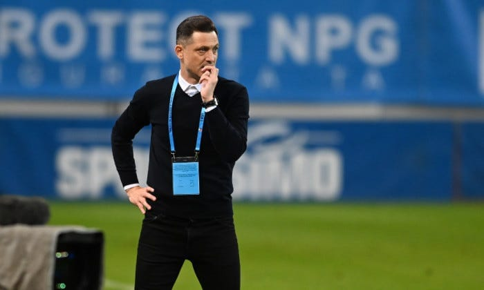

Cel mai ciudat lucru la Craiova este că aproape fiecare numire de antrenor pare să fie o alegere bine gândită.

Și totuși, clubul obține ceva mai puțin decât te-ai aștepta să obțină după atâția ani.

În fine, povestea cu Rădoi este interesantă pentru că el însuși este un individ aparte în antrenoratul din România.

Dar și pentru că eșecul său s-a produs în condiții aparent ideale pentru reușită.

## Ce a greșit Rădoi în ieșirile sale publice

Discursurile lui Rădoi după meciurile încheiate cu rezultate nefavorabile echipei sale au avut cam aceeași temă:

> Fotbaliștii sunt într-o perioadă de evaluare, unii vor pleca pentru că nu fac ce trebuie, eu nu-mi permit să accept această atitudine față de fotbal.

Normal, au fost și alte nuanțe, dar în mare despre asta a fost vorba.

Ce este greșit într-un astfel de discurs?

Absolut nimic.

De altfel, sunt de acord cu ideea că la Craiova [există o problemă de evaluare corectă a lotului](https://www.cameravar.ro/
marea-problema-a-lui-radoi/).

Marea problemă nu este că Rădoi a avut public această poziție.

Marea problemă ține de frecvența cu care a repetat această idee și rațiunea pentru care a repetat-o.

În privința frecvenței, lucrurile sunt simple - dacă o spunea o singură dată apoi își vedea de treabă și de fapte, efectul vorbelor sale era mult mai puternic.

Dacă a repetat iar și iar aceste lucruri, efectul vorbelor sale s-a diluat pentru cel puțin trei dintre publicurile sale importante: jucătorii, ziariștii și suporterii.

Ușor-ușor, prin repetare, discursul lui Rădoi a început să semene cu amenințările infantile din categoria "lasă că te prind eu cu frate-meu și să vezi ce-ți fac".

În privința rațiunii pentru care a repetat această idee lucrurile sunt ceva mai complicate și nu pot să discut pe dovezi, ci pe bază de percepție și supoziție.

Concret, impresia mea a fost că Rădoi a avut acest gen de discurs dintr-un soi de autoîndrăgostire exagerată de propria persoană. Cred că vânează momentele în care poate obține admirație prin discurs și fapte care să indice că e un tip plin de personalitate.

Partea ciudată este că el, teoretic, este deja perceput ca un astfel de individ și te poți întreba de ce simte nevoia să întărească această idee.

În fine, după plecarea sa de la Steaua, Rădoi a avut o serie de reacții agresive față de orice personaj puternic care i-a lezat într-un fel sau altul conturul - Ionuț Lupescu, Gigi Becali, Sorin Cârțu.

De ce simte Rădoi nevoia să aibă aceste atitudini?

De unde dorința sa de-a fi profund diferit în reacții față de majoritatea colegilor săi de breaslă (fotbaliști / antrenori)?

Normal, poți să concluzionezi că e firesc să-și dorească să fie diferite față de jucători care acceptă orice tratament sau față de antrenori care acceptă să li se facă echipa de către oricine-i mai bine poziționat decât ei în club.

Totuși, eu n-am întrebat de ce Rădoi nu înghite tratamente pe care le consideră incorecte, ci de ce produce vâlvă în jurul refuzului său de-a le înghiți.

De ce nu refuză de-o manieră discretă?

Ca să-mi spun părerea, ar trebui să speculez și mai mult decât am făcut-o apropo de un om pe care nu-l cunosc personal, doar îl urmăresc în existența sa publică.

## 3 lucruri neașteptate în mandatul lui Rădoi la Craiova

Ce am scris mai sus nu reprezintă lucruri care să mă fi surprins.

În schimb, am fost mirat de următoarele chestiuni:

### 1. A întârziat la o ședință cu Mihai Rotaru și nu a anunțat întârzierea

Conform finanțatorului Craiovei, Rădoi ar fi întârziat aproape jumătate de oră la o discuție pe care ar fi trebuit să o aibă și nu a avut inițiativa normală de-a anunța că nu ajunge la timp.

De ce este ceva neașteptat?

Pentru că percepția mea despre Rădoi, bazată pe informații publice, indica faptul că e un tip care ar ține la chestiuni ce implică un soi de disciplină și un soi de minimă politețe în relație cu ceilalți.

De altfel, în calitatea sa de căpitan de echipă al Stelei, el era cel care se asigura că toți colegii respectă programul echipei și regulile acesteia. Se implica inclusiv în colectarea amenzilor date celor care nu respectau această disciplină de grup.

### 2. A manifestat un soi de labilitate în relație cu meseria de antrenor

Conform lui Mihai Rotaru, Rădoi ar fi cerut rezilierea contractului și după meciul cu Petrolul.

De ce?

Pentru că era nemulțumit de lot și dorea transferuri.

Apoi, a plecat de la echipă acum, anunțându-și demisia la doar câteva minute după ce avusese ocazia să o facă și nu a făcut-o.

Ce s-a întâmplat în acele 8 minute dintre cele două reprize de declarații date la finalul meciului de cu FC Argeș încât să-l determine să plece?

Tocmai acest timp foarte scurt mă face să cred că Rădoi a reacționat emoțional, într-o aparentă dorință de-a se glorifica.

Un antrenor este un om care gestionează un grup. Pentru mulți, cel mai important lucru pare să fie ideea de-a motiva jucătorii și de-a-i mobiliza înainte de meciuri prin cine știe ce discursuri înălțătoare.

Totuși, gestionarea unui grup presupune mult mai mult de atât.

Să te motivezi ar trebui să fie partea ușoară pentru un sportiv, să-ți păstrezi cumpătul, să ai echilibru în moment de tensiune / presiune ar trebui să fie chestiunea mai dificilă, pe care antrenorul trebuie să o rezolve pe cât posibil prin felul său de-a fi, prin discurs și prin ceea ce lucrează concret la antrenamente.

E greu să produci așa ceva dacă tu ești genul repede dătătoriu de demisii nevinovate oricând te confrunți cu o dificultate într-o meserie de altfel dată naibii de dificilă.

### 3. Meciul cu Rapid, terminat 2-2 după ce Craiova a avut 2-0

Sezonul trecut, Rapidul antrenat de Mihai Iosif a avut 1-0 contra Craiovei lui Reghecampf pe teren propriu și partida s-a terminat 2-1 pentru olteni, care au întors pe final rezultatul.

Trebuie menționat și că Rapid a avut un om în minus o repriză.

Dincolo de asta, Craiova a dominat acea repriză secundă mult dincolo de ceea ce te-ai fi așteptat să vezi chiar și în cazul unei partide în care o echipă joacă în inferioritate.

În partida din acest sezon, Rapid s-a prezentat cu o echipă net superioară celei de sezonul trecut, dar și Rădoi a avut la dispoziție un lot ceva mai bun  bun decât anul trecut.

În plus, a avut 2-0 la un moment dat și avantaj la pauză la capătul celei mai bune reprize din acest sezon de Liga 1.

În partea a doua însă, Rapid a egalat și putea chiar să câștige acel meci.

Cât a ținut de antrenor acest fapt?

Acum, exemplul meu cu Rapid nu este legat doar de meci în sine, ci mai ales de felul în care putea juca echipa cu Regecampf și de felul în care joacă cu Rădoi.

## De ce vezi atâtea reacții negative la adresa lui Rădoi

În zonele de comentarii de pe site-urile de sport, dar și pe social media, există o grămadă de reacții ironice la adresa lui Rădoi.

Existau și înainte să-și dea demisia, există și acum și vor exista și-n viitor.

Cum de sunt atât de sigur apropo de viitorul lui Rădoi în relație cu o parte a publicului?

În realitate, Rădoi e doar un alt personaj care se-ncadrează bine într-o scenă clasică - o parte a publicului nu suportă oamenii cu bani și atitudini diferite față de cele pe care le consideră ei firești.

Deci nu am prezis nimic spectaculos, doar am remarcat ceva vechi de când lumea - succesul și libertatea de-a face doar ceea ce vrei irită profund.

Nu-ți închipui că Becali este urât în primul rând pentru că-i grobian sau ipocrit. Becali este urât în primul rând [pentru că are bani și că face ce vrea](https://www.cameravar.ro/de-ce-il-urasti-pe-becali/) într-o lume în care majoritatea n-au bani și nu fac nici pe departe ce vor.

Abia după ce se formează această ură, apar tot felul de pretext precum "e arogant", "e prost", "e cioban" etc.

Cam la fel stau lucrurile și la Rădoi.

Sigur, aici e vorba doar de o parte a comentariilor negative la adresa sa, o altă parte e justificată de chestiuni concrete, unele dintre ele menționate și de mine aici.

## Ce a greșit Mihai Rotaru în relație cu Rădoi

Partea proastă pentru Mihai Rotaru este că nu există situație la Craiova pentru care el să nu fie vinovat la nivelul percepției publice.

Întotdeauna va fi vinovat inclusiv pentru chestiuni care frizează absurdul dacă i le reproșezi. Este costul pe care-l plătești suplimentar când ești responsabil de mulțumirea suporterilor unui club de fotbal.

Dincolo de asta, Mihai Rotaru este vinovat și că a prins societatea în niște contracte proaste cu o serie de fotbaliști sub nivelul pretențiilor pe care le are clubul.

De exemplu -  Rivaldinho, Hanca, Martic, Vână etc.

Sau Mihai Rotaru este vinovat pentru că clubul oferă un credit mai mare decât e cazul unor fotbaliști încă tineri, dar care întârzie prea mult să aibă consistență în joc.

De exemplu - Câmpanu.

Sigur, nu e o urgență să scapi de fotbaliști precum Câmpanu mai ales dacă financiar nu afectează major clubul, dar aceștia pot într-un final reprezenta un balast valoric dacă nu confirmă mai rapid.

În fine, inclusiv unii dintre cei care statistic aduc plusuri echipei sunt într-o scădere fotbalistică evidentă.

De exemplu - unul dintre fotbaliștii mei preferați, Dan Nistor.

De asemenea, Mihai Rotaru este vinovat că nu reușește să facă una din două: ori conduce clubul pe față și își asumă asta, ori lasă pe altcineva să-l conducă, dar face în așa fel încât această chestiune să fie credibilă pentru exterior.

În momentul de față, dânsul apare la Digi Sport și spune ceva de genul - “eu acum am citit ce spune Rădoi, eu nu mă ocup, așteptam să fiu și eu sunat".

E o poziție slabă în relație cu suporterii.

Nu c-ar trebui să te dai cocoș în relație cu aceștia, dar nu-nțeleg rostul disculpării unui finanțator când nu e cazul să o facă. Astfel de atitudini nu fac decât să alimenteze ideea de mai sus cu finanțatorul veșnic vinovat indiferent de situație.

Indiferent care-i adevărul, o parte a celor care susțin clubul vor crede că Sorin Cârțu l-ar fi “atacat” pe Rădoi la cererea lui Rotaru. Da, există oameni care cred aberația că lui Cârțu îi spune cineva ce să spună.

## De ce Rădoi va ajunge un antrenor foarte bun

Cine citește acest text ar putea crede că n-am o părere bună despre Mirel Rădoi.

Din contră, Rădoi îmi place ca antrenor și repet acum ce am spus și în plin mandat dezastruos pe banca Stelei - cred că va ajunge un antrenor foarte bun.

Pe ce mă bazez?

În mare, mă bazez pe o bună parte dintre lucrurile care i-au sabotat acum mandatul de la Craiova.

De exemplu, personalitatea sa dramatică, de erou gata să se sacrifice pentru aplauze poate să-i fie de folos într-o lume în care victoria este totul.

Apoi, există la el o dorință reală, intensă de-a fi antrenor.

Poți privi faptul c-a antrenat fără licență doar ca o formă de dispreț față de reguli sau poți să o privești ca o formă de-a practica o meserie de care este îndrăgostit.

În fine, povestea cu banii, cea care i-a iritat pe mulți: va conta pentru el ca antrenor că este un om cu situație financiară bună.

În timp, cred că va învăța să reacționeze public diferit față de cum reacționează în privat și abia atunci situația sa financiară va fi cu adevărat un mare sprijin.

Rădoi este un fost foarte bun fotbalist, un tip cu personalitate și un tip cu liniște financiară - asta îl va ajuta și-n relație cu vestiarul și-n relație cu administrațiile cluburilor care-l vor angaja.

În fine, mulți au ironizat faptul că după fiecare meci a spus poeziile acelea legate de ce a greșit echipa lui, ce a făcut bine adversarul, ce a pregătit, cum joacă adversarul etc.

În realitate, Rădoi nu a bătut câmpii în acele situații și este, alături de Zicu, Pancu, Ionuț Badea și Narcis Răducan printre puținii oameni din fotbalul nostru care vorbesc despre lucruri concrete legate de fotbalul jucat.

De ce contează asta?

Pentru că antrenorii capabili să exprime lucruri concrete se fac mai ușor înțeleși de către jucători.

Și asta pare să conteze.
