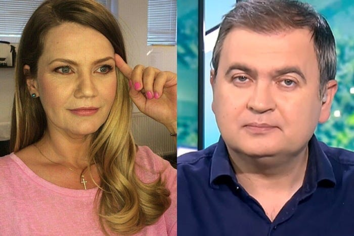

După ce ProArena a decis să renunțe la emisiunea Ora Exactă în sport, oamenii care lucrau acolo își vor vedea de treabă prin alte părți.

[Adică, pe românește, au fost dați afară](https://www.gsp.ro/gsp-special/media/ioana-cosma-mihai-mironica-pleaca-din-trustul-pro-685833.html).

Sau, pe corporatește, sau li s-au propus variante pe care aceștia nu le acceptă, așa că pleacă ei.

[Ca om care a trecut prin situația asta](https://www.cameravar.ro/plecare-beldie-sport-ro), probabil că știu ce simt unii dintre ei.

Dar nu despre simțire este textul acesta.

Sau nu despre acel tip de simțire.

Chiar din contră.

## Măcar o dată la un deceniu ai dreptul să te bucuri

Pentru unii oameni, viața este grea și nu le oferă prea multe satisfacții.

Prin urmare, să te bucuri de răul altuia este o chestiune nu doar firească, dar și necesară în acest context.

Mai mult, bucuria în cauză ar trebui să fie intensă, pentru că pot trece ani de zile între evenimente de acest gen.

De exemplu, eu și Marius Chican am fost dați afară de la sport.ro (actualul ProArena) prin 2014. Au trecut aproape 9 ani de atunci.

Suficienți cât unii să uite bucuria măruntă a acelor zile, iar alții să se-ntrebe îndreptățit: "Bă, dar Lipovan pe unde mai este?".

În fine, trebuie să fii de-a dreptul hain să le furi oamenilor bucuria clasică din aceste momente. Din fericire, există Facebook sau zone de comentarii pe site-urile de sport și cei triști din reflex au posibilitatea să sărbătorească.

## Foarte important: fii total pe lângă subiect

Unii au impresia că atunci când deschizi gura / scrii ceva, trebuie să știi despre ce vorbești.

Ceea ce este fals în cazul unor ziariști.

Prin urmare, de ce ai avea această pretenție de la oamenii care doar urmăresc presa sportivă?

Dacă vrei să te bucuri cu adevărat de momentul concedierii unor ziariști sportivi, indiferent că se numesc Mironică sau Ioana Cosma sau Dan Ionescu sau mai știu eu cum, fii pe lângă subiect.

[Bag-o pe aia cu banii de la Gigi Becali.](https://www.cameravar.ro/spaga-presa-sportiva)

Ignoră istoricul confruntărilor acestuia cu Mironică și bag-o pe aia cu "și-au luat suficientă telemea, bla-bla".

Nu te chinui să faci glume bune. Pe de o parte pentru că nu poți, pe de altă parte pentru că un astfel de efort fură din farmecul situației.

Tu vrei să te distrezi, nu să te chinui.

## La fel de important: crezi în varianta că vor muri de foame

După ce bați câmpii cu Becali și șpaga, bucură-te pe tema eșecului lor profesional total.

Cine naiba îi mai angajează pe ăștia?

Așa cum ți-am spus în trecut, există puține locuri de muncă în domeniul presei sportive.

[Mai ales dacă vrei să faci emisiuni.](https://www.cameravar.ro/emisiuni-beldie)

Deci poți spera că vor rămâne pe margine.

Și că după ce vor rămâne pe margine, vor începe să moară de foame.

Lent, c-așa se moare de foame și așa se obține mai multă satisfacție de pe urma nenorocirii lor.

Sub nicio formă nu te gândi că un ziarist care a luat salariu + șpagă niște zeci de ani ar putea avea ceva bani. Fii selectiv cu elementele pe care le folosești când privești tabloul de ansamblu.

Repet, nu este despre logică, este despre bucurie.

## Dacă totuși apar în altă parte, nu renunța la bucuria ta

Din păcate, e posibil ca unii dintre cei dați afară să fie ofertați totuși de alte redacții și să te trezești cu ei din nou la TV.

Acesta nu este un motiv să fii dezamăgit.

Concentrează-te un pic pe ceea ce contează: au fost dați afară!

Mai mult, au fost dați afară de la Pro.

Nu te-ncurca în ideea că poate unii dintre ei au preferat să plece singuri, precum șeful departmentului, Ionuț Coandă.

Trebuie să înțelegi că fericirea nu se construiește cu adevăruri reci. Ai dreptul să fii un pic romantic, ai dreptul să înfrumusețezi un pic realitatea.

Vorba ceea, nu lăsa adevărul să strice o veste bună!

În fine, oricând poți considera că cei care i-au angajat sunt niște proști.

Cum ar putea fi indivizii care conduc companiile care-ți fixează zilnic atenția timp de câteva ore?
