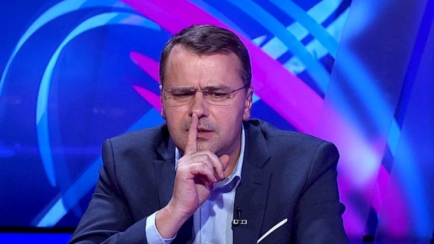

Înainte de toate, două precizări.

Nu am o relație personală cu Vali.

Prin urmare, nu-l cunosc și voi specula destul de mult.

Adică voi face ceea ce, uneori,  facem unii dintre noi atunci când vorbim despre Liga 1 la TV.

În al doilea rând, ca să înțelegi de ce Vali are respectivele reacții, e important să-ți dai silința într-o privință importantă - să încerci să faci abstracție de cât de mult îl simpatizezi sau îl antipatizezi pe Vali Moraru.

Adică-ți cer să faci ceea ce o bună parte dintre ziariști nu reușesc să facă-n cazul lui Adrian Mititelu și-n cazul multor altor personaje din fotbal.

Da, știu, e nedrept.

Dar eu scriu aici despre realitate, nu despre idealul meseriei de ziarist.

Dacă reușești să faci abstracție de acest aspect, atunci vei putea să accepți mai ușor ce-ți voi spune în continuare.

Sau poți să nu accepți.

Nu contează, oricum am dreptate.

## Reacțiile lui Vali Moraru sunt alimentate cu frustrare

Ideea este că majoritatea oamenilor sănătoși la cap au frustrări.

Uuuu, ce urât sună asta!

Sigur că sună urât dacă asociezi ideea de frustrare cu ideea de neputință și atât.

Sau cu ideea de oftică perversă.

Sau mai știu cu ce alte idei.

Așa cum spuneam mai sus, frustrările sunt trăiri absolut firești pentru majoritatea oamenilor sănătoși psihic.

Mai mult, datorită existenței acestor trăiri, omenirea a beneficiat de progrese remarcabile în tot felul de arii.

De exemplu, Edison a făcut acea legendară mie de încercări să inventeze becul alimentat și de o serie de frustrări mai mici sau mai mari.

Frustrarea că nu avea lumină când își dorea.

Sau frustrarea că deși încearca, nu reușea.

Sau frustarea că-n paralel mai erau vreo doi care încercau.

Acum, nu-ți închipui că din frustrarea unor ziariști așezați la o masă se va naște cine știe ce invenție. Ar fi ca și cum eu ți-aș cere ție ca din frustrarea pe care o simți când te uiți la emisiunile de analiză sportivă să se nască leacul pentru cine știe ce maladie.

Ar fi absurd.

Și de fapt, nici nu e nevoie să se nască ceva spectaculos.

Din frustările acelor ziariști se pot naște doar lucruri banale obiectiv vorbind care plac sau nu plac audienței.

Uneori, acele frustrări mărunte sau mai mari nasc întrebări al căror răspuns ai vrea și tu să-l cunoști.

Sau nasc o atitudine pe care ai vrea și tu să o ai față de diverși de prin fotbal.

Alteori, acele frustrări te enervează și mergi pe Facebook sau în zonele de comentarii ale site-urilor de sport și spui că Moraru e un frustrat care nu știe să se poarte cu invitații.

Asta deși ai telecomandă pentru a da de pe DigiSport pe Prima Sport. Sau poți schimba cu totul furnizorul de cablu, cum am tot auzit c-ar fi făcut unii pentru că la Orange Sport ar fi mai puțini frustrați.

Acum, dincolo de frustrările lui Vali și ale altora care moderează emisiuni sau doar ne dăm cu părerea ca specialiști / nespecialiști, mai există ceva.

Trigger-ul.

Adică ce reușește să scoată la suprafață frustrarea omului, a ziaristului în cazul de față.

În cazul de aseară, a fost Adrian Mititelu.

## Care e problema cu Adrian Mititelu și de ce-i scoate din sărite pe unii ziariști

Corect era "de ce-i scoate din sărite pe toți ziariștii", dar am zis să-i las totuși pe câțiva să-l placă pe Mititelu în totalitate.

Bun, care-i problema cu Mititelu?

Sunt mai multe probleme.

### 1. Mititelu are un istoric bogat de prevestiri care nu s-au petrecut

De-a lungul timpului, acesta a aruncat în spațiu public o grămadă de prevestiri care nu s-au vestit. Adică a spus că sigur se vor întâmpla lucrurile într-un fel și s-au întâmplat în alt fel.

Uneori, ceea ce el a spus că se va întâmpla nu s-a întâmplat pentru că a bătut câmpii din start.

Alteori, ceea ce el a spus că se va întâmpla nu s-a întâmplat pentru că adversarii săi au părut să aibă o putere care nu a părut corect exercitată.

### 2. Mititelu își comunică ideile / gândurile de-o manieră care îi lezează pe ceilalți

Ceea ce l-a făcut antipatic pentru unii ziariști a fost modul în care a îmbrăcat tot ceea ce spus.

De multe ori, luptele sale au implicat reacții care i-au dernajat pe ziariștii de sport.

Care ziariști, în caz că nu ți-ai dat seama, suntem o breaslă destul de sensibilă de fel.

De ce?

Pentru că nimeni nu vrea să fie făcut în fel și chip la TV.

De ce?

Pentru că în străfundurile creierului nostru, în zonele de programare maxim primitivă, a te face de râs la TV echivalează cu a te face de râs în fața tribului strâns în jurul focului făcut la intrarea-n peșteră.

Adică animalic vorbind, nu vrem să pierdem statut deși supraviețuirea noastră fizică nu mai depinde astăzi de felul în care ne percep ceilalți.

Poate doar supraviețuirea profesională.

Dar instinctual vorbind, e greu să faci distincție între cele două [chiar și când ai un bun control asupra minții tale](https://beldie.ro/hard-reset/).

### 3. Mititelu are dreptate în anumite privințe deranjante

Alt lucru profund enervant la Adrian Mititelu este că, în anumite "spețe", are dreptate.

Dar nu în orice fel situații.

Nu e vorba de situațiile în care spune că a fost sau nu a fost ofsaid.

E vorba mai ales de situațiile în care ziariștii ori nu se pricep din cauze obiective, ori au fost prea leneși ca să se priceapă.

Sau se pricep prea puțin.

Asta se întâmplă mai ales în chestiuni de natură juridică sau de natură financiară.

În aceste arii, te pricepi ori dacă ai avut sub o formă sau alta tangență cu domeniile respective, ori ai făcut efortul de-a te pricepe cât de cât.

Și chiar și atunci, nu vei fi nici la nivelul unui avocat, nici la nivelul unui economist / finanțist / auditor financiar / contabil etc.

Mai mult, cu mici excepții, nu ve fi nici la nivelul unor personaje pe care, undeva pe fundalul minții tale, e posibil să nu le placi.

Sau chiar să le disprețuiești de-a dreptul.

Adică Mititelu s-ar putea să cunoască mai bine decât aproape toți ziariștii sportivi nu doar legile / regulamentele, dar și nuanțe importante legate de interpretarea lor .

Pentru că de ce, cum ar spune domnul Becali…

Pentru că oameni precum Mititelu, Becali și alții ca ei au depins în viață / afaceri de situații complicate de natură juridică sau financiară mai mult decât a depins vreodată un ziarist sportiv care și-a luat salariul pe 1 și pe 15.

Iar ei, oamenii din fotbal, știu asta.

Toți oamenii din fotbal care au în spate cunoaștere de natură juridică și de natură financiară știu cât se pricep ziariștii și știu instant în momentul unui dialog dacă respectivul are habar ce vorbește sau nu.

Acum, uman vorbind, dacă tu te pricepi bine la ceva și intri într-o dispută legată de acel domeniu cu cineva care nu se pricepe, cum îl vei trata pe respectivul?

Depinde mult de cum ești tu.

Dacă ești un tip rezonabil de fel, îl vei trata cu înțelegere mai ales dacă și interlocutorul are bun simț.

Dacă nu ești un tip rezonabil, îl vei trata cu dispreț pe respectivul chiar dacă acesta manifestă bun simț.

În lumea fotbalului sunt oameni cu atitudine rezonabilă în dialog și oameni fără o atitudine rezonabilă.

Mititelu nu e rezonabil.

Rotaru de la Craiova este.

Becali uneori este, alteori nu este.

Iftime este.

Șucu este.

Angelescu nu este, dar trebuie să fii atent la discursul său ca să-ți dai seama de asta.

Copos era.

Borcea nu era.

Și așa mai departe.

Dar și oamenii din fotbal, oricât de lipsiți de rezonabilitate ar fi, sunt trigger-uiți de multe ori de ziariștii cu care discută.

Care ziariști pot să enerveze ori pentru că nu se pricep la ce vorbesc sau se pricep și deranjează tocmai prin întrebările pe care le adresează.

Acum, în cazul lui Mititelu e ceva aparte.

El se enervează oricum când se simte amenințat de o situație, cum e aceasta în care riscă să piardă meciul cu 3-0.

De exemplu, dacă ar fi acum de față, ar țipa că nu riscă nimic și că nu-nțeleg eu regulamentul.

Reacțiile lui au legătură cu multe lucruri, nu doar cu felul în care-i percepe pe ziariști, indiferent că-s eu sau Vali Moraru.

E vorba și de lucruri care n-au legătură cu fotbalul, ci cu viața sa în general. Cu experiențele sale, cu toate acele dispute în care a fost implicat și chiar cu ceea ce-l face să fie supraviețuitorul suprem din fotbalul nostru.

[Mult mai supraviețuitor chiar și decât Mihai Stoica](https://www.cameravar.ro/mihai-stoica/).

## Apropo, nu-ți închipui că eu n-am frustrările mele…

Cam asta a fost.

Sper să fi fost clar.

Iar dacă n-a fost clar și simți o ușoară frustrare, e foarte bine.

Poate asta te va face să nu mai pierzi timpul cu mine și să progresezi - adică să-l citești pe altul care e mai bun.

Și dacă faci asta, probabil că mă vei scoate ușor din sărite.

Pentru că la rândul meu am diverse frustrări întemeiate sau nu.

De exemplu, mi se pare că sunt un invitat mult mai bun decât alții care au un statut superior.

Ca dovadă, în ultima emisiune de la DigiSport, am insistat că [televiziunile greșesc atunci când aduc drept analiști oameni care-s angajați ai unor cluburi](https://www.cameravar.ro/televiziuni-sport-analisti-liga1/).

Că aceștia nu sunt obiectivi (spre deosebire de mine, bineînțeles).

Că aceștia nu fac altceva decât să apere interesele cluburilor atât pe banii acestora, cât și pe banii televiziunilor. Și că ce aduc bun în emisiuni este insuficient raportat la costul de integritate pe care și-l asumă astfel televiziunile.

Și că cine vrea obiectiviate nu o va obține de la angajați ai cluburilor care apar ca analiști la DigiSport, Prima Sport, Orange Sport etc.

Am dreptate?

Sigur că am dreptate.

Dar dincolo de dreptate, reacția mea a fost alimentată destul de probabil și de frustarea mea că nu sunt mai bine văzut.

Ceea ce poate părea oarecum paradoxal având în vedere că eu nu trăiesc din banii niciunui angajator, deci n-am probleme de supraviețuire.

Dar, așa cum ți-am spus mai sus, toți avem mai mult sau mai puțin dezvoltată dorința de-a fi bine văzuți.

Ca nu cumva să fim dați afară de lângă foc și să petrecem iarna pe cont propriu.

Mai ales c-a nins zilele astea.
