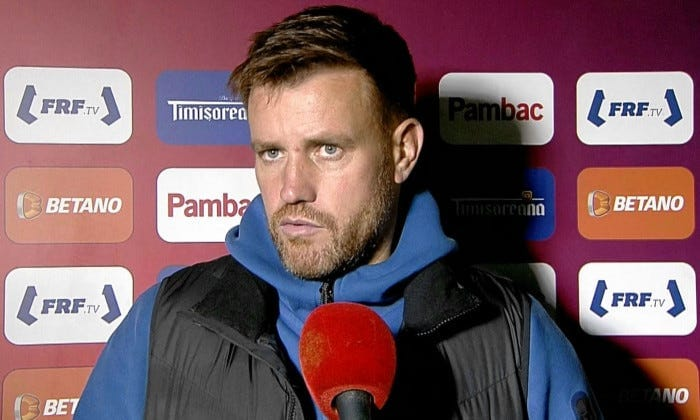

După ce LPF l-a desemnat acum două etape antrenorul rundei și după ce FCSB a ajuns să conteze în lupta pentru titlu, te poți întreba asta.

Cum ar fi dacă FCSB ar câștiga titlul cu Pintilii antrenor?

Înainte de orice, un pic de context...

De fiecare dată când Becali a numit un antrenor care nu era antrenor după standardele obișnuite, m-am surprins având gânduri penibile din categoria "sper să piardă și să se sature de prostiile astea".

Sigur, nu am amestecat aceste dorințe personale în munca mea.

Ce am contestat eu a fost doar [ideea de-a aduce antrenori fără experiență la o echipă care are obiective înalte + jucători de crescut](https://www.cameravar.ro/pintilii-fcsb-avantaje-dezavantaje).

Deci am contestat strategia clubului.

Totuși, realitatea este că aceste idei au existat și am făcut un oarecare efort să le țin la respect.

În fine, de ce cred că am gândit așa?

Nu pentru că țin cu o altă echipă sau alte prostii de genul acesta.

Ci pentru că ceea ce face Becali reprezintă un atac asupra logicii fotbalului înțeles de mine.

Adică, într-un fel, m-am simțit eu atacat.

[Am simțit că e atacată logica mea](https://www.cameravar.ro/fcsb-dezamagire).

Normal, m-a pufnit râsul de câte ori am avut astfel de idei, dar tot le-am avut. Ca și când contează ce-mi place și ce nu-mi place mie în raport cu realitatea.

De ce-ți spun aceste lucruri?

Ca să-nțelegi că ceea ce urmează în continuare vine din tot din mintea celui căruia nu-i convine că se întâmplă astfel de lucruri.

## Ce ar trebui discutat neapărat legat de carnetul de antrenor și licențe

În primul rând, cred că discuția corectă legată de licențiere nu este de ce antrenează unii fără carnet de antrenor și fără licență.

Discuția corectă este de ce există acest proces complex de licențiere a antrenorilor?

"Așa e legea!", îți spun mulți.

Sigur, așa e legea.

Dar legile nu sunt mereu făcute în interesul breslelelor pe care le guvernează.

De ce meseria de antrenor a fost capturată birocratic prin intermediul unor procese complicate de licențiere?

De ce legea românească impune deținerea carnetului de antrenor pentru a fi antrenor?

Teoretic, necesitatea carnetului de antrenor și a unui proces complex de licențiere a antrenorilor care vor să antreneze la nivelul Ligii 1 reprezintă profesionalizarea domeniului.

Sună serios, nu?

Da, sunt sintagme pe care oamenii le înghit doar pentru că diverși mânuitori ai limbii de lemn sau diverși birocrați le-au impus în spațiul public.

În realitate, meseria de antrenor n-ar trebui să fie nici pe departe atât de îngrădită.

De ce?

Din două mari motive:

1. **nu este genul de meserie care implică riscuri majore, precum se întâmplă în prestarea de alte servicii - de exemplu - servicii medicale sau pilotaj sau avocatură etc.**
2. **industria fotbalului / piața este capabilă să cearnă singură antrenorii. Chiar aș zice că piața cerne de-o manieră de-a dreptul sălbatică: ai rezultate, primești oferte / nu ai rezultate, nu primești oferte.**

Prin urmare, un domeniu fără niciun fel de risc, care este autogestionat de fapte (rezultatele antrenorilor) este totuși încălecat legislativ și regulamentar de un colos al poftei de reglementare (**Statul**) și o instituție la fel de lacomă în domeniu (**Federația Română de Fotbal**).

De ce fac lucrul acesta?

Statul o face de obicei din reflex.

Asta e filosofia sa de existență - legiferez orice ca să pot controla orice. E foamea de putere supremă a unei instituții care teoretic ar trebui să fie în slujba noastră, dar se află în slujba sa.

Federația Română de Fotbal o face însă mult mai aplicat pentru că regulamentele sale se nasc din interacțiunea directă cu fotbalul.

Spre deosebire de legea statului român care impune necesitatea carnetului de antrenor și care a fost dată ca să controleze toți antrenorii de la toate disciplinele, Federația s-a aplecat doar asupra domeniului său.

Așa cum a făcut-o și cu alte ocazii, uneori făcând bine cu forța (regula jucătorului sub 21 ani), alteori exagerând de-a dreptul (impunerea echipelor feminine).

Mai mult, de parcă aberația impunerii unor reguli exagerate n-ar fi de ajuns, nu există absolut nimeni care să lupte organizat împotriva acestei stări de fapt.

Adică, antrenorii n-au un sindicat al lor și, chiar dacă l-ar avea, probabil că ar fi mai degrabă în slujba celor care au deja licențe și nu în slujba celor care vor să profeseze fără.

O speranță teoretică ar trebui să vină din partea AFAN, organizația sindicală a fotbaliștilor. Ei sunt cei mai afectați de faptul că pentru a deveni antrenor la Liga 1 îți trebuie ani de școală ca-n cazul profesiei de medic.

Doar că și AFAN ar trebui să conteste ceva ce iau de bun - legea zice că-ți trebuie carnet de antrenor ca să antrenezi. Apoi, regulamentul fotbalistic spune că în funcție de nivelul la care antrenezi, îți trebuie diverse licențe.

## Dacă Pintilii câștigă titlul, se confirmă că unii antrenori chiar se “nasc”

Dacă Pintilii ar câștiga campionatul cu FCSB, atunci ceea ce spun eu ar fi confirmat de-o manieră mai mult decât evidentă.

Nu e nevoie să ai carnet de antrenor și licențe ca să prestezi o meseria de antrenor.

O poți face și fără.

Sigur, Pintilii nu vine de pe stradă ca să zic că s-a născut antrenor.

E din fenomen, a jucat fotbal și înțelege anumite lucruri.

Sigur, aproape toți antrenorii spun că e diferență între ce credeau că e meseria asta când jucau și ce a fost după ce s-au apucat să o presteze.

[Dar tot ar trebui să existe libertatea cluburilor să aleagă](https://www.cameravar.ro/garantare-salarii-drepturi-tv-eroare).

Atenție la nuanță.

Nu e nevoie ca Pintilii să ia titlul ca acest lucru să fie adevărat.

Doar că dacă Pintilii ia titlul, acest lucru nu e doar adevărat, ci de-a dreptul evident.

Vor veni diverși și vor spune ceea ce am gândit și eu - "Da, dar Pintilii are la dispoziție un lot în care s-au investit sume uriașe pentru nivelul Ligii 1".

Da, corect.

Doar că e vorba de decizia unui club de-a-și risca succesul, inclusiv cel financiar. Ar trebui lăsați să facă ce doresc.

Da, școala te poate face bun sau mai bun.

Dar poți reuși poți reuși și fără atât de multă școală pe cât impun statul român prin lege și FRF prin regulamente.

Repet, ceea ce vedem acum în antrenorat este o formă de control a unor instituții lacome de putere. Atâta tot.

Unii vor zice "așa e și afară". Și dacă eu spun că "afară poate fi la fel de greșit", voi părea automat antieuropean sau radical sau mai știu eu cum.

Dar nu spun că afară e greșit.

Spun că afară nu e chiar la fel.

Că legea care impune carnetul de antrenor în România nu este afară, cel puțin nu în campionatele serioase.

Legile și regulile sunt făcute ca să fie respectate, dar asta nu le face nici morale, nici etice, nici bine gândite.

Le face doar instrumente de coerciție în tot felul de situații.

Câteodată e bine, câteodată e rău.

În cazul poveștii cu carnetul de antrenor + licențele tehnicienilor din România legile și regulamentul sunt aberante.

Lipsite de logică profundă și pline de control birocratic.
