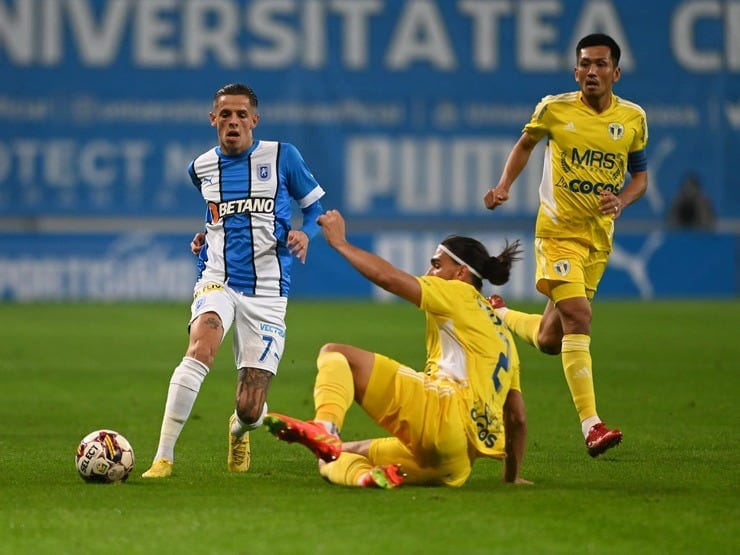

Din când în când, scriu lucruri care dau impresia că mă pricep foarte bine la fotbalul din Liga 1.

Ceea ce este cât se poate de adevărat.

Mai ales dacă nu te uiți la toate nuanțele predicțiilor mele și le elimini cu totul pe cele în care m-am înșelat zdravăn.

Mai jos ai câte un exemplu din fiecare categorie.

Cu precizarea  că varianta în care am avut doar parțial dreptate poate fi totuși trecută lejer la capitolul succese, iar cea în care m-am înșelat nu e o anticipare  pierdută definitiv.

Bun, încep cu ce-mi convine: am anticipat corect o parte a ceea ce se întâmplă acum la Craiova. De ce doar o parte?

Vei înțelege în continuare.

## 1. Am fost probabil singurul care a spus că marea problemă a Craiovei este evaluarea corectă a lotului

[În texte succesive](https://www.cameravar.ro/marea-problema-a-lui-radoi), i-am menționat pe Papp, Nistor și Căpățână la capitolul jucători buni, care totuși oferă prea puțin. Și i-am dat exemplu pe Hanca, Martici, Vână și Rivaldinho la capitolul jucători care-n opinia mea sunt clar sub nivelul pretențiilor clubului.

Cazul Câmpanu este unul special. Oferă puțin, dar e încă un fotbalist tânăr care poate fi vândut la un moment dat pe o sumă de bani OK.

Sigur, eu aș încerca să-l vând azi, dacă ar exista ceva de ordinul sutelor de mii de Euro, dar eu n-am vândut în viața mea vreun jucător.

În fine, deși am spus că la Craiova e necesară o remaniere deșteaptă, corectă și masivă a lotului, m-am îndoit că cei de acolo o vor face.

De ce?

Pentru că astfel de mișcări sunt, de obicei, scumpe - e greu să scoți oameni din contract fără să plătești. Faptul că Arlauskis a plecat fără nicio pretenție suplimentară este o minune.

Altfel, clubul trebuie să facă niște cheltuieli imediate usturătoare. Sigur, așa cum am spus la vremea respectivă, pe termen mediu, pierderea de acum va fi compensată de economiile ulterioare și de șansa de-a crește sportiv.

## 2. Am explicat limpede ce a greșit Rădoi la Craiova, lucru confirmat ulterior de club

Unele dintre ideile mele s-au bazat pe ce spusese deja Mihai Rotaru, dar altele au reprezentat lucruri pe care întâi le-am scris eu, iar ulterior le-a confirmat și patronul Craiovei.

Inclusiv chestii aparent mărunte - ex. [modul în care Rădoi a gestionat meciul cu Rapid](https://www.cameravar.ro/radoi-explicarea-demisiei/), în care echipa lui Mutu a egalat deși oltenii au avut la un moment dat 2-0 pe Giulești.

De asemenea, am evidențiat faptul că atitudinea publică a lui Rădoi este ceva ce irită clubul oltean. Pur și simplu, acolo există o sensibilitate majoră față de orice ar putea produce o imagine necontrolată de club.

Observi nuanța?

N-am spus o imagine negativă.

Am spus o imagine dincolo de controlul clubului. Asta pentru că deși în majoritatea cazurilor e vorba de lucruri care fac rău imaginii clubului, se poate întâmpla ca și chestiuni beningne pentru club să fie sancționate de acesta.

## 3. Am vorbit despre necesitatea ca Mihai Rotaru să-și asume direct conducerea clubului

Atunci când am vorbit de erorile făcute de Mirel Rădoi la Craiova, am vorbit și despre erorile pe care le face patronul clubului.

Printre acestea, au fost și faptul că acordă credit fotbaliștilor de care clubul se desparte acum și că a prins clubul în contracte cu aceștia.

Dar și faptul că nu rezolvă limpede problema legată de cine conduce cu adevărat clubul.

Că alege să aibă o atitudine greșită în relație cu suporterii când apare la TV și spune lucruri din categoria “nu am știut, acum aflu și eu. Voi cere mai multe detalii de la colegii mei”.

Chiar dacă ar fi fost adevărat că nu era la curent, nu era credibil.

De asta, am scris despre necesitatea ca Rotaru să aleagă ori pune conducător pe cineva care să fie perceput drept conducător, ori își asumă el direct conducerea.

Și-a asumat-o el.

## 4. Am spus la Digi Sport, după meciul Botoșani - CSU Craiova, că ieșirea isterică a lui Arlauskis îl poate costa contractul

Și l-a costat.

Gafa de la meciul cu Farul nu a fost decisivă, a fost doar o confirmare suplimentară pentru club.

Probabil că au contat și alte lucruri, dar eu sunt convins că modul în care Arlauskis s-a comportat după acel meci a contat major.

Mai ales că, așa cum am spus mai sus, clubul are această sensibilitate față de orice înseamnă imaginea sa.

E firesc până la urmă având în vedere și situația specială care este la Craiova, cu un rival în propriu oraș care râvnește la același bazin de suporteri.

## În schimb, am bătut câmpii până acum legat parcursul Petrolului

Cred că de vreo 4-5 ori am spus la Digi Sport că-n opinia mea, Petrolul va fi una dintre echipele care se va bate să scape de retrogradare.

Am început să o spun de când se afla pe primele locuri și am tot continuat să insist asupra acestei idei.

Argumentul meu a fost mereu că lotul este sub nivelul rezultatelor.

Da, știu, sună cumva ilogic, dar asta cred și acum.

Că au obținut mai mult decât le permitea valoarea individuală a jucătorilor pe care i-au rulat de-a lungul acestui sezon.

Și că de fapt, Nicolae Constantin a fost un antrenor excelent pentru ei.

Totuși, chiar dacă Petrolul a trecut printr-o perioadă mai grea recent, realitatea este că sunt încă în față și chiar dacă eu nu cred în varianta ca ei să prindă play off-ul,  mai ales matematica arată că acest lucru e posibil.

Acum, lotul lor a fost ușor întărit, iar clubul afirmă că au început să plătească din restanțele față de jucători.

[Iar suporterii le sunt aproape, cu bune și cu rele.](https://www.cameravar.ro/fani-nocivi-petrolul)

Acum, dacă ții cu Petrolul, posibil să crezi că am ceva cu echipa ta.

Nu-mi place faptul că [Petrolul a fost iertată de retrogradare după ce a încercat să mituiască un arbitru](https://liga2.prosport.ro/seria-1/flagrant-cu-un-oficial-al-clubului-petrolul-dand-mita-catre-arbitrul-meciului-cs-mioveni-aerostar-reactia-clubului-ploiestean-19176260). Caz clasic de corupție sancționabil cu retrogradarea. Nu există absolut nicio rațiune regulamentară pentru care să se-nchidă ochii.

Faptul că Petrolul se află acum în Liga 1 este o chestiune incorectă.

Totuși, oricât ți s-ar părea de improbabil, nu amestec lucrurile.

Faptul că eu cred în continuare că Petrolul va avea emoții legate de retrogradare în acest sezon ține doar de felul în care văd eu valoarea lotului și [problemele financiare ale clubului](https://www.gsp.ro/fotbal/liga-1/petrolul-ploiesti-cesionare-drepturi-tv-superliga-688065.html).

Dacă mă-nșel, mă-nșel.

Voi vorbi mai mult despre situațiile în care am dreptate.
