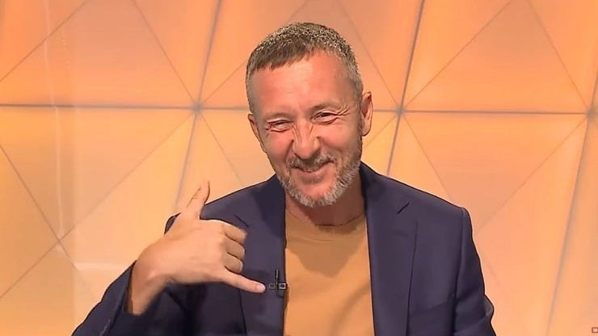

[După ce-am scris aici](https://www.cameravar.ro/de-ce-tipa-vali-moraru-invitati/), vei crede că-s lipsit de obiectivitate în această poveste.

Am o veste pentru tine: am o obiectivitate limitată în absolut toate lucrurile pe care le spun / scriu.

Marea mea calitate este însă că-n ciuda faptului că obiectivitatea totală este imposibilă pentru oricine, eu sunt unul dintre cei care-și dau silința să fie cât mai obiectivi posibil.

Și, de multe ori, îmi iese într-o măsură respectabilă.

De ce mă laud atât?

Dincolo de faptul că am motive, e important pentru ceea ce voi încerca să explic în acest text.

Momentan, o lămurire - de ce televiziunile de sport aduc ca analiști inclusiv oameni care sunt deja angajați la cluburile din Liga 1?

## Televiziunile oferă contracte unor analiști angajați ai cluburilor pentru că e ușor

Da, e foarte ușor.

Gândește-te un pic...

Scopul general al televiziunilor este să facă bani.

Știu, nu pare ceva glorios din perspectivă jurnalistică, dar nu-ți închipui că misiunea unei televiziuni comerciale este doar jurnalismul.

Inclusiv când respectă toate standardele profesiei, televiziunile tot trebuie să facă bani indiferent dacă e vorba de televiziuni clasice sau de posturi ale cabliștilor.

Inclusiv televiziunea publică ar fi mai sănătoasă dacă ar avea inclusiv o menire legată de profitabilitate.

În fine, televiziunile clasice chiar trăiesc de pe urma reclamei din timpul programelor emise, iar cele arondate firmelor de cablu trăiesc și din reclame, și de pe urma abonamentelor pe care compania le vinde vehiculând inclusiv prezența posturilor de sport în grilă.

În cazul acestora, profitabilitatea lor este ceva mai greu de calculat, dar de vreme ce continuă să existe, probabil că au oameni care reușesc să vadă lucrurile în esența lor și să se lămurească dacă fac sau pierd bani cu aceste stații.

Bun, dacă scopul televiziunilor este să facă bani, atunci trebuie să creeze audiența potrivită pentru asta.

Audiența potrivită nu înseamnă automat doar public numeros (deși de cele mai multe ori chiar asta e), ci și public cu un anumit specific - caracteristici. De exemplu, unele televiziuni pot vinde reclamă la produse / servicii care se adresează bărbaților cu vârsta cuprinsă între 18 și 49 ani.

Altele pot avea alt public țintă.

Dar toate trebuie să vândă ceva.

Inclusiv când e vorba de televiziuni care sunt atât de afiliate politic încât nu par să țină cont de chestiuni comerciale, tot vând ceva - idei, manipulări etc.

Ei, în acest context în care televiziunile au nevoie de personaje relevante pentru cei pe care vor să-i atragă în fața televizoarelor.

Lucrul acesta se sărută cu nevoia unor cluburi de-a încerca să influențeze prin discurs desfășurarea competiției.

Această aparentă potrivire de interese face ca un contract între o televiziune și un oficial al unui club să fie ușor de semnat.

Televiziunea poate spune că-și premiază publicul cu  analiști din cel mai profund interior al fenomenului, iar angajatul clubului poate spune angajatorului său principal că se duce să lupte pentru club.

Televiziunii îi place ideea.

Clubului îi place ideea.

Analistului îi place ideea și se bucură de faptul că ia bani din două părți făcând o chestie care-i place.

Știu că am zis de prea multe ori "place", dar a fost necesar ca să pot evidenția ușurința unei astfel de colaborări.

Vorba ceea, ce e plăcut este și ușor.

## Care este atunci problema cu astfel de colaborări între televiziuni și angajații cluburilor

Dincolo de invidii mărunte ale celor care suntem doar ziariști și, automat, avem un statut inferior în ochii unora dintre televiziuni, mai e ceva.

Problema este că acești angajați ai cluburilor care prestează și ca analiști în emisiunile dedicate Ligii 1 pervertesc ideea de analiză obiectivă.

Ai observat ce alt termen se repetă?

Obiectivitate.

Adică mai sus am spus că eu însumi nu sunt obiectiv, iar mai jos acuz că acești invitați nu sunt obiectivi.

După ce am recunoscut că uman vorbind nimeni nu este obiectiv de-o manieră perfectă.

Deci sunt ipocrit?

Nu, nu sunt.

Diferența este că [eu îmi dau silința să fiu obiectiv](https://www.cameravar.ro/relatii-ziaristi-oameni-din-fotbal) pentru că este una dintre puținele forme de valoare pe care le pot aduce în emisiune.

Nu am fost fotbalist important, nu am experiență în administrarea vreunui club, nu am antrenat pe nimeni.

Sunt Beldie și atât.

Sau Beldie Sunt.

Adică un ziarist care se uită la toate meciurile din Liga 1 și își dă silința să fie obiectiv.

În schimb, analiști precum Mihai Stoica, Gică Popescu, Daniel Stanciu și oricare alții care sunt și angajați ai cluburilor nu au interesul să fie obiectivi de vreme ce ei sunt plătiți de cluburi să le apere interesele.

De asta, indiferent că e vorba de oameni care din reflex nu-și vor propun vreodată obiectivitatea - Mihai Stoica la Orange Sport, sau oameni care au în trecutul lor exercițiul obiectivității jurnalistice - Daniel Stanciu la Digi Sport, realitatea este că  ceea ce spun în emisiunile legate de Liga 1 va fi alterat de interesele cluburilor lor.

Atenție, nu am spus că ceea ce spun n-ar fi interesant pentru public.

Am spus că va fi viciat.

Chiar dacă există situații în care analiștii din această categorie dau dovadă de fair play și au un comportament neașteptat în lumea fotbalului românesc, acestea reprezintă excepții.

Regula este ca aceștia să apere întâi interesele clubului și abia apoi să ofere obiectivitate dacă a mai rămas pe undeva.

De asemenea, în ciuda credinței televiziunilor că acești oameni pot să ofere informații valoroase în emisiuni, te asigur că dacă interesul clubului lor nu este să ofere o informație aparte, nu o vor face.

În mare, aceștia se limitează la două categorii de informații: informații / comentarii pe care au interesul să le ofere și informații / comentarii pe care le oferă pentru că pur și simplu le place fotbalul.

În rest, liniște și pace.

Dacă nu crezi, gândește-te un pic ce diferență era între prestațiile lui Duckadam de pe vremea când încă era plătit de Becali și cele actuale. Astăzi, fostul mare portar al Stelei este un invitat mult, mult mai bun din toate punctele de vedere.

## Cum este afectat publicul de alegerile televiziunilor de-a avea "analiști sub acoperire".

E foarte greu de cuantificat cu acuratețe așa ceva.

Pot să fac referire la chestiuni ce țin în general de bunul simț jurnalistic.

De exemplu, ideea de conflict de interese viciază întotdeauna ideea de obiectivitate jurnalistică.

Acum, nu toate televiziunile își doresc obiectivitate jurnalistică sau nu toate fac o prioritate din asta.

De ce?

Pentru că în cazul unora dintre ele, oamenii de decizie nu au nicio treabă cu meseria de jurnalist. Sunt mai degrabă oameni de afaceri, contabili, finanțiști, manageri de resurse umane etc.

Prin urmare, ei se vor uita mai degrabă într-un excel care le oferă rezultate imediate precum audiența sau încasările și abia apoi se vor gândi dacă ce produce postul din perspectiva conținutului este sau nu OK.

Sau vor spune că e OK ce face bani și nu e OK ce nu produce bani.

Ceea ce poate fi corect dacă vrei să exiști în continuare pe piață.

Pe de altă parte, asta nu înseamnă că dacă joci jocul acesta corect și ții cont de principii jurnalistice nu poți face bani.

Eu, care nu am responsabilitatea lor pot vorbi despre faptul că emisiuni credibile pot fi mai profitabile pe termen mediu și lung decât emisiuni în care diverși angajați ai cluburilor își servesc angajatorul principal.

O parte a publicului este oricum sătul să ne vadă inclusiv pe unii dintre noi, ziariștii, scăpând uneori hățurile și comportându-ne ca și cum servim la rândul nostru interesele unor cluburi.

Sigur, asta nu se întâmplă atât de des pe cât cred cei mai vocali telespectatori, dar se întâmplă. Sau dacă se întâmplă des, e vorba de un număr limitat de ziariști care calcă aiurea.

Dar când dublezi aceste scăpări cu prezența în studio a unor analiști care în mod evident nu sunt obiectivi, automat scazi nivelul de încredere în ceea ce se întâmplă pe ecran.

Gândește-te un pic ce impresie ți-ar provoca un ziarist despre care știi că ia șpagă. Adică îl vezi vorbind despre diverse lucruri legate de echipa ta, dar știi că ia șpagă de la adversarul echipei tale.

Analiștii care sunt și angajați ai cluburilor nu au absolut nicio problemă de etică. Nu sunt plătiți pe ascuns de cluburi.

Dar sunt plătiți.

Ceea ce îi face, repet, nedornici să fie obiectivi. Exact ca niște ziariști care iau șpagă.

Știu, sună exagerat, dar eu vorbesc de rezultatul final al prestației lor, nu că ar avea o problemă de caracter, cum au șpăgarii din presă.

Și dacă nu e încredere, probabil că pierzi bani.

Nu mă pricep, dar bănuiesc că o companie de cablu care a crescut de la o firmă de cartier la un gigant național poate spune mai multe despre cât contează încrederea oamenilor în ceea ce le vinzi.

Glumesc, mă pricep suficient cât să spun că presa nu are o problemă de finanțare, cum încearcă mulți să ne spună direct sau indirect. Presa are deja o mare problemă de credibilitate.

În unele cazuri, pare cumva nedrept că trăim așa ceva - de exemplu, când toți ziariștii sunt băgați la grămadă doar pentru că un număr limitat își bat joc de meserie.

În altele, ne merităm cu vârf și îndesat soarta - de exemplu, când societățile care administrează economic redacțiile primesc ajutoare de la stat pentru că statul înțelege rolul presei și vrea să o salveze :))

Adică să-i creeze reflexul obiedienței în situații dificile.

## De ce-mi permit să vorbesc / scriu despre astfel de lucruri?

Oare nu se va supăra cineva de la Digi Sport că am zis ce-am zis și oare nu voi fi dat afară?

N-am zis doar de Digi Sport, am zis de toate televiziunile care  apelează la practica angajării de analiști care-s deja oamenii cluburilor din Liga 1 - asta face și Orange, asta face și Prima Sport.

În plus, adevărul este că ce fac eu nu reprezintă vreun act de eroism.

Din fericire pentru mine, nu depind de nimeni și pot să vorbesc vrute și nevrute, chiar cu riscul de-a pierde colaborări.

Ceea ce mă-ndoiesc să se întâmple.

Oriunde am lucrat / colaborat, m-am bucurat de libertate totală - Prosport / Gazeta Sporturilor, Telesport, Sport.ro (ProArena), Hotnews, Digi Sport.

Mai mult, indiferent de situație, sigur rămân cu plăcerea că-mi dau silința să fiu obiectiv în tot ceea ce scriu / vorbesc despre Liga 1.