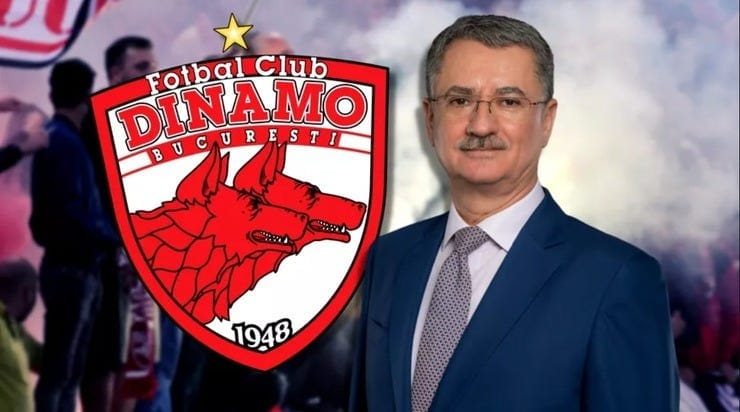

După ce Eugen Voicu și Andrei Nicolescu au preluat controlul la Dinamo, au apărut tot felul de reacții.

În mod aproape firesc, cele mai vocale sunt ale celor dezamăgiți.

Că noii acționari nu bagă bani.

Că noii acționari nu au bani oricum.

Că noi acționari sunt la fel ca cei vechi.

Că noii acționari au un limbaj prea corporatist.

Că nu s-a schimbat de fapt nimic și că Dinamo va muri.

Ceea ce-mi aduce aminte de [Glossă, a lui Eminescu.](https://ro.wikisource.org/wiki/Glossă)

Nu te lăsa păcălit, nu știam cum se numește exact respectiva poezie, am căutat pe Google ca să-i dau titlul aici.

Simplu fapt că cineva face trimitere la chestii care trădează cine știe ce cunoaștere nu înseamnă că respectiul e și un bun deținător al respectivei cunoașteri.

La fel e și cu unii dintre fanii lui Dinamo - deși știu anumite chestiuni, nu le știu suficient de bine.

Sau ce știu amestecă cu ce nu știu.

Nu c-ar avea vreo datorie să știe, [cum e cazul ziariștilor](https://www.cameravar.ro/de-ce-tipa-vali-moraru-invitati/), de exemplu.

Doar că soarta clubului depinde de ei și de susținerea lor așa cum depinde într-un final soarta tuturor cluburilor.

## De ce sunt unii dezamăgiți de noul acționariat de la Dinamo

Unele lucruri țin de realitate, altele țin de concepții ale fanilor care sunt dezamăgiți.

Când vine vorba de realitate, e firesc să ai rețineri să mai crezi în cai verzi pe pereți după ce te-ai ars cu Cortacero.

Mai ales că atunci, căderea a fost de la o mare înălțime.

Nu doar speranțele au fost sus, dar și primele fapte ale spaniolilor au fost în acord cu aceste speranțe - jucători cu nume, antrenor cu nume, conducere cu nume care sună bine, chiar și un pic de fotbal spectaculos.

Adică fanii lui Dinamo n-au fost precum bleguții aceia de la Rapid care se bucurau că [a plecat Copos și au venit Zamfir cu Cristescu](https://www.digisport.ro/fotbal/liga-1/s-au-semnat-actele-sefi-noi-la-rapid-dupa-20-de-ani-zamfir-si-cristescu-au-preluat-clubul-60610).

Adică se bucurau că a plecat deținătorul Athenee Palace Hilton și a venit deținătorul Hanului Vlăsia :))

Dar dincolo de realitate, vine și ceva ce ține de irealitate.

Mai exact, concepția despre viață și fotbal a unor suporteri.

Sau despre viață, bani și fotbal, ca să fiu ceva mai cuprinzător.

Care e uneori asemănătoare cu concepție despre viață, bani și fotbal a unor ziariști sportivi.

Că și ei sunt oameni.

[Era să zic că și ei sunt suporteri](https://www.cameravar.ro/relatii-ziaristi-oameni-din-fotbal), dar nu vreau să fiu răutăcios cu mine însumi.

În fine, mulți dintre cei interesați de fotbal - suporteri, ziariști, jucători, antrenori și oameni din executivul cluburilor cred că datoria unui patron este să investescă.

Să bage bani.

Sigur, faptul că bagi bani nu este mereu suficient.

Ar trebui să bagi bani, să obții rezultate, să premiezi bine pe toată lumea, să oferi satisfacții inclusiv unor [influensării de peluză îndrăgostiți de puterea pe care o au](https://www.cameravar.ro/fani-nocivi-petrolul) și, la final, să pierzi un pic.

Nu mult.

Să pierzi cât să nu poți spune că ai ieșit pe zero.

Că dacă ieși pe zero, n-ai pierdut.

Și care mai e farmecul tău, om bogat, dacă nu pierzi ceva pentru satifacția celor care te judecă?

Ei, din combinația aceasta de realitate și irealitate, se poate naște multă dezamăgire.

Mai ales că scenariul actual de la Dinamo este departe de scenariul ideal pe care l-ar fi putut trăi Dinamo.

Mai exact...

## Ce ar trebui să înțeleagă suporterii lui Dinamo despre situația actuală a clubului

În cazul Dinamo, situația ideală ar fi fost următoarea.

Un domn care avea bani să preia clubul, să plătească instant o bună parte din datorii, să scoată societatea din insolvență și să se asigure că echipa promova la finalul sezonului în curs.

Sau dacă nu se putea din rațiuni obiective la finalul sezonului în curs, măcar să se vadă că la anul vor defila.

Să facă investiții în continuare pentru modernizarea bazei Săftica, inclusiv să cumpere ce poate cumpăra în zonă ca să-i crească dimensiunile. Atenție, asta era o chestiune importantă - nu subestima efectul grandorii asupra psihicului multora dintre cei care ținem cu o echipă de fotbal.

În fine, să facă lucrurile astfel încât să ofere cele mai importante două satisfacții pentru o bună parte a fanilor oricărei echipe din România: clubul să aibă rezultate, iar patronul să piardă niște bani.

Nu repet întâmplător ideea asta cu pierdutul de bani.

Nu cunoști fotbalul românesc și mentalitățile unor suporteri, ziariști, fotbaliști și conducători de club dacă ignori partea cu pierdutul banilor de către patron.

Rezultatele și banii pierduți, măcar puțin, sunt absolut esențiale.

Dacă nu sunt rezultate, iar patronul nu pierde măcar un pic, de ce să mai ții cu o echipă din România?

Găsești pe afară o grămadă de cluburi care au și rezultate, și profit pentru acționari.

În fine, revin la realitate.

Adică la faptul că scenariul ideal nu s-a produs.

În schimb, s-a produs un scenariu care din perspectiva bunului simț poate fi OK. Nu am de unde să știu dacă va fi sau nu pentru că nimeni în afară de Dumitru Dragomir nu știe.

În primul rând, cel mai important lucru - clubul există. Asta este ceva mai important decât mulți conștientizează.

Revin la acei fani ai Rapidului care și-au omorât echipa pentru că au vrut ei să fie cool și [să-i arate coliva lui Copos](https://www.digisport.ro/fotbal/liga-1/video-surpriza-la-iccj-fanii-au-venit-cu-coliva-si-au-cerut-inchisoare-pentru-copos-53258) când acesta se afla în cel mai de jos moment al vieții sale.

Sau la acei fani ai Petrolului care și-au omorât finanțarea crezând că e mai important să conteze părerile lor decât cele peste 2 milioane Euro pe care Veolia le dădea datorită lui Mădălin Mihailovici.

Existența clubului este condiția esențială ca orice altceva să se întâmple. Inclusiv suporterii există dacă există clubul pe care-l susțin.

Altfel, vom vorbi despre fanii lui Dinamo ca despre cei care s-au întâlnit cu extratereștri la un moment: par convinși de ce spun, dar nu-i bagă nimeni în seamă.

În al doilea rând, clubul are șanse mai mari să existe în continuare decât dacă Dorin Șerdean nu ar fi cedat acțiunile.

Adică e diferența dintre un acționar care a spus limpede că nu poate ține Dinamo și un acționar care caută soluții ca să țină Dinamo.

Sigur, totul e încă la nivel de vorbe, dar vorbele câteodată contează inclusiv când ai de amânat datorii sau de convins fotbaliști să te păsuiască până obții licența.

În al treilea rând, oamenii care au preluat clubul nu au un istoric de țepe în spate. Singurul care a avut tangență cu fotbalul anterior, Nicolescu, nu are la nivel de fapte nimic care să-l facă suspect.

În fine, cei doi acționari au ca misiune atragerea de alți oameni care să finanțeze clubul pe măsura pretențiilor acestuia.

Ceea ce este foarte bine în condițiile de față.

Gândește-te că, în general, cei care au falimentat echipe ori s-au încăpățânat să le țină ei și și s-au sufocat financiar, ori se bazau pe sprijin de la primării și n-a ieșit ce trebuie la alegeri.

La Dinamo, nu e cazul.

Oamenii vor să aducă bani prin intermediul celor care pot aduce bani.

Foarte bine.

Alternativa era să aducă Șerdean, care a încercat și n-a reușit.

Sau să clubul să fie în continuare finanțat de suporteri în condițiile în care DDB a pierdut mult capital de PR în toată această perioadă.

Sau să vină cineva care să plătească datoriile, să scoată echipa din insolvență, să determine aproape financiar promovarea încă din acest sezon, să renoveze Săftica și să-i crească dimensiunile și să piardă ceva bani.

Nu neapărat mulți, cât să nu fie pe zero.

Dar n-a venit.

Așa că între a te plânge superficial că Dinamo a ajuns pe mâna unora care nu pot, mai bine ai un pic de răbdare măcar să vezi ce pot.

**PS1**: am scris textul dintr-o cafenea în care sunt și doi foști jucători ai lui Dinamo. Ambii sunt antrenori acum. Și unul dintre ei este nemulțumit de felul în care arată lucrurile. Ceea ce e firesc, că n-ai avea de ce să fii mulțumit dacă nu ții cont de ce am scris eu mai sus.

**PS2**: ca un simbol al faptului că sunt deja vândut noilor acționari ai lui Dinamo, am manipulat greșit imaginea de la acest text și am pus-o pentru câteva momente wallpaper pentru laptopul meu. Psihanalitic vorbind, Freud și ai lui ar trage niște concluzii grave de aici.
