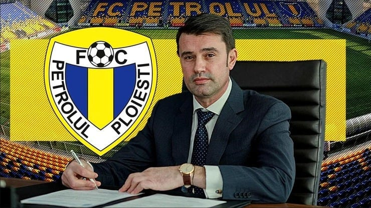

Așa cum există Adidas și adidași, așa există Marian Copilu și mariancopilu. Adică un om care formează de unul singur o categorie de conducător de club.

Ce fel de conducător?

Habar n-am.

Nu știu absolut nimic despre acest om deși acționează la un nivel înalt într-o industrie super expusă, pe care o urmăresc cu aproape toată atenția mea.

Și nu exagerez când spun asta.

În fine, orice scriu despre acesta se bazează pe ceea ce concluzionez ca urmare a spuselor publice rostite de diverși oameni din fotbal.

Stai liniștit, nu voi începe să-i dedic ode precum o serie de foști colaboratori de-ai săi, dar trebuie să remarc ceva: oameni cu profil profund diferit îl apreciază dincolo de obișnuit.

De exemplu, [Șumudică](https://www.cameravar.ro/sumudica/) și Edward Iordănescu.

Dacă erau doar Șumudică și Dumitru Dragomir, râdeam și râdeam.

Dar e și actualul selecționer, e și un fotbalist precum Arlauskis. Plus e vorba de cum e văzut de jucători și staff-ul de la Petrolul.

Ai putea crede că orice fotbalist neplătit de-o manieră atât de rușinoasă cum sunt cei de la Petrolul va privi cu multă speranță orice vehiculare de salvare.

Dar nu e doar asta.

Fotbaliștii vorbesc între ei.

Și dacă cei de la Petrolul sunt atât de bucuroși de venirea unui om care n-are nicio afacere vizibilă, înseamnă că ceva - ceva trebuie să fie legat de el.

## Apropo de afaceri vizibile - de unde are bani Copilu?

Istoricul său în fotbal este al unui administrator de buget la nivel de primă ligă, nu de finanțator.

Nu am găsit nicio afacere de-a sa care să producă la un nivel care să permită susținerea unui club de Liga a 2-a, nu mai vorbesc de o echipă scumpă de primă ligă așa cum e Petrolul.

Prin urmare, ce s-a schimbat acum?

Mai ales că e vorba de o echipă cu datorii mari - peste 2 milioane Euro și cu un potențial limitat la nivelul orașului Ploiești + parțial județul Prahova.

Deci nu e vorba de o echipă predată la cheie, fără probleme și nici de o echipă care a produs bani în mod constant în trecut și acum brusc are nevoie de un ajutor cât să revină în postura sa obișnuită de autofinanțare.

E o echipă cu probleme constante după plecarea Veolia și cu un istoric care a însemnat inclusiv dispariția temporară din cauze financiare.

Prin urmare, sunt două variante:

1. **finanțatorii echipei sunt alții și Marian Copilul este reprezentantul lor / partener alături de ei**
2. **Marian Copilu crede că Petrolul e un club al cărui potențial nu a fost niciodată valorificat de cei care l-au avut în deținere în ultimii 20 ani și el poate schimba asta datorită cunoașterii / experienței sale**

Aș crede că e vorba de a doua variantă dacă n-ar fi acele datorii de peste 2 milioane Euro și o scadență iminentă.

Prin urmare, mai degrabă e prima variantă - adică mai sunt și alții care vin cu bani sau care investesc alături de Copilu în caz că și acesta va investi din resurse proprii.

## De ce e important cine finanțează Petrolul

Alături de Rapid și parțial Dinamo, Petrolul este cealaltă echipă care se poate mândri că poate fi controlată de un număr redus de suporteri până la limita dezastrului și chiar dincolo de această limită.

Am mai scris despre asta când am vorbit despre modul în care [câțiva fani influenți pot decide lejer ce se-ntâmplă cu echipa](https://www.cameravar.ro/fani-nocivi-petrolul/) pe care susțin că o iubesc.

Știu, știu, există în presă și nu numai reflexul ca atunci când vorbești despre galerii să spui lucruri de genul “eu respect galeria cutare, dar de data asta…” sau “Suporterii aceștia sunt admirabili, dar bla-bla”.

E o formă comică de lașitate a celor care nu-ndrăznesc să formuleze o critică fără să o panseze bine în tot felul de laude.

Pe de altă parte, nu pot remarca faptul că-n ciuda respectului pe care cei de la Petrolul îl manifestă față de suporteri, acum sunt foarte rezervați în ceea ce privește detaliile acestei modificări majore în structura clubului.

Asta în condițiile în care omul galeriei, Claudiu Tudor, rămâne președinte executiv și are idee ce se întâmplă la club. Când spun omul galeriei, nu o spun în sens peiorativ, ci în sensul realității - n-am văzut în ultimii ani un conducător de club mai susținut de fanii influenți ai unei formații.

Bine, acum glumesc și eu.

Acei fani influenți ai Petrolului sunt ținuți la curent de angajații clubului așa că știu [dacă Marian Copilu mai vine cu cineva](https://www.prosport.ro/fotbal-intern/superliga/prima-decizie-luata-de-marian-copilu-dupa-ce-a-batut-palma-sa-preia-petrolul-ploiesti-a-chemat-liderii-de-galerie-la-club-se-pregateste-si-o-coalitie-fantastica-intre-mihai-rotaru-19608097)  + multe alte detalii.

Doar că-n majoritatea situațiilor în care câțiva fani capătă o influență majoră, marea masă a suporterilor este ținută la distanță din perspectiva comunicării.

Un fel de “voi sunteți buni să strigați, nu să aflați”.
