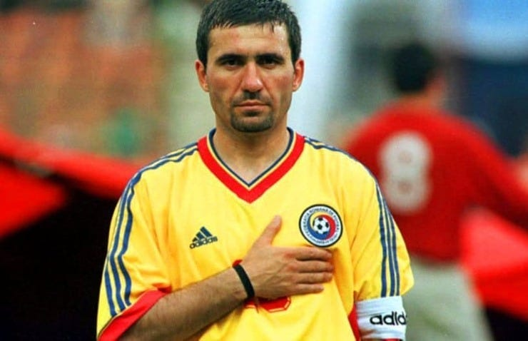

Deja ai o opinie.

Toată lumea o are, ar fi culmea să fii singurul care n-a prins propria opinie din zbor.

Doar că există un risc major să-ți fi format această opinie pe baze care nu se îmbină cu toate laturile realității.

Adică să te bazezi mult pe emoție.

Dar dacă citești în continuare, s-ar putea să-ți păstrezi verdictul, doar că-l vei susține cu argumente mai solide decât cele la care sunt tentați cei mai mulți să apeleze.

## Hagi cere o formă supremă de condamnare fotbalistică

După cum știi, câțiva fotbaliști români crescuți fotbalistic și numai pe la cluburi din străinătate refuză "naționalele" României.

Ori pentru că li se pare că pierd timpul la un nivel de vârstă sub valoarea lor, ori pentru că speră la convocări la "naționalele" țărilor în care joacă.

Hagi crede că FRF n-ar trebui să insiste cu convocări, iar presa ar trebui să-i ignore.

"Pentru că nu sunt români!".

Adică nu simt suficient pentru România încât să fie o onoare pentru ei convocările respective.

Ignorarea la Hagi înseamnă eliminarea numelui:

"Nu le mai scrieți numele!".

De ce vrea asta?

Omul cu cel mai important nume din fotbalul românesc știe ce-nseamnă să-ți dispară numele.

Este o formă de condamnare supremă.

Să nu mai contezi.

Să nu mai exiști.

## Ce spune Bourceanu despre subiect și de ce contează

Fostul fotbalist al Stelei are o reacție care conține și altceva decât o dezamăgire amestecată cu acuză legată de Cârjan (Arsenal), Coubiș (AC Milan) și ceilalți.

În mare, acesta spune c-ar trebui să vorbim cu jucătorii:

> "Să aflăm de ce nu vor să vină dacă într-adevăr nu vor să vină".

De ce nu vor să vină...

Curiozitatea mea și curiozitatea ta este stârnită de întrebarea aceasta.

Adică vrei să știi concret de ce.

Vrei să auzi din gura oricăruia dintre ei adevărul.

Mai ales dacă adevărul respectiv îți confirmă ție o bănuială.

Ți-ar plăcea să auzi ceva din categoria aceasta:

“Nu vin pentru că România e o țară care nu contează fotbalistic".

Sigur, te-ar enerva, dar undeva-n străfundurile tale ți-ar alimenta verdictul inițial: "Nu sunt patrioți!".

Sigur, pot exista multe variante ale răspunsului pe care acești fotbaliști l-ar putea da, dar capacitatea oamenilor de-a le încadra în schema lor de gândire este nesfârșită.

## Cât contează atașamentul real față de România când vine vorba de "națională"

Hagi spune că e un igredient principal.

În opinia lui, ca să faci o echipă națională bună îți trebuie fotbaliști care să considere o mare onoare convocarea.

Jucători care să iubească echipa națională și ideea de-a reprezenta România:

> "Secretul este să știi să formezi o echipă națională cu jucători de mare personalitate, care să joace cu pasiune, cu iubire! Nu să ne rugăm de ei să vină la echipa națională, că ne amenință ei că nu vin! E prea mult pentru mine, de asta am vrut să intervin".

Stai un pic și gândește-te…

Fă abstracție de încărcătura emoțională chiar dacă discutăm de un aspect emoțional.

Nu cumva e logic ce spune Hagi?

E de-a dreptul simplu: niște jucători cărora le pasă de națională și de faptul că reprezintă România sunt automat niște jucători care se vor dedica mai mult scopului.

Sunt jucători care vor avea atitudine.

Sunt jucători care nu vor garanta rezultatele, dar vor garanta că vor face tot ce ține de ei să le obțină.

Niște jucători care nu au acest sentiment e posibil să fie la rândul lor motivați din alte rațiuni - bani sau creșterea statutului în caz că obțin rezultate, adică tot bani.

Sunt banii un motivator mai bun decât dragostea?

Sunt banii un motivator mai bun decât dedicarea totală?

Atenție, faptul că pentru cineva scopul reprezintă banii, iar pentru altcineva scopul primordial e reprezentat de onoare nu înseamnă că automat primul este profesionist, iar cel de-al doilea doar un amator cu multă dorință.

Ambii pot profesioniști.

Aș zice chiar că probabilitatea ca cel dedicat să fie mai profesionist este una mai mare.

De ce e important să iei asta în considerare?

Pentru că "naționala" este o reprezentativă.

Ține minte aceste element pentru că e foarte, foarte important.

## Mic ghid psihologic legat de ideea de reprezentativă a României

Multe echipe din fotbalul românesc pot reprezenta România.

Glumesc.

În general, doar cele care joacă în cupele europene o fac.

În ultima vreme, CFR o face la un nivel onorabil.

Iar tradițional, Steaua e cea mai importantă reprezentantă a noastră în Europa.

Totuși, cu "naționala" e altceva.

Toate războaiele "naționalei" sunt externe.

Nu se bate cu alți români în campionat, se bate cu străini în Europa sau pe unde ajunge să joace.

Nu întâmplător am folosit termenul "război" și nu întâmplător am folosit sintagmele "români" și "străini".

Stai relaxat, nu mă pregătesc să agit xenofobic subiectul.

Vreau doar să înțelegi de ce ții cu România uneori și de ce alteori ți-e lehamite de rezultatele / atitudinea "naționalei" de fotbal.

În mare, echipa națională este o metaforă pentru o armată a României.

Fotbalul în sine este o metaforă pentru vânătoare și război.

De asta îi stârnește profund pe bărbați și de asta reclamele la Heineken în care încearcă să pună femeile în plin planul masei de suporteri ai fotbalului sunt comice.

Politice și comice în același timp.

Dar deviez...

Când naționala este văzută la nivel psihologic ca o armată a țării tale, rezultaltele ei contează în străfundurile primordiale ale minții tale.

Și nu doar rezultatele ei, ci și felul în care le obține.

Adică atitudinea din luptă.

De asta, când auzi că un “soldat” nu prea ar vrea să vină la luptă, ai un oarecare grad de revoltă.

[Care, în realitatea vremurilor noastre, este aproape sigur exagerat.](https://www.staidrept.ro/nu-ti-consuma-revolta-aiurea/)

Dar îl ai.

Și tot de asta, când naționala pierde iar de-o manieră rușinoasă, te cuprinde lehamitea.

Pentru că nu te simți reprezentat de acei flăcăi.

E o formă de apărare.

E mai ușor să nu te mai asociezi cu ei ca să nu suferi că nu te reprezintă așa cum ți-ai dori.

Prin urmare, instinctual și nu numai, Hagi are dreptate în ceea ce zice.

Niște jucători care nu-s onorați de convocări sunt niște jucători pe care nu te poți baza că vor da totul.

Și la nivel psihologic, e vorba de-a nu te putea baza pe niște bărbați care ar trebui să ducă un război de apărare în numele tău.

## Da, dar alte țări au succes inclusiv cu fotbaliști de alte etnii

Insist să spun că o națională este caracterizată mai ales de reprezentativitatea sa.

Adică de ușurința cu care spectatorul se poate identifica cu cel care joacă.

De asta, e penibil când la tenis de masă unele țări europene aduc asiatici să-i reprezinte.

Dacă nu există nicio legătură între sportivul respectiv și țara respectivă în afară c-a fost plătit să reprezinte poporul în cauză în competiții, atunci e o situație penibilă.

Chiar dacă-și face bine treaba, asta nu înseamnă că un chinez reprezintă tenisul de masă german.

A, dacă respectivul sportiv avea o legătură reală cu cultura poporului german, cu viața acestui popor, trăia în contact cu acesta, discutam despre cu totul altceva.

Mai ales într-o societate deschisă politic spre multiculturalism și diversitate precum a Germaniei.

Așa cum putem discuta la Camora.

Sau poate nici la Camora nu putem discuta.

Depinde.

Totuși, măcar oltenii știutori de istorie ar trebui să se abțină când vine vorba de portughezi.

Nu de alta, dar e posibil ca anumite caracteristici ale lor să fi fost moștenite de la soldații romani recrutați din zona Portugaliei și rămași exact în această zonă a României..

În fine, ce vreau să spun?

Vreau să spun că deși naționalitatea este importantă pentru o națională (criteriu de eligibilitate), nu este suficientă dacă vrei ca acea naționalitate să fie reprezentativă.

De exemplu, pentru România, reprezentativi sunt fotbaliști proveniți din etnii locale - români, romi, maghiari, turci, Alibec etc.

Prin urmare, nu contează ce etnie ai, important este să fii român în privințe fotbalistice.

Foarte important.
