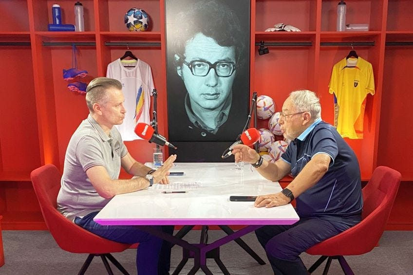

De ce de 18 ori pe zi?

Mă gândesc că de atâtea ori accesezi gsp.ro, digisport.ro, prosport.ro etc.

Dacă o faci chiar mai des, probabil pui prea mult la suflet.

Și asta s-ar putea să-ți dăuneze.

În fine, titlul de mai sus e făcut special ca să stârnească în tine un anumit tip de revoltă.

Genul ăla de revoltă alimentată de tot felul de exemple în care presa sportivă a fost de rahat, iar tu ai suferit din această cauză.

Dar totuși ai continuat să o frecventezi așa cum un flăcău frecventează o femeie pe care a prins-o cu alții, dar totuși simte c-ar fi a lui.

Deși femeile care se duc și cu alții sunt curve.

Ce-am făcut aici?

Am creat premiza pentru o titrare din categoria dragă Gazetei - “Derapaj oribil: bla-bla, bla-blum”.

Și de ce tălpile respective sunt “destul de curate”?

Pentru că presa sportivă calcă uneori în tot felul de rahaturi.

De asta ai articole-nimic despre [rebela tenisului românesc](https://www.digisport.ro/tenis/rebela-tenisului-romanesc-a-reactionat-imediat-dupa-decizia-radicala-anuntata-de-wta-1402585) sau despre [bunoaca de la Urlați](https://www.gsp.ro/gsp-special/stiri-extrasport/oana-marica-marius-niculae-viata-de-lux-693347.html).

Totuși, rahaturile în care calcă presa sportivă sunt, per total, mai puțin lipicioase și mai puțin mirositoare decât cele în care calcă multe alte redacții - generaliste sau la rândul lor nișate pe diverse domenii.

## Vestea proastă pentru toată lumea: nu există jurnalism perfect dintr-un capăt în altul

Nu-nțelege din asta că-n România presa este la un nivel aproape de perfecțiune și doar mici scăpări o fac să nu o atingă.

Nici pe departe.

Nici pe foarte departe.

Între misiunea ideală a presei și realitatea jurnalismului din România chiar există o prăpastie.

Cât de adâncă?

La fel de adâncă precum cea existentă în acest moment în SUA + țările vestice.

Niciodată n-a existat partizanat politic și ideologic al ziariștilor sau al patronilor de presă mai agresiv decât în acest moment.

Și nu doar agresiv, ci și evident.

Pe față.

Zilele romantice în care părintele jurnalismului, Pietro Aretino, șantaja diverse personaje sus puse cu scrierile sale sunt aproape uitate.

Nici măcar zilele frumoase în care jurnalismul era corupt doar de interesele financiare ale patronilor sau ale ziariștilor șpăgari nu mai sunt ce erau. Deși există-n continuare, sunt puse-n umbră de activismul politic / ideologic / cultural al multor redacții din lumea civilizată.

De asta, deși vei găsi o grămadă de artiști ai scrisului sau ai vizualului în redacții, vei găsi din ce în ce mai greu oameni neradicalizați de credințe care pot fi nobile, dar care n-au absolut nicio legătură cu misiunea jurnalistică.

Penibil.

## Vestea bună pentru România: banii contează în continuare cel mai mult

Presa poate ajunge la bani în mai multe feluri.

Uneori, patronii de presă încearcă să obțină bani pe calea clasică - finațează un produs de presă foarte bun, creează condiții OK pentru ziariști valoroși și ce rezultă se vinde bine sub diverse forme.

Alteori, e prea scump să faci asta.

Și durează prea mult.

Și investiția inițială e prea mare.

Și nu toată lumea se pricepe.

Și cei care se pricep costă bani.

Așa că e prea scump.

Și durează prea mult.

Și investiția inițială e cam mare.

Prin urmare, o parte însemnată a celor care dețin controlul redacțiilor - patronat sau ziariști influenți - încearcă să ajungă la bani vânzând două mărfuri stricate din start: **mușcături selective** și **pupături-n fund**.

Da, fiecare redacție de acest fel are o dublă linie de producție capabilă să producă concomitent și mușcături selective, și pupături în fund.

Ce sunt mușcăturile selective?

Sunt situațiile în care o redacție are misiunea să-i atace doar pe unii, dușmanii politici sau economici sau ideologici ai prietenilor lor.

Ce sunt pupăturile în fund?

Sunt formele de jurnalism grețos în care prietenii ziariștilor sau ai patronatului sunt ridicați în slăvi.

Aproape întotdeauna, redacțiile care mușcă selectiv sunt dibace și la pupat în fund.

Totul e intergrat, cum spuneam mai sus.

Prin urmare, în România, lucrurile incorecte din perspective jurnalistice se petrec mai ales sub influența banilor.

Din fericire.

Astăzi, chestiunile culturale / ideologice sunt mai puțin influente în ceea ce privește felul în care se face presă în România.

Dar vor fi.

E suficient să urmărești cum a fost relatată povestea fraților Tate și te vei lămuri ce-nseamnă să nu-ți placă cineva suficient de mult și la adăpostul ideii că aperi o cauză nobilă să faci pișu' pe meseria de ziarist.

Sau cum încearcă Gazeta să-ți spună din titlu ce trebuie să gândești despre diverse situații de prin lume adunate sau chiar din România  - din nou “Derapaj oribil…”.

## De ce presa sportivă produce cel mai credibil jurnalism din România

În fine, ideea este că banii sunt în continuare factorul cel mai influent în ceea ce privește presa românească.

Și din acest motiv, presa sportivă este încă în fruntea ierarhiei în ceea ce privește calitatea actului jurnalistic.

Hehehe, nu-ți place când vezi această alăturare - "presă sportivă" și "calitate".

Simți nevoia să-mi spui că ăia de la Digi Sport sunt rapidiști, că Naum se bucură la înfrângerile Stelei, că Mironică are ceva cu Rapid, că [Vali Moraru țipă la Rotaru sau la Mititelu](https://www.cameravar.ro/de-ce-tipa-vali-moraru-invitati/) etc.

Și totuși, nu ai făcut exercițiul de-a compara ce produce / cum arată presa sportivă cu ce emană restul presei românești.

Fie ea generalistă, fie presă de nișă.

Chiar îți recomand să faci acest exercițiu.

Să deschizi ochii și să vezi ce-nseamnă "presă" în restul "presei".

Uite, îți dau eu un exemplu.

Să zicem că te interesează agricultura și citești presă agricolă.

Liderul acesteia se numește [Agrointeligența](https://agrointel.ro), care există sub forma unui site cu un număr respectabil de vizitatori pentru o publicație online de nișă.

Dacă intri pe site-ul lor, ghinion.

Site-ul nu se deschide cu o informație clasică din domeniul agriculturii, ci cu un articol care aduce aminte de reclamele mascate.

Doar aduce aminte pentru că masca e foarte, foarte discretă.

Ieri, era un articol în care șeful Corteva, Jean Ionescu, [spunea nimic nou](https://agrointel.ro/253470/opinia-expertului-jean-ionescu-corteva-romania/) despre lipsa apei ca să poată promova un produs din portofoliul companiei respective - niște hibrizi de porumb adaptați la condițiile respective.

Într-o presă sănătoasă la picioare - adică presă făcută fără să te târăști - un astfel de articol ar fi fost marcat drept publicitate.

Repet, articolul care deschidea site-ul.

Azi, [articolul care deschide site-ul](https://agrointel.ro/254645/un-fermier-galatean-a-facut-propria-comparatie-cum-se-comporta-culturile-cu-si-fara-starterul-seed-sprint/) e din aceeași categorie - un fermier a făcut comparație între culturile tratate cu starterul Seed Sprint și cele care n-au avut norocul ăsta.

Așa, din senin, omul s-a apucat de treaba asta, iar Agrointelingeța a fost curioasă să vadă ce și cum.

Fix produsul ăla vândut de Chemark Rom (bolduit în text, că era nevoie) i-a interesat.

Din nou, articol cu caracteristici publicitare evidente nemarcat.

Și așa e în fiecare zi acolo.

Și nu doar atât.

Toate articole de pe primul ecran sunt din această categorie sunt PR sau reclamă pentru diverse companii care, mă gândesc eu cu mintea mea, plătesc sub o formă sau alta pentru pentru acest beneficiu.

Trebuie să scrollezi ca pe Facebook să dai de primele articole care înseamnă presă.

Care articole sunt OK pentru că Agrointeligența are și ziariști care știu să-și facă treaba.

Apoi, Agrointeligența nu s-a oprit la presă și a dezvoltat o asociație numită Asociația Forța Fermierilor, prin care face tot felul de demersuri în favoarea acestora.

Fără glumă, e cea mai vie asociație de gen pe care am văzut-o vreodată în agricultura românească.

Doar că-n ciuda misiunii lor nobile, nu e treaba unei publicații să dezvolte astfel de asociații și să facă demersuri de reprezentare a oamenilor în raport cu politicul.

Absolut deloc.

Treaba presei este să scrie, să sesizeze incorectitudini, să stea cu ochii pe cei care decid ca să nu o ia razna.

Nu să-și facă asociație și să devină actor politic într-un final.

## Ce se întâmplă pe site-urile de sport

În mare, site-urile de sport își văd de treaba lor.

După posibilități și după capacități.

Dar își văd de treabă.

Deschide acum gsp.ro

Nu e lider de audiență pe zona de sport, dar e publicația de care mă leg pentru că-s penibili uneori, iar eu sunt deținătorul adevărului absolut când vine vorba de aprecieri în zona asta.

În fine, nu există comparație între ce-nseamnă gsp.ro și ce-nseamnă Agrointeligența sau multe alte alte site-uri nișate pe zone precum economic sau politică.

Repet, nu există comparație.

Reclamele, oricât de multe, sunt reclame marcate ca atare.

Articole de presă sunt articole de presă.

Dacă simți o prietenie prea mare între ziaristul care scrie și personajul articolului, aproape sigur e doar o prietenie prea mare.

Și ei au momente când [confundă presa cu activismul politic și statul de ziarist cu cel oengist](https://www.cameravar.ro/gazeta-penalty-la-coltul-scurt/).

Totuși, repet, nu ești păcălit că citești informații despre Steaua și, de fapt, ți se vinde un apartament în ultimul proiect rezidențial al familiei Becali.

Sau nu citești ceva despre Dinamo și ești invitat să joci la bursă pentru că domnul Eugen Voicu crede în importanța diversificării surselor de venit.

Sau nu citești ceva despre Rapid și brusc ești sfătuit să te-ntinzi pe canpeaua Welton de la Mobexpert.

Redacțiile de sport au ca țintă obținerea de audiență.

Care chestiune nu înseamnă întotdeauna acte de jurnalism etic sau de calitate.

Nu mai vorbesc despre [zoaiele acelea online numite "cross-uri"](https://www.cameravar.ro/continut-platit-site-uri-sport/) în care o publicație obține trafic prin faptul că "știrile" sale sunt expuse pe site-uri cu care colaborează.

Totuși, în mare, audiența în presa sportivă se obține în felul următor: focus pe fotbal și atenție maximă pentru echipele cu suporteri.

Fără prietenii care să decidă cu ce se deschide site-ul.

Fără încercări tâmpe de manipulare a cititorului.

Fără băgat mâna pe șestache în buzunar sub pretext că faci jurnalism.

Știu, vorbesc despre ceva ce-ar trebui să fie normal.

Nu mai trăiești într-o lume în care așa ceva să fie normal.

Așa că atunci când te lovești de excepții parțiale, cum e presa sportivă, nu mai considera că nu e mare scofală.

Este.

Nu spun acum c-ar trebui să fii recunoscător presei sportive.

Să fim serioși, ar fi o idioțenie.

Dar nimic nu te-mpiedică să remarci c-un pic de simpatie:

> Ăștia din presa sportivă ori sunt mai proști de felul lor, ori nu știu!

Ce să zic…

Sunt zile și zile, dar mai degrabă nu știi.
