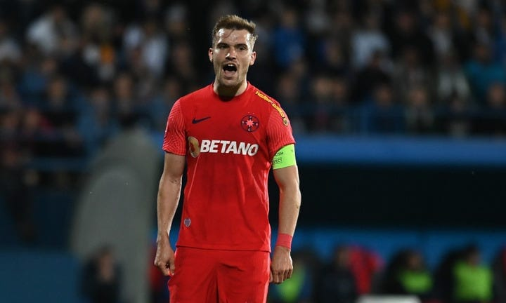

Înainte de orice, câteva cuvinte despre mentalitatea multora dintre suporterii echipelor mari.

Motivul principal pentru care țin cu această echipă este că vor să se asocieze cu învingătorii.

E o practică umană obișnuită.

O practică născută dintr-un amestec de instinct de supraviețuire și o programare culturală.

În cazul celor care țin cu marile echipe, de cele mai multe ori, e vorba de-a câștiga de-o manieră clasică:

> “Ai mei i-au bătut pe ai tăi, deci eu te-am bătut pe tine. Deci eu am mâncat azi în urma vânătorii, în timp ce tu stai în peșteră, cu focul stins și cu oftica până peste urechi”.

Așa cum ți-am mai spus, fotbalul și multe alte sporturi sunt o metaforă pentru vânătoare și pentru supraviețuire primară.

De asta, cei mai mulți țin cu “cei mai buni”.

Mai mult, nu există niciun cost și niciun risc să susții o echipă care-n mod tradițional câștigă. Pur și simplu, spui că ții cu Steaua și automat ții cu echipa care are un lung istoric de victorii și perspective asemănătoare.

Chiar dacă tu ții cu Steaua începând de astăzi, “primești” automat palmaresul acestei echipe fără să fie nevoie să te cerți cu vreun colonel de justiție cu ieșiri isterice.

Sigur, există o grămadă de fani ai acestui tip de echipe care au ajuns să fie suporteri pe alte căi, unele dintre ele romantic - glorioase.  De exemplu, bunicul ținea cu Steaua, tatăl ținea cu Steaua și tu ai fost la primul meci din viața ta când a jucat Steaua cu Anderlecht.

Doar că acest tip de suporteri sunt puțini în mare masă a celor care se identifică fani ai unei echipe mari. Îi găsești mai degrabă la echipe cu mult mai puțini suporteri și cu un trecut în care victoriile au fost rare și umilinețele dese.

Da, la Rapid mă refer.

În fine, ideea este că după eșecul de aseară cu Farul, o bună parte a celor care țin cu Steaua se comportă de parcă cine știe ce dramă s-a petrecut.

De parcă acest sezon ar fi unul ratat.

Și ar putea avea dreptate, dacă ar considera eșec faptul că o bună parte a fotbaliștilor tineri au cam bătut pasul pe loc sau au progresat sub normal.

Sau dacă ar considera eșec faptul că patronul nu aduce un antrenor pe măsura pretențiilor clubului.

Sau dacă ar considera eșec că deși clubul îl are pe [Mihai Stoica](https://www.cameravar.ro/mihai-stoica/), nu-l folosește pe măsura capacităților sale.

Doar că rațiunea pentru care cei mai mulți au impresia că acest sezon a fost ratat ține de faptul că echipa lor n-a câștigat campionatul.

Și e de înțeles să aibă astfel de impresii dacă motivul pentru care au ajuns să țină cu Steaua este legat de dorința de-a se asocia cu învingătorii și atât.

Adică tu ești suporter fidel, dar jucătorii, antrenorii și nenorocitul de patron nu-și țin partea lor de promisiune.

Nu câștigă pentru tine.

Unii se comportă de parcă regretă că n-au anticipat seria de 5 campionate câștigate de CFR Cluj.

Ar fi putut schimba taberele la timp.

Da, sună într-un mare fel.

Și este exact momentul în care pot afirma că o bună parte dintre acești suporteri sunt niște copii răzgâiați.

Nu le dai jucăria, se supără.

Oamenii respectivi își inventează această dramă.

Unii au cumva impresia c-ar fi elemente esențiale din fluxul excelenței și că e sub demnitatea lor să accepte ideea ca echipa favorită să iasă pe locul 2.

Ceea ce e comic.

Fotbalul poate fi cel mai important lucru din lumea asta, dar tot nu e cazul să pierzi contactul cu realitatea doar pentru c-ai ieșit pe locul 2.

Locul 2 este bun.

Mai ales dacă ești OK financiar.

Mai ales dacă aduci oameni reali în tribune.

Mai ales dacă ai o bază de pregătire care-ți aparține.

Mai ales dacă exiști și anul viitor în ciuda faptului că n-ai luat titlul.

Toate astea înseamnă că te mulțumești cu puțin?

Nu, toate acestea înseamnă să vezi lucrurile și dincolo de ceea ce e ușor de văzut.

Mai mult, ca suporter, întotdeauna ar trebui să te mulțumești cu foarte puțin când vine vorba de echipa favorită.

Asta dacă ții cu adevărat cu ea.
