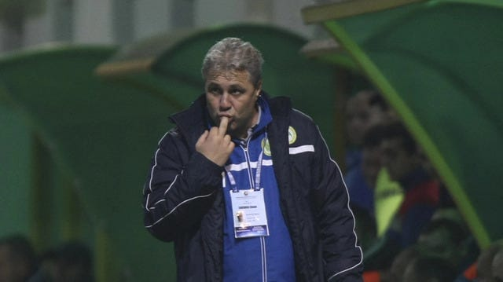

În lumea fotbalului românesc se vântură des ideea de respect.

Care uneori pare o chestiune importantă.

Iar alteori e doar o formă de-a spune ceva care să sune interesant fără să fie neapărat adevărat în sensul că respectivul chiar era dornic de respect.

În fine, ideea apare des sub aceste două forme:

> "M-am simțit respectat".

sau

> "Nu m-am simțit respectat".

Depinde de situație, desigur.

Prima e ceva mai rară pentru că și respectul este ceva mai rar în fotbalul nostru.

De altfel, e aici o corelație aproape științifică între volumul de bani implicați în poveste și existența respectului.

Asta pentru că mulți cred că respectul în cauză are legătură cu banii.

Și cum banii nu-s mulți în fotbalul nostru, de aici și raritatea lui “M-am simțit respectat”.

În schimb, cea de-a doua abundă.

O auzi des atât din gura jucătorilor, dar și din cea a antrenorilor: “Nu m-am simțit respectat”.

De ce?

Din tot felul de motive, inclusiv pentru că are mare legătură cu statul de angajat al unui club.

Nu vei auzi prea des patroni care să spună s-au simțit sau nu s-au simțit respectați. Cumva, oamenii cu mulți bani sau cu un statut indepedent în totalitate par să-și ia respectul din alte părți.

Sau să nu facă mare caz de acesta.

În fine, filosofez atât pentru că urmează să scriu despre situația lui Marius Șumudică și a celor de la Rapid.

[Iar un astfel de personaj](https://www.cameravar.ro/sumudica) și un astfel de club au nevoie de o introducere lămuritoare.

## Nu e vorba că Șucu nu-l place pe Șumudică sau că acesta e certat cu Daniel Niculae

După cum știi deja, Șumudică era liber de contract după ce arabii nu l-au mai respectat pentru încă un sezon.

Mai mult, Rapid a rămas fără antrenor după pleacarea lui Mutu la un club care să-l respecte cam de 4 ori mai mult.

Prin urmare, s-a ivit posibilitatea unei colaborări bazate inclusiv pe respect între Șumudică și Rapid. Doar că această colaborare pare imposibilă între oamenii cu respectul de la Rapid și antrenor.

De ce?

Adevărul adevărat este că Dan Șucu și Victor Angelescu probabil că nu-l respectă pe Șumudică.

Și aici nu mai e vorba de o metaforă pentru bani.

E o exprimare cât se poate de concretă despre neimplicarea respectului în felul în care cei doi îl percep pe antrenor.

Care antrenor iubește de-o manieră evidentă clubul.

Și care antrenor este cu adevărat antrenor.

Dar nu l-au angajat pentru că nu-l respectă.

De ce nu-l respectă?

Pentru că Șumudică are atitudini și comportamente pe care cei doi nu le consideră demne de respect.

Ceea ce nu e ceva ciudat.

Ăsta e adevărul - comportamentul public al lui Șumudică este de multe ori deplorabil.

Și nu vor ca această imaginea a lui Șumudică se fie asociată cu afacerea lor, afacere care vor să fie una respectabilă. Adică să atragă banii sponsorilor, nu doar pe cei ai peluzei.

Întrebarea este ce te poate face însă mai respectabil clubul Rapid: rezultatele pe care ți le aduce un antrenor sau imaginea pe care o are antrenorul pe care-l angajezi?

Unii vor spune că amândouă și ar avea dreptate.

## De ce Șumudică nu poate fi și antrenor bun, și imaginea de marketing pe care o vor Șucu și Angelescu

Doar că Șumudică nu poate să fie și antrenor bun, și om cu o imagine în acord cu liniile corporatiste pe care Șucu vrea să le traseze clubului.

De ce?

Pentru că ceea ce-l face pe Șumudică un antrenor foarte bun are aceeași rădăcină cu ceea ce-l face pe Șumudică să fie de multe ori un circar.

Adică ceea ce nu înțeleg foarte mulți oameni despre natura umană este că ceea ce este "negativ" la un individ poate avea aceeași sursă cu ceea ce este "pozitiv".

În cazul concret al lui Șumudică, valoarea sa ca antrenor se bazeză pe câteva chestiuni destul de evidente:

- citește foarte bine și foarte rapid ce joacă adversarul (de aici inclusiv flerul său la schimbări)
- știe de ce jucători are nevoie ca ideile sale de joc să se vadă clar pe teren (de aici inclusiv lipsa de aplecare spre promovarea de tineri)
- are capacitatea de-a mobiliza vestiarul de-o manieră aparte (de aici și legenda reală c-ar fi un bun motivator)

Ceea ce spun eu mai sus circulă în limbaj fotbalistic de-o manieră diferită de multe ori.

Adică auzi că are ochi la schimbări, are ochi la jucători, că știe să vorbească cu jucătorii și tot felul de alte formule, unele dintre ele implicând inclusiv termenul "bulan", pe care totuși nu-l folosesc să nu se simtă oripilat domnul Șucu.

Or toate acestea nu sunt bazate doar pe mers la școala de antrenori și învățat de-o manieră răzvanlucesciană.

Multe dintre acestea au legătură cu personalitatea lui Șumudică, au legătură chiar și cu temperamentul acestuia, au legătură inclusiv cu istoria de viață a lui Șumudică.

De asta, Răzvan Lucescu este un super antrenor din postura de tocilar, iar Șumudică este un super antrenor din postura de golan.

Ăsta e adevărul.

Iar lui Șucu nu doar că nu-i plac golanii, dar nici nu-i respectă.

Iar Șumudică nu poate renunța să fie golan, circar, derbedeu, clovn și toate acestea pentru că ar însemna să-și scadă inclusiv nivelul ca antrenor. Așa că nu-i rămâne decât să aștepte să-l angajeze cine poate să-l accepte ca "pachet complet", cu bune și cu rele.

Momentan, e vorba doar de-o televiziune, care exploatează la Șumudică inclusiv ceea ce îi oripilează pe Șucu și Angelescu.

De ce face Digi Sport asta?

Pentru că televiziunile știu cui se adresează și nu au prea des probleme de “respect”.
