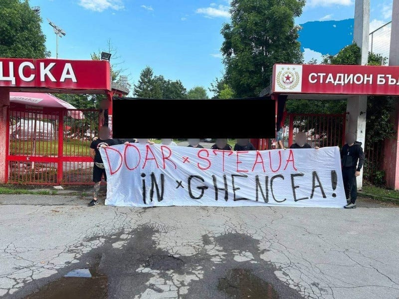

Din ce-mi dau seama, ideea fanilor CSA Steaua este că diverși ziariști au folosit  multa sau puțina credibilitate pe care o au ca să întărească ideea că de fapt FCSB este Steaua.

Cei mai "răi" dintre ziariștii care ar fi lucrat la această manipulare au fost trecuți pe lista aceea a interzișilor la meciurile din Ghencea. Listă elaborată de suporteri, nu asumată de club.

În fine, cât adevăr este în această poveste?

Nu cred că cineva poate măsura exact, dar încerc să îmi spun părerea legat de ce este corect în această credință și ce reprezintă o neînțelegere a realității.

## Cât de organizată e presa sportivă când vine vorba de manipulări

Înainte de orice, ziariștii nu sunt niște sfinți, iar presa nu este un domeniu perfect.

Probabil ca-ș fi mai aproape de adevăr dacă aș spune că unii ziariști pot fi niște nemernici absoluți, iar presa poate fi mizerabilă apropo de modul în care tratează diverse subiecte.

E suficient să te uiți la modul nesimțit în care diverși ziariști și diverse redacții în ansamblul lor se subordonează politic în campaniile electorale.

Nu toți și nu toate.

Doar suficient de mulți și de multe încât să rupă bucăți mari din eventualul respect care s-ar acorda unei meserii teoretic nobile.

Părerea mea este însă că presa sportivă este cea mai performantă și cea mai curată formă de presă din România.

Da, știu, în contextul general poate să nu pară mare lucru.

Și totuși, este.

[Am mai scris despre asta, așa că nu revin](https://www.cameravar.ro/suprematia-presei-sportive/).

Dar chiar și-n aceste condiții, tot există diverși care confundă pasiunea pentru o echipă cu munca de ziarist.

Așa apar o parte dintre situațiile în care fanii unor echipe se revoltă legat de comentariile unui ziarist.

Doar că deși astfel de lucruri se întâmplă, se produc la o scală mică și neorganizată.

**Nu există ședințe de redacție în care cineva să vorbească despre "cum să inducem ideea că de fapt FCSB este Steaua și CSA Steaua este o aberație a unui minister".**

De asemenea, nu există nici măcar la nivel instinctual reflexul de-a apăra cauza FCSB pentru că e mai profitabil decât de-a apăra cauza CSA Steaua. Poate exista reflexul jurnalistic sau al lipsei de imaginație în unele cazuri de-a vorbi mai mult despre FCSB decât despre orice altă echipă.

Pentru că au foarte mulți suporteri și audiența contează.

În fine, aproape tot ceea ce vezi legat de opinii ale ziariștilor sunt pur și simplu opinii ale ziariștilor.

Care fiind opinii au o nuanță de subiectivitate.

Dar n-au o nuanță de grup organizat care luptă pentru o cauză nedreaptă.

De asta, faptul că eu consider că [FCSB a continuat ideea de Steaua](https://www.cameravar.ro/de-ce-fcsb-este-steaua/) este o opinie a mea legată de acest subiect, nu o încercare perversă de-a influența pe alții.

## Fanii FCSB nu sunt confuzi, sunt doar mulți

Hehehe, pun pariu că cineva s-a gândit deja că spun despre fanii FCSB că-s mulți în sensul c-ar fi proști.

Nici pe departe.

Trimit spre volumul uriaș de fani ai FCSB ca să pot face legătura cu o situație care se întâlnește frecvent pe la toate marile cluburi care au mulți suporteri.

Aceștia sunt mulți pentru că echipa cu care țin are o istorie lungă a victoriilor.

Sunt mulți pentru că-n marea lor masă sunt o grămadă de oameni care se asociază natural / reflex doar cu câștigătorii.

Dacă vrei să vezi oameni care nu sunt disperați să se asocieze doar cu învingătorii, uită-te la Rapid. Acolo vezi oameni care țin cu echipa ori ca să respecte decizia tatălui și  a bunicului.

Sau pentru că le-a plăcut atmosfera.

Sau pentru că a fost o echipă mereu persecutată și se simt solidari cu cei mici și chinuiți.

Dar nimeni nu ține cu Rapid pentru că Rapid are o istorie bogată a victoriilor.

De asta echipele care au palmares bogat au, de obicei, și foarte mulți fani.

Iar echipele cu altfel de istorie au fani mai puțini și foarte fideli.

FCSB nu face excepție.

Au fost continuatoarea ideii de Steaua neîntrerupt după ce secția de fotbal s-a desprins de MAPN.

Prin urmare, masa de fani a continuat să însoțească echipa și după ce Becali a umilit din vorbe gloriile clubului sau s-a comportat de-o manieră greu înghițit.

Echipa continua să facă performanță în Europa și oamenii au stat lângă echipă.

Mulți.

Când a apărut noua echipă a MAPN, cei mulți au avut de ales nu între cine a spus presa că e Steaua și cine nu e.

Au avut de ales între o echipă care juca în Europa + prima Ligă și o echipă care a jucat în liga a 4-a. De asta, lângă echipa din liga a 4-a s-a dus un nucleu dur de fani care aveau ca principală problemă prezența lui Becali.

Nu felul în care a fost luată echipa a fost marea lor problemă.

Felul în care fost preluată echipa a devenit un pretext în lupta cu un patron pe care nu-l suportau.

## Efectele disputei FCSB - CSA Steaua a născut niște super aberații

În fine, unul dintre motivele pentru care există puțină simpatie generală față de apariția CSA Steaua și pentru care sentimentul fanilor acestei echipe că "ziariștii sunt cu FCSB" ține de toate aberațiile născute din lupta în instanță.

Jucători care află că n-au jucat la Steaua deși au jucat la Steaua, [palmares tăiat în bucăți](https://www.facebook.com/stefan.beldie/posts/pfbid0khjPugY99Jj6LJwYxH48x4zxmtsaMGAu5a1USDMqeGUDXLLeCKmq2adnpoN2Y3Qol) pe baza unor idei neghidate de lege, ci de modul în care niște judecători au ales să vadă lucrurile (n-au nicio vină), antrenori care se dezic de locul în care au lucrat etc.

Aberații peste aberații peste aberații.

Încercări de modificare cu dedicație a legii, finanțări de la buget nemainîntâlnite în UE, blocarea unui bun public pe criterii discreționare, invenții din categoria "dacă avem proces, n-avem voie să te primim pe stadion" etc.

Aberații peste aberații peste aberații.

Iar toate acestea adunate creează percepții, creează opinii.

Și creează chiar credințe în cazul unor oameni.

Nu cred însă și printre ziariști.

Mulți dintre noi suntem ceva mai superficiali de atât.
