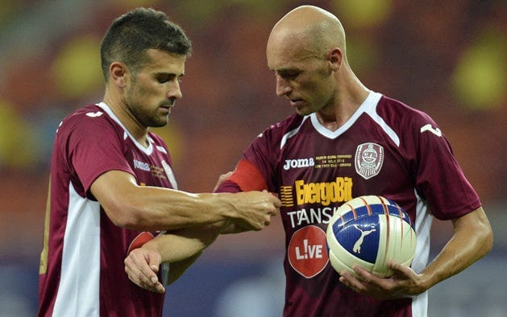

> "Cheliosul ăla de la CFR care l-a lovit cu cotul pe Rusescu de era să-i scoată ochiul...".

Probabil asta își aduce aminte un fan obișnuit al Stelei despre Gabi Mureșan.

Sigur, Mureșan juca pe atunci la ASA Tg. Mureș, dar adevărul este că a fost un jucător atât de profund asociat cu CFR Cluj, încât există o probabilitate destul de mare ca oamenii să uite nuanțe.

Ceea ce în cazul lui Mureșan se petrece și-n alte privințe.

Mai ales că și fanii altor echipe ar putea să aibă amintiri asemănătoare:

"Era ăla chel de la CFR Cluj, care intra tare!".

Logic, discuția ar devia spre o dezbatere de genul cine era mai dur: Cadu sau Mureșan?

Și apoi totul alunecă firesc spre Van Damme vs Bruce Lee.

Iar Gabi Mureșan este uitat până când apare ceva despre el pe Facebook, gen "ăsta a rupt 1-2 fotbaliști".

Vă spun eu, nu există 1-2 exemple de jucători rupți de Mureșan chiar dacă a luat suficiente roșii în carieră.
De unde această imagine?

Numărul mare de cartonașe luate de Mureșan de-a lungul carierei - 10 roșii la CFR Cluj - poate ține loc de orice amintire concretă.

Dar nu e chiar așa.

Mureșan a jucat în special ca închizător / mijlocaș defensiv și era în sarcina lui să rupă jocul sau să blocheze adversari cu prețul unui fault și poate al unui cartonaș mai mult chiar și decât un fundaș.

Atunci?

Simplu: este efectul care se obține atunci când superficialitatea se combină cu un eveniment care a fost grav ca urmări și putea fi chiar dramatic. Și culmea, în acest context, calitățile lui Mureșan au devenit sprijin pentru acuzarea sa.

La ce mă refer?

OK, să le luăm pe rând...

## Nu te aștepta ca majoritatea fanilor echipelor mari să aibă amintiri obiective despre cei "mici"

Cu cât o echipă este mai mare, cu atât are o masă mai bogată de fani care sunt asociați clubului doar pentru că această echipă este mare.

Adică e o echipă care câștigă.

Adică exact ceea ce caută oamenii care n-ar suporta vreodată să țină cu cineva care nu câștigă sau nu are cele mai mari șanse să câștige.

Așa sunt o parte importantă a celor care spun că țin cu Steaua sau cu Real Madrid sau cu alte mari echipe ale lumii. O fac pentru că e-n structura animalică a omului să caute compania celor puternici.

În cazul fanilor de acest gen, caută compania echipelor care câștigă des și mult.

Așa se simt la rândul lor satisfăcuți.

Și în siguranță.

Da, ai citit bine: **în siguranță.**

Nu te speria, nu am plecat departe de subiectul Gabi Mureșan.

Doar îți explicam că nu te poți baza pe amintirilor multora dintre fanii obișnuiți ai echipelor mari.

Nu doar că-s aciuați lângă aceste echipe din rațiuni care pot părea comice în ziua azi (deși nu sunt), dar în contextul acesta au și **o aplecare naturală spre dramă**.

De asta, ceea ce au văzut ei în momentul lovirii lui Rusescu de către Mureșan e posibil să nu fi fost doar o fază în care Istvan Kovacs trebuia să dea cartonaș roșu. Au văzut cum unul de-al lor, unul cu care trebuia să câștige pentru ei, a fost "omorât" de unul de-ai lor.

Acum, în subconștientul uman, o astfel de scenă se desprinde ușor de pe gazon și se poate duce amigdalic în povești de pe vremea locuitului în peșteri.

Pe atunci, dacă cel care apăra intrarea în cavernă era omorât, cei care-l "susțineau" din spate cu încurajări sau doar cu speranțe - femei, copii, bărbați neputincioși dădeau de naiba.

Tocmai am comparat o parte a fanilor obișnuiți ai unor echipe cu “femei, copii și bărbați neputincioși” pentru a le sublinia statutul de privitori de pe margine cu sensibilitate ridicată?

Da, cred că da.

Doar nu ți-ai închipuit că meciul de fotbal ar fi în profunzimile sale altceva decât punerea în scenă de-o manieră modernă a disputei dintre bărbații a două triburi rivale.

Sau, în unele cazuri, punerea în scenă a unei clasice partide de vânătoare care ar trebui să asigure supraviețuirea vânătorilor.

În concluzie, Mureșan nu doar că l-a lovit pe Rusescu cu cotul, dar a lovit în programări arhaice ale minții unor fani ai Stelei.

Acesta este motivul pentru care ura față de el este intensă în rândul multor fani FCSB / Steaua și acesta este motivul pentru care aceiași oameni nu simt același sentiment față de Gardoș, care l-a nenorocit pe Băcilă sau față de Lăcătuș, care l-a nenorocit pe Ardeleanu.

Când agresorul e de la adversar, e un nemernic.

Când agresorul e de la ai tăi, e fotbal.

## Ce a fost de fapt Gabi Mureșan în fotbalul nostru

În primul rând, n-a fost un rupător.

A fost un jucător care juca tare, dar la minge. Dar ca să reții așa ceva ar fi însemnat să te uiți la meciuri cu interes și dincolo de partidele echipei tale favorite.

Ai fi văzut rapid că imaginea de dur a lui Mureșan nu a fost construită pe o agresivitate dincolo de limitele normalului ci pe o atitudine corectă față de fotbal și față de duelurile fizice.

Mureșan nu a fost un individ care să lovească atunci când în mod evident nu avea șanse să joace balonul.

Doar că  într-un campionat în care se simulează enorm și se “zvârcolește” imens, un fotbalist care acuza propriile accidentări rămânând în picioare și mergând șchiopătând categoric a fost dintr-un alt film.

De asemenea, ia în calcul cât de slabi au fost și sunt arbitri români când vine vorba să judece duelurile fizice.

Cât de ușor dau fault la orice atingere.

Cât de ușor dau fault la portar ca să nu-și complice cumva viața când există dueluri în careul vreuneia dintre echipe.

De asta, când jucăm în cupele europene, avem impresia că adversarul e prea dur și ni se pare că arbitrii au ceva cu noi de nu-i sancționează pe “agresori”

Realitata este că Mureșan a jucat un fotbal care nu atrage privirile multora, dar care aduce victorii.

De asta spun că ideea de-a-l defini doar prin momentul Rusescu înseamnă să uiți de trofeele câștigate cu CFR sau de meciurile europene jucate cu această echipă - inclusiv victoriile de pe Olimpico (2-1 cu AS Roma) și Old Trafford (1-0 cu Manchester United).

Iar dacă ai alergie instant când vine vorba de meritele celor de la CFR, măcar adu-ți aminte de acel România - Bosnia 3-0.

Poate că atunci Raț, Mutu, Sânmărtean și Marica au fost eroi, dar doi chelioși care au jucat tare și la minge - Mureșan și Bourceanu - ne-au făcut probabil victorioși.
