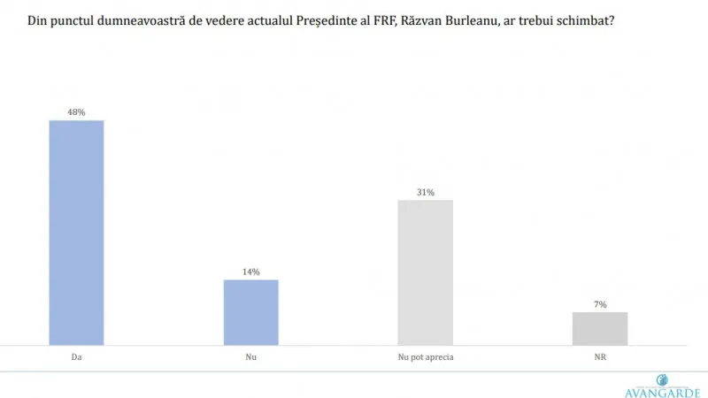
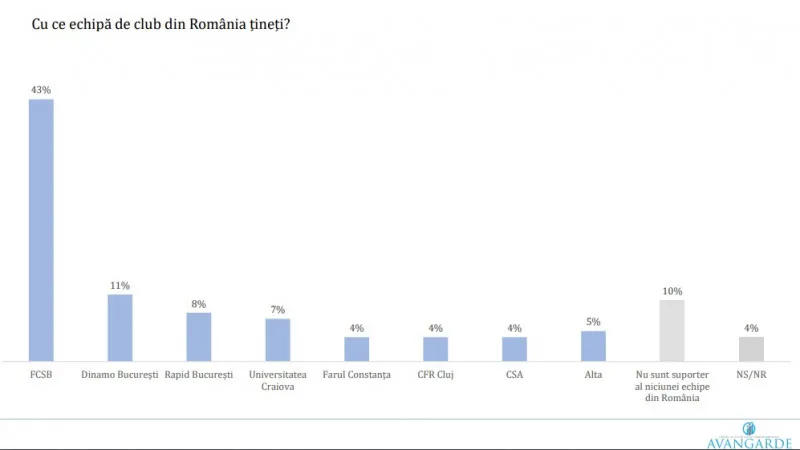

Zilele trecute, [Digi 24 a dat publicității un sondaj](https://www.digi24.ro/stiri/sport/fotbal/sondaj-jumatate-dintre-romani-cred-ca-performanta-nationalei-de-fotbal-este-slaba-si-vor-schimbarea-lui-burleanu-de-la-frf-2504823) pe care-l solicitase și pe care Avangarde l-a realizat în perioada 9-13 septembrie.

În fine, ce mi-a atras atenția?

## Probabil mulți dintre cei care au răspuns nu urmăresc de fapt fotbalul românesc

Conform sursei, cei care au răspuns ar fi oameni care urmăresc fotbalul românesc:

> "Sondajul a fost realizat telefonic, pe 815 subiecți **care urmăresc fotbalul românesc**, și are o marjă de eroare de 3,4%".

Realitatea răspunsurilor pare să indice altceva.

În primul, te-ai fi așteptat ca-ntr-o țară în care se spune că toată lumea se pricepe la fotbal să nu fi existat acel procent uriaș de respondenți care s-au abținut să răspundă sau care au spus că nu știu să răspundă la multe dintre întrebări.

Asta mă face să cred că mulți dintre cei care au participat la sondaj n-au vreo treabă cu fotbalul local.

Altfel, cum s-ar explica reținerea pe care o arată în privințe în care de altfel oricine simte nevoia să dea un verdict - gen este sau nu este Răzvan Burleanu vinovat pentru tot ce mișcă sau pentru tot ce-i mort în fotbalul nostru?

 

Doar cineva care n-are absolut nicio treabă cu fotbalul ar putea spune că nu poate aprecia sau nu știe să aprecieze activitatea lui Răzvan Burleanu. Chiar dacă lucrul acesta este adevărat pentru că, în realitate, puțini au habar ce face și ce nu face bine Burleanu la FRF.

Concret, 31% dintre așa zișii urmăritori ai fotbalului românesc nu se pot pronunța în acest caz și alți 7% nu știu sau nu au răspuns.

Sunt impresionat de această reținere a oamenilor într-o problemă sensibilă.

Ca și-n aproape toate celelalte privințe luate-n calculul întrebărilor.

Glumesc.

Repet, cel mai probabil nu a fost vorba de oameni care urmăresc în mod real fotbalul românesc sau a urmări fotbalul românesc a fost definit gen "am văzut un meci în ultimii 4 ani, dar nici acela complet că aveam treabă pe telefon".

Asta schimbă datele problemei?

Da.

Eșantionul nu are cel mai probabil caracteristicile pe care le susține firma de sondare.

## Procentul celor care susțin Rapidul mi se pare impresionant

În al doilea rând, sunt uimit de procentul uriaș de susținători cu care a ieșit Rapid în acest sondaj - 8%.

De ce?

Pentru că-n ciuda istoricului său și a faptului că echipa e-ntr-o evidentă revenire, în opinia mea Rapid se află doar cu un singur pas în cercul așa-ziselor echipe "naționale".

Adică echipe care au un număr relevant de susținători pe toată suprafața țării.

În această situație se află-n mod clar Steaua și Dinamo.

Și ar mai fi Craiova, chiar dacă cei mai mulți fani ai săi sunt mai ales în regiunea Olteniei și poate-n unele județe învecinate, există suporteri ai echipei și-n restul țării.

Explicația nu ține doar de apetența unor olteni de-a migra și de-a duce după ei atât perfectul simplu, cât și pasiunile, dar și faptul că Universitatea Craiova a avut performanțe reale în anii ‘80 și asta nu putea rămâne fără nicio consencință la nivel de țară.

Revenind la Rapid, cred că e printre rarele ocazii în care este peste Craiova în acest tip de sondaj, chestiune posibil explicabilă și prin situația cu cele două Craiove.

Plus faptul că sunt atât de aproape de Dinamo, care au doar 11%.

Plus procentele pe care Rapid le avea în mod tradițional [în astfel de sondaje-n trecut.](https://orangesport.ro/foto-echipa-care-are-cei-mai-multi-suporteri-din-tara-steaua-nu-mai-e-pe-primul-loc-cum-arata-top-13-19203149)

În fine, probabil că Rapid începe să atragă fani și din categoria celor care mergeau în mod tradițional spre “marile echipe victorioase”, doar pe ideea de asociere cu cel care câștigă. În cazul de față, pe ideea asocierii cu cel care pare capabil să câștige în viitorul apropiat.

Plus că show-ul din tribune, de departe cel mai spectaculos din România, sigur atrage și indivizi care devin rapidiști peste noapte. Ceea ce este comic din perspectiva celor care chiar au treabă cu fotbalul, dar foarte profitabil pentru club.

## Cei mai mulți nu înseamnă automat și cei care au cea mai multă dreptate

Deși susțin la rândul meu evidența că FCSB este continuatoarea ideii de Steaua, nu mă las impresionat de procentul uriaș de fani care consideră același lucru comparativ cu cei care iau partea CSA.

Nu din perspectiva ideii că cei mulți sigur au și dreptate.

Din contră, istoria ne-a arătat că lucrurile pot sta exact invers.

Pe de altă parte, acest procent arată totuși că o masă mare de oameni au o părere formată și că nici măcar o decizie a justiției definitivă în toate aspectele ei nu va schimba ușor ceva ce ține de percepție, nu de juridic.

**Cine este, din punctul dumneavoastră de vedere, continuatoarea echipei Steaua București?**

- **FCSB - 49%**
- CSA - 8%
- Niciuna 10%
- Nu știu / Nu răspund - 33%

Interesant este că deși 43% dintre respondenți susțin că sunt fani FCSB,  49% cred că FCSB este continuatoarea Stelei.

Acum, înseamnă că și o parte dintre cei care țin cu alte echipe cred că FCSB este Steaua.

Cel mai probabil.

Altfel, pot exista scenarii absurde în care nu toți fanii FCSB să creadă că echipa lor e continuatoarea Stelei, iar unii dintre fanii CSA Steaua să creadă că de fapt FCSB este Steaua.

Repet, sunt aberații de logică, dar care pot fi concluzionate prin simpla analiză a procentelor fără să ai alte detalii de finețe.

## Cei mai mulți susținători nu înseamnă automat cea mai iubită echipă

Am văzut des confuzia asta de exprimare și chiar de gândire.

Simplu fapt că o echipă are cei mai mulți susținători declarați nu înseamnă decât are cei mai mulți susținători declarați.

Nu înseamnă cea mai iubită echipă.

Ideea de a iubi ceva implică intensitate, nu volum.

Sigur, după logica mea, poți spune că o echipă cu doar 3 suporteri care sunt înnebuniți după acea formație ar deveni automat cea mai iubită echipă.

Ceea ce, desigur, ar fi adevărat și aberant în același timp.

Dar mai ales extrem.

**Cu ce echipă de club din România țineți?**

- FCSB - 43%
- Dinamo - 11%
- Rapid 8%
- Universitatea Craiova 7%
- Farul 4%
- CFR Cluj 4%
- CSA 5%
- Nu sunt suporter al niciunei echipe din România - 10%
- Nu știu / Nu răspund 4%

Ideea este că echipele foarte populare n-au neapărat de fiecare dată mai mulți suporteri super dedicați comparativ cu cele mai puțin populare.

De exemplu, dintre cei care țin cu Steaua, doar o mică parte sunt suporteri super dedicați. În schimb, în cazul celor care țin cu echipe mai puțin populare, cum e Rapid de exemplu, procentul fanilor super dedicați în totalul fanilor declarați este mult mai mare.

E normal să e întâmple asta dacă înțelegi toate resorturile psihologice care-i fac pe oameni să se îndrepte spre o echipă sau alta.

Cel mai puternic astfel de resort, pe care l-am mai menționat în scrierile mele, este dorința de asociere cu învingătorul. Acesta e motivul pentru care marile echipe au mulți suporteri din perspectiva volumului.

În schimb, când ajungi să ții cu o echipă care nu are un super istoric de victorii, atunci altceva din tine te-a lipit de respectiva echipă.

Și acel altceva este, de obicei, o chestiune care te face mult mai determinat în dragostea ta decât simpla asociere cu învingătorul.

Atenție, asta nu înseamnă că marile echipe nu atrag fani și altfel decât prin faptul că le flutură tentația de-a a se asocia cu învingătorii și de-a evita astfel ceea ce mulți nu ar suporta - să fie învinși.

Spun doar cum se-ntâmplă lucrurile în general.
