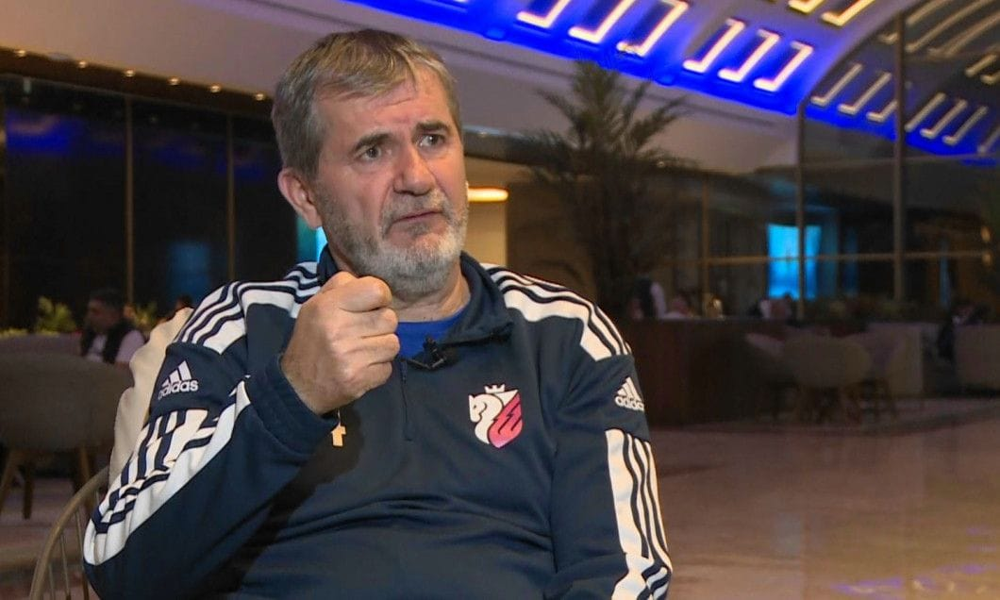

După Gigi Becali,  Valeriu Iftime este patronul cu cele mai multe retrageri din fotbal anunțate și nepuse-n faptă.

Omul care împreună cu asociații săi finanțează FC Botoșani a tot făcut anunțuri de acest gen. Prima dată mi-a atras atenția când promisiunea era evident neserioasă.

S-a întâmplat în sezonul 2021 - 2022, când Iftime anunța cu câteva etape înainte de final că dacă echipa sa nu prinde play off-ul, se retrage. 

Și n-a prins play off-ul chiar echipa sa era mi bine poziționată în clasament decât FC Argeș și cu un program mai bun.

Doar că dincolo de faptul că totul s-a aranjat în favoarea argeșenilor, Iftime a luat și o măsură care a dus mai ușor la insuccesul moldovenilor - i-a vândut chiar înainte de acele ultime meciuri decisive pe Ogenda, Edjouma și Racovițan.

Recent însă, retragerile lui Iftime au căpătat alte nuanțe.

## De ce retrogradarea ar fi un șoc real pentru Valeriu Iftime

Se teme evident de retrogradare, care nu ar fi doar un șoc financiar - pierzi bani din drepturile TV + scade cota oricui ar mai pute fi vândut.

O retrogradare ar fi și un șoc emoțional pentru un om care de-a lungul vieții sale școlare și apoi profesionale a fost obișnuit să performeze.

Pentru un fost olimpic la fizică așa cum este Iftime, o retrogradare probabil c-ar fi ca o repetenție. Sau ca un eșec absolut din perspectivă inginerească într-un proiect de mare amploare.

Dincolo de asta, ideea retragerii este alimentată și de constatări cât se poate de obiective legate de starea de fapt a orașului și a zonei - populație îmbătrânită, niciun proiect clar de dezvoltare a zonei din perspectivă economică, lipsa unor legături rapide cu un centru economic cum este Iași etc.

Nu mai vorbesc despre concurența neloială pe care cluburile finanțate masiv din fonduri publice o fac echipelor care sunt finanțate de privați, așa cum este și FC Botoșani.

Sau de faptul că FC Botoșani nu are un stadion pe care să nu se mănânce semințe. Adică un stadion care să arate atât de bine încât să-i inhibe pe sămânțari să consume bomboane agricole la meci sau să motiveze administratorii arenei să interzică ei înșiși asta.

Și, aș mai adăuga pe baza unor informații neverificate totuși, o aversiune a familiei sale și a partenerilor săi din Elsaco față de sumele mari de bani pe care clubul le consumă de niște ani de zile.

În fine, ceea ce Iftime a observat la o parte importantă a celor aproximativ 2.000 de oameni care vin în mod obișnuit la meciuri - îl înjură cu o energie neobișnuită.

Genul de înjurături pe care unii oameni pe care le aruncă reflex pentru că-i mai ușor să spui că unul care deține FC Botoșani și o finanțează e prost și rău și lacom de bani și în toate felurile, decât să faci efortul de-a-nțelege cât de greu se ține un club de fotbal cu finațare privată într-un oraș / zonă limitată zdravăn economic.

## De ce ar continua totuși Iftime în condițiile acestea

Ceea ce urmează sunt speculațiile mele pe baza a ceea ce percep despre acesta. Sunt concluziile mele bazate pe ce pare să reiasă din ceea ce Iftime a spus sau a făcut de-o manieră publică.

Deci nu e ceva bazat pe o discuție cu Valeriu Iftime, pe care nu-l cunosc în privat și cu care nu am avut vreodată ocazia să discut dincolo de emisiunile la care am participat.

Bun, de ce ar continua?

### **Deși a pierdut bani, are și experiența succesului**

Zilele trecute, Iftime anunța că el și partenerii săi din Elsaco, grupul care reunește companiile pe care le conduce, [au finanțat în ultimii 2 ani un deficit de 5 milioane Euro](https://www.facebook.com/valeriu.iftime.1/posts/pfbid02dtZENqpreYs3GD3N46TLi3imZGG7yHJ1f1FQ8MUUg3W54REsHpYdG8Hu3ya5K7zPl).

Pe simplește, asta înseamnă că FC Botoșani a consumat cu 5 milioane Euro mai mult decât a produs. 

Și spre deosebire de ceea ce se întâmplă prin alte părți, primarul și consilierii locali sau oficialitățile județene nu s-au apucat să voteze alocări de fonduri pentru acoperirea acestui deficit.

Iftime a plătit.

Pe de altă parte, în ciuda faptului că are probabil cu mult peste 10 milioane Euro bani pierduți / greu de recuperat din fotbal de când a preluat echipa, Iftime a cunoscut și vremuri mai bune.

Timp de vreo 5 sezoane, din 2016 și până în 2021, FC Botoșani și-a acoperit cheltuielile și chiar a făcut profit în unii ani. Ceea ce, în fotbalul nostru, este extraordinar.

Și ceea ce, pentru un om de afaceri este semnal incredibil de puternic - se poate.

### Vânzările adictive de fotbaliști

Dincolo de acest aspect general, Iftime a cunoscut și dopamina unor lovituri care l-au mobilizat suplimentar - vânzarea lui Ngadeu la Slavia Praga pentru 1,4 milioane Euro sau vânzarea lui Moruțan la FCSB pentru o sumă care depășește de asemenea în total milionul de Euro.

Normal, cu cât trece mai mult timp de la aceste lovituri, cu atât pot să pară precum câștigurile de la un joc de noroc și nu efectul unor strategii ușor repetabile.

Doar că atât succesul programat, și câștigurile de la jocurile de noroc sunt stimuli pentru un soi de adicție care ar putea să-l mențină pe Iftime în fotbal.

### Fotbalul e un producător de emoții superior oricărei afaceri clasice

Dan Șucu a constatat singur că deși Mobexpert există de 30 ani și produce economic de zeci de ori mai mult decât o face Rapid, toată lumea este interesată de ce face la Rapid, nu de ce face la Mobexpert.

Asta pentru că la Rapid este fotbal, iar la Mobexpert este mobilă. Și-n oricât marketing ai îmbrăca mobila, oricât ai face trimiteri la casă, familie, somn, căldura căminului, tot nu atingi ceea ce poți atinge pe un stadion de fotbal.

Ei, afacerile lui Iftime sunt în domeniul energiei și a utilităților. Mai mult, omul e super pasionat de domeniul său. Poate să-ți vorbească despre eficiență energetică, despre rețele de apă despre ce vrei tu din domeniul respectiv cu maxim entuziasm.

Doar că fotbalul îi atinge pe oameni în mod diferit de felul în care i-ar putea atinge victoria modernității oferite de faptul că în sfârșit ai făcut o casă independentă energetic sau că în sfârșit ți-au tras canalizare.

### Fotbalul este mai complicat decât pare și asta poate atrage

Acum niște ani, Becali a făcut o constatare adevărată.

A zis că dacă fotbalul ar fi ușor, l-ar face toți și succesul ar veni fluierând pe toate străzile cluburilor din lumea asta. Doar că nu e ușor și a dat exemplul unor cluburi care investesc miliarde și ajung să fie constant întrecute de unii care pun mai puțini bani și scot mai mult succes.

Prin urmare, pentru un om obișnuit cu provocări, această situație ar putea fi un stimul mobilizator suplimentar.

Nu mai vorbesc despre faptul că prezența unor finanțatori care au mai multe resurse precum Becali, Varga, Rotaru, Șucu, Mititelu este de asemenea un factor de provocare.

În lumea afacerilor sale, Iftime este deja bine situat, iar ierarhiile de acolo au un soi de încremenire specifică domeniilor în care mari companii au decis deja cum arată piața.

În fotbal, lucrurile nu sunt stabilite.

An de an, se pot schimba în funcție de cât de bine administrezi banii și ce valoare dai acestor bani prin managementul pe care-l faci.

Iar asta te poate face să mai joci o mână și să speri că ceea ce știi + șansa te vor duce unde-ți dorești.

### România, Botoșani și firmele lui Iftime vor avea mai mulți bani în anii care vin

Spuneam mai sus că Botoșani, asemeni multor altor orașe / județe / zone din Moldova și nu numai, are o problemă uriașă cu îmbătrânirea populației, exodul tinerilor specialiști sau nespecialiști și, cel mai important, lipsa unui plan real de dezvoltare.

Când spun plan real, mă refer la genul de strategie pe niște oameni deștepți și real vizionari să o facă, nu genul de strategie care este produsă doar pentru gargară politică.

Și totuși, finanțările europene asociate PNNR-ului și altor programe vor aduce în România mai mulți bani decât oricând în istoria țării noastre.

Bani care vor fi orientați inclusiv spre dezvoltarea infrastructurii și a tuturor domeniilor asociate. Adică exact zone în care activează și firmele lui Iftime.

Asta va însemna contracte mai mari și mai profitabile pentru acesta și disponibilități financiare mai mari inclusiv pentru fotbal.

Mai mult, sunt șanse reale ca stadionul din Botoșani să fie modernizat / renovat de către CNI, ceea ce ar reprezenta un câștig uriaș pentru club.

În fine, Iftime spunea că la Botoșani nu vin fotbaliști pentru că pe de o parte orașul nu are ce să le ofere comparativ cu alte orașe care au fotbal sau că el nu poate plăti ceea ce plătesc cluburile finanțate de primării.

Dacă orașul va fi legat cu un drum de mare viteză de Iași, lucrurile s-ar putea schimba măcar parțial. Între cele două localități sunt aproximativ 100 km pe care-i faci cu mașina în două ore sau mai mult.

Un drum care ar permite parcurgerea acestei distanțe într-o oră ar însemna un câștig uriaș pentru Botoșani în general, nu doar pentru clubul de fotbal.

## De ce nu mi-ar plăcea să se retragă Iftime din fotbal

Dincolo de toate aceste argumente, realitatea este că nici nu mi-ar plăce să plece din fotbal.

Repet, nu am absolut nicio legătură cu acest om, dar cred că ceea ce a reușit el la Botoșani în condițiile de acolo este o dovadă a unor capacități respectabile.

Mai mult, cred că e sănătos să existe în fotbal cât mai mulți oameni care să-ncerce cu înverșunarea sa să se încadreze într-un buget chiar și când acest lucru pare imposibil - vezi deficitul ultimilor doi ani.

Între a avea cluburi conduse de oameni care cer continuu bani de la bugetul local / județean și care spun că nu se poate face nimic fără bani de la stat și a avea oameni care își dau silința an de an să existe și chiar să performeze cu finanțare privată e clar că prefer a doua variantă.

De altfel, este profund imoral ca banii pe care Iftimie, Becali, Șucu, Angelescu, Mititelu, Rotaru, Varga etc. îi dau la bugetul de stat să se întoarcă apoi sub forma unor finanțări ale unor echipe care concurează apoi formațiile deținute de aceștia.

E incorect oricum ai privi-o.

Doar că acesta e unul dintre atributele multor oameni de afaceri - să facă lucruri chiar și când contextul este clar nefavorabil. 

Cam cum este acum la Botoșani.
