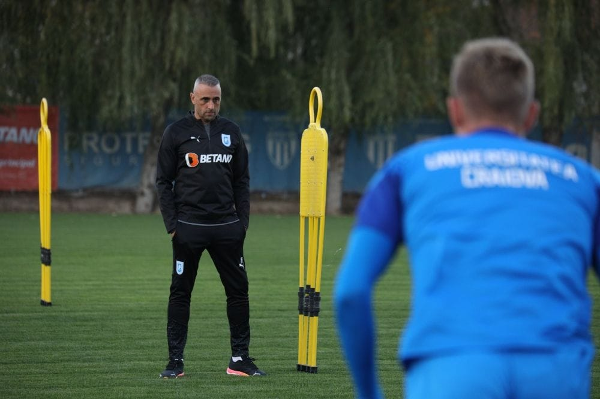

Am o teorie legată de antrenorii români...

După [conducătorii de club](https://www.cameravar.ro/cea-mai-slaba-veriga-fotbalul-romanesc/), antrenorii români sunt a doua cea mai slabă verigă a fotbalului nostru.

E o simplă teorie bazată pe chestiuni subiective precum:

- lipsa majoră de educație tehnico-tactică a fotbaliștilor care pleacă din România și ajung afară
- numărul infim de antrenori români care au contat în fotbalul meritocratic din Vest de-a lungul ultimilor 30 ani
- succesul instant pe care orice antrenor italian l-a avut în fotbalul românesc în competiție directă cu cei români
- atitudinea servilă pe care prea mulți antrenori români o au în relație cu cluburile care-i angajează, această manifestare fiind, printre altele, și efect al nivelului de pregătire pe care știi că-l ai
- atitudinea general fricoasă în relație cu ideea de risc indiferent că vine vorba de-a promova tineri sau de-a produce strategia pentru meciuri
- un analfabetism pronunțat în ceea ce privește citirea rolului pe care îl au dincolo de "eu pregătesc echipa" - interes  infim pentru estetica exprimării echipei, pentru ce văd spectatorii care vin la stadion, pentru eforturile financiare ale clubului etc. 

Și mai sunt și altele, la fel de subiective, dar suficient de multe cât să am această teorie.

Teorie conform căreia în fotbalul românesc există două categorii de oameni de foarte bună calitate:

- [**suporterii din tribune**](https://www.cameravar.ro/cel-mai-important-obiectiv-liga1/) pentru că cei care consumă fotbalul prin prezență fizică pe stadion au un rol major în creșterea spectacolului de care beneficiază într-un final și cei care doar se uită la TV
- [**privații care finanțează echipe de fotbal**](https://www.cameravar.ro/importanta-patronului-in-fotbal/) pentru că cine investește / plătește / riscă e întotdeauna valoros. Da, știu, e neplăcut să auzi asta, dar e un text despre realitate, nu despre ce place sau nu place în general publicului.

Unde sunt ziariștii în toată povestea asta?

Pe la mijloc.

Aproape la fel de utili precum suporterii de telefon / televizor. Nu c-ar fi puțin, dar am făcut un soi de ierarhie și nu pot vorbi la fel de laudativ despre toată lumea.

De ce a fost nevoie să-ți spun toate aceste lucruri într-un text în al cărui titlu face trimitere la decizia lui Mihai Rotaru de-a angaja un antrenor bulgar?

Pentru că deși niciodată nimeni nu poate fi sigur de succesul pe care-l va avea echipa cu un antrenor sau altul, poți crește probabilitatea succesului printr-o alegere deșteaptă.

Iar o alegere deșteaptă, indiferent că este vorba de o echipă din Liga 1 sau de echipa națională a României, ar trebui întotdeauna să se facă de pe o listă care să conțină și numele unor antrenor străini

De ce?

Pentru că asta înseamnă să nu-ți limitezi alegerea la antrenorii români, care deja ți-am spus, sunt a doua cea mai slabă verigă a fotbalului nostru.

Sper că înțelegi nuanțele.

N-am spus că toți antrenorii români sunt slabi, ci doar că ei, ca breaslă, sunt slabi per total.

De asta primele 4 echipe din campionatului nostru au antrenori străini în acest moment - FCSB, CFR Cluj, Rapid și CS U Craiova?

Unii - da.

Alții - nu.

Ideea este că atunci când construiești un lot ai mult mai multe variabile și îți asumi mai multe riscuri costisitoare decât atunci când alegi un antrenor.

Un antrenor este mai adaptabil în practică decât un fotbalist inclusiv pentru că este la un nivel superior de maturitate umană.

De asta, din punctul meu de vedere, un finanțator trebuie întotdeauna să-și aleagă conducătorul capabil să aducă cel mai bun antrenor posibil.

Este sarcina supremă a unui conducător pe linie pur sportivă.

Sarcina supremă a unui conducător în general ar fi să așeze clubul în postura de-a face profit.

Astăzi, Rotaru conduce clubul din toate punctele de vedere.

De asta, a adus un bulgar cu rezultate la Ludogorets și cu experiență la nivel de echipă națională. A făcut ceea ce a ținut de capacitățile sale să aleagă corect pentru club.

Ce-nseamnă asta?

Printre multe altele, a adus un om capabil să facă selecție. Iar după cum ți-am tot spus în trecut, [evaluarea corectă a lotului celor de la Craiova](https://www.cameravar.ro/marea-problema-a-lui-radoi/) este cel mai dificil lucru cu care clubul se confruntă în realitate.

Asta pentru că au în continuare în lot sau împrumutați jucători cu talent real și cu o vârstă bună care nu oferă suficient pentru pretențiile clubului.

Dar clubul a investit bani buni îi ei și nu știe dacă se află sau nu într-o situație care apare frecvent în mediul de afaceri când o companie face o investiție majoră și nu vede încă rezultatele.

Așa că are următoarea dilemă de tip "*sunk-cost fallacy*"

> Renunț la acești jucători "neclari" și consider pierdută toată investiția sau am băgat prea mulți bani deja și nu pot renunța acum pentru că altfel acei bani ar fi pierduți?".

După cum îți poți da seama, oricare dintre alegeri implică pierderi pe care le acoperă privatul care finanțează această echipă.

Adică Rotaru.

De asta, spun că omul care finanțează echipa are "cea mai bună calitate" din fotbalul nostru. 

Și ca să-i enervez pe cei care urăsc oamenii cu bani mai ales pentru că au bani. 

Bun, care-i concluzia?

Că Rotaru a făcut prin alegerea sa exact ceea ce trebuia să facă - să minimalizeze riscul eșecului prin aducerea unui antrenor cu experiență clară și valoare dovedită.

Și-a făcut treaba.

Sigur, vor veni unii și vor spune că bulgarul nu cunoaște suficient fotbalul nostru și bla-bla, bla-blum.

E perfect că nu-l cunoaște.

Evaluările sale vor fi mai obiective inclusiv din acest motiv.

În plus, peste tot în lume, antrenorii valoroși merg dintr-un campionat în altul și se descurcă nu datorită faptului că știu fotbalul local, ci pentru că-s antrenori valoroși.

Ceea ce e evident și pentru Ivaylo Petev conform rezultatelor sale.
