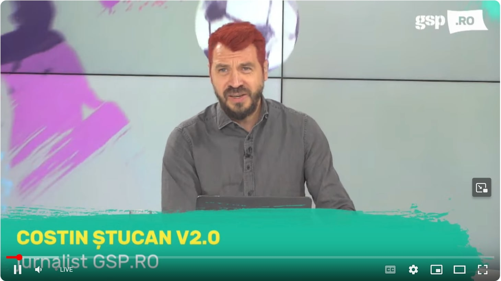

Cazul Costin Ștucan pare unul aparte, dar în realitate este relevant pentru mulți dintre cei care trăim / lucrăm public.

Includ ziariști / influenceri, dar și o parte importantă a publicului.

Și am să explic de ce.

Sigur, orice comentez se bazează pe simple percepții, nici pe departe pe vreo discuție exploratorie sau obișnuită cu Costin.

Deci probabilitatea ca ideile mele să fie unele superficiale este mare și mi-o asum.

Glumesc, nu am ce să-mi asum.

Asta cu "asumarea" este o formă de auto-glorificare tâmpă la care apelează mulți dintre cei care habar n-au pe ce lume sunt. Sau care au impresia că rostirea acestor cuvinte produce cine știe ce act de eroism impresionant pentru audiență.

Orice acțiune de-a ta implică ideea asumării indiferent că spui din vorbe că ți-o asumi sau nu.

Chiar și când ești genul de smiorcăit care dă vina pe alții din reflex, realitatea este că acțiunile / reacțiile / atitudinile tale sunt ale tale.

Iar dacă tu ai impresia c-ar fi cumva responsabilitatea altora, cei din jur vor avea grijă să vadă realitatea.

În fine, revenind...

## Da, e o încercare de-a obține atenție

Îl bănuiesc pe Costin de-o-ncercare reușită de-a obține atenție.

Atât în momentul angajamentului de-a se vopsi roșu turbat dacă ne calificăm la Euro, dar mai ales în acest moment, când a trecut la fapte.

Atenție, nu spun că e o încercare sănătoasă sau nesănătoasă de-a obține atenție pentru că atunci chiar aș fi în totalitate pe lângă și n-aș avea cum să știu asta fără să discut cu el.

De altfel, chiar dacă aș discuta, tot nu cred c-aș obține mare lucru dintr-un motiv ce ține tocmai de faptul că ar fi o discuție între doi foști colegi despre un subiect neobișnuit.

Dar pot trage concluzii legate de orice gest de natură publică doar pe baza perepției mele - deci cred că e vorba de dorința de-a atrage atenția.

Care, teoretic, nu e ceva ciudat când ești ziarist și munca ta implică inclusiv să determini publicul să fie atent la ce produci. 

Dar...

Am  o nelămurire pe care mi-o voi lămuri măcar parțial acum, în timp ce scriu.

Nu știu dacă a făcut-o pentru simpla plăcere pe care obținerea atenției ți-o produce sau ca efect al unei presiuni pe care a resimțit-o?

Plăcerea obținerii atenției este o chestiune naturală, obișnuită. 

Adică, suntem programați biologic și parțial social să apreciem atenția celor din jur pentru că, în profunzimile ei, atenția este de cele mai multe ori un semnal de securitate.

Normal, chestiunea își trage originile din vremuri în care să primești atenția celor din jur era importantă pentru supraviețuire, iar să fii ignorat implica efectul invers - riscai să nu supraviețuiești tocmai pentru că celorlalți nu le păsa de tine.

Deși azi nu mai trăim vremuri periculoase din aceste perspective, viața pe rețelele sociale ne antrenează-n continuare pentru tendințe de acest gen. 

Nu-ți închipui că prea mulți dintre noi acționăm în social media doar pentru a ne satisface cine știe ce dorințe din vârful piramidei lui Maslow.

O facem și pentru chestiune aflate mult mai aproape de baza acesteia.

Bun, la ce tip de presiune m-am gândit c-ar putea de asemenea să stea la originea gestului său de-a-și vopsi păru-n roșu?

La presiunea obișnuită cu care mulți dintre noi ne confruntăm zilnic - să ne păstrăm conturul public.

Concret, în cazul lui Costin,  ziarist specializat mai ales pe tratarea unor subiecte sensibile, care expun lipsa de caracter a multora dintre personajele implicate, poate să apară o "obligație" de-a a demonstra el însuși integritate cu orice prilej.

Ca nu cumva să pară ipocrit.

Pentru că dacă pari ipocrit, psihologic vorbind, intri iar în zona lipsei de securitate - adică cei din jur nu se pot baza pe ceea ce zici,  pe eea ce ești.

Și dacă nu se pot baza pe tine, ghici ce fac? 

Te elimină din trib.

Prin urmare, decizia lui Costin de-a pune-n practică ceea ce s-a angajat să facă poate fi și efectul acestei presiuni de-a se încadra în ceea ce el însuși așteaptă de la el, dar și în așteptările celorlalți.

A, să nu uit aici...

Ceea ce poate fi oarecum amuzant este că-n astfel de situații nu e vorba de ceea ce așteaptă de la noi oamenii apropiați. 

Nu, nici pe departe.

E vorba de ceea ce așteaptă cei care ne comentează pe Facebook / Instagram / Twitter / TikTok.

Sau ceea ce credem noi c-ar aștepta aceștia.

Sigur, nu știu exact cum stau lucrurile în cazul lui Costin, dar ca nejucător la pariuri, pot paria pe o plicitisitoare apă plată că absolut nimeni dintre cei care contează în viața sa reală nu a făcut vreo presiune asupra sa să se vopsească.

Nici cei din viața virtuală nu au făcut direct vreo presiune, dar e posibil ca el să o fi simțit cumva.

Habar n-am.

Îmi place să scriu despre lucruri pe care nu le cunosc în profunzime, e atât de specific muncii multora dintre ziariști.

Ar mai fi ceva?

Da, ar mai fi.

## Cum a ajuns Costin să-și ia acest angajament

E ceva ce ține de uneltirea temperamentului său (chestiune înnăscută) și a personalității sale (chestiune construită)?

Probabil.

Dar mai e ceva ce-a contribuit la asta.

Contextul.

Contextul nu este nici pe departe faptul că România juca trist și obținea puncte nemeritate.

Contextul este iarăși legat de media - de rețele sociale și de presă.

Atenția unei părți a publicului este atât de fragmentată și atât de greu de tras spre "ecranul" tău, încât există impresia de multe ori corectă că dacă nu spui ceva tare, nu te bagă nimeni în seamă.

Deci iar apare nevoia aceasta de atenție...

În fine, ideea este că-n acest context diverși simt nevoia să spună lucruri tari pe care în alt context nu le-ar spune. 

De exemplu, Costin a fost un ziarist la fel de bun și-nainte să aibă contact cu publicul său prin intermediul rețelelor sociale.

S-ar fi angajat și atunci să se vopsească roșu-n cap dacă se întâmpla ceva anume?

Sigur că  se angaja.

Doar că, cel mai probabil, ar fi făcut-o în fața colegilor săi, în cămăruța aceea de fumat a Gazetei Sporturilor. Sau în timpul unei ședințe pe care Tolontan o prelungea ca să le ofere oamenilor plăcerea de-a spune lucruri care nu contau pentru ziar direct, ci pentru cei care făceau ziarul. 

Ar fi spus-o-n glumă. 

Cei din jur l-ar fi luat la mișto, el i-ar fi luat la mișto la rândul său și lucrurile ar fi mers mai departe fără nicio măsură radicală.

De altfel, în cadrul interacțiunilor "primitive", față-n față, oamenii sunt mult mai inspirați în ceea ce spun și fac decât atunci când ajung pe net.

Nu mai contează, doar ziceam și eu ce cred.

## Ce putea face în loc să se vopsească

Habar n-am.

Depinde de fiecare om în parte.

De exemplu, [când vorbesc aiurea și faptele demonstrează că am vorbit aiurea](https://www.cameravar.ro/anticipare-situatie-craiova-petrolul/), sunt tentat să fac o chestie total nespectaculoasă.

Adică, să spun c-am vorbit aiurea pentru că faptele au arătat altceva.

Iar când am dreptate, anunț c-am avut dreptate.

Nu care cumva să se uite cât de des am eu dreptate și nu care cumva să creadă cineva că nu sunt genul pe care să te poți baza când spune ceva... 

Da, iarăși o chestie care implică dorința de-a primi atenție.

Apropo de asta, imediat după tragerea la sorți a acestei grupe, am scris aici că după părerea mea România nu doar că se va califica la Euro 2024,  [dar că avem șanse reale să terminăm pe primul lor, înaintea Elveției](https://www.cameravar.ro/ne-calificam-la-euro/). 

Fără însă să-mi asum că fac cine știe ce gest dramatic dacă nu se întâmplă lucrurile cum le-am anunțat.

Bine, asta și pentru că toleranța mea la risc este mult mai scăzută.

Adică nu-mi iau angajamente nici legate de o evntuală defilare-n chiloți ca Decebal, nici de vopsire părului precum Costin.

Și totuși, probabil că dorința mea de-a primi atenție este la fel de mare ca a oricărui altcuvia, dar eu sunt ceva mai fricos - nu vreau să primesc genul de atenție care cumva mi-ar "sabota" siguranța.

Așa că nu mă vopsesc roșu-n cap, ci doar încerc să spun ceea ce cred pe baza faptelor, nu pe baza unor emoții de moment.

## Poate fi Ștucan altfel decât este Ștucan?

Când am făcut [prezentarea personajului Șumudică](https://www.cameravar.ro/sumudica/), am întărit o idee -  dacă de mâine, acesta și-ar schimba total comportamentul și ar deveni un monument de "seriozitate", probabil că n-ar mai fi la fel de bun antrenor.

Asta pentru că o parte importantă a talentului său izvorăște exact de unde izvorăsc și reacțiile / atitiudinile sale publice controversate.

E valabilă o astfel de idee și legată de Costin Ștucan?

Adică ceea ce l-a făcut să pescuiască atenție în cazul vopsirii alimentează și o bună parte din ceea ce-l face unul dintre cei mai buni ziariști din presa sportivă?

Eu cred că nu.

Mai mult, e posibil ca plăcerea atenției să fi venit la pachet și cu momente de stânjeneală.

Dar o spun ca un om destul de arhaic în concepții și care n-are habar de foarte multe lucruri, chiar dacă scrie uneori despre ele în dorința secretă de-a obține atenție la rândul său.
