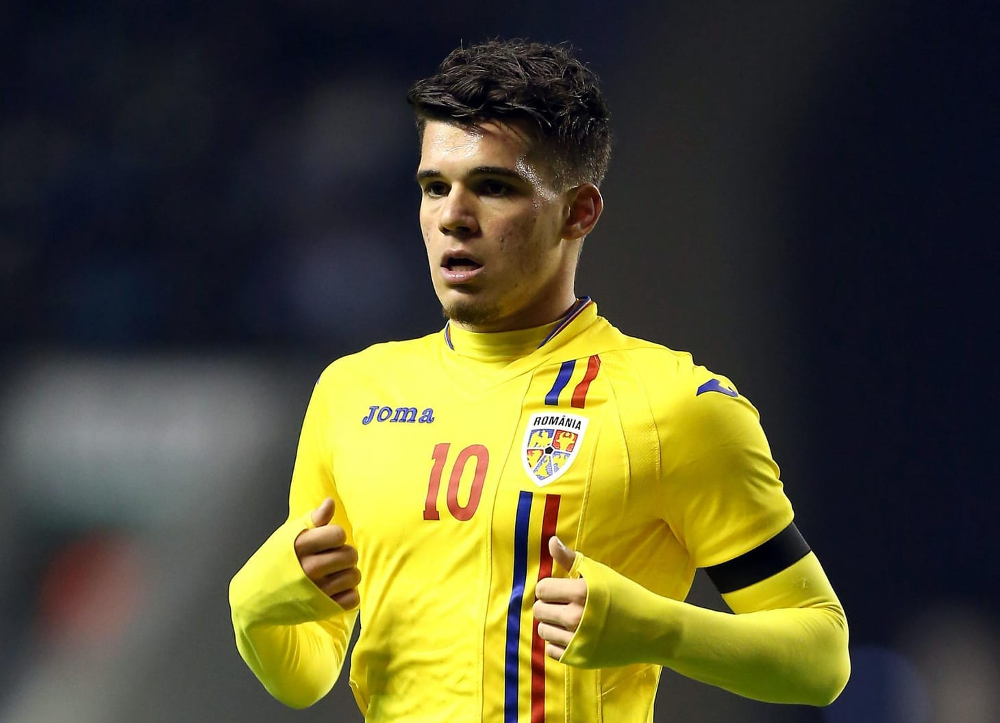

Nu există meci al naționalei care să nu atragă comentarii din acestă categorie:

*"Iarăși l-a băgat pe băiatul lui tata ca să nu joace nimic!"*

Și nu există articol care să fie legat cumva de Ianis Hagi care să nu fie însoțit de precizări conform cărora e un fotbalist slab care există în prim plan doar datorită presiunilor și insistenței tatălui său.

În mare, respectivii au dreptate.

Ianis Hagi este un fotbalist pentru care s-au plătit câteva milioane de Euro de către Fiorentina, Genk sau Rangers tocmai pentru că tatăl său a fost insistent în ceea ce privește cariera fiului său.

Și a făcut tot felul de presiuni, probabil cele mai intense chiar asupra lui Ianis, ca acesta să reușească.

Sigur, cele 3 cluburi amintite mai sus e destul de probabil să aibă scouteri / directori sportivi / antrenori mai puțin capabili să evalueze valoarea unor jucători decât avem noi, cei care comentăm fotbalul pe Facebook sau în zonele de comentarii ale site-urilor de sport.

Prin urmare, e firesc să nu te lași păcălit doar de faptul că cineva plătește niște bani pentru transferul altcuiva.

Plus că, se știe, Hagi are o uriașă influență în lumea fotbalului și ar fi putut oricând să pună presiune asupra celor care au dat bani ca să-i transfere fiul.

Pe de altă parte, textul acesta nu este despre Ianis Hagi, ci despre cei care au sentimente puternice legate de el.

Uneori de invidie, alteori de curată oftică.

De foarte multe ori, totul este însă împachetat în revoltă legată de faptul că unii sunt ținuți în brațe și ajutați, iar altora li se dă în cap.

Vorba ceea, din cauza unor tratamente precum cele de care a beneficiat și beneficiază unii ca Ianis Hagi nu ajunge țara asta nicăieri!

## Cei mai mari contestatari de profesie sunt și cei mai discreți

Apropo, eu nu vorbesc în acest moment doar despre cei care comentează pe net despre "nulitatea" Ianis Hagi.

Eu vorbesc inclusiv despre cei pe care-i numesc "eroii pauzelor publicitare".

În calitate de fost producător al emisiunii moderate de Ovidiu Ioanițoaia, Recursului Etapei, și actual invitat ocazional la emisiuni de analiză fotbalistică, am identificat această specie de foarte mulți ani.

Sunt cei care au ceva de spus despre orice, dar o fac mai ales în pauzele de publicitate ale emisiunilor.

E o formă aparte de lașitate, născută dintr-un soi aparte de frustrare.

Pe de o parte ai o părere și ai vrea să ți-o exprimi, pe de altă parte ești sau te simți prea mărunt ca să nu te temi de eventualele consecințe ale spuselor tale.

Așa că taci în emisiune, dar te apleci spre colegii de platou în pauze pentru a le rosti șoptit - viclean:

> "L-ai văzut pe Ianis? Varză!"

sau

> "Strâmbul are oamenii lui, face echipa după comisioane!"

sau

> "La Gică e regulă, dacă nu câștigă, îl fură arbitrul!"

sau

> "Nu s-a dus el la Becali? Păi, atunci i-a plăcut bănuțul, acum stă și comentează!"

După cum vezi, am dat exemple de lucruri care există în spațiul public, de comentarii pe care diverși le fac la vedere.

Nu e vorba de vreun secret, e vorba doar de multă lașitate.

Măcar cei de pe net sunt însoțiți de prezumția schiloadă că ceea ce comentează ar spune în față și celor despre care comentează.

Eroii pauzelor publicitare sunt lași de carieră.

## Se pare că oamenii cu principii puternice acționează mai ales online

Iani Hagi nu va fi probabil niciodată un fotbalist de nivelul tatălui său chiar dacă prin absurd va câștiga trofee mai importante cu echipa de club sau va ajunge cine știe unde cu naționala.

Pe de o parte pentru că anumite calități ale tatălui au fost înnăscute și nu s-au transmis la fiu - ex. viteza de reacție, explozia, plecarea de pe loc etc.

Repet, sunt calități antrenabile, dar limitate de înzestrări native.

Pe de altă parte, absolut tot ceea ce a făcut și face Hagi pentru fiul său sunt lucruri în totalitate naturale. Orice tată are datoria să-i ofere fiului cele mai bune condiții ca să-și exploateze potențialul.

Mai mult, în accepțiunea mea subiectivă, cred că nu este absolut nimic în neregulă ca un părinte să încalce inclusiv anumite reguli sau norme sociale ca să-și ajute copilul.

Atenție, nu spun că legea n-ar trebui să intervină atunci când este cazul.

Și nu spun că e-n regulă să-ncalce orice regulă / normă / lege.

Anumite.

Deși...

În fine, ideea este că am dorit să setez cadrul.

Mai exact, să evidențiez faptul că un părinte ar face orice pentru binele copilului său cu excepția situațiilor în care nu-i pasă de binele copilului său sau "a face orice" intră în conflict cu principiile sale de viață de-o manieră prea profundă ca să treacă peste acest aspect.

Hagi a fost un astfel de părinte care ar face orice și probabil că este în continuare.

Îmi închipui că cei care nu văd atitudinea sa ca fiind firească sunt cei care au principii de viață atât de puternice legate de limitele în care un părinte ar trebui să-și susțină copilul încât văd atitudinea lui Hagi ca fiind exagerată.

Ar fi totuși destul de ciudat ca niște oameni cu principii atât de puternice să fie exact cei care-l ironizează sau jignesc pe Ianis Hagi pe net sau în privatul discuțiilor de ici-colo.

Dar în spiritul a ceea ce am scris până acum, orice-i posibil.

## Ce ar trebui să înțelegi despre succesul lui Hagi

Dacă din perspectiva anumitor părinți este absolut firesc să facă totul pentru copiii lor, de ce există indivizi atât de deranjați de acest lucru?

Sunt mai multe motive, dar eu mă voi opri doar la două dintre ele.

Primul motiv este că există oameni care militează activ pentru echitate socială.

Dintre aceștia, unii o fac de-o manieră etică.

Adică văd în accesul egal la oportunități un sprijin pentru meritocrație și pentru funcționarea normală a societății.

Iar alții o fac de-o manieră clasic socialistă.

Adică ar vrea ca egalitatea să se producă prin aducerea la nivelul mediocrității a celor aflați "sus". Mai ales că cei care sunt sus ajung acolo, conform filosofiilor care-i ghidează, fără să merite acest lucru.

Pur și simplu, au succes că au fost favorizați.

În cazul de față, Ianis a fost favorizat de tatăl său

Al doilea motiv este că psihologic vorbind, succesul lui Ianis Hagi este o lovitură pentru două categorii de oameni:

- pentru părinții care nu au putut din rațiuni subiective sau obiective să ofere același sprijin copiilor lor
- pentru copii care nu au beneficiat de acel sprijin din partea părinților din aceleași rațiuni subiective sau obiective.

Aș putea spune ca președintele României, ghinion.

Doar că aș risca, pe bună dreptate, să nu fiu înțeles.

Așa că prefer să fiu amabil...

Prin urmare, spun că acest tip de oftică sau revoltă împotriva celor "favorizați" este des însoțită de insuccesul personal al celui ofticat sau revoltat.

Pe scurt, unii îl urăsc pe Ianis Hagi pentru că viața lor nu este ceea ce ar fi vrut să fie din rațiuni obiective - s-au născut într-un mediu care-n mod evident i-a tras înapoi, au avut suferințe de natură medicală împovărătoare, s-au confruntat cu situații care ar fi făcut din oricine un perdant al vieții măcar din anumit puncte de vedere.

Sau nu.

Pur și simplu, unii oameni au avut lucrurile sub controlul lor și decizia lor legată propria viață a fost să o ia pe calea ratării. 

Sau a mediocrității.

Sau a succesului insuficient de mulțumitor.

Acum, dacă ceva din acest text te-a lezat în vreun fel, e posibil să-ți imaginezi că am cine știe ce interese legate de apărarea lui Ianis Hagi.

De unde știu asta?

Ar fi o chestie care s-ar încadra într-un anume tipar de gândire, chiar aș zice de personalitate dacă aș forța un pic lucrurile, 

Din păcate, genul acesta de concluzii îi împiedică pe oameni să vadă realitatea - nu contează cât își susține Hagi sau alții fiul sau cât de susținut e Ianis Hagi sau alții de către părinții lor.

Contează în schimb o grămadă de alte lucruri aparent mărunte care sunt sub controlul fiecăruia dintre noi. Inclusiv cât timp stăm pe net ca să ne revoltăm în același ritm cu alții ca noi.

**PS1:** am uitat o categorie probabil uriașă de contestatari ai lui Ianis Hagi - cei care-și dau relaxați cu părerea, dar așa par ei, mai încrâncenați în aprecieri. În realitate, jignesc fără patimă, de dragul distracției.

**PS2: **după cum vezi, n-am spus o vorbă despre faptul că Ianis Hagi a avut un comportament general ireproșabil, c-a fost veșnic interesat doar de fotbal sau alte chestiuni care cumva contribuie la o imagine decentă a acestuia.

Nu o fac pentru că sunt chestiuni irelevante pentru ce-am scris eu aici.

Putea fi oricum, tot ce-am spus e general valabil într-o astfel de situație.
