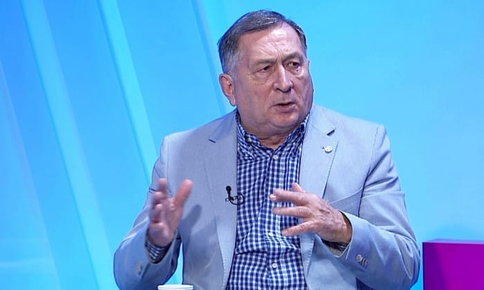

Zilele trecute, Ion Crăciunescu și-a exprimat în direct o nemulțumire legată de statutul său la Digi Sport.

Mai exact, legat de ceea ce percepe dânsul despre acest statut.

Și a făcut-o atingând și o problemă care probabil exista de mai multă vreme în mintea sa - faptul că Digi Sport i-a oferit lui Marius Avram posibilitate de-a-l concura în ceea ce privește zona analizei de arbitraj:

> **Ion Crăciunescu**: Mamă, ce mare arbitru e Marius Avram! Hai, lăsați-mă în pace!

> **Radu Naum**: Nu trebuie să fii mare arbitru ca să fii un bun analist. Și este un analist al Digi Sport.

> **Ion Crăciunescu**: Ah, am înțeles, analistul Digi Sport… Eu nu mai sunt, a ajuns Marius Avram?!

> **Radu Naum**: Cine a spus că nu sunteți analist?

> **Ion Crăciunescu**: La mine nu mai scrie analist. Scrie la emisiuni: «Marius Avram, analist Digi Sport».

> **Radu Naum**: Și la Ion Crăciunescu nu scrie nimic? Aha!

> **Ion Crăciunescu**: Nu scrie nimic, eu sunt un zero! Ce să fac?

> **Radu Naum**: Serios? Astea chiar sunt lucruri… Eu doar v-am spus opinia unui domn care a arbitrat.

> **Ion Crăciunescu**: Auzi, puneți-mă după Porumboiu, după Balaj, după Tudor. Nu mă puneți după… alții.

## Marius Avram chiar îl concurează pe Ion Crăciunescu

Da, Marius Avram îl concurează pe Ion Crăciunescu în această privință.

Nu contează că primul este un fost mare arbitru care a condus inclusiv o finală a Ligii Campionilor, iar cel de-al doilea este doar un fost arbitru FIFA care a avut prestații mai mult decât decente la nivel de Liga 1.

Fiecare invitat / analist intră într-o concurență cu ceilalți invitați / analiști.

Oamenii care privesc emisiunile compară ce spune Ilie Dumitrescu cu ce spune Stelea.

Ce spune Lăcătuș cu ce spune Duckadam.

Ce spune Balint cu ce spune Narcis Răducan.

Apropo de numele de mai sus...

Circulă pe net insistent credința stelistă că Digi Sport este un așa-zis "cuib de rapidiști". 

Amuzant este că peste 80% dintre analiști sunt cu trecut sau chiar prezent stelist.

În fine, ideea este că inclusiv eu, care am la rândul meu contract cu Digi Sport și particip în special la emisiunile moderate de Viorel Grigoroiu, concurez cu alți invitați.

Da, inclusiv cu Ilie Dumitrescu.

Sunt convins că există măcar un telespectator Digi Sport care constată că deși Ilie Dumitrescu are un costum mai elegant decât tricourile mele, totuși eu spun lucruri mult mai interesante decât el.

Mulțumesc fratelui meu Dragoș pentru această apreciere!

## Ce a greșit cu adevărat Ion Crăciunescu

**Primul lucru greșit** de Ion Crăciunescu este că a avut o reacție de pe urma căreia nu a câștigat absolut nimic.

Chiar din contră.

Pentru o parte a publiclui, reacția sa a părut ca fiind efectul unei vulnerabilități:

> "Se teme că-și pierde locul în favoarea lui Marius Avram".

Nu contează dacă este sau nu este adevărat că Ion Crăciunescu are această temere, contează percepția care se poate naște în mintea oamenilor.

Mai mult, Marius Avram și-a jucat perfect cartea ca urmare a acestei mari oportunități de-a marca la capitolul imagine.

Pe de o parte a făcut-o pe victima nevinovată care este atacată cu răutate de bătrânul invidios, iar ulterior a insistat pe o altă ideea care-l avantajează în mod evident:

> "Vremea analizelor după ureche s-a dus. Dinozaurii din fotbalul românesc nu mai pot mușca, doar amuză"  ([iAM Sport](https://iamsport.ro/fotbal/superliga/marius-avram-da-de-pamant-cu-craciunescu-dupa-ce-acesta-l-a-atacat-vremea-analizelor-dupa-ureche-s-a-terminat-id7769.html))

Avram a folosit pentru această replică un articol mai vechi scris de el pentru ProSport, articol în care nu dăduse nume. Sigur, cei pasionați știau că face referire atunci la Ion Crăciunescu sau și la el.

Acum însă, a avut ocazia să folosească acel atac în mod justificat de faptul că Ion Crăciunescu a fost cel care a deschis aparent conflictul.

**Al doilea lucru major pe care l-a greșit** Ion Crăciunescu în opinia mea este legat de modul în care a-ncercat să încheie subiectul:

> "Am avut o discuție cu cineva, care este un tip foarte serios. Nu o să mai vedeți de la mine niciodată reacții mai vehemente". (Miercuri, la Digi Sport)

Nu am vreo informație legată de această chestiune, dar bănuiesc faptul că "tipul foarte serios" este cineva din conducerea Digi Sport.

Și mai bănuiesc că nu este cineva din conducerea editorială a postului, adică nu e un ziarist. 

Speculez asta pentru că breasla jurnaliștilor nu are prea des ocazia de-a inspira asemenea seriozitate precum cea anunțată de fostul mare arbitru.

Probabil e vreunul dintre "cabliști", adică oameni din managementul Digi Sport care au un cuvânt greu de spus fără să aibă istoric în presă, ci doar cunoaștere de business.

"Doar"...

Da, e greu să le ai pe amândouă.

Trebuie să fii Costi Mocanu și nu ești.

Revenind, idee este că dacă a avut o astfel de discuție, nu era necesar să o facă publică.

Imaginea sa are de pierdut tocmai pentru că Ion Crăciunescu este în mod real o instituție a arbitrajului românesc indiferent ce spune Marius Avram sau ce cred cei enervați când verdictele sale sunt defavorabile echipei pe care o susțin.

Din această postură, Ion Crăciunescu nu are nevoie de sfaturi / indicații / discuții de calmare de la niciun "tip serios" indiferent că acesta este sau nu este șef la Digi Sport.

Crăciunescu este mai mare decât acel tip serios chiar dacă acel tip serios este mai influent și are, probabil, puterea de-a decide lucruri inclusiv în ceea ce privește contractul lui Ion Crăciunescu cu Digi Sport.

A, e uman să ai discuții cu cine dorești.

Nu e însă inspirat să le folosești ca argument pentru viitorul tău calm din emisiunile postului.

## Ce ar trebui să facă Digi Sport

Din punctul meu de vedere, Digi Sport ar trebui să nu rateze prilejul de-a-i aduce pe Crăciunescu și Avram în aceeași emisiune.

Eventual, într-o ediție de analiză a arbitrajului la finalul acestui sezon.

Avram sunt convins că va accepta pentru că nu ar avea absolut nimic de pierdut, ci doar de câștigat. 

E challenger în această dispută.

Dar Crăciunescu e posibil să refuze.

El este deținătorul titlului de "arbitrul suprem" și nu o spun cu ironie. Nu există individ cu o popularitate mai mare decât a sa în ceea ce privește arbitrajul. Iar pentru o televiziune, asta contează.

Prin urmare, dacă tipul serios chiar e șef la Digi Sport, poate interveni să-l convingă.

Desigur, dacă are simț jurnalistic.

Sau măcar un simț de speculare a unei situații de pe urma căreia postul poate câștiga ceva cu adevărat - audiență.

## De ce-mi permit să ironizez un ipotetic șef al Digi Sport

Deși am contract cu Digi Sport e posibil să fi ironizat în aceste rânduri un ipotetic șef din interiorul companiei?

Sigur că da.

Fac asta doar ca să le atrag atenția într-o privință care mă deranjează și poate ajung să am și eu o discuție cu tipul serios.

Citesc ei ce scriu eu aici?

Absolut.

Cine n-ar citi ceva scris de mine?

De altfel, inspirat de discuția dintre Ion Crăciunescu și Radu Naum, simt că o discuție cu acel șef ar decurce exact așa:

> **Ștefan Beldie**: Mamă, ce mare analist e Ilie Dumitrescu! Hai, lăsați-mă în pace!

> **Tipul foarte serios**: Cam trebuie să fi fost mare fotbalist ca să fii un bun analist. Și este analistul-emblemă al Digi Sport.

> **Ștefan Beldie**: Ah, am înțeles, analistul-emblemă Digi Sport… Eu nu mai sunt, a ajuns Ilie Dumitrescu?!

> **Tipul foarte serios**: Domnule, dar dumneavoastră n-ați fost niciodată analist-emblemă... Despre ce discutăm aici?

> **Ștefan Beldie**: La mine nu mai scrie analist, nu mai scrie autor CameraVAR.ro Scrie la emisiuni: «Ilie Dumitrescu, analist-emblemă Digi Sport».

> **Tipul foarte serios**: Și la Ștefan Beldie nu scrie nimic? Aha!

> **Ștefan Beldie**: Nu scrie nimic, eu sunt un zero! Ce să fac?

> **Tipul foarte serios**: Serios? Astea chiar sunt lucruri… Eu doar v-am spus cum stau lucrurile.

> **Ștefan Beldie**: Auzi, puneți-mă după Răureanu, Drejan, Geambașu. Nu mă puneți după… alții.

Sau poate să mă dea afară, desigur.

Sau să-mi mărească contractul.
