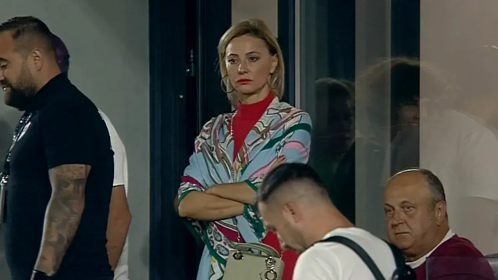

De câte ori văd imagini cu Dan Șucu nelămurit de evoluțiile Rapidului, de atâtea ori îmi vine în minte o situație pe care acesta a trăit-o acum mulți ani, pe la începuturile afacerilor sale cu mobilă.

Mai exact, pe când a cumpărat o fabrică de mobilă de la stat, parcă pe la Târgu Mureș.

Și după ce-a cumpărat-o / privatizat-o, a încercat să facă niște modificări, să o modernizeze din tot felul de puncte de vedere.

Intenții bune desigur.

Doar că printre angajații respectivei fabrici se aflau și oameni care considerau că tinerelul Șucu nu știe prea bine cum stau lucrurile sau cum merg.

Pentru că-n fabricile respective, lucrurile mergeau sau stăteau în funcție de cum credeau respectivii angajați că merg sau stau.

În fine, Șucu și-a impus punctul de vedere.

Doar că nu a făcut-o instant.

Pe de o parte, pentru că-n ciuda faptului că era patron, nu avea suficientă autoritate în ochii unor oameni mult mai vechi în industrie decât el.

Iar pe de alta, pentru că o parte din ceea ce credeau acei angajați probabil că era în regulă sau măcar mai bine adaptat vremurilor decât ce dorea Șucu să facă.

Nu am de unde să știu sigur, doar speculez acum.

## Iluzia că fotbalul e ușor pentru că cei care-l populează sunt slabi

În fine, Șucu trăiește în fotbal și la Rapid cam ce-a trăit cu acea fabrică.

Adică, e patron, dar în ochii celor pe care i-a găsit în această industrie nu e suficient de priceput. Nu contează că el insistă că se ocupă exclusiv de partea de business, unde inclusiv partenerul său Angelescu susține că-i genial.

Contează c-a intrat în fotbal, iar în fotbalul românesc există mereu oameni mult mai deștepți decât cei care finanțează fenomenul.

Mai ales că respectivii sunt capabili să cheltuiască oricât ar fi patronii capabili să producă și ceva pe deasupra.

Sigur, autoritatea sa este mult mai mare acum pentru că România este la mai bine de 30 ani distanță teoretică de comunism și patronul este totuși patron.

Chiar dacă-n general diverși l-ar cataloga oricând cu multă plăcere ofticată drept un prost norocos.

Ce ar trebui să înțeleagă însă Dan Șucu, [Andrei Nicolescu](https://iamsport.ro/editorial/de-ce-se-exprima-andrei-nicolescu-asa-cum-se-exprima-cele-3-mari-ghinioane-id7927.html), Eugen Voicu și chiar patroni mai vechi în fotbal precum Mihai Rotaru?

Că fotbalul este o industrie foarte dificilă.

Nu pentru că se lucrează cu marje infime de profit ca-n industria mobilei sau pentru că-n ciuda unor finanțări uriașe riști totuși să nu câștigi mare lucru.

Fotbalul românesc este greu pentru că cei care investesc în el îl subestimează și nu reușesc astfel să ajungă să-l cunoască cu adevărat.

Și e natural să-l subestimezi când vii din high league-ul zonei de business și descoperi cât de slab pregătiți par sau chiar sunt managerii pe care-i găsești în club comparativ cu diverși indivizi pe care i-ai angaja tu pentru afacerile tradiționale.

Nu vei găsi președinți de club cu MBA sau măcar președinți de club cu o filosofie de afaceri sănătos-țărănească: "Nu consumăm mai mult decât producem".

Din contră, găsești mai ales indivizi talentați să primească bani și să-i dea mai departe cu rezultate cel mult mediocre.

Iar asta te poate păcăli.

Te poate face să crezi că e un mediu pe care îl vei domina tocmai pentru că cei care-l populează sunt atât de slabi.

Iar când nu reușești, vei crede că de fapt corupția din fotbal e de vină pentru această nereușită.

Iar după un timp, te vei gândi la ieșirea din fenomen.

Sau la "exit", ca să vorbesc în limbaj corporatist.

Și vei da interviuri din exterior, precum Ionuț Negoiță sau vei tăcea tot din exterior, precum George Copos.

## De ce Hagi a reușit cu bani mai puțini decât absolut oricine altcineva

Una dintre ciudățeniile industriei fotbalului este că există foarte puțini antreprenori veniți din fenomen.

Adică puțini foști fotbaliști fac suficienți bani încât să preia o echipă și să o ducă în vârf.

De ce?

Evident, pentru c-au jucat fotbal.

Adică o bună parte din viața activă au petrecut-o prin cantonamente și antrenându-se, nu făcând afaceri. Sau limitându-se la chestiuni precum investițiile în imobiliare și cam atât.

Totul sub imperiul mentalității "să am după ce mă las de fotbal", nu sub cel al mentalității "să preiau un club și să iau titlul după ce mă las de fotbal".

Prin urmare, cei care ajung să fie patroni sunt oameni care au făcut bani mulți în afaceri total diferite față de fotbal.

Sigur, există zone comune afacerile clasice, dar cele care fac industria fotbalului diferită sunt exact cele care produc eșecul acestor investitori.

De asta, Hagi a luat două titluri cu o echipă de provincie și având cel mai mic buget cu care cineva a luat vreodată titlul. Sunt echipe care au retrogradat cu bugetul cu care Hagi a luat titlul cu Viitorul.

De ce?

Pentru că Hagi este singurul om care se pricepe real la fotbal dintre cei care au bani.

Marele său neajuns este că nu se "pricepe" la bani pe cât se pricepe la fotbal și asta îl limitează deja. Nu atât de mult pe cât e limitat Șucu în acest moment de neînțelegerea fenomenului, dar totuși...

Acum, secretul este ca [Șucu să aibă răbdarea să progreseze](https://www.cameravar.ro/5-lucruri-aduce-dan-sucu-in-liga1/) în ceea ce privește înțelegerea fotbalului așa cum a avut răbdare cu acei angajați ai fabricii de mobilă de la Târgu Mureș.

Dacă va avea, banii săi și apoi banii Rapidului vor începe să conteze cu adevărat tocmai pentru că vor fi bani investiți de oameni care știu ce fac, nu oameni care ghicesc ce fac.
