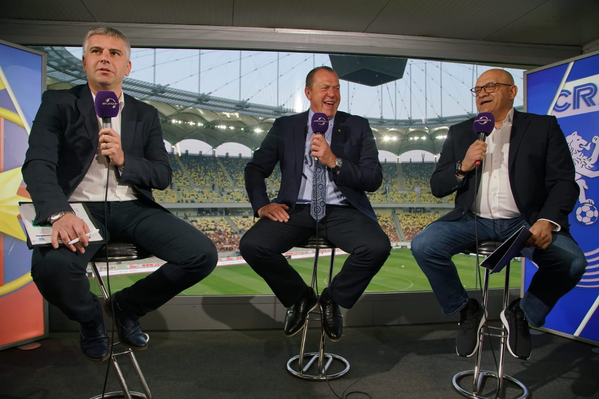

Dan Filoti este un moderator Digi Sport care reușește să scoată din sărite o bună parte a publicului stelist prin ceea ce respectivii numesc "rapidismul său feroce".

Desigur, oamenii care sunt foarte deranjați de rapidismul lui Dan Filoti nu sunt la fel de deranjați de stelismul niciunui alt ziarist.

Ceea ce e logic.

Spre deosebire de ziariști, publicul nu are vreo obligație în legătură cu presa sportivă.

Logic și ipocrit, desigur.

Doar nu credeai că scap prilejul de-a-ți spune cum stau lucrurile, mai ales într-o lume în care ești virtual zdravăn pupat în posterior și nu ți se spune adevărul ca nu cumva să te simți ofensat.

Te vei simți.

## Dan Filoti este rapidist inclusiv pentru că ți-a spus-o el

Spre deosebire de absolut toți ceilalți care facem presă sportivă și ținem în paralel cu o echipă sau alta fără să o spunem public, Filoti a ales să o facă.

Sigur, n-ar fi fost greu să-ți dai seama dacă o ținea la "secret", dar a spus-o.

Spre deosebire de mine care țin la rândul meu cu o echipă și vă las să fiți siguri fiecare-n parte că-s ori stelist, ori rapidist, ori cefere-clujist, ori dinamovist, ori doar un "profesionist" plătit de Becali, Varga, Șucu etc. 

După părerea mea, Dan a făcut o eroare.

Nu pentru c-a spus adevărul, ci pentru că publicul din România nu poate face față senin adevărului. 

Ideea care rămâne este că-n lumea vorbelor - presa sportivă și numai - faptele sunt de multe ori mai slabe decât declarațiile. 

Adică, din momentul în care un ziarist spune că este simpatizantul / fanul unei echipe, acel ziarist nu mai scapă vreodată de bănuiala că face jocurile respectivei echipe.

Cum ar spune cineva, merg mai departe și spun: eu dacă spun că țin cu Olimpia Satu Mare și totuși îmi dau silința să fiu obiectiv, voi fi mai bănuit că fac jocurile Olimpiei Satu Mare decât unul care merge meci de meci la jocurile acestei formații, stă în galerie etc.

Asta e situația.

Nu voi spune niciodată cu cine țin deși e o chestiune arhicunoscută de către cei cât de cât apropiați mie.

## De ce invită Dan Filoti atât de mulți rapidiști în emisiunile sale

Pentru că e rapidist, desigur.

Totuși, problema cu logica asta duce la concluzia că moderatorii care invită steliști sunt steliști. Cei care invită dinamoviști sunt dinamoviști și așa mai departe.

De exemplu, nimeni nu face crize online că la o emisiune a lui Naum sunt prezenți Duckadam, Ilie Dumitrescu și Gabi Balint.

Absolut nimeni.

Absolut nimeni dintre steliști, care-s cei mai mulți și cei mai vocali dintre cei care comentează situațiile din studiouri.

Că așa, se mai aud voci firave de pe la Cluj care reclamă aplecarea miticilor spre promovarea unei singure echipe. Nu-i auzi însă pe clujeni sau pe dinamoviști sau pe olteni sau pe cine vrei tu să se plângă că sunt prea mulți invitați rapidiști la Digi Sport.

Îi auzi exact pe cei care au cei mai mulți invitați asociabili cu echipa favorită.

Adică pe steliști.

Sau fecesebiști cum li se spune moderno-juridic.

De ce?

Pentru că suporterii marilor echipe, așa cum este FCSB [sunt foarte sensibili de felul lor](https://www.cameravar.ro/cum-sa-tii-cu-fcsb/). 

Au o foarte mică toleranță când vine vorba de orice le ia din expunere. Exact așa cum niște copii învățați să primească doar ei jucării se supără când apare unul care primește și el una.

Dincolo de asta, Filoti a scris ani de zile despre Rapid la Gazeta Sporturilor și la ProSport. Prin urmare, dincolo de faptul că este rapidist, și-a dezvoltat relații cu mulți dintre cei care au jucat / lucrat la această echipă.

Iar când vine vorba de-a aduce invitați în studio, e al naibii de greu să aduci pe cine vrei dacă nu ai relațiile respective. 

Vrea Filoti să-l aducă mâine pe Drăgușin la emisiune?

Vrea.

Poate să-l aducă?

Nu prea.

Atunci, îl aduce pe Florin Manea, care-i rapidist, nu doar impresarul lui Drăgușin.

Aduci pe cine poți, abia apoi pe cine vrei. 

De exemplu, ori de câte ori am avut ocazia să modereze emisiuni, știi care era condiția principală pe care o puneam?

Înainte de bani, înainte de orice...

Ceream ca eu să nu dau vreodată telefon să invit pe cineva. Să se ocupe producătorii, cei din redacție, oricine, dar nu eu.

[Asta deși țin la rândul meu cu o echipă](https://www.cameravar.ro/relatii-ziaristi-oameni-din-fotbal/) și aș fi putut pe logica de mai sus să aduc la rândul meu oameni asociabili cu respectiva formație.

## Cât de bun ziarist sportiv este Dan Filoti

După părerea mea, poate fi un ziarist foarte bun oricând dorește să fie un ziarist foarte bun.

Absolut oricând.

Uneori vrea asta, alteori nu vrea asta.

Nu spun c-ar fi vreun Messi al presei sportive, spun exact cum stau lucrurile chiar dacă asta îi poate deranja pe mulți dintre cei care suntem ziariști sportivi foarte buni doar în zilele bune, nu când ne propunem asta.

Cum vine însă chestia asta cu "e foarte bun oricând dorește"?

Ar putea să ți se pară ciudat ca un individ să-și facă meseria în funcție de cum are chef mai ales că noi trăim totuși într-o țară a profesioniștilor profund dedicați practicii lor.

Nu degeaba suntem alintați japonezii Europei sau nemții Balcanilor.

După părerea mea nediscutată vreodată-n privat cu Dan, ci doar bazată pe ceea ce percep la fel ca oricare altu-l privește, cred că el este un tip care alege să se simtă bine.

Iar asta este prin definiție o chestie enervantă pentru că el e pus acolo să muncească, nu să se simtă bine. 

Și a se simți bine înseamnă exact ceea ce vezi tu la TV în emisiunile sale. Uneori, discută despre 7 subiecte diferite, alteori discută bine despre un singur subiect, de fiecare dată te scoate din sărite dacă ești stelist și rar te enervează dacă ții cu orice altă echipă.

Nu te-ai gândit la asta vreodată, dar din anumite puncte de vedere, Dan Filoti seamănă cu Gigi Becali -  amândoi par să facă aparent doar ceea ce vor. 

În rest, cred că a fost un foarte bun ziarist de presă scrisă - și aici mă refer la interviurile sale și la capacitatea de-a obține informații. Nu mă refer la jocurile de cuvinte care fac deliciul multora dintre voi.

De altfel, cred că asta cu jocurile de cuvinte este o chestiune recentă, de după ce a început să facă emisiuni. A fost, cel mai probabil, importată la Digi Sport prin intermediul oamenilor care au lucrat în ProTV anterior.

## Nu sunt sigur, dar cred că am vrut să-l dau jos pe Filoti de la ProSport

Apropo de presă scrisă - acum mulți, aveam o colaborare cu ProSport. Adică scriam niște texte de opinie. După părerea mea, care nu-s vreun modest, majoritatea acestor texte erau slabe.

Asta este, n-am ce face.

În fine, când a venit criza, ProSport m-a dat afară și nu doar că n-au pierdut nimic pentru acest gest, dar au făcut și o economie bună cu salariul meu de editorialist.

Ei, după ce m-au dat afară, m-am gândit totuși că lucrurile nu merg tocmai bine la ziarul respectiv condus de Dan Filoti din postură de redactor șef, ajutat de Lucian Lipovan și Florin Caramvrov.

Și împreună cu un prieten cu care lucrasem anterior la Gazeta Sporturilor, am luat legătura cu oamenii care conduceau administrativ ProSport să le propun un  serviciu de consultanță editorială.

Mai pe românește, să le spunem ce credem noi c-ar trebui făcut la ziar și la site, iar ei să ne plătească pentru asta.

Da, ai citi bine: ei mă dăduseră afară ca să facă economii că venise criza, iar eu voiam să revin să-i învăț cum să facă lucrurile mai bine, dar pe bani mult mai mulți, desigur.

În fine, măcar o parte din ceea ce le propuneam eu și partenerul meu de consultanță știau să facă și cei care erau deja acolo. Doar că între cât de deștept ești de pe margine și cât de bine poți implementa ceea ce-ți trece prin cap când intri în acțiune sunt diferențe uriașe.

Nu conta.

Am fost invitați de directorii ziarului la o discuție pe tema ideii noastre, întâlnire la care a apărut și Dan Filoti.

Cred că și Lucian, nu mai rețin exact.

Ideea este că propunerea noastră a părut un fel de "ce faceți voi e greșit, ce vă spunem noi să faceți e bine". 

Adică Filoti e slab, noi suntem buni.

Sigur că asta voiam să spunem.

Sigur că nu voiam postul lui Dan Filoti, ci doar contractul respectiv.

Sigur că am pierdut vremea.

Adică ei ne-au mulțumit și noi ne-am văzut mai departe de treburi. 

După un timp, după ce plecase Dan Filoti de acolo cred, am avut ocazia să fiu redactor-șef la ProSport, dar am am preferat să fac în continuare doar emisiunea de la sport.ro și am refuzat înainte să discutăm măcar de partea financiară.

Deci nu voiam poziția lui, voiam doar să vând ceea ce aveam eu în minte.

Ideea este că-n ciuda situației respective, Dan nu a avut vreodată o atitudine neprietenoasă în relație cu mine. Din contră, a făcut gestul suprem pe care un moderator îl face în relație cu un invitat - m-a chemat în emisiunile sale.

Glumesc, desigur. 

Unii invitați sunt chemați pentru că-s importanți (ex. Ilie Dumitrescu) alții sunt chemați pentru că sunt foarte buni (ex. Ștefan Beldie) și-n fine, sunt unii chemați pentru că îi stresează pe moderatori să-i cheme.

Revenind, a uitat Dan Filoti de momentul acelui aparent puci?

Posibil.

Așa cum a uitat o dată și că m-a invitat în emisiune și ne-am trezit mai mulți invitați decât scaune are Digi Sport în studioul respectiv. Noroc că Lucian Lipovan a fost elegant și a renunțat el pentru mine și mai ales pentru Dan.

Chiar, ar fi fost șocant pentru toți cei care mă confundă cu Lucian să ne vadă împreună acolo.

## Dan Filoti și prezentatoarele de la Digi Sport

Am văzut că există foarte multe reacții legate de dialogurile pe care Dan le are cu fetele care prezintă știrile sportive la Digi Sport.

Ca ziarist, am marele avantaj că-mi pot da cu părerea despre orice, inclusiv lucruri la care nu mă pricep, și să nu par decât un alt ziarist care vorbește depsre ceea ce nu știe.

Doar că priceperea mea este atât de măruntă în domeniul intereacțiunilor femei-bărbați încât am o reținere.

Totuși, în foarte rarele momente în care am trecut prin redacți Digi Sport și am văzut discuții între Dan Filoti și fetele de la știri am remarcat exact aceleași tipuri de dialog

Deci ideea că acele fete ar fi supuse unei presiuni din partea lui mi se pare exagerată.

Din contră, cred că în acest moment Dan este supus unei presiuni să continue acele dialoguri cu fetele când dă pasa la știri.

Închipuie-ți că la finalul unei emisiuni, s-ar limita să-i spună Andreei Trușcă ceva de genul:

> "Și acum, îi dau legătura pentru știri Andreei..."

Fără nimic alteva.

Fără întrebări despre unde merge-n concediu, fără întrebări despre echipa favorită, fără nicio glumă bună sau slabă.

Doar legătura la știri și atât.

Ei, cum s-ar simți Andreea?

Ce ar crede ea?

"E Dan supărat pe mine?"

Sigur că ar părea extrem de supărat.

Să fim serioși, nu-i poți face așa ceva unei colege!

Și nici unui coleg.

Doar că Digi Sport nu are prezentatori de știri bărbați.

Asta pentru că publicului Digi Sport îi place mai mult să vadă femei prezentând știri sportive decât bărbați. Posibil inclusiv celor care sunt deranjați că Dan Filoti stă de vorbă cu fetele mult mai mult și mai variat din perspectiva subiectelor și a abordărilor decât orice alt prezentator din lumea cunoscută.

## Ce poți face dacă nu-ți place Dan Filoti

Poți face exact ce vrei tu.

Îți dau voie.

Poți, de exemplu, să faci un exercițiu de imaginație.

Să-ți imaginezi cât de mult te-ar deranja Dan Filoti dacă în loc să fie rapidist ar fi stelist.

Ar invita steliști.

S-ar distra cu ei în emisiune.

Ar face glumi cu prezentatoarele de-o manieră care ar face Steaua să dea bine și Rapid să dea prost.

Te-ai plânge în legătură cu asta online?

Ai reclama că la Digi Sport e un cuib de steliști?

Nu.

De altfel, ai ocazia să faci asta și acum, fără ca Filoti să fie stelist.

Majoritatea covârșitoare a celor care sunt invitați la Digi Sport sunt asociabili cu ideea de Steaua - au jucat acolo, au antrenat acolo, au condus clubul acolo.

Iar dacă nu sunt asociabili cu ideea de Steaua, sunt întrebați despre Steaua.

Și e firesc din perspectiva împărțirii audienței în funcție de numărul de suporteri ai fiecărei echipe.

Prin urmare, te înțeleg.

Nu e plăcut să vezi atât Rapid când ei sunt cel mult 1/5 din numărul steliștilor.

Da, viața e nedreaptă.

Dar telecomanda poate salva situația.
