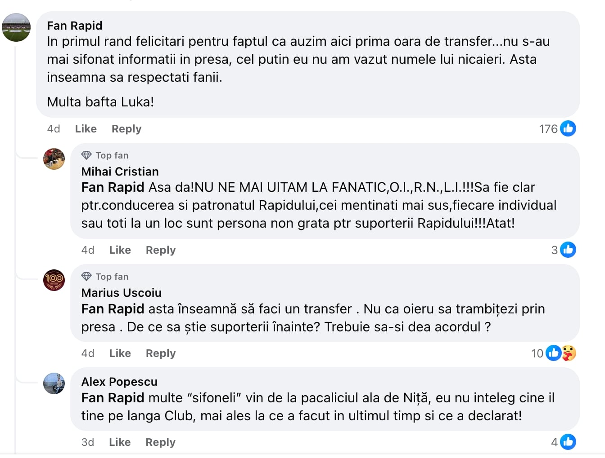
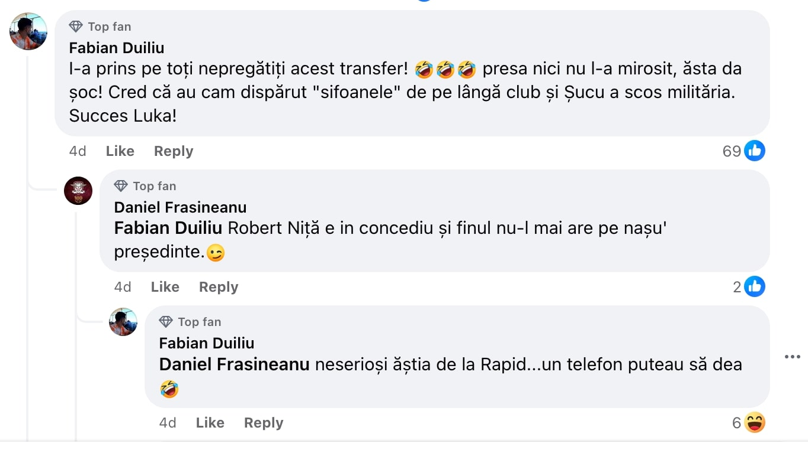
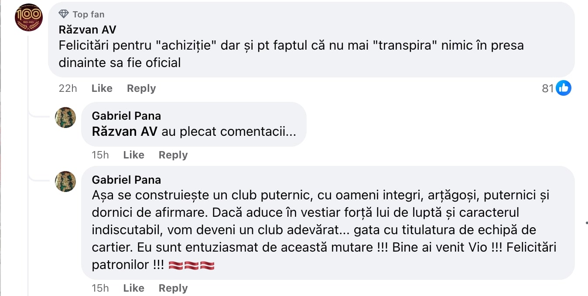

Fenomenul este vechi, dar se desfășoară în toată splendoarea sa zilele acestea sub tutela Rapidului.

Concret, este vorba de satisfacția unor suporteri că anumite informații relevante despre echipa favorită - transferuri, numiri de antrenori, modificări diverse în organigramă etc. - sunt anunțate în premieră de club prin intermediul propriilor platforme de comunicare.

Atenție, nu e vorba de situația în care clubul anunță oficial că un jucător a venit curtea sa, ci de situații în care jucătorul care vine n-a fost menționat deloc în presa sportivă ca variantă de transfer.

Extazul suprem se atinge în situații precum cele recente de la Rapid: transferul sârbului Gojokovic sau numirea lui Viorel Moldovan ca președinte de club.

Dacă te uiți în zona de comentarii a contului de Facebook a echipei, vei vedea satisfacția pe care o au numeroși fani giuleșteni că lucrurile sunt aflate în premieră de acolo și nu dintr-o sursă tradițională - presa sportivă.

## De ce există această bucurie legată de faptul că presa sportivă a ratat un subiect?

Lucrurile sunt de simple.

Mai mult, dacă le-aș simplifica la extrem și m-aș exprima popular, impresia unora este că dacă ziariștii n-au acces la informații de acest gen, vor muri de foame.

Da, expresia “vor muri de foame” este preluată din exprimarea celor care cred asta.

De altfel, ziariștii mor continuu de foame în opinia respectivilor de câte ori clubul favorit intră în silenzio stampa sau când vreun oficial are o atitudine țărănoasă în relație cu presa.

Da, aceste scenarii chiar trec prin mintea unor oameni.

Care oameni, de multe ori, par inteligenți din maniera generală de exprimare.

Atunci, cum vine asta?

E simplu din nou.

Acești suporteri sunt convinși că presa sportivă vrea răul echipei lor.

Deși Rapid are sloganul “singuri împotriva tuturor”, slogan născut ce-i drept dintr-o realitate istorică, nivelul maxim în ceea ce privește mania persecuției este atins de o parte a fanilor FCSB.

Trebuie precizat faptul că deși vorbim de o frustrare uriașă, realitatea o face să fie super-comică. Adică acei fani FCSB care au impresia că echipa lor este persecutată sunt atât de departe de realitate încât e amuzant să-i privești de pe margine.

Toleranța lor legată de realitate este aproape de zero și pot consuma liniștiți doar informații care sunt ori laudative la adresa echipei lor, ori măcar lipsite de laude la adresa rivalelor.

Orice situație diferită este ceva de neacceptat și dovada că televiziunile și site-urile în cauză sunt cu ceilalți.

Mai mult, e aproape imposibil să iasă din această capcană, așa că orice scenariu care le dă dreptate este îmbrățișat cu un patos.

## Dincolo de dorința comică de-a vedea presa sportivă murind, mai este ceva...

Unii oameni n-au cultura necesară să-nțeleagă rostul presei.

Iar asta nu e doar vina lor, ci și vina presei.

Ei ar vrea ca presa să dispară pentru că le lipesește capacitatea de-a vedea dincolo de ce se întâmplă dacă n-ar mai fi presă începând de mâine.

De asemena, în cazul strict al presei sportive, sunt incapabili să-i măsoare valoarea și să constate adevărul - [jurnalismul sportiv este de departe cea mai performantă și onestă formă de jurnalism din România](https://www.cameravar.ro/suprematia-presei-sportive/).

Totuși, dincolo de această dorință mustind de ignoranță, satisfacția din jurul situațiilor în care clubul anunță în premieră ceva important din viața echipei mai poate fi alimentată de ceva.

Ceva care nu implică nici pe departe prostie, ci chiar inteligență.

Este vorba de credința verificată în timp că o societate capabilă să-și păstreze secretele cât consideră că e oportun să o facă este o societate mai puternică.

În cazul unui club de fotbal și nu numai, asta implică ideea că oamenii care lucrează acolo nu vând altora informații, ci le păstrează secrete în interesul societății.

Deci sunt angajați serioși și loiali.

Până la urmă, de ce un angajat al unui club i-ar spune unui ziarist că se negociază cu un oarecare jucător?

Ce are de câștigat?

În general, nimic altceva decât un favor personal.

Adică “presă bună”.

PR.

Deși ziariștii nu sunt teoretic oameni de PR, unii dintre ei se comportă așa cu o selecție de surse tocmai ca să le răsplătească pentru informațiile pe care le primesc.

Normal, sunt o grămadă de nuanțe ale [relațiilor ziariști - angajați ai cluburilor](https://www.cameravar.ro/relatii-ziaristi-oameni-din-fotbal/), chiar unele care trec dincolo de interese obișnuite - prietenii reale sau relații de rudenie.

Oricum, nu mă pricep la asta - n-am absolut nicio relație privată cu nimeni din fotbal. Nu inițiez comunicări private cu cineva din fotbal, doar răspund când sunt abordat, iar peste 99% din ceea ce discut cu oameni din fotbal se petrece în ochii tuturor, în cadrul emisiunilor la care particip.

Atenție însă, pentru mine este foarte ușor să fac asta pentru că nu alerg toată ziua după știri și nu sunt nevoit să intru zilnic în contact cu tot felul de oameni din fotbal.

Deși, când eram nevoit să fac asta, lucrurile stăteau tot la fel - n-am avut vreodată relații private cu nimeni din fotbal.

Deci chiar nu mă pricep.

Doar constat lucruri.

## Vestea proastă, dar bună legată de situațiile de genul acesta

Chiar dacă un club anunță în premieră o informație, ziariștii nu vor muri de foame.

Așa cum nu vor muri de foame dacă Becali nu mai vorbește cu presa, așa cum naiv gândesc o grămadă de fani ai FCSB.

Ziariștii pot dezvolta tot felul de materiale în jurul informațiilor pe care le obțin pe cont propriu sau chiar în jurul informațiilor care apar din surse oficiale.

[Iar tu vei citi în continuare ce scriu ei sau vei asculta în continuare ce vorbesc ei](https://www.cameravar.ro/fani-fcsb-boicot-vali-moraru-digi-sport/).

Sigur, te vei enerva, vei dori să le auzi stomacul chiorăind, te vei bucura cu bucurie mare când sunt dați afară și alte chestiuni mature pe care le pot face oamenii.

Dar asta nu schimbă realitatea.

Nu schimbă jocul.

Presa va fi presă fără să fie simpatizată, iar publicul va fi public fără să aibă întotdeauna dreptate.

Mai ales când “dreptatea” implică emoțiile specifice ale faptului că ții din toată inima cu o anume echipă.

Nici nu contează care.
